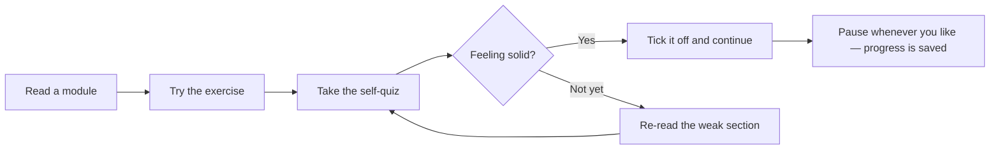

# 🚀 Sales → Project Management — The Complete Reviewer

> A self-paced study guide that turns your **sales experience** into a credible, confident move into **project management**. Built like a mentor would build it: structured, visual, and designed to be studied in short sittings — pause anytime, pick up exactly where you left off.

Welcome. 👋 If you've spent your career in sales — chasing quotas, running discovery calls, managing a pipeline, closing deals — you already own a huge slice of what makes a great project manager. This reviewer fills in the rest, in plain language, with a diagram on almost every page.

It's **23 modules**, roughly **14–16 hours** of focused study end to end. You don't have to do it in one go — that's the whole point. Each module is a self-contained sitting with its own objectives, visuals, a self-quiz, and a hands-on exercise.

---

## 🎯 Who this is for

- You have a **sales / account-management background** and little or no formal PM training.
- You're **transitioning into** project coordinator, associate/junior PM, scrum master, or implementation-manager roles.
- You want something **more structured than scattered blog posts** but lighter and friendlier than a 700-page certification manual.

> 🔁 **Sales → PM bridge:** Treat this reviewer like a long enterprise deal — work it in stages, take notes, and "close" each module before moving to the next.

---

## 🗺️ The learning roadmap

*The full journey: build the foundations, learn how to deliver, master the people side, get fluent in agile and tooling, then launch your new career. Reference material is there whenever you need it.*

---

## 📚 The modules

### Part 1 · Foundations
| # | Module | Time | What you'll get |
|---|---|---|---|
| 00 | [Welcome & How to Use This Reviewer](reviewer/00-welcome-and-how-to-use.md) | ~20 min | How to study this, the icon legend, and your game plan |
| 01 | [What Project Management Really Is](reviewer/01-what-is-project-management.md) | ~35 min | Projects vs. operations, the iron triangle, what a PM actually does |
| 02 | [From Sales to PM — Your Unfair Advantage](reviewer/02-from-sales-to-pm.md) | ~30 min | A skills map from sales to PM, mindset shifts, gaps to close |
| 03 | [The Project Life Cycle & Process Groups](reviewer/03-lifecycle-and-process-groups.md) | ~40 min | The 5 process groups, 10 knowledge areas, phase gates |
| 04 | [Predictive, Agile & Hybrid](reviewer/04-predictive-agile-hybrid.md) | ~40 min | Waterfall vs. agile vs. hybrid, and how to choose |

### Part 2 · Core delivery knowledge
| # | Module | Time | What you'll get |
|---|---|---|---|
| 05 | [Initiation — Business Case, Charter & Stakeholders](reviewer/05-initiation-charter-stakeholders.md) | ~35 min | Business case, project charter, finding stakeholders |
| 06 | [Scope Management](reviewer/06-scope-management.md) | ~45 min | Requirements, the WBS, scope creep, MoSCoW |
| 07 | [Schedule Management](reviewer/07-schedule-management.md) | ~50 min | Network diagrams, the critical path, Gantt, estimation |
| 08 | [Cost & Budget Management](reviewer/08-cost-and-budget.md) | ~50 min | Estimating, budgets, and Earned Value Management |
| 09 | [Quality Management](reviewer/09-quality-management.md) | ~40 min | QA vs. QC, cost of quality, the 7 basic tools |
| 12 | [Risk Management](reviewer/12-risk-management.md) | ~50 min | Risk register, probability/impact, response strategies |
| 14 | [Procurement & Contracts](reviewer/14-procurement-and-contracts.md) | ~35 min | Make-or-buy, contract types, vendor selection |

### Part 3 · People & communication
| # | Module | Time | What you'll get |
|---|---|---|---|
| 10 | [Resources, Teams & Leadership](reviewer/10-resources-teams-leadership.md) | ~45 min | RACI, Tuckman, servant leadership, motivation |
| 11 | [Communication Management](reviewer/11-communication-management.md) | ~40 min | Comms plans, channels math, meetings that don't suck |
| 13 | [Stakeholder Engagement](reviewer/13-stakeholder-engagement.md) | ~35 min | Power/interest grid, engagement levels, managing up |
| 18 | [Negotiation, Conflict & Soft Skills](reviewer/18-negotiation-conflict-softskills.md) | ~40 min | Conflict modes, BATNA/ZOPA, influence without authority |

### Part 4 · Agile, tools & metrics
| # | Module | Time | What you'll get |
|---|---|---|---|
| 15 | [Agile & Scrum, In Depth](reviewer/15-agile-and-scrum.md) | ~60 min | Scrum roles/events/artifacts, user stories, Kanban |
| 16 | [Tools of the Trade](reviewer/16-tools-of-the-trade.md) | ~30 min | Jira, Asana, MS Project & friends — and how to choose |
| 17 | [Metrics, KPIs & Reporting](reviewer/17-metrics-and-reporting.md) | ~35 min | Velocity, cycle time, EVM recap, RAG status reporting |

### Part 5 · Career launch
| # | Module | Time | What you'll get |
|---|---|---|---|
| 19 | [Certifications Roadmap](reviewer/19-certifications-roadmap.md) | ~30 min | CAPM, PMP, PSM, Google PM — which one, in what order |
| 20 | [Landing the PM Job](reviewer/20-landing-the-pm-job.md) | ~45 min | Resume translation, portfolio, STAR interviews, 30-60-90 |

### Reference & practice
| # | Module | Time | What you'll get |
|---|---|---|---|
| 21 | [Glossary & Cheat Sheets](reviewer/21-glossary-and-cheatsheets.md) | Reference | Terms, acronyms, formulas, quick-reference grids |
| 22 | [Your Study Plan & Self-Assessment](reviewer/22-study-plan-and-self-assessment.md) | ~30 min | An 8-week plan, a capstone project, and a final quiz |

---

## ✅ Progress tracker

Tick these off as you go (edit this file, or just keep your own copy):

- [ ] 00 · Welcome & How to Use
- [ ] 01 · What PM Really Is
- [ ] 02 · From Sales to PM
- [ ] 03 · Life Cycle & Process Groups
- [ ] 04 · Predictive, Agile & Hybrid
- [ ] 05 · Initiation & Charter
- [ ] 06 · Scope Management
- [ ] 07 · Schedule Management
- [ ] 08 · Cost & Budget
- [ ] 09 · Quality Management
- [ ] 10 · Resources, Teams & Leadership
- [ ] 11 · Communication Management
- [ ] 12 · Risk Management
- [ ] 13 · Stakeholder Engagement
- [ ] 14 · Procurement & Contracts
- [ ] 15 · Agile & Scrum
- [ ] 16 · Tools of the Trade
- [ ] 17 · Metrics & Reporting
- [ ] 18 · Negotiation & Conflict
- [ ] 19 · Certifications Roadmap
- [ ] 20 · Landing the PM Job
- [ ] 21 · Glossary & Cheat Sheets
- [ ] 22 · Study Plan & Capstone

---

## 🧭 Suggested paths

**You have plenty of time (the deep path):** Go straight through, 00 → 22, one module per sitting. Do every exercise and self-quiz. This is the route to genuine fluency and certification-readiness. Budget ~3–4 weeks at a relaxed pace.

**You have an interview next week (the fast track):** Do 00 → 01 → 02 → 03 → 04, then jump to 15 (Agile & Scrum), 13 (Stakeholders), 20 (Landing the Job), and skim 21 (Glossary). That's the highest-leverage subset for sounding credible fast.

*The study loop for every module: learn, apply, self-test, and only then move on.*

---

## 🔑 Icon legend

| Icon | Means |
|---|---|
| 🎯 | What you'll be able to do (objectives) |
| 👋 | A note from your mentor |
| 🔁 | A **Sales → PM bridge** — connecting what you know to what's new |
| ⏸️ | A safe **pause & reflect** checkpoint |
| 🧠 | A **check yourself** self-quiz (answers hidden until you click) |
| 🧰 | A **try it** hands-on exercise |
| 🔑 | **Key terms** for the module |

---

### Ready?

👉 **Start with [Module 00 — Welcome & How to Use This Reviewer](reviewer/00-welcome-and-how-to-use.md).**

You've already done the hard thing — deciding to make the move. The rest is just reps. Let's go. 💪
