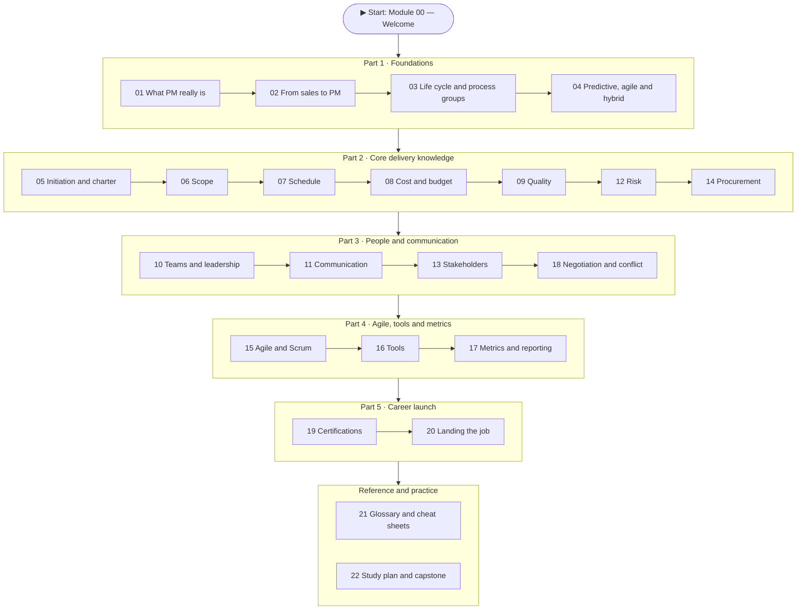
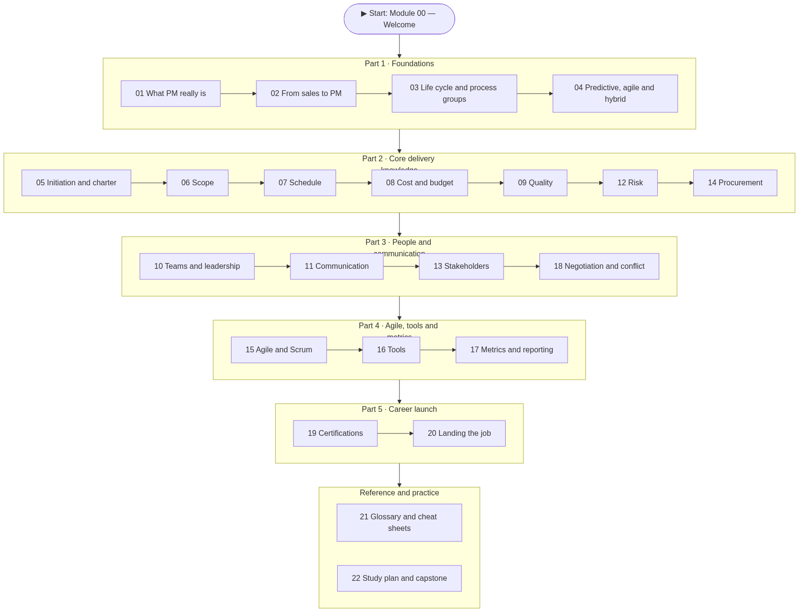
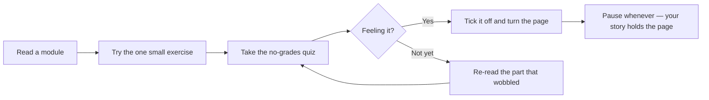
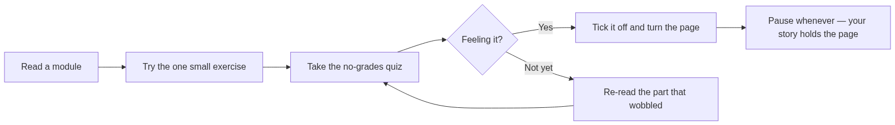

# 🚀 Sales → Project Management — The Reviewer You'll Actually Want to Read

> A self-paced guide that turns your **sales career** into a confident leap into **project management** — written to read like a book you can't put down, not a textbook you have to survive. Cozy, witty, and built for short sittings. Pause anytime; your story holds the page.

> ✨ **Prefer a website that remembers your place?** Read the **[interactive version](https://bv-ai-kit.github.io/kv-reviewer/)** — it mirrors every chapter, lets you tick modules off as you finish them, shows a progress dashboard with time estimates, and saves it all privately in your own browser (nothing leaves your device). *(Built from this repo's [`docs/`](docs) folder.)*

Hi. 👋 Come in, get comfy. If you've spent your career in sales — chasing quotas, running discovery calls, reading a room, talking a flat "no" into a "let's talk" — then here's a secret the PM world won't tell you on day one: **you already own half the job.** This guide hands you the other half, in plain language, with a little drama, and a diagram on almost every page.

It's **23 short modules**, roughly **14–16 hours** end to end — but please don't binge it like a deadline. Read one, let it settle, come back. Each module is a self-contained chapter with its own hook, its own visuals, a no-grades quiz, and one small thing to try. Think of it as a slow burn: by the last chapter, you and project management are *definitely* a couple.

---

## 🎯 Is this you?

- You come from **sales / account management** and have little or no formal PM training.
- You're eyeing a move into **project coordinator, associate/junior PM, scrum master, or implementation manager**.
- You want something friendlier than a 700-page certification brick, but more structured than a pile of random blog posts.

> 🔁 **Sales → PM bridge:** Treat this like working a big account — in stages, with notes, "closing" each module before the next. You've run this play a hundred times.

---

## 🗺️ The map (where this story takes you)

<!-- mobile-diagram:readme-1 -->

🖼️ Tap to view as an image (for the GitHub mobile app)

<!-- /mobile-diagram -->

*The whole arc: lay the foundation, learn to deliver, master the people, get fluent in agile and tooling, then walk into the job. Reference is always a click away when you need it.*

---

## 📚 The chapters

### Part 1 · Foundations
| # | Module | Time | The hook |
|---|---|---|---|
| 00 | [Welcome & How to Use This Reviewer](reviewer/00-welcome-and-how-to-use.md) | ~20 min | How to read this for fun, the icon key, and your game plan |
| 01 | [What Project Management Really Is](reviewer/01-what-is-project-management.md) | ~35 min | Projects vs. operations, the iron triangle, what a PM actually does all day |
| 02 | [From Sales to PM — Your Unfair Advantage](reviewer/02-from-sales-to-pm.md) | ~30 min | The skills you already have, the mindset shifts, the gaps to close |
| 03 | [The Project Life Cycle & Process Groups](reviewer/03-lifecycle-and-process-groups.md) | ~40 min | The 5 process groups, 10 knowledge areas, and phase gates |
| 04 | [Predictive, Agile & Hybrid](reviewer/04-predictive-agile-hybrid.md) | ~40 min | Waterfall vs. agile vs. hybrid — and how to pick |

### Part 2 · Core delivery knowledge
| # | Module | Time | The hook |
|---|---|---|---|
| 05 | [Initiation — Business Case, Charter & Stakeholders](reviewer/05-initiation-charter-stakeholders.md) | ~35 min | The business case, the charter, and finding your people |
| 06 | [Scope Management](reviewer/06-scope-management.md) | ~45 min | Requirements, the WBS, scope creep, and the magic of MoSCoW |
| 07 | [Schedule Management](reviewer/07-schedule-management.md) | ~50 min | Network diagrams, the critical path, Gantt, and honest estimates |
| 08 | [Cost & Budget Management](reviewer/08-cost-and-budget.md) | ~50 min | Estimating, budgets, and Earned Value (the money lie-detector) |
| 09 | [Quality Management](reviewer/09-quality-management.md) | ~40 min | QA vs. QC, the cost of quality, the 7 basic tools |
| 12 | [Risk Management](reviewer/12-risk-management.md) | ~50 min | The risk register, probability/impact, and how to respond |
| 14 | [Procurement & Contracts](reviewer/14-procurement-and-contracts.md) | ~35 min | Make-or-buy, contract types, and choosing a vendor |

### Part 3 · People & communication
| # | Module | Time | The hook |
|---|---|---|---|
| 10 | [Resources, Teams & Leadership](reviewer/10-resources-teams-leadership.md) | ~45 min | RACI, Tuckman, servant leadership, and what really motivates people |
| 11 | [Communication Management](reviewer/11-communication-management.md) | ~40 min | Comms plans, the channels math, and meetings that don't make people cry |
| 13 | [Stakeholder Engagement](reviewer/13-stakeholder-engagement.md) | ~35 min | The power/interest grid, engagement levels, and managing up |
| 18 | [Negotiation, Conflict & Soft Skills](reviewer/18-negotiation-conflict-softskills.md) | ~40 min | Conflict modes, BATNA/ZOPA, and influence without authority |

### Part 4 · Agile, tools & metrics
| # | Module | Time | The hook |
|---|---|---|---|
| 15 | [Agile & Scrum, In Depth](reviewer/15-agile-and-scrum.md) | ~60 min | Scrum roles, events, artifacts, user stories, and Kanban |
| 16 | [Tools of the Trade](reviewer/16-tools-of-the-trade.md) | ~30 min | Jira, Asana, MS Project & friends — and how to choose |
| 17 | [Metrics, KPIs & Reporting](reviewer/17-metrics-and-reporting.md) | ~35 min | Velocity, cycle time, EVM recap, and RAG status reporting |

### Part 5 · Career launch
| # | Module | Time | The hook |
|---|---|---|---|
| 19 | [Certifications Roadmap](reviewer/19-certifications-roadmap.md) | ~30 min | CAPM, PMP, PSM, Google PM — which one, in what order |
| 20 | [Landing the PM Job](reviewer/20-landing-the-pm-job.md) | ~45 min | Resume translation, portfolio, STAR interviews, the 30-60-90 |

### Reference & practice
| # | Module | Time | The hook |
|---|---|---|---|
| 21 | [Glossary & Cheat Sheets](reviewer/21-glossary-and-cheatsheets.md) | Reference | Terms, acronyms, formulas, and quick-reference grids |
| 22 | [Your Study Plan & Self-Assessment](reviewer/22-study-plan-and-self-assessment.md) | ~30 min | An 8-week plan, a capstone project, and a final quiz |

---

## ✅ Progress tracker

Tick these off as you go — there's a small, real thrill in watching the list fill up:

- [ ] 00 · Welcome & How to Use
- [ ] 01 · What PM Really Is
- [ ] 02 · From Sales to PM
- [ ] 03 · Life Cycle & Process Groups
- [ ] 04 · Predictive, Agile & Hybrid
- [ ] 05 · Initiation & Charter
- [ ] 06 · Scope Management
- [ ] 07 · Schedule Management
- [ ] 08 · Cost & Budget
- [ ] 09 · Quality Management
- [ ] 10 · Resources, Teams & Leadership
- [ ] 11 · Communication Management
- [ ] 12 · Risk Management
- [ ] 13 · Stakeholder Engagement
- [ ] 14 · Procurement & Contracts
- [ ] 15 · Agile & Scrum
- [ ] 16 · Tools of the Trade
- [ ] 17 · Metrics & Reporting
- [ ] 18 · Negotiation & Conflict
- [ ] 19 · Certifications Roadmap
- [ ] 20 · Landing the PM Job
- [ ] 21 · Glossary & Cheat Sheets
- [ ] 22 · Study Plan & Capstone

---

## 🧭 Two ways to read it

**The slow burn (you've got time):** Go in order, 00 → 22, one module per sitting. Do every exercise and quiz. This is the path to genuine fluency and certification-readiness — give it a relaxed three or four weeks and let it sink in.

**The page-turner (you've got an interview next week):** Read 00 → 01 → 02 → 03 → 04, then jump to 15 (Agile & Scrum), 13 (Stakeholders), and 20 (Landing the Job), and skim 21 (Glossary). That's the highest-drama, highest-payoff subset for sounding like a natural, fast.

<!-- mobile-diagram:readme-2 -->

🖼️ Tap to view as an image (for the GitHub mobile app)

<!-- /mobile-diagram -->

*The rhythm of every chapter: read, try, check, and only then move on.*

---

## 🔑 The icon key

| Icon | What it means |
|---|---|
| 🎯 | What you'll be able to do (the promise of the chapter) |
| 👋 | A note from your mentor, just between us |
| 🔁 | A **Sales → PM bridge** — connecting what you know to what's new |
| ⏸️ | A safe **pause & reflect** spot — stop here guilt-free |
| 🧠 | A **check yourself** quiz — no grades, answers hidden till you peek |
| 🧰 | A **try it** — one small thing to do with your hands |
| 🔑 | **Key terms** for the chapter |

> 📱 **Reading on the GitHub mobile app?** The app shows Mermaid diagrams as raw code instead of pictures. Under any diagram, tap **🖼️ Tap to view as an image (for the GitHub mobile app)** to see it rendered. (On the website the diagrams draw themselves live — no tapping needed.)

---

### Ready when you are

👉 **Turn to [Module 00 — Welcome & How to Use This Reviewer](reviewer/00-welcome-and-how-to-use.md).**

You already did the bravest part — deciding to change your story. The rest is just good chapters and a little practice. Settle in. Let's begin. 💪
