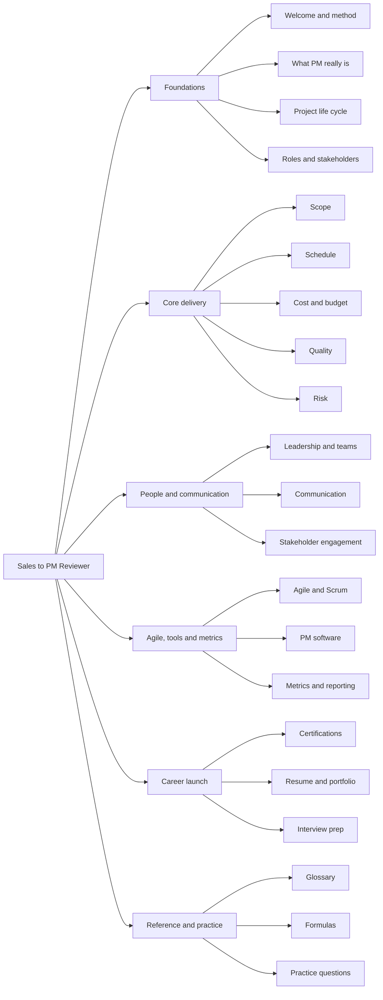
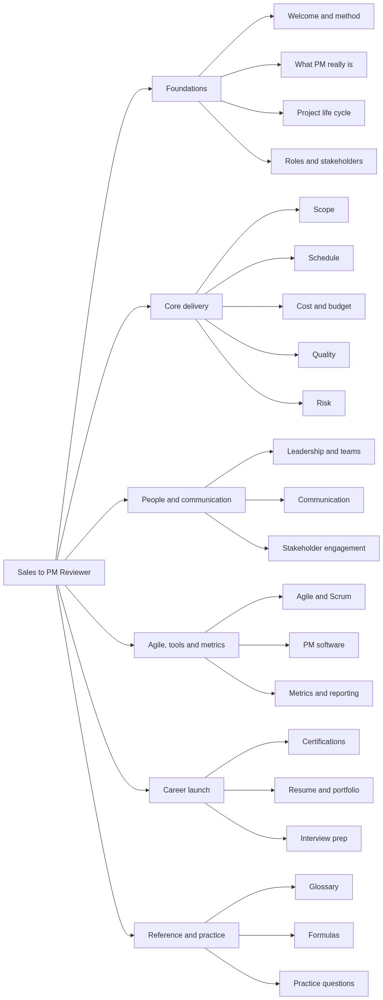
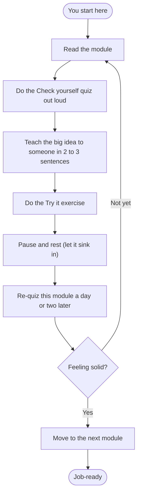
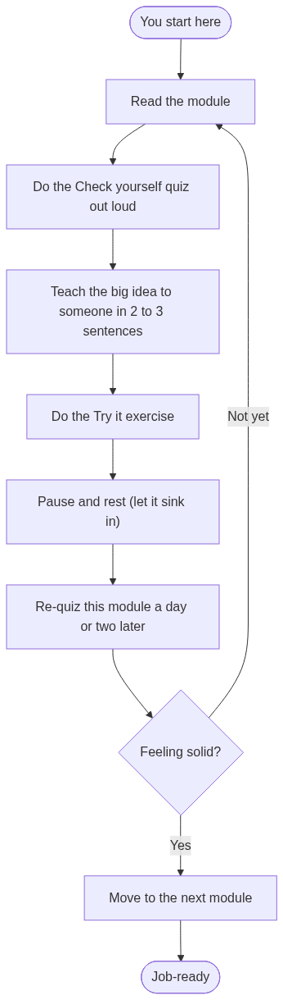

# Module 00 — Welcome & How to Use This Reviewer

> ⏱️ **Estimated study time:** ~20 min · 🎚️ **Level:** Orientation · 📋 **Prerequisites:** None — start here.
> Part of the **Sales -> Project Management Reviewer**.

*Every great story has a "before." This is yours — the chapter where the heroine decides to change everything.*

## 🎯 What you'll be able to do

- [ ] Explain who this reviewer is for and what you'll be able to do by the end of it.
- [ ] Use three proven study techniques — active recall, spaced repetition, and teaching-it-back — so the material actually sticks.
- [ ] Navigate any module confidently using the shared structure and icon legend.
- [ ] Pick the learning path (fast track or mastery) that fits your timeline.
- [ ] Set up a simple progress tracker and a healthy mindset for the weeks ahead.

## 👋 From your mentor

Okay, real talk — pull up a chair, get comfy, I'm so glad you're here. You've spent years reading a room before you said a word, nursing a pipeline like it was a houseplant, and dragging deals across the line while the clock screamed at you. That is not a blank page. That, my friend, is one heck of a backstory. Project management is, at its heart, the discipline of getting a group of people to deliver something on time, on budget, and at the quality everyone agreed to — and you already do a version of that every single quarter.

So think of this reviewer as the slow-burn part of the story: the stretch where the unlikely-but-perfect match finally clicks into place. We'll translate what you already know into the language and frameworks hiring managers swoon over, and we'll fill the genuine gaps with concrete, mentor-style explanations. No jargon for its own sake, ever. And if you feel a little flicker of *"wait, can I actually do this?"* — good. That flutter means you care. Stick with me. Let's go.

## 📖 What a "reviewer" is (and how to actually use it)

In a lot of countries, a **"reviewer"** is a focused self-study guide — denser than a textbook, lighter than a course, built to get you *exam-and-interview ready* without wasting a minute of your time. That's exactly what this is: a sequence of short modules you can study in order, each one building on the last, like chapters that earn the ending.

But here's the plot twist nobody warns you about: most people read a reviewer like a beach novel — eyes gliding, head nodding, blissfully absorbing nothing. A week later? Gone. Vanished. Passive reading *feels* productive and absolutely isn't. So let's outsmart that from page one.

### The three techniques that make this stick

| Technique | What it means | How to do it here |
|---|---|---|
| **Active recall** | Pulling an answer *out* of your brain instead of re-reading it *in*. | Cover the answer in every "Check yourself" quiz and say it out loud first. The struggle is the learning. |
| **Spaced repetition** | Reviewing material at growing intervals (1 day, 3 days, a week) right as you're about to forget it. | Don't cram. Revisit a finished module's quiz a day or two later before moving on. |
| **Teaching it back** | Explaining a concept simply, as if to a friend, to expose what you don't really understand. | After each module, explain its big idea in 2–3 plain sentences to a person, a pet, or your phone's voice memo. |

Here's what that actually means for you: you don't study by *re-reading*, you study by *retrieving*. Make your brain reach.

> 🔁 **Sales → PM bridge:** You already know that re-reading a product spec the night before a demo doesn't make you *good* at the demo — running mock pitches and getting peppered with objections does. Active recall and teaching-it-back are the exact same muscle. Study the way you prep to *sell*, not the way you skim a Monday-morning inbox.

### Why you must pause between modules

Your brain consolidates learning during the *gaps* — the walk, the sleep, the quiet moment later — not during the white-knuckle marathon session. Cramming six modules in one sitting feels heroic and produces mush. One or two modules, then a genuine break, beats a binge every time.

That's why most modules include a **⏸️ Pause & reflect** checkpoint. When you hit one, it's truly fine — encouraged, even — to close the laptop and come back tomorrow. Momentum comes from finishing *rested*, not from finishing wrecked.

## 🧭 How every module is structured

Learn the rhythm of one module and you've got them all — same beats, every chapter. Each one follows the same shape, marked with the same icons:

| Icon | Section | What it's for |
|---|---|---|
| 🎯 | **What you'll be able to do** | The concrete objectives — your "definition of done" for the module. |
| 👋 | **From your mentor** | A short, human framing of why this matters, often tied back to sales. |
| 📚 | **Core content** | The actual teaching: explanations, tables, examples, diagrams. |
| 🔁 | **Sales → PM bridge** | A callout mapping something you already do in sales onto the new PM concept. |
| ⏸️ | **Pause & reflect** | A safe stopping point with a reflective prompt or two. |
| 🧠 | **Check yourself** | Self-test questions with hidden answers — your active-recall reps. |
| 🧰 | **Try it** | A small hands-on exercise so the idea leaves your head and hits the page. |
| 🔑 | **Key terms** | A short glossary of the module's vocabulary. |
| ⬅️ ➡️ | **Navigation** | Links to the previous and next module, plus Reviewer Home. |

Don't skip the 🧠 and 🧰 sections to "save time." Those *are* the time well spent — the reading is just the setup, the flirty banter before the real chemistry.

## 🗺️ The full curriculum at a glance

Here's everything ahead, grouped into six parts. No need to memorize it — this is just the table of contents, so you can see where the story's headed.


*A bird's-eye map of the whole journey — six parts, building from foundations to a job-ready you.*

<!-- mobile-diagram:00-welcome-and-how-to-use-1 -->
<details><summary>🖼️ Tap to view as an image (for the GitHub mobile app)</summary>



</details>
<!-- /mobile-diagram -->

### The parts in words

- **Foundations** — what a project is, the life cycle, and who's involved. This is where your mental model gets built. *(You are here.)*
- **Core delivery knowledge areas** — the classic disciplines: **scope, schedule, cost, quality, and risk**. The bread and butter of delivery.
- **People & communication** — leadership, team dynamics, and stakeholder engagement. Your sales background will *shine* here.
- **Agile, tools & metrics** — Agile and **Scrum**, the software you'll use day to day, and the metrics that prove you're delivering.
- **Career launch** — certifications, your resume and portfolio, and interview prep aimed squarely at landing the role.
- **Reference & practice** — a glossary, the formulas worth knowing, and practice questions to test yourself before interviews.

## 🛤️ Two suggested paths

You've got a timeline and a goal. Pick the path that matches the life you're actually living.

| | 🏃 **Fast track to interviews** | 🧗 **Deeper mastery** |
|---|---|---|
| **Timeline** | 1–2 weeks | 6–8 weeks |
| **Best when** | You have interviews lined up *now* and need to speak the language fast. | You want durable understanding and a portfolio you can defend in depth. |
| **Pace** | 2–3 modules/day, skim the optional reference parts. | 3–5 modules/week, pause between each, do every Try-it. |
| **Focus** | Foundations + People + Career launch + a Scrum primer. | Everything, in order, with the practice bank revisited weekly. |
| **Quizzes** | Do them once, out loud. | Do them, then re-do them spaced 2–3 days later. |
| **Risk to manage** | Going too shallow — keep the Key Terms sheet handy in interviews. | Losing momentum — protect a fixed weekly study slot. |

A perfectly reasonable hybrid: run the **fast track first** to get interview-ready, then loop back through the **mastery path** to deepen what you skimmed. Nobody said you only get to read this once — the best books reward a second pass.


*The recommended loop for each module — read, recall, teach, try, rest, space, advance.*

<!-- mobile-diagram:00-welcome-and-how-to-use-2 -->
<details><summary>🖼️ Tap to view as an image (for the GitHub mobile app)</summary>



</details>
<!-- /mobile-diagram -->

## ✅ How to track progress

Keep it gloriously, stubbornly simple. Copy this checklist somewhere you'll actually see it — a notes app, a sticky note, the top of a doc — and tick a box each time you finish a module's reading **and** its quiz.

```text
[ ] 00 — Welcome & How to Use This Reviewer   ← you're nearly done!
[ ] 01 — What Project Management Really Is
[ ] 02 — ...
[ ] 03 — ...
   ...continue for every module in the curriculum...
```

> 🔁 **Sales → PM bridge:** Think of this checklist as your **pipeline for the deal of getting hired** — each module is a stage moved from "open" to "closed-won." You'd never run a quota without a board to track it; don't run your career switch blind either.

A small streak beats a big plan. Two modules a day for one week will carry you further than a flawless 8-week schedule you ghost on day three.

## 🌱 A word on mindset (read this on the hard days)

At some point you'll hit a module where the vocabulary feels like a foreign menu with no pictures, and a quiet little voice will whisper *"everyone else already knows this."* That voice has a name — **impostor syndrome** — and it gets *loudest* exactly when you're growing. It is not evidence that you don't belong. It's the antagonist in your story, and antagonists lie.

Two anchors to hold onto:

- **Growth mindset.** Skills are built, not born. "I can't do this *yet*" is the whole game. Every PM you'll interview with was once sitting precisely where you're sitting.
- **You're not starting from zero.** Negotiation, managing expectations, handling difficult people, hitting a number under a deadline — you've been doing project-management-adjacent work for years. We're relabeling and sharpening it, not implanting it.

Be as patient with yourself as you'd be with a nervous new rep you were mentoring. Progress, not perfection.

## ⏸️ Pause & reflect

This is a safe place to stop — bookmark it. Take a breath before you dive into Module 01, and if today's been long, genuinely come back to this tomorrow.

- Which study technique — active recall, spaced repetition, or teaching-it-back — do you most often *skip*? How will you build it in this time?
- Which path are you choosing: fast track or mastery? Write down the realistic time slot you'll protect for studying.
- Name one project-management-adjacent thing you already did well in sales. Tuck it in your pocket for the impostor-syndrome days.

## 🧠 Check yourself

Cover the answers. Say yours out loud first — that little struggle *is* the point.

**1. Why is re-reading a module a poor way to study, and what should you do instead?**
<details><summary>Show answer</summary>
Re-reading feels productive but is passive — recognition isn't recall. Instead use **active recall** (retrieve answers from memory before checking), **spaced repetition** (revisit at growing intervals), and **teaching-it-back** (explain the idea simply to someone).
</details>

**2. What does the ⏸️ Pause & reflect section signal, and why does it matter?**
<details><summary>Show answer</summary>
It's a deliberate, safe stopping point. Pausing matters because your brain **consolidates** learning during breaks and sleep, not during marathon cram sessions — so resting between modules makes the material stick better.
</details>

**3. Name the six parts of the curriculum.**
<details><summary>Show answer</summary>
Foundations; Core delivery knowledge areas; People & communication; Agile, tools & metrics; Career launch; and Reference & practice.
</details>

**4. When would you choose the fast-track path over the mastery path?**
<details><summary>Show answer</summary>
When you already have interviews lined up and need to speak the language quickly (roughly 1–2 weeks). The mastery path (6–8 weeks) is better when you want deeper, durable understanding and a portfolio you can defend.
</details>

**5. What's a healthy way to think about impostor feelings as you start?**
<details><summary>Show answer</summary>
They're a normal sign of growth, not proof you don't belong. Lean on a **growth mindset** ("I can't do this *yet*") and remember you're transferring real, relevant skills from sales — not starting from zero.
</details>

## 🧰 Try it

A five-minute setup that quietly pays off all the way through:

1. Open a notes app or doc and paste the progress checklist from the section above.
2. Decide your path — **fast track** or **mastery** — and write your protected study slot next to it (e.g. *"30 min after dinner, Mon–Fri"*).
3. Out loud, in 2–3 sentences, explain to an imaginary friend what this reviewer is and how you plan to study it. (Yes, actually say it — out loud — that's your first teaching-it-back rep.)
4. Tick the box for Module 00. You just closed your first stage. 🎉

## 🔑 Key terms

- **Reviewer** — a focused, condensed self-study guide built to get you interview- and exam-ready efficiently.
- **Active recall** — retrieving information from memory (vs. re-reading it), the single most effective study technique.
- **Spaced repetition** — reviewing material at increasing intervals to fight forgetting.
- **Teaching it back** — explaining a concept in plain language to expose and close gaps in your understanding.
- **Consolidation** — the brain's process of stabilizing new memories, which happens during rest and sleep.
- **Growth mindset** — the belief that ability is developed through effort and practice rather than fixed at birth.
- **Impostor syndrome** — the persistent feeling of being a fraud despite real competence, common during career transitions.

Close this one feeling steady — because next, we stop circling the question and finally answer it: what *is* project management, really, once you strip away the buzzwords? Turn the page.

---
⬅️ **Previous:** [Start here](../README.md) · 🏠 **[Reviewer Home](../README.md)** · ➡️ **Next:** [Module 01 — What Project Management Really Is](01-what-is-project-management.md)
