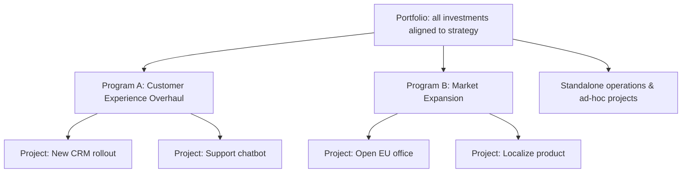
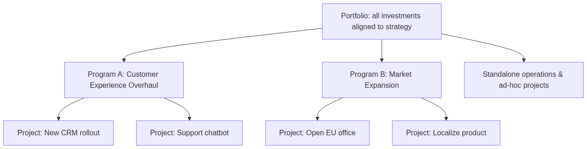
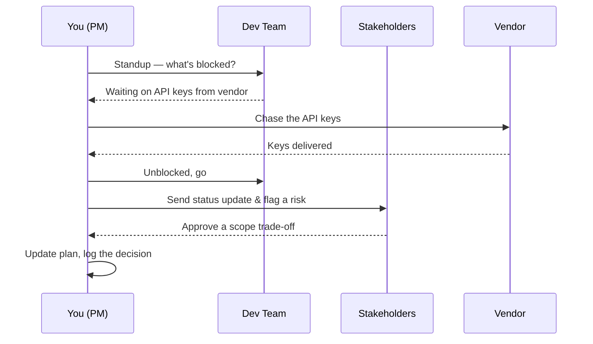
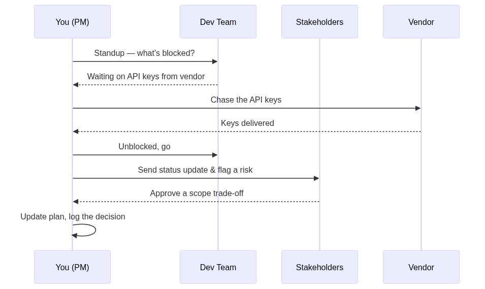
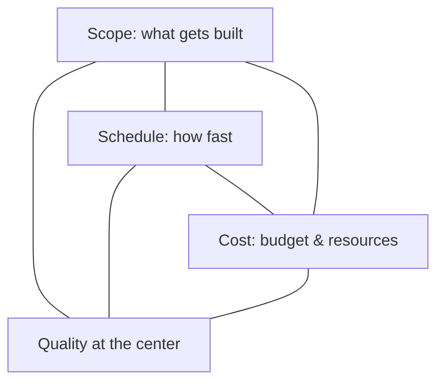
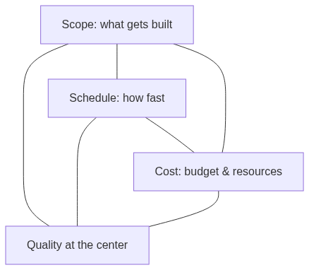
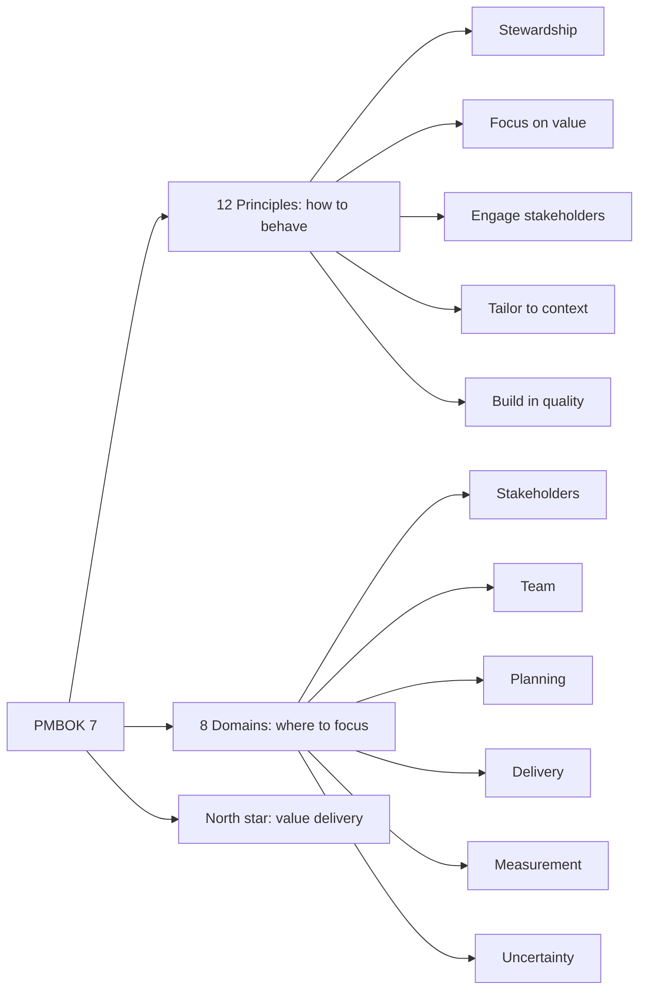
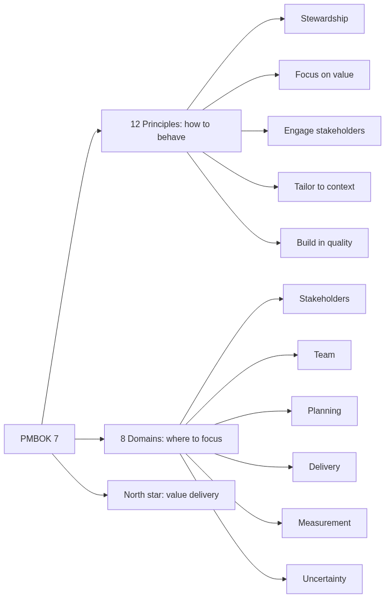

# Module 01 — What Project Management Really Is

> **Estimated study time:** ~35 min · **Level:** Beginner · **Prerequisites:** [Module 00](00-welcome-and-how-to-use.md) · Part of the **Sales -> Project Management Reviewer**.

*The first chapter, where you discover the heroine has been doing this all along — she just never knew its name.*

## 🎯 What you'll be able to do

- [ ] Explain what makes something a **project** versus ongoing **operations**, with your own examples.
- [ ] Place any piece of work correctly in the **portfolio > program > project** hierarchy.
- [ ] Describe what a project manager actually does all day — and why "the boss who does the work" is the wrong mental model.
- [ ] Use the **Iron Triangle** to talk about trade-offs like a pro, and name the extended constraints.
- [ ] Orient yourself in **PMBOK Guide 7th edition** (the 12 principles and 8 performance domains) without drowning.
- [ ] Define **project success** the modern way — beyond just "on time and on budget."

## 👋 From your mentor

Hey, you. First real module. Settle in, get comfy — this one's gentler than it looks.

Here's the secret I want to spill before we even start: you already manage projects. You just call them "closing the quarter" or "landing the enterprise account." Everything in this module is about giving proper names to instincts you've trusted for years. It's less *learning a new language* and more *finding out the thing you do has subtitles*.

By the end, I want you to be able to walk into a room of PMs and not feel like the new girl who wandered in by mistake. The vocabulary is honestly learnable in an afternoon. The hard part — the judgment to know what to trade off when everything's on fire — you've been rehearsing on the sales floor this whole time. Let's connect the two.

---

## What is a project, really?

A **project** is *a temporary endeavor undertaken to create a unique product, service, or result* (that's PMI's definition, and yes, it's worth memorizing word-for-word). Three little words in there do all the heavy lifting:

- **Temporary** — it has a defined start and a defined end. When the goal is met (or the project gets called off), it's over. Note: "temporary" does *not* mean "quick." A project can run for years. It just isn't *forever*.
- **Unique** — the deliverable hasn't existed in exactly this form before. Building *this* client's onboarding portal is unique even if you've built a dozen portals already. Like every wedding has a cake, but never quite *this* cake.
- **Progressive elaboration** — you don't know everything on day one, and that's completely normal. The plan sharpens as you learn. You start fuzzy ("we need a new CRM") and end sharp ("migrate 12,000 contacts to HubSpot by March 31, keeping these 4 custom fields"). Detail arrives in layers, like a photo slowly developing.

### Projects vs. operations

**Operations** are the polar opposite of temporary and unique: ongoing, repetitive work that keeps the lights on. Payroll every two weeks. Restocking shelves. Answering support tickets. There's no "end date" — you just do it again next cycle.

Here's the clean contrast:

| Dimension | **Project** | **Operations** |
|---|---|---|
| Timeline | Temporary (clear start & end) | Ongoing, no end |
| Output | Unique deliverable | Repetitive, standardized output |
| Goal | Achieve a specific objective, then close | Sustain the business |
| Planning | Progressively elaborated | Stable, optimized over time |
| Example | Launch a new product line | Process daily customer orders |

**A few concrete examples to lock it in:**

- *Project:* Open a new regional office. *Operations:* Run that office once it's open.
- *Project:* Build a company website. *Operations:* Publish a blog post on it every Tuesday.
- *Project:* Roll out a new CRM to the sales team. *Operations:* Log calls in that CRM every day (this one's personal for you 👇).

> 🔁 **Sales → PM bridge:** Think about closing your quarterly quota. It has a **hard end date** (quarter-end), a **unique target** (this quarter's number, this pipeline), and you **elaborate progressively** — your forecast gets sharper as deals advance through the stages. That, my friend, is textbook *project* behavior. Meanwhile, the daily grind of logging activities and nudging pipeline stages along? That's *operations*. You've been living on both sides of this line for years — you just never had the chart.

---

## The hierarchy: portfolio > program > project

Big organizations don't run one tidy project at a time — they run dozens, all at once, and they need a way to keep them organized so the work actually serves the strategy instead of wandering off. That's the **portfolio > program > project** hierarchy.

*A portfolio holds programs and projects; programs group related projects toward a shared outcome.*

<!-- mobile-diagram:01-what-is-project-management-1 -->

🖼️ View as image (for the GitHub mobile app)

<!-- /mobile-diagram -->

The distinctions, plainly:

| Level | What it is | Managed for |
|---|---|---|
| **Project** | A single temporary effort with one deliverable | **Outputs** — deliver the thing, well |
| **Program** | A group of *related* projects coordinated together because managing them as a set gets you benefits you couldn't get separately | **Outcomes** — the combined benefit |
| **Portfolio** | The whole collection of projects, programs, and operations an organization runs to hit strategic goals | **Strategic alignment** — are we investing in the right things? |

**Example:** "Open EU office" and "Localize the product into French and German" are two separate projects. Bundle them under a **Market Expansion program** and suddenly you can share staff, sequence them sensibly, and track one combined benefit (revenue from Europe). The **portfolio** is the room where leadership decides whether Market Expansion deserves funding *at all* — versus, say, the Customer Experience program.

Think of it like planning a big trip with friends: each booking (flights, hotel, the wine tour) is a *project*; "the Italy leg" that ties a few of them together is a *program*; and "what are we even spending this year's vacation budget on" is the *portfolio*.

You'll spend most of this reviewer working at the **project** level. Just know the whole ladder exists, so you know where your rung sits — and so "the PMO is reprioritizing the portfolio" doesn't sound like overheard gossip in a language you never studied.

---

## What a project manager actually does all day

Let's kill a myth right now, because it'll save you a lot of grief: **the PM is not the boss who does all the work.** If you're the PM and you're personally building the deliverable at 11pm, something has gone sideways. Your job is to make *everyone else's* work possible, coordinated, and unblocked.

Two roles capture this:

- **Integrator** — you're the one person who can see the whole picture. Engineering, design, finance, the client, legal — each of them sees only their slice. You connect the slices so the thing actually ships. Most of your day is spent moving information across boundaries (think of yourself as the friend who keeps the group chat from falling apart).
- **Servant-leader** — a term PMI and Agile both embrace. You lead by *removing obstacles and serving the team*, not by barking orders. You ask "what's in your way?" far more than you say "do this." (We go deep on servant-leadership in [Module 02](02-from-sales-to-pm.md) and the people modules.)

A realistic morning:

*A day in the life: mostly communicating, unblocking, and integrating — not "doing the build."*

<!-- mobile-diagram:01-what-is-project-management-2 -->

🖼️ View as image (for the GitHub mobile app)

<!-- /mobile-diagram -->

What that actually breaks down into:

- **Communicating** — studies and PMI both put this at roughly *80–90% of a PM's time*. Status, expectations, and bad news delivered early (always early).
- **Planning & re-planning** — turning fuzzy goals into a sequence of work, then adjusting when reality crashes the party.
- **Managing risk** — spotting what could go wrong *before* it does, and having a plan ready.
- **Managing stakeholders** — keeping the people who care about (or could sink) the project informed and aligned.
- **Removing blockers** — the unglamorous, high-value work of quietly clearing the path.
- **Tracking & reporting** — knowing where you *really* are versus the plan, and saying so honestly.

---

## The Iron Triangle (triple constraint)

If you remember one mental model from this whole reviewer, make it this one — you'll reach for it weekly. The classic **triple constraint** — also called the **Iron Triangle** — says every project is held in tension by three competing forces, with **quality** sitting right at the center as the thing they all affect:

*The triple constraint: move one side and the others must flex. Quality lives in the middle.*

<!-- mobile-diagram:01-what-is-project-management-3 -->

🖼️ View as image (for the GitHub mobile app)

<!-- /mobile-diagram -->

Here's the rule that makes it powerful: **you cannot fix all three independently.** Tug on one and at least one other has to give.

- Want it **faster** (shorter schedule)? Either cut **scope** or add **cost** (more people/overtime).
- Want **more scope**? It'll take longer or cost more.
- Want it **cheaper**? Expect less scope or a longer timeline.

A working example: a client says, *"Add three more features, keep the same deadline, and don't touch the budget."* The Iron Triangle tells you instantly that something has to break — and your job is to make that visible and start a real trade-off conversation, instead of quietly burning out the team (which silently sacrifices the hidden fourth variable: **quality**). Saying yes to all three is the project-management version of promising you'll be "five minutes away" when you haven't even left the house.

> 🔁 **Sales → PM bridge:** You already negotiate this triangle in your sleep. A prospect wants a lower price (**cost**), the full feature set (**scope**), and onboarding by Monday (**schedule**). You don't just smile and say yes — you trade: "I can hit that price if we start with the core package and add modules next quarter." That instinct to *protect value while flexing the constraints* is exactly what PMs do. You're not learning a new skill here. You're relabeling one you've already mastered.

### The extended / competing constraints (PMBOK 7)

Modern PM admits the triangle was always a bit of a simplification. There are really **six** competing constraints you're balancing:

| Constraint | The question it asks |
|---|---|
| **Scope** | What work is (and isn't) included? |
| **Schedule** | When must it be done? |
| **Cost** | What's the budget? |
| **Quality** | How good does the deliverable need to be? |
| **Resources** | What people, tools, materials do we have? |
| **Risk** | What uncertainty are we accepting? |

And hovering above all six, like the real reason anyone showed up: **benefits / value** — the actual point of the project. A project delivered on time and on budget that produces no value is still a *failure*. Hold that thought tight; it's the beating heart of PMBOK 7.

---

## ⏸️ Pause & reflect

This is a genuinely lovely place to stop, stretch, and let the Iron Triangle settle into your bones. **It's completely safe to bookmark here and come back later** — the next section shifts gears into PMI's framework, and you'll absorb it better with fresh eyes.

Before you go (or before you carry on), sit with these:

1. Think of one "project" from your sales career — a big push, a launch, a quota sprint. Which constraint did you protect, and which did you let flex?
2. In your current or last job, name one thing that's clearly **operations** and one thing that's clearly a **project**. Was anyone treating the project like operations (or the other way around)?

No essays required — just answer them honestly, in your head or a notebook.

---

## Value delivery: how PMBOK 7 thinks

Earlier editions of the **PMBOK Guide** were process-heavy — 49 processes, a forest of inputs and outputs. The **7th edition (2021)** made a deliberate pivot: away from rigid processes and toward **principles** and **outcomes**, because projects deliver in wildly different ways now (predictive/waterfall, agile, hybrid). The new north star is **value delivery** — projects exist to create value, not just to crank out deliverables.

It's built on two lists. **You do not need to memorize these now** — just recognize them so they're old friends, not strangers, when they show up later.

### The 12 Principles (the "how to behave")

These are guidelines for *good project conduct*:

1. Be a diligent, respectful, and caring **steward**.
2. Create a collaborative project **team** environment.
3. Effectively engage with **stakeholders**.
4. Focus on **value**.
5. Recognize, evaluate, and respond to **system interactions** (systems thinking).
6. Demonstrate **leadership** behaviors.
7. **Tailor** based on context.
8. Build **quality** into processes and deliverables.
9. Navigate **complexity**.
10. Optimize **risk** responses.
11. Embrace **adaptability and resiliency**.
12. Enable **change** to achieve the envisioned future state.

### The 8 Performance Domains (the "where to focus")

These are the areas of activity critical to delivering outcomes:

| # | Performance Domain | In one line |
|---|---|---|
| 1 | **Stakeholders** | Engage the people who matter |
| 2 | **Team** | Build and support those doing the work |
| 3 | **Development Approach & Life Cycle** | Choose predictive, agile, or hybrid |
| 4 | **Planning** | Organize and coordinate the work |
| 5 | **Project Work** | Run the processes, manage resources & procurement |
| 6 | **Delivery** | Meet scope and quality; deliver the value |
| 7 | **Measurement** | Track performance; know if you're on track |
| 8 | **Uncertainty** | Handle risk, ambiguity, and complexity |

Tying it together: PMBOK 7 also names the **value delivery system** — the idea that portfolios, programs, projects, *and* operations all work together to deliver value to the organization. Notice the principles and domains overlap (stakeholders, value, risk, team show up in both lists). That's on purpose — they reinforce each other.

*PMBOK 7 at a glance — principles guide behavior, domains guide focus, both serve value.*

<!-- mobile-diagram:01-what-is-project-management-4 -->

🖼️ View as image (for the GitHub mobile app)

<!-- /mobile-diagram -->

---

## What does "project success" actually mean?

The old answer was the Iron Triangle: **on time, on budget, in scope.** Necessary — but, plot twist, no longer sufficient. Modern PM (and PMBOK 7 especially) defines success more completely:

- **On time / on budget / in scope** — you delivered what you said, when you said, for what you said. Table stakes.
- **Stakeholder satisfaction** — the people who care about the outcome are *actually* happy with it. A "successful" project nobody wanted isn't a success.
- **Benefits realized / value delivered** — the project produced the outcome it was funded to produce. Did the new CRM actually shorten the sales cycle? Did the revenue from Europe materialize?

Here's the cautionary tale — and it's the kind of twist that should make you sit up. A project can land *perfectly* inside the triangle and still **fail** if it delivers something useless, or if stakeholders feel steamrolled, or if the expected benefit never shows. Flip it around: a project that ran a little over budget but transformed how the whole company sells might be a roaring success. **Value is the final judge.**

> A blunt way to remember it: *"On time and on budget" is how you deliver. "Did it create value?" is whether you succeeded.*

---

## The PMO in one section

A **Project Management Office (PMO)** is an organizational structure that standardizes project governance and shares resources, methods, tools, and techniques. Not every company has one, but plenty do — and they come in three flavors, sorted by how much control they like to wield:

| PMO type | Degree of control | What it does |
|---|---|---|
| **Supportive** | **Low** | Provides templates, training, best practices, lessons learned. Acts as a consultant/repository. Take it or leave it. |
| **Controlling** | **Moderate** | Requires compliance — you must use specific frameworks, tools, or templates. Audits for conformance. |
| **Directive** | **High** | Takes over and *directly manages* the projects; the PMs report into the PMO. |

If you join a company with a **directive** PMO, expect a lot of standardization and a watchful eye over your shoulder. A **supportive** PMO is more like a helpful, well-stocked library you can lean on whenever you want. Knowing which kind you're dealing with tells you, on day one, how much freedom you'll have to tailor your approach (remember principle #7 — *tailoring*).

---

## 🧠 Check yourself

Try to answer before you peek. No grade, no red pen — just calibration.

**1. What three words define a project, per PMI?**

Show answer

**Temporary** (defined start and end), **unique** (a one-of-a-kind deliverable), and developed through **progressive elaboration** (detail emerges as you learn more). The official phrasing: "a temporary endeavor undertaken to create a unique product, service, or result."

**2. Your team logs support tickets every day with no end date. Project or operations?**

Show answer

**Operations** — it's ongoing and repetitive with no defined end. Building the *ticketing system* would be a project; *using it daily* is operations.

**3. A client wants more features, the same deadline, and no budget increase. What does the Iron Triangle tell you?**

Show answer

Something has to give. You can't add scope while holding schedule and cost fixed without sacrificing the hidden constraint — **quality** (or burning out the team). Your job is to surface the trade-off and force an explicit decision.

**4. How do portfolio, program, and project differ in one word each?**

Show answer

**Project** = outputs (deliver the thing). **Program** = outcomes (combined benefits from related projects). **Portfolio** = strategic alignment (are we investing in the right things at all?).

**5. A project finished on time and on budget, fully in scope — but no one uses the result and the expected revenue never came. Success or failure?**

Show answer

**Failure** (or at best a hollow win). Modern success requires **stakeholder satisfaction** and **benefits realized / value delivered**, not just hitting the triangle. Value is the final judge.

**6. Name the three PMO types from least to most control.**

Show answer

**Supportive** (low — templates and advice) → **Controlling** (moderate — requires compliance) → **Directive** (high — directly manages the projects).

---

## 🧰 Try it

**Reframe a sales win as a project (15 minutes).**

Pick one achievement you're genuinely proud of from your sales career — a major account you closed, a territory you launched, a quota sprint you won. Now write it up as a *project*, using the language from this module:

1. **The deliverable** — what unique result did you produce? (e.g., "Signed enterprise contract with Acme worth $240k ARR.")
2. **Temporary boundaries** — when did it start and end?
3. **Progressive elaboration** — name one thing you *didn't* know at the start that became clear later.
4. **The Iron Triangle** — which constraint did you protect (scope/schedule/cost) and which did you flex? What was your "quality at the center" worry?
5. **Success beyond the triangle** — did it deliver real *value/benefit* and leave stakeholders satisfied? How do you know?

Keep it to half a page. This is exactly the kind of story you'll retell in PM interviews — and writing it now is your own little proof that you've been running projects all along. You'll build on this directly in [Module 02](02-from-sales-to-pm.md).

---

## 🔑 Key terms

- **Project** — A temporary endeavor undertaken to create a unique product, service, or result.
- **Operations** — Ongoing, repetitive work that sustains the business; no defined end.
- **Progressive elaboration** — Refining the plan in greater detail as more information becomes known.
- **Portfolio** — The full collection of projects, programs, and operations aligned to strategy.
- **Program** — A group of related projects managed together to gain benefits not available by managing them separately.
- **Iron Triangle (triple constraint)** — The interdependence of scope, schedule, and cost, with quality at the center.
- **Integrator** — The PM's role of connecting all parts and stakeholders into a coherent whole.
- **Servant-leader** — A leader who leads by serving the team and removing obstacles, not by command.
- **PMBOK Guide** — PMI's *A Guide to the Project Management Body of Knowledge*; the 7th edition is principle- and value-based.
- **Performance domain** — One of the 8 PMBOK 7 areas of activity critical to delivering project outcomes.
- **Benefits realization / value** — The actual outcome and worth a project produces; the ultimate measure of success.
- **PMO (Project Management Office)** — An organizational structure that standardizes governance; supportive, controlling, or directive.

---
⬅️ **Previous:** [Module 00 — Welcome & How to Use This Reviewer](00-welcome-and-how-to-use.md) · 🏠 **[Reviewer Home](../README.md)** · ➡️ **Next:** [Module 02 — From Sales to PM — Your Unfair Advantage](02-from-sales-to-pm.md)
