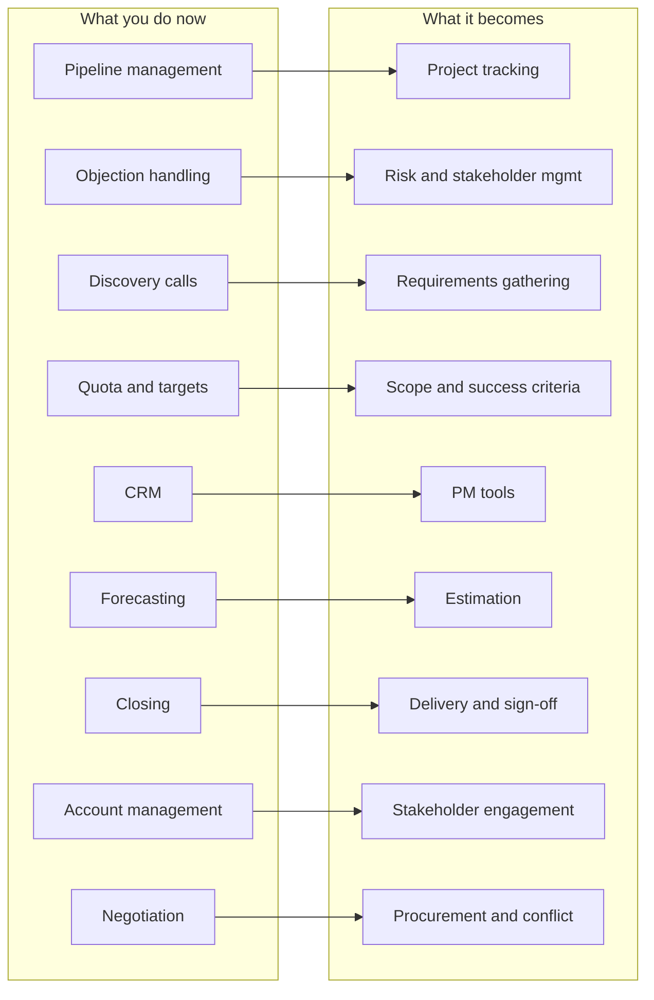
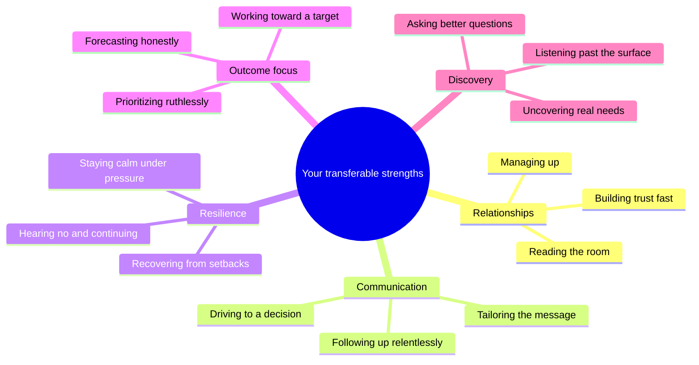
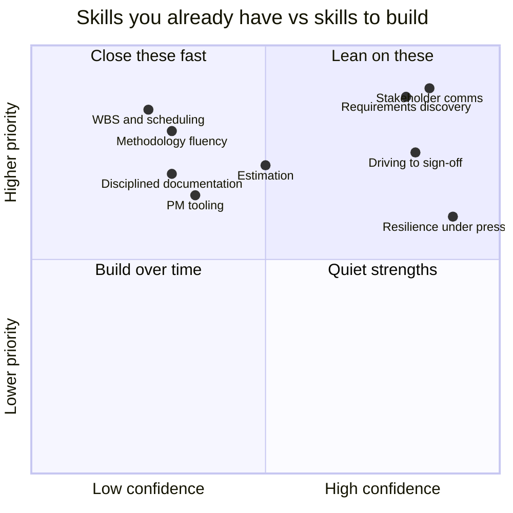

# Module 02 — From Sales to PM — Your Unfair Advantage

> **Estimated study time:** ~30 min · **Level:** Beginner · **Prerequisites:** Module 01 · Part of the **Sales -> Project Management Reviewer**.

## 🎯 What you'll be able to do

- [ ] Explain, with concrete examples, why your sales experience is a genuine head start in project management.
- [ ] Map at least eight specific sales skills onto their project-management equivalents.
- [ ] Name the three or four mindset shifts you'll need to make — and spot them happening in real time.
- [ ] Identify your honest skill gaps (artifacts, methodology, tooling, documentation) and have a plan to close them.
- [ ] Translate your own résumé into PM language without faking anything.
- [ ] Talk about your career change with calm confidence instead of apology.

## 👋 From your mentor

Here's the thing nobody told you when you started worrying about this switch: most of the hard part of project management isn't the templates — it's the *people*, the *pressure*, and the *follow-through*. You've been living in all three for years.

A surprising number of strong PMs come from sales, customer success, and account management precisely because they already know how to hold a relationship steady while a deal (or a project) wobbles. You're not starting from zero. You're starting from "I already do 70% of this; I just call it different things." This module is about naming that 70%, being honest about the other 30%, and walking into your first PM conversation like you belong there. Because you do.

## Why sales is genuinely strong preparation for PM

Let's be specific, because vague encouragement won't calm career-change nerves — evidence will. Four parts of the job that sink new PMs are four parts you've already been doing under quota pressure.

**Relationships are the work, not a distraction from it.** New PMs often treat stakeholders as obstacles between them and "the real work." You already know the relationship *is* the real work. A skeptical engineering lead is just a tough buyer who hasn't been given a reason to trust you yet.

**You communicate to move people, not just to inform.** Sales taught you to read a room, adjust your message to the audience, and follow up until you get a decision. PM status reports and steering meetings are exactly this — clarity that drives action, not documents that gather dust.

**You're resilient by training.** You've heard "no," lost deals you were sure of, and shown up the next morning anyway. Projects slip, scope changes, and sponsors go quiet. The person who can absorb a setback without spiraling is worth a lot in a delivery room.

**You drive outcomes under pressure.** A quarter-end with a gap to close is not so different from a release date with open risks. You already know how to stay calm, prioritize ruthlessly, and ask "what's the one thing that moves this forward today?"

> 🔁 **Sales → PM bridge:** Every quarter you took a number you didn't control directly and made it happen through other people — buyers, sales engineers, legal, finance. That *is* project management. A PM takes an outcome they can't personally produce and orchestrates the people who can. You've been doing the core motion all along; only the deliverable changes.

## The skills-mapping table

This is the heart of the module. Read it slowly. For each row, picture an actual moment from your own job — the table becomes real when you do.

| What you do in sales | The PM equivalent | What carries over |
|---|---|---|
| **Pipeline management** (tracking deals through stages) | **Project / portfolio tracking** (tasks, milestones, status) | Working a board of "in-flight things," knowing what's stuck and why, forecasting what lands when |
| **Objection handling** (surfacing and resolving buyer concerns) | **Risk & stakeholder management** | Hearing the unsaid worry early, naming it, and having a response ready before it becomes a deal-killer |
| **Discovery calls** (asking questions to uncover real needs) | **Requirements gathering / elicitation** | Open questions, active listening, separating what people *ask for* from what they actually *need* |
| **Quota & targets** | **Scope & success criteria** | Defining "what counts as winning" up front and measuring against it without flinching |
| **CRM** (Salesforce, HubSpot) | **PM tools** (Jira, Asana, MS Project, Monday) | Living in a system of record, keeping data clean, trusting the pipeline view to tell the truth |
| **Forecasting** (call the quarter) | **Estimation** (effort, duration, cost) | Turning incomplete information into a defensible number, then refining it as you learn more |
| **Closing** (getting signature and commitment) | **Delivery & sign-off / acceptance** | Driving to a yes, confirming the decision is real, getting it in writing so it sticks |
| **Account management** (growing and retaining accounts) | **Stakeholder engagement** | Keeping busy, powerful people informed and bought-in over a long relationship, not a single transaction |
| **Negotiation** (price, terms, concessions) | **Procurement & conflict resolution** | Finding the trade that both sides can live with; managing vendors and contracts; defusing tension |

A few of these deserve a second look:

- **Discovery → requirements** is your single biggest advantage. The number-one cause of failed projects is building the wrong thing because nobody dug past the surface ask. You dig past the surface ask *for a living*.
- **Forecasting → estimation** transfers more than people expect. You already know forecasts are ranges, not promises, and that "sandbagging" and "happy ears" both burn you. Estimation has the same psychology.
- **Closing → sign-off** matters because new PMs are weirdly shy about asking for a clear "yes." You are not shy about asking for the close. Use that.

*Your existing toolkit on the left maps almost one-to-one onto the PM toolkit on the right.*

## The mindset shifts to make

The skills carry over. The *posture* needs adjusting. These are the four shifts that separate "salesperson doing PM tasks" from "project manager." None of them mean abandoning who you are — they mean redirecting the same energy.

### 1. From individual quota to team outcomes

In sales, the number on your back was yours. You could be a lone wolf and still be a hero. In PM, you succeed only when the *team* delivers — and often the most valuable thing you do is make someone else look good. Your scoreboard changes from "what did I close" to "did the team ship the right thing." That can feel like a loss of control at first. It's actually a promotion in scope.

### 2. From persuading to facilitating

Selling pushes toward a predetermined outcome: the purchase. Facilitating pulls the best answer *out of the group*, even when it's not the answer you walked in with. A PM in a planning meeting isn't there to win the room; they're there to help the room decide and commit. Same charisma, opposite vector — instead of "let me convince you," it's "let me help us figure this out together."

### 3. From short deal cycles to longer delivery cycles

A sales cycle might be days or weeks; the dopamine of the close is frequent. Projects can run months. The reward is delayed and diffuse. You'll need to manufacture your own sense of progress — celebrate milestones, demos, and small wins — because the big "close" is far away and shared. Build the habit of marking progress, or the long middle will feel like a slog.

### 4. From "always be closing" to "always be enabling"

ABC was about converting. Your new motto is closer to **always be enabling**: removing blockers, clarifying decisions, getting the team what they need so *they* can produce. Your highest-value moments are often invisible — the dependency you unstuck, the ambiguity you killed before it cost a week.

*The strengths sales already built in you, grouped the way a PM would use them.*

## The honest gaps to close

Encouragement without honesty is just flattery, and you'd see through it anyway. Here's the real 30% you need to build. The good news: every one of these is *learnable*, and most are covered in later modules.

| Gap | What it actually means | Where it's covered |
|---|---|---|
| **Technical artifacts** | Building a WBS (work breakdown structure), schedules (Gantt, critical path), and budgets/cost baselines | Later scope, schedule & cost modules |
| **Methodology fluency** | Knowing when to use predictive (Waterfall) vs. adaptive (Agile/Scrum) approaches and the vocabulary of each | `03-lifecycle-and-process-groups.md` and the Agile modules |
| **Tooling** | Hands-on with Jira/Asana/MS Project the way you knew Salesforce cold | Tools module |
| **Disciplined documentation** | Decision logs, status reports, change records, RAID logs — writing things down so they survive memory and turnover | Communications & documentation modules |

Two honest notes:

- **Documentation is the one that bites ex-salespeople hardest.** Sales rewards verbal agility and improvisation; you could carry a lot in your head. PM rewards the written record. When a sponsor "remembers" the scope differently three months in, the documented decision is what saves you. Treat documentation as your insurance policy, not paperwork.
- **You don't need to master all four before applying.** You need enough fluency to be conversant and a credible plan to grow. A PMI **CAPM** certification or a **PSM I** (Scrum.org) can structure your learning and signal seriousness on a résumé while you build the hands-on reps.

> 🔁 **Sales → PM bridge:** You already trust your CRM as the single source of truth — you'd never run a pipeline review off memory. PM documentation is the same instinct applied to projects. The RAID log and decision record are just your "clean pipeline data" for delivery. You're not learning a new discipline; you're pointing an old one at a new object.

## ⏸️ Pause & reflect

This is a safe place to stop. Close the file, get a coffee, come back later — your progress holds. Before you do, sit with one or two of these:

- Which row in the skills-mapping table felt most *obviously* true for you? Write down the specific memory it brought up — that's your strongest interview story.
- Which of the four mindset shifts feels hardest to imagine making? Naming the discomfort now makes it smaller later.
- If a friend in sales asked "could I do PM?", what would you tell them — and does that answer apply to you?

No rush. The rest of the module will be here when you're ready.

## The sales → PM vocabulary translator

Half of impostor syndrome is just not knowing the words yet. You're not less capable; you're translating in real time. Here's the phrasebook so you can speak PM in the room and on your résumé.

| You say (sales) | They say (PM) | Quick gloss |
|---|---|---|
| Prospect / lead | Stakeholder | Anyone affected by or interested in the project |
| Decision maker / economic buyer | Sponsor | The person who funds and champions the project |
| Pipeline | Portfolio / backlog | The set of work in flight or waiting |
| Deal stage | Phase / milestone | A defined point of progress |
| Quota | Scope & objectives | What "done and successful" means |
| Forecast | Estimate / baseline | Predicted effort, time, or cost |
| Discovery | Requirements elicitation | Uncovering what's actually needed |
| Objection | Risk / issue / concern | A potential or actual threat to success |
| Close | Acceptance / sign-off | Formal agreement that work is complete |
| Account plan | Stakeholder engagement plan | How you'll keep people informed and aligned |
| Champion | Sponsor / advocate | Your inside ally with influence |
| Pushback | Constraint / dependency | Something limiting your options |
| Renewal / upsell | Benefits realization | Making sure the value actually lands after delivery |

Keep this handy for your first few weeks. Within a month the translation becomes automatic and you'll stop noticing you ever needed it.

## A word about impostor syndrome

Let's name it plainly, because pretending you don't feel it doesn't help. You're going to sit in a meeting where someone casually says "let's check the critical path against the baseline" and your stomach will drop. That feeling is *not* evidence you don't belong. It's evidence you're learning new vocabulary for things you already understand. A critical path is just "the sequence of things that, if any slips, the whole deal slips" — you've tracked that on big sales pursuits your whole career.

Here's how to talk about the transition with confidence, whether to a hiring manager or to yourself:

- **Don't apologize for your background — lead with it.** "I come from sales" is not a confession. It's "I bring relationship management, stakeholder communication, and outcome ownership that most PMs have to learn the hard way."
- **Use bridge language.** Tie every PM requirement back to a sales reality: "Requirements gathering is discovery — it's been my core skill for years." This shows you understand the concept *and* that you can do it now.
- **Be honest about gaps, and pair each with a plan.** "I'm building my scheduling and WBS skills — I'm working toward CAPM and have been hands-on in [tool]." Honesty plus a plan reads as maturity, not weakness.
- **Remember the failure data.** Projects fail far more often on people, communication, and unclear requirements than on Gantt-chart mechanics. You are strong exactly where projects are weakest.

*Top-left is where to invest now; the right side is the foundation you already stand on.*

## 🧠 Check yourself

**1. Name three sales activities and their PM equivalents, and say what carries over.**

Show answer

Examples: Discovery calls → requirements elicitation (asking past the surface ask); objection handling → risk/stakeholder management (surfacing concerns early); closing → acceptance/sign-off (driving to a clear, documented yes). Any three from the skills-mapping table are fine if you can name the transferable thread.

**2. What is the core difference between *persuading* (sales) and *facilitating* (PM)?**

Show answer

Persuading pushes the group toward a predetermined outcome (the purchase). Facilitating pulls the best answer out of the group, even if it differs from the one you walked in with. Same skills with people; opposite direction.

**3. Which honest gap tends to bite ex-salespeople hardest, and why?**

Show answer

Disciplined documentation. Sales rewards verbal agility and carrying things in your head; PM rewards the written record. When memories diverge later, the documented decision (e.g., a RAID or decision log) is what protects you.

**4. Translate these into PM language: prospect, quota, forecast, close.**

Show answer

Prospect → stakeholder; quota → scope & success criteria; forecast → estimate/baseline; close → acceptance/sign-off.

**5. A hiring manager says "but you've never managed a project." Give a confident, honest response.**

Show answer

Something like: "I've owned outcomes I couldn't produce alone — closing complex deals means orchestrating buyers, sales engineers, legal, and finance to a deadline. That's stakeholder management, requirements discovery, and driving to sign-off. I'm building the formal artifacts — WBS, scheduling, and methodology — and working toward CAPM, but the core motion of delivering through other people is exactly what I've done for years." Honest about the gap, anchored in real strength.

**6. Why is your discovery-call skill possibly your single biggest PM advantage?**

Show answer

The leading cause of failed projects is building the wrong thing because nobody uncovered the real need. Discovery — asking open questions and listening past the surface ask — is precisely the skill that prevents this, and you already do it professionally.

## 🧰 Try it

Build your personal **Sales → PM Bridge Sheet**. It doubles as interview prep.

1. Open a blank doc or spreadsheet. Make three columns: **Sales experience**, **PM equivalent**, **My specific story**.
2. Pick your five strongest sales moments from the last two years — a hard close, a deal you saved, a discovery call that uncovered something nobody expected, a tense negotiation, a tough account you retained.
3. For each, fill in the PM equivalent using this module's tables.
4. In the third column, write two or three sentences of the *actual story* — names removed, outcome included. ("Buyer's team was split; I ran a working session to surface each person's real concern, then framed a path everyone could commit to.")
5. Read your five stories out loud. Notice that they're already PM stories. Those are the exact answers you'll give when asked "tell me about a time you managed competing stakeholders."

Keep the sheet. You'll add to it as the next modules give you sharper vocabulary.

## 🔑 Key terms

- **Stakeholder** — Any person or group affected by or interested in the project (your "prospect/account," widened).
- **Sponsor** — The person who funds and champions the project; your senior ally (the "economic buyer").
- **Requirements elicitation** — The disciplined practice of uncovering what's actually needed; PM's name for discovery.
- **WBS (Work Breakdown Structure)** — A hierarchical decomposition of the total project work into manageable pieces.
- **Estimation** — Producing defensible effort, duration, or cost figures from incomplete information; PM's forecasting.
- **Acceptance / sign-off** — Formal confirmation that deliverables meet the criteria and are complete; PM's close.
- **RAID log** — A running record of Risks, Assumptions, Issues, and Dependencies; part of disciplined documentation.
- **Facilitation** — Helping a group reach and commit to its own decision, rather than pushing a predetermined one.
- **CAPM / PSM I** — Entry-level certifications (PMI's Certified Associate in Project Management; Scrum.org's Professional Scrum Master I) useful for structuring early learning.

---
⬅️ **Previous:** [Module 01 — What Project Management Really Is](01-what-is-project-management.md) · 🏠 **[Reviewer Home](../README.md)** · ➡️ **Next:** [Module 03 — The Project Life Cycle & Process Groups](03-lifecycle-and-process-groups.md)
