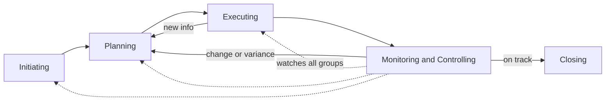
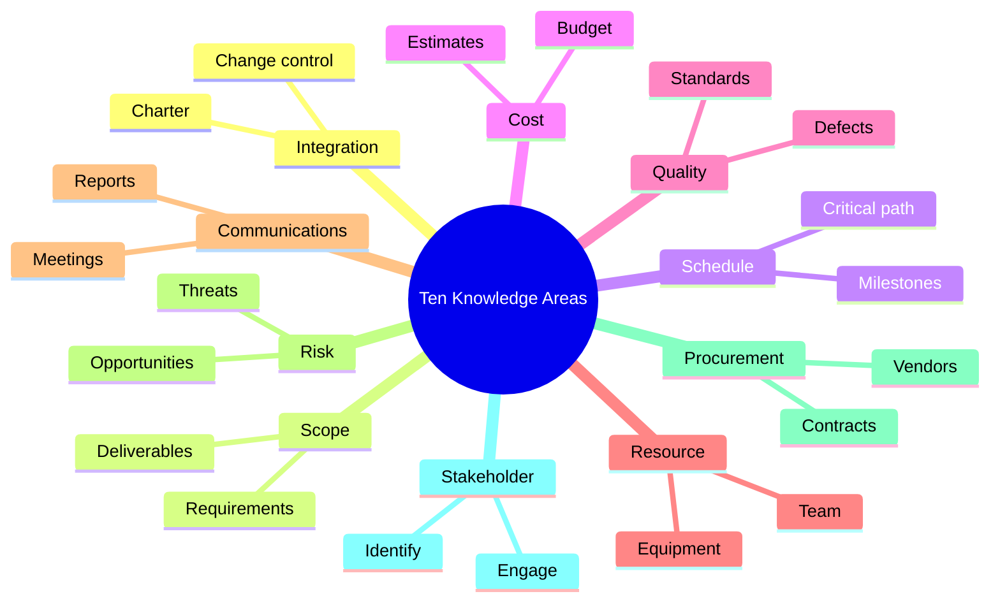
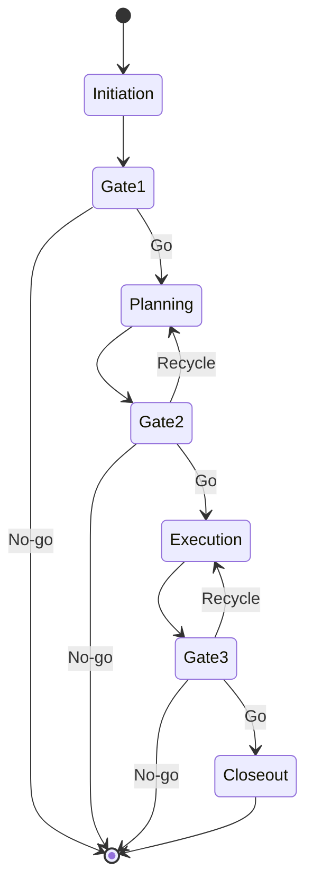

# Module 03 — The Project Life Cycle & Process Groups

> **Estimated study time:** ~40 min · **Level:** Beginner · **Prerequisites:** [Module 01](01-what-is-project-management.md) · Part of the **Sales -> Project Management Reviewer**.

*Two characters are about to walk into this module looking nearly identical — and the whole plot turns on telling them apart.*

## 🎯 What you'll be able to do

- [ ] Explain the difference between a project **life cycle** (the work) and **process groups** (the management activity).
- [ ] Name the **five process groups** and describe what really happens in each — and why they overlap instead of marching in a straight line.
- [ ] Map the **ten knowledge areas** to the modules in this reviewer so you always know where to look next.
- [ ] Describe how **PMBOK 7's performance domains and tailoring** changed the conversation — and why principles beat memorizing grids.
- [ ] Run a **phase gate / stage-gate review** and make a clean **go/no-go** decision.
- [ ] **Tailor** your process to the size and stakes of the project in front of you.

## 👋 From your mentor

Okay, real talk before we even start: you've already shepherded something through a multi-stage process hundreds of times. Every deal you ever closed moved from a cold lead to a signed contract through stages — and you would *never* have fired off a proposal before you'd qualified the buyer. (You know in your bones how that ends.) That instinct *is* project management thinking. You're not starting from zero today; you're starting from "fluent but undiagnosed."

This module just gives names and structure to what you already feel. We'll carefully separate the **phases of the work** from the **management activity** that wraps around the work — because mixing those two up is the single most common beginner mix-up, and honestly it's an easy one to fall for. They look like twins. They are not twins. Get this clean and the rest of the reviewer clicks into place noticeably faster.

Take it slow. There's a grid coming later that *looks* intimidating, like a wall of homework — and I promise to tell you exactly which parts to memorize (almost none) and which to just absorb (the shape of it). Deal? Deal.

## Life cycle vs. process groups — the distinction that unlocks everything

These two terms get jumbled constantly — they're the will-they-won't-they couple everyone confuses at the party. Let's pin them to the wall side by side so you never lose track of who's who.

| | **Project life cycle** | **Process groups** |
|---|---|---|
| What it describes | The **phases of the work** itself | Clusters of **management activity** |
| Example items | Design → Build → Test → Deploy | Initiating, Planning, Executing, Monitoring & Controlling, Closing |
| Changes by project? | **Yes** — a software project's phases differ from a building's | **No** — the same five groups apply to almost any project |
| Question it answers | "What stage is the *deliverable* in?" | "What kind of *managing* am I doing right now?" |
| Who cares most | The team doing the work, the customer | You, the project manager |

**The life cycle** is the journey your *product* takes. A house goes through foundation, framing, plumbing, finishing. A marketing campaign goes through concept, creative, production, launch. These phases are domain-specific — they describe the thing you're building.

**The process groups** are the journey your *management* takes. No matter what you're building, you initiate it, plan it, do it, watch and correct it, and close it out. These are universal. Same five moves, every single time.

Here's the insight that makes everything else easier to hold: **the five process groups repeat inside every phase of the life cycle.** When a building project enters its "framing" phase, you initiate that phase, plan it, execute it, monitor it, and close it — before "plumbing" starts up with its own fresh round of the same five. Process groups aren't a one-time march across the whole project; they're a loop that turns again and again, phase after phase. (Think of it like hosting a dinner party in courses — you don't plan the whole evening once and walk away; you set up, serve, read the table, and clear, for *each* course.)

> 🔁 **Sales → PM bridge:** Picture your CRM pipeline *stages* (Prospect → Qualify → Propose → Negotiate → Close) as the **life cycle** — they tell you where the *deal* is sitting. Now picture what you actually *do* at every stage: you research, you plan your approach, you run calls and demos, you read the signals and adjust, and you wrap up — won or lost — with notes for next time. That repeating loop of behavior is the **process groups**. The deal slides through stages once; your selling instincts cycle the whole loop *inside* each stage. You've been running this dual rhythm for years without naming it.

## The five process groups

PMI files all project management work into five **process groups**. Learn the *shape* of these, not a memorized inventory of 49 individual processes — the shape is the thing you'll actually reach for on a Tuesday afternoon.

### 1. Initiating
You define the project (or a phase) and get the green light to spend real money and time on it. The headline output is the **project charter** — the document that formally says "this project exists, here's its purpose, and here's the PM's authority." You also identify your initial stakeholders here.

*Real example:* A request lands to build a customer self-service portal. Initiating means writing a short charter — the goal, the rough budget, the sponsor, who the PM is — and getting a signature before anyone designs a single screen.

### 2. Planning
You figure out *how* you'll actually pull this off. This is the biggest group by sheer headcount of activities: scope, schedule, budget, quality, resources, communications, risk, procurement, and stakeholder engagement all get planned here. The collected output is the **project management plan** plus baselines (the approved scope, schedule, and cost you'll measure everything against).

*Real example:* You break the portal into features, estimate each, build a schedule, set a budget, name the risks out loud ("the payment-gateway vendor might be slow"), and decide how often you'll update stakeholders.

### 3. Executing
You do the work. You coordinate people and resources, manage the team, communicate, and produce the actual **deliverables**. Most of the project's *budget* and *effort* gets spent right here — this is the busy, beating heart of it.

*Real example:* Developers build screens, the designer delivers mockups, you run daily check-ins and clear roadblocks before they pile up.

### 4. Monitoring & Controlling
You track progress against the plan, measure variances, and steer the project back on course. Here's the part that surprises people: this group runs **in parallel with all the others**, start to finish. It never clocks out. It's where change control lives — when someone breezes in mid-project asking for a shiny new feature, this is where you evaluate it and approve or reject it.

*Real example:* You notice the build phase is 15% behind schedule, dig into *why*, and either add resources or renegotiate the deadline. You also process a change request to add a dashboard.

### 5. Closing
You formally finish the project (or phase): get final acceptance, hand over deliverables, release the team, archive the documents, and — the part everyone is tempted to skip — capture **lessons learned**.

*Real example:* The portal goes live, the sponsor signs off, you close the vendor contracts, and you write down what you'd do differently next time (before you conveniently forget).

### How they overlap and repeat — the part people miss

Here's the plot twist, and it's a good one. The five groups are **not a strict sequence**. Beginners picture a tidy relay race: Initiating hands the baton to Planning hands it to Executing, everyone in their lane. The reality is messier, more overlapping, and frankly better:

- **Planning and Executing overlap heavily.** You almost never finish *all* planning before starting work; you plan the next phase while executing the current one (this is "rolling wave" planning).
- **Monitoring & Controlling runs the entire time**, wrapping its arms around everything else.
- **The whole cycle repeats per phase.** Each life-cycle phase gets its own full pass through the groups.
- **You loop back.** A change you spot while monitoring sends you right back into planning.

*The five process groups with their feedback loops — Monitoring & Controlling (the dotted line) keeps an eye on everything, and a variance sends you back into Planning rather than straight to Closing.*

> 🔁 **Sales → PM bridge:** You never planned an entire quarter of selling before picking up the phone once. You planned the next move, acted, read the response, and re-planned on the fly. That "plan a little, act, adjust, plan again" rhythm *is* the overlapping process-group cycle. Rolling-wave planning is just your disciplined sales hustle — now with a paper trail and a nicer name.

## The ten knowledge areas (and where this reviewer covers each)

If process groups answer *"what kind of managing am I doing,"* the ten **knowledge areas** answer *"what subject am I managing?"* Every project management activity belongs to both a process group **and** a knowledge area — picture rows and columns of a grid, each task sitting in one cell.

> **Breathe — quick reassurance:** You do **not** need to memorize the famous 10×5 grid of 49 processes. PMI itself walked away from leading with it in PMBOK 7 (more on that just below). Learn what each area is *for*; the grid is a reference you can look up, not a pop quiz.

| # | Knowledge area | What it manages | Covered in this reviewer |
|---|---|---|---|
| 1 | **Integration** | Tying everything together; the charter, the plan, change control | Module 05 |
| 2 | **Scope** | What's in and out; requirements, deliverables, scope creep | Module 06 |
| 3 | **Schedule** | Sequencing, durations, the timeline, critical path | Module 07 |
| 4 | **Cost** | Estimating, budgeting, earned value | Module 08 |
| 5 | **Quality** | Defining "good enough," preventing and catching defects | Module 09 |
| 6 | **Resource** | The team and physical resources; acquiring, developing, leading | Module 10 |
| 7 | **Communications** | Who needs to know what, when, and how | Module 11 |
| 8 | **Risk** | Identifying, analyzing, and responding to uncertainty | Module 12 |
| 9 | **Procurement** | Buying goods/services; contracts and vendors | Module 14 |
| 10 | **Stakeholder** | Identifying and engaging everyone with a stake | Module 13 |

*(Module numbers above are where each topic lives in this reviewer — open the matching file when you get there. If a number ever looks off as the reviewer evolves, trust the filename your teammates publish.)*

*The ten knowledge areas at a glance — these are the "subjects" of project management, and each one gets its own later module to shine in.*

## PMBOK 7: from a process grid to performance domains

Pick up an older study guide and you'll meet project management framed as **49 processes** packed into that 5×10 grid. That was the **PMBOK Guide 6th edition** (and earlier) — a *process-based* model. It's still useful and still turns up on exams, so it's worth being on a first-name basis with it.

In 2021, the **PMBOK Guide 7th edition** made a deliberate pivot. Instead of opening with a prescriptive process grid, it organizes around:

- **12 Principles** — guiding statements about *how* to lead projects well (e.g., be a diligent steward, focus on value, tailor your approach, embrace adaptability).
- **8 Performance Domains** — broad areas of activity that drive outcomes: **Stakeholders, Team, Development Approach & Life Cycle, Planning, Project Work, Delivery, Measurement, and Uncertainty.**
- A strong emphasis on **tailoring** — adapting your approach to the project in front of you instead of forcing every project through the same heavyweight machine.

**Why the change?** Because predictive (waterfall) projects and agile projects simply don't fit the same rigid grid. The 7th edition is **delivery-method-agnostic** — its principles hold whether you're building a bridge or shipping software in sprints.

**What this means for you, practically:** Don't lie awake memorizing which of 49 processes belongs in which cell. Internalize the *principles* — deliver value, manage stakeholders, plan appropriately, watch for uncertainty — and learn to *tailor*. A mentor's promise, and I'll stake my reputation on it: a PM who understands principles and tailors well will run circles around one who can recite the grid but applies it like a cook who follows a recipe to the letter and never once tastes the soup.

| | **PMBOK 6 (process-based)** | **PMBOK 7 (principle-based)** |
|---|---|---|
| Organizing idea | 5 process groups × 10 knowledge areas | 12 principles + 8 performance domains |
| Count to know | 49 processes | 12 principles, 8 domains |
| Posture | Prescriptive ("do these processes") | Adaptive ("tailor to context") |
| Best fit | Predictive / plan-driven work | Predictive, agile, **and hybrid** |
| Still relevant? | Yes — foundational, exam content | Yes — current standard |

You'll choose between predictive, agile, and hybrid approaches in [Module 04](04-predictive-agile-hybrid.md) — consider this the conceptual groundwork for that very decision.

## ⏸️ Pause & reflect

This is a genuinely good place to stop, stretch, refill the coffee, and let it settle. Come back later with fresh eyes — the rest builds on what's above, and nobody's holding a stopwatch.

- In your own words, what's the difference between a **life cycle** and a **process group**? (Can't quite yet? Totally normal — re-skim that first table and it'll snap into focus.)
- Which **knowledge area** sounds most like something you *already* do well from sales? (Hint: most sales-to-PM folks point straight at Communications or Stakeholder — and they're right.)
- Does PMBOK 7's "tailoring over grids" message make you feel more or less anxious? Notice which — it quietly tells you how you learn.

## Phase gates and go/no-go decisions

A **phase gate** (also called a **stage gate**, **kill point**, or **phase review**) is a checkpoint at the *end of a life-cycle phase* where leadership decides whether the project gets to keep going. It's the moment of suspense at the door — and the output is a **go / no-go** decision:

- **Go** — proceed to the next phase.
- **No-go / Kill** — stop the project; the value no longer justifies the cost.
- **Hold / Recycle** — pause, or send the phase back to fix something before continuing.

Gates exist to stop good money from chasing a bad project down a hole. And here's the mindset shift that separates the pros: **stopping a project at a gate is a success, not a failure** — you just protected the budget for something better. New PMs flinch at "kill" like it's a personal black mark; experienced ones treat a clean kill as exactly the kind of grown-up discipline that gets them trusted with bigger things.

A typical gate review asks:
1. Did this phase meet its objectives and quality criteria?
2. Is the **business case** still valid? (Costs, benefits, risks updated.)
3. Are resources and funding available for the next phase?
4. Have new risks emerged that change the picture?

*Project phases moving through gates — each gate is a go / no-go / recycle decision, and "no-go" is a perfectly healthy, legitimate ending.*

> 🔁 **Sales → PM bridge:** Plot twist — you already run gates. They're your **qualification checkpoints**. Before you'll write a proposal, you check budget, authority, need, and timeline (BANT). If a lead flunks qualification, you don't bulldoze toward "close" anyway — you disqualify and walk, with your dignity and your calendar intact. That's a no-go decision protecting your time. A phase gate is that exact discipline, scaled up to a whole project.

## Tailoring to project size and context

**Tailoring** means deliberately choosing *how much* process a project actually needs. A two-person, two-week internal tool and a two-year, ten-vendor regulated platform should **not** wear the same outfit. Forcing heavyweight process onto a tiny project is a classic rookie move — it gums up the work and annoys everyone without adding a thing. (You wouldn't hire a wedding planner and a string quartet for a casual Tuesday coffee with a friend.)

Factors that push you toward **more** process: large budget, many stakeholders, high risk, regulatory/compliance requirements, distributed teams, long duration, low tolerance for failure.

Factors that let you get away with **less**: small team, low budget, low risk, co-located people, short timeline, an experienced crew that's done this dance before.

| Project context | Charter | Planning depth | Gate reviews | Documentation |
|---|---|---|---|---|
| **Small / low-risk** | One page or an email | Lightweight, rolling-wave | Informal check-in | Minimal — just enough |
| **Medium** | Formal charter | Full plan, right-sized baselines | Scheduled gate per phase | Standard set |
| **Large / regulated** | Detailed, signed charter | Deep planning, all baselines | Formal board-led gates | Full, auditable trail |

The skill isn't cranking out *maximum* process — it's dialing in the *right* amount. PMBOK 7 promoted tailoring to a core principle precisely because matching process to context is what separates a thoughtful PM from a bureaucratic one. Aim to be the former.

## 🧠 Check yourself

**1. What's the core difference between a project life cycle and the process groups?**

Show answer

The **life cycle** is the set of phases the *work/product* passes through (e.g., Design → Build → Test → Deploy) and is specific to the type of project. **Process groups** are the universal clusters of *management activity* (Initiating, Planning, Executing, Monitoring & Controlling, Closing) that repeat inside each phase, regardless of project type.

**2. Name the five process groups in order.**

Show answer

Initiating, Planning, Executing, Monitoring & Controlling, and Closing. Remember that Monitoring & Controlling runs in parallel across the whole project, and the groups overlap and repeat rather than running strictly one after another.

**3. Which process group produces the project charter, and which produces lessons learned?**

Show answer

The **project charter** is an output of **Initiating**. **Lessons learned** are captured during **Closing** (though good PMs collect them throughout).

**4. How did PMBOK 7 change the framing compared to PMBOK 6?**

Show answer

PMBOK 6 was process-based: 5 process groups × 10 knowledge areas (49 processes). PMBOK 7 is principle-based: **12 principles + 8 performance domains**, delivery-method-agnostic, with a strong emphasis on **tailoring**. Both are still relevant; 7 is the current standard.

**5. What is a phase gate, and why is a "no-go" decision not a failure?**

Show answer

A phase gate is a checkpoint at the end of a phase where leadership makes a **go / no-go / recycle** decision based on whether objectives were met and the business case still holds. A "no-go" (kill) is healthy stewardship — it stops further spending on a project that no longer justifies its cost, freeing resources for better work.

**6. Give one factor that should push you toward heavier process and one toward lighter.**

Show answer

**Heavier** process: large budget, many stakeholders, high risk, regulatory/compliance demands, distributed teams, or long duration. **Lighter** process: small team, low budget, low risk, co-located people, short timeline, or an experienced crew. Tailoring means deliberately choosing the *right* amount, not the maximum.

## 🧰 Try it

Pick a project you can picture clearly — ideally one from your old sales world (e.g., **launching a new outreach campaign**, **standing up a new CRM**, or **onboarding a key account**). Give it ~15 minutes and fill in this one-page sketch:

1. **Life cycle:** List the 3–5 *phases the work* passes through. (For a campaign: Concept → Build assets → Launch → Measure.)
2. **Process groups, for ONE phase:** Pick a single phase and jot one concrete activity for each group — what does Initiating, Planning, Executing, Monitoring & Controlling, and Closing look like *just for that phase*?
3. **Gates:** Draw a gate after each phase. For each, write the one question that would trigger a **no-go**. (E.g., after "Build assets": "Did legal approve the messaging?")
4. **Tailor it:** In one sentence, decide whether this project is small, medium, or large — and name one piece of process you'd *deliberately skip* because it's overkill.

Pull this off for a real example and you've understood the module better than someone who white-knuckled all 49 processes into memory. Keep the page — you'll reuse this exact shape in [Module 04](04-predictive-agile-hybrid.md).

## 🔑 Key terms

- **Project life cycle** — The series of phases the project *work/product* passes through (domain-specific, e.g., Design → Build → Test → Deploy).
- **Process group** — One of five universal clusters of management activity: Initiating, Planning, Executing, Monitoring & Controlling, Closing. They overlap and repeat per phase.
- **Knowledge area** — A subject domain of project management (e.g., Scope, Schedule, Risk); ten in the PMBOK 6 model. Answers *what* you're managing.
- **Project charter** — The Initiating output that formally authorizes the project and the PM's authority.
- **Project management plan** — The Planning output describing how the project will be executed, monitored, and closed; includes the scope, schedule, and cost baselines.
- **Baseline** — The approved version of scope, schedule, or cost used as the measuring stick for performance.
- **Rolling-wave planning** — Planning the near-term work in detail while leaving later work at a higher level, refining as you go.
- **Performance domain** — One of PMBOK 7's eight outcome-oriented areas (Stakeholders, Team, Development Approach & Life Cycle, Planning, Project Work, Delivery, Measurement, Uncertainty).
- **Tailoring** — Deliberately adapting the amount and type of process to fit a project's size, risk, and context.
- **Phase gate (stage gate / kill point)** — A checkpoint at a phase boundary where leadership makes a **go / no-go / recycle** decision.
- **Go/no-go decision** — The choice at a gate to continue, stop (kill), or recycle a project based on objectives met and business case validity.

---
⬅️ **Previous:** [Module 02 — From Sales to PM — Your Unfair Advantage](02-from-sales-to-pm.md) · 🏠 **[Reviewer Home](../README.md)** · ➡️ **Next:** [Module 04 — Predictive, Agile & Hybrid — Choosing Your Approach](04-predictive-agile-hybrid.md)
