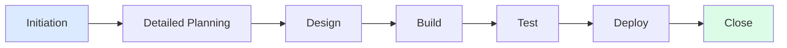
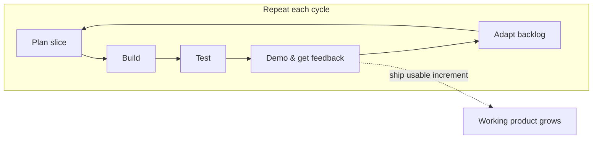
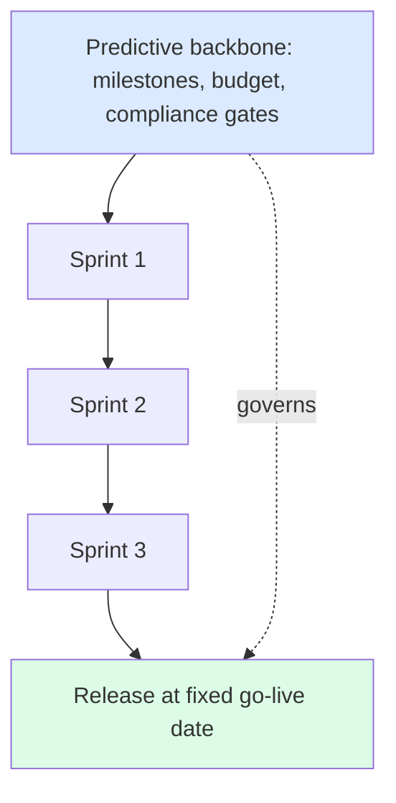
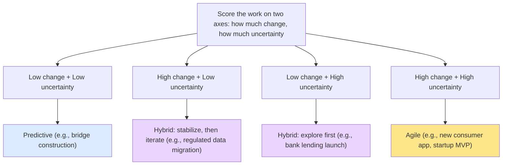
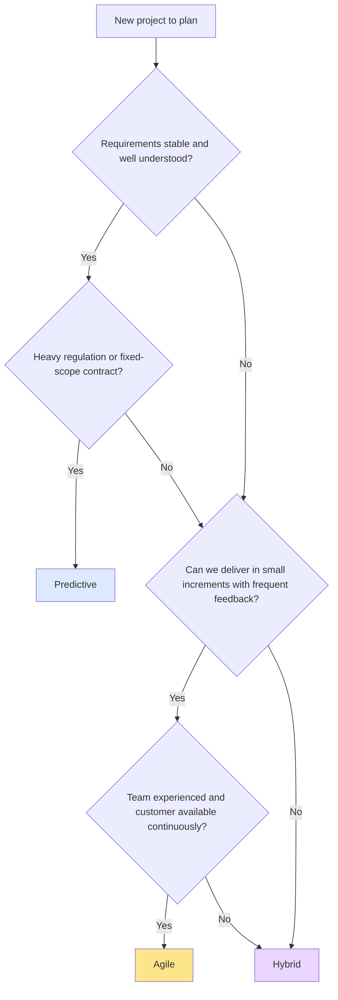

# Module 04 — Predictive, Agile & Hybrid — Choosing Your Approach

> **Estimated study time:** ~40 min · **Level:** Beginner · **Prerequisites:** Module 03 · Part of the **Sales -> Project Management Reviewer**.

## 🎯 What you'll be able to do

- [ ] Explain what **predictive (waterfall)** delivery is and the conditions where it shines
- [ ] Summarize the **four values** and the spirit of the **twelve principles** of the Agile Manifesto
- [ ] Tell the difference between **iterative** and **incremental** delivery (and why agile uses both)
- [ ] Orient yourself on **Scrum vs Kanban** at a high level (deep dive lives in Module 15)
- [ ] Describe **hybrid** approaches and give a concrete example
- [ ] Use a small set of factors to **choose an approach** for a real project with confidence

## 👋 From your mentor

Here's the good news before we start: choosing a delivery approach is a lot like choosing a sales motion. You already know that a six-figure enterprise deal with a formal RFP is run completely differently from a fast self-serve SMB deal where you adapt on every call. That instinct — "read the situation, then pick the play" — is exactly the muscle great project managers use here.

The PMBOK Guide 7th edition doesn't crown one approach as "right." It puts them on a **continuum** and asks you to fit the approach to the work. So your job in this module isn't to memorize dogma — it's to learn the trade-offs well enough to pick on purpose. Let's go.

---

## 1. Predictive (a.k.a. Waterfall / Plan-Driven)

**Predictive** means you plan as much as you can **up front** — scope, schedule, budget, requirements — and then execute against that plan, changing it only through a controlled process. Progress flows in sequence, one phase mostly finishing before the next begins. That sequential, cascading shape is why people nickname it **"waterfall."**

The defining bet of predictive work is: *requirements are knowable and stable, so investing in detailed planning pays off.*

### Where predictive shines

| Condition | Why predictive fits |
|---|---|
| **Stable, well-understood requirements** | Little will change, so a detailed plan stays valid. |
| **Regulated / compliance-heavy work** | Auditors and regulators want documented scope, sign-offs, and traceability. |
| **Physical / construction-like deliverables** | You can't "iterate" a poured foundation; sequence and dependencies are real. |
| **Fixed-price, fixed-scope contracts** | The contract itself locks scope — change is expensive on purpose. |
| **Low uncertainty, low expected change** | The cost of planning is small relative to the value of predictability. |

### Pros and cons

| Pros | Cons |
|---|---|
| Clear scope, schedule, and budget up front | Slow to respond once requirements change |
| Easy to report progress against a baseline | Value is delivered **late** — usually all at the end |
| Strong documentation and auditability | Misunderstood requirements surface late and cost more to fix |
| Predictable for stakeholders and contracts | Customers can't course-correct mid-flight |

> 🔁 **Sales → PM bridge:** A predictive project feels like a long, formal **enterprise RFP**. The buyer publishes fixed, detailed requirements; you respond to *those* requirements; scope is locked and changes go through a formal change order. Everyone trades flexibility for predictability — and that's a feature, not a bug, when the stakes and the paperwork are high.

*A predictive project is a one-way phased timeline — value lands near the end, after the waterfall completes.*

---

## 2. Agile

**Agile** is an umbrella term for approaches built on short, repeating cycles where you deliver a **working slice** of value, get feedback, and adapt. It was crystallized in 2001 by the **Agile Manifesto**.

The Manifesto isn't a methodology — it's a set of **values and principles**. Frameworks like Scrum and Kanban are ways of *living* those values.

### The four values

The Manifesto says we value the items on the **left more than** the items on the right — *without* throwing away the items on the right.

| We value... | ...over... |
|---|---|
| **Individuals and interactions** | processes and tools |
| **Working software** | comprehensive documentation |
| **Customer collaboration** | contract negotiation |
| **Responding to change** | following a plan |

> Read that last line carefully: agile doesn't mean "no plan." It means a plan is a starting hypothesis you expect to revise as you learn.

### The twelve principles, digestibly

You don't need to recite them verbatim, but you should recognize their themes. Here's a faithful, plain-language summary:

1. **Satisfy the customer** through early and continuous delivery of valuable software.
2. **Welcome changing requirements**, even late — change is a competitive advantage.
3. **Deliver working software frequently** (weeks, not months).
4. **Business and developers work together** daily.
5. **Build projects around motivated people**; give them support and trust.
6. **Face-to-face conversation** is the most effective way to share information.
7. **Working software is the primary measure of progress.**
8. **Sustainable pace** — sponsors, developers, and users keep a steady tempo indefinitely.
9. **Continuous attention to technical excellence** and good design.
10. **Simplicity** — maximizing the work *not* done — is essential.
11. **Self-organizing teams** produce the best architectures and designs.
12. **Reflect and adjust** regularly — the team tunes its own behavior at intervals.

### Iterative *and* incremental

These two words get blurred, but they're different ideas — and agile uses both at once.

| Term | Meaning | Painting analogy |
|---|---|---|
| **Incremental** | Deliver in slices; each slice adds a usable piece of the whole. | Finish the left third of the canvas, then the middle, then the right. |
| **Iterative** | Revisit and refine the same work as you learn. | Sketch the whole canvas rough, then add detail and color over passes. |

Agile blends them: each short cycle delivers a usable increment **and** gives you a chance to iterate on what you already built based on feedback.

### Embracing change

In predictive work, change is a threat to the baseline. In agile, change is **expected fuel**. Because you deliver small slices often and replan every cycle, a new requirement isn't a crisis — it's just the next thing the team pulls into its work. The cost of change stays roughly flat instead of ballooning over time.

> 🔁 **Sales → PM bridge:** Agile feels like a **fast, iterative startup deal**. You don't have a frozen RFP — you have a champion who's still figuring out what they need. So you demo something small, watch their reaction, learn, and adjust your pitch *every single call*. Each conversation delivers a little value and reshapes the next one. That loop — show, learn, adapt — *is* an iteration.

*Agile is a loop that repeats — every cycle ships a usable increment and feeds the next plan.*

---

## 3. Scrum vs Kanban (a quick orientation)

Both are popular agile frameworks. We'll go deep in **15-scrum-and-kanban.md** — for now, just get the shape of each.

| | **Scrum** | **Kanban** |
|---|---|---|
| **Cadence** | Fixed-length **Sprints** (e.g., 2 weeks) | Continuous flow — no required timebox |
| **Core idea** | Commit to a batch of work each Sprint | Visualize flow and **limit work in progress (WIP)** |
| **Key roles** | Product Owner, Scrum Master, Developers | No prescribed roles |
| **Key artifacts** | Product Backlog, Sprint Backlog, Increment | The Kanban board and its columns |
| **Change mid-cycle** | Avoided during a Sprint | Allowed anytime — just pull the next item |
| **Best when** | Work fits planned batches; team wants rhythm | Work arrives unpredictably (e.g., support/ops) |

A quick note on accuracy: the **2020 Scrum Guide** defines exactly three accountabilities (Product Owner, Scrum Master, Developers), three artifacts, and five events (the Sprint plus Sprint Planning, Daily Scrum, Sprint Review, Sprint Retrospective). Certifications differ by sponsor — **PSM/PSPO** are from **Scrum.org**, while **PMP** and **CAPM** are from **PMI**, and **PRINCE2** is from **Axelos/PeopleCert**. Don't mix them up on an exam.

---

## 4. Hybrid Approaches

Real organizations rarely live at a pure extreme. **Hybrid** means deliberately combining predictive and agile elements in one project — typically a **predictive backbone** for the parts that need predictability, with **agile delivery** for the parts where you're still learning.

Common patterns:

- **Predictive plan, agile build.** Lock the overall scope, milestones, and budget up front (the contract demands it), but build the software in Sprints so you can refine details and demo early.
- **Agile core, predictive wrapper.** The team works in Scrum, but a phase-gate around it handles regulatory sign-offs, procurement, and a fixed go-live date.
- **Different approaches per workstream.** A construction-heavy workstream runs predictive; the companion mobile app runs agile; one integrated schedule ties them together.

**Concrete example:** A bank launches a new lending product. The **regulatory and infrastructure work** (compliance reviews, data migration, hardware) is planned predictively with hard sign-offs. The **customer-facing web app** is built by a Scrum team iterating every two weeks on real user feedback. One program plan coordinates both. That's hybrid — and it's extremely common.

*Hybrid: a predictive backbone sets the guardrails while agile sprints deliver the work inside them.*

---

## 5. Lean thinking (one short paragraph)

**Lean** is the mindset behind much of agile and Kanban. Born in manufacturing (the Toyota Production System), it focuses on **maximizing customer value while eliminating waste** — anything the customer wouldn't pay for: waiting, rework, handoffs, overproduction, unused features. Lean prizes smooth **flow**, small batches, and continuous improvement. When you hear "limit work in progress" or "stop starting, start finishing," that's Lean talking.

---

## ⏸️ Pause & reflect

This is a perfectly safe place to stop, stretch, and come back later — the next section is the decision-making payoff, and it's worth a fresh head.

- Think of a past sales situation that was "locked RFP" and one that was "adapt every call." What made each feel that way?
- If you had to guess right now, does your *target* PM role lean more predictive, more agile, or hybrid? Why?
- Which of the four agile values feels most natural to you already, given how you sell?

---

## 6. How to Choose Your Approach

There's no trophy for being "agile" or "predictive." There's only **fit**. PMBOK 7 frames it as a **continuum**: pure predictive on one end, pure agile on the other, hybrid everywhere in between. You slide along it based on the work.

### The factors that decide

| Factor | Leans **Predictive** when... | Leans **Agile** when... |
|---|---|---|
| **Requirement stability** | Requirements are clear and fixed | Requirements are fuzzy or emerging |
| **Rate of change** | Change is rare and expensive | Change is frequent and expected |
| **Risk & uncertainty** | Low — the path is known | High — you must learn by doing |
| **Regulatory needs** | Heavy sign-offs, audits, traceability | Light or internally managed |
| **Customer availability** | Customer engages at milestones | Customer collaborates continuously |
| **Team maturity** | Team is new or distributed | Team is experienced and self-organizing |
| **Delivery cadence value** | Big-bang release is acceptable | Early, frequent value matters |

A simple read: **high uncertainty + high expected change → agile.** **Low uncertainty + low change → predictive.** Anything mixed → **hybrid**, mapped factor by factor.

*Place the work by how much change and uncertainty it carries — the pairing suggests the approach.*

Now a decision tree you can actually run in a meeting:

*A quick decision tree — answer four questions and land on predictive, agile, or hybrid.*

> 🔁 **Sales → PM bridge:** You already qualify deals before choosing a motion — budget, authority, need, timeline. Choosing a delivery approach is the same discovery instinct: qualify the *project* (stability, change, risk, regulation, team) before committing to how you'll run it. Pick the play that fits the buyer in front of you.

---

## 🧠 Check yourself

**1. In one sentence, what's the core bet a predictive approach makes?**

Show answer

That requirements are knowable and stable enough that detailed up-front planning will hold — so investing in that plan buys predictability.

**2. The four agile values prefer the left over the right. Does "working software over comprehensive documentation" mean agile teams skip documentation?**

Show answer

No. The right-hand items still have value — the Manifesto says we value the left *more*, not that we discard the right. Agile teams document what's useful; they just don't let documentation substitute for working product.

**3. What's the difference between iterative and incremental delivery?**

Show answer

Incremental = delivering the whole in usable slices, each adding a piece. Iterative = revisiting and refining the same work over multiple passes as you learn. Agile uses both: each cycle ships an increment and lets you iterate on prior work.

**4. Name one situation where Kanban fits better than Scrum.**

Show answer

Work that arrives unpredictably and can't be batched into fixed Sprints — e.g., a support, operations, or incident-response team that needs continuous flow and WIP limits rather than a sprint commitment.

**5. Give a concrete example of a hybrid project.**

Show answer

A bank lending launch: regulatory/compliance and infrastructure work planned predictively with hard sign-offs, while the customer-facing web app is built by a Scrum team iterating every two weeks — coordinated under one program plan.

**6. Two factors push you toward agile. Name them and explain why.**

Show answer

High uncertainty (you must learn by doing, so short feedback loops beat big plans) and a high rate of expected change (frequent replanning absorbs change cheaply instead of fighting a frozen baseline). Fuzzy/emerging requirements and continuous customer collaboration also count.

---

## 🧰 Try it

Pick a real project — from work, a side hustle, or even planning a big event (a product launch, a website rebuild, a wedding).

1. Score it on the seven factors in the **How to Choose** table: for each, jot "predictive" or "agile."
2. Plot it on the quadrant: roughly how much **change** and how much **uncertainty** does it carry?
3. Run the **decision tree** out loud. Where does it land — predictive, agile, or hybrid?
4. Write **two sentences** defending your choice to a skeptical sponsor, the way you'd defend a deal strategy to your sales manager.

If different factors point in different directions, that's not a failure — that's the signal that the honest answer is **hybrid**. Note *which* parts you'd run each way.

---

## 🔑 Key terms

- **Predictive (Waterfall)** — Plan-driven approach where scope, schedule, and budget are detailed up front and executed in sequence.
- **Agile** — Umbrella term for approaches using short, repeating cycles that deliver working slices and adapt to feedback.
- **Agile Manifesto** — 2001 statement of four values and twelve principles that defines the agile mindset.
- **Iterative** — Refining the same work over repeated passes as you learn.
- **Incremental** — Delivering the whole in usable slices, each adding a piece of value.
- **Scrum** — Agile framework using fixed-length Sprints, three accountabilities, three artifacts, and five events (per the 2020 Scrum Guide).
- **Kanban** — Agile method based on visualizing flow and limiting work in progress (WIP); continuous, not timeboxed.
- **Hybrid** — Deliberate combination of predictive and agile elements in one project.
- **Lean** — Mindset focused on maximizing customer value while eliminating waste and improving flow.
- **WIP limit** — A cap on how many items are worked on at once, used to improve flow (especially in Kanban).
- **Continuum** — PMBOK 7's framing of approaches as a spectrum from pure predictive to pure agile, with hybrid in between.

---

⬅️ **Previous:** [Module 03 — The Project Life Cycle & Process Groups](03-lifecycle-and-process-groups.md) · 🏠 **[Reviewer Home](../README.md)** · ➡️ **Next:** [Module 05 — Initiation — Business Case, Charter & Stakeholders](05-initiation-charter-stakeholders.md)
