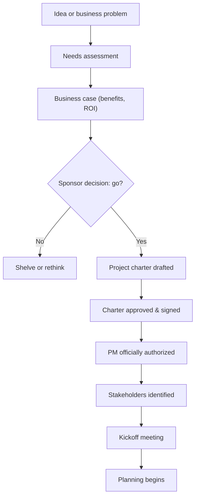
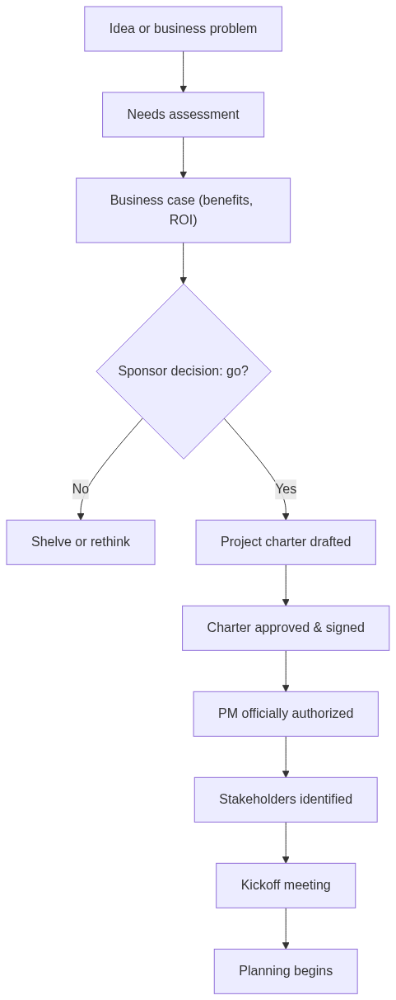
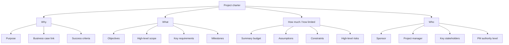
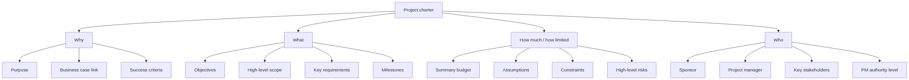
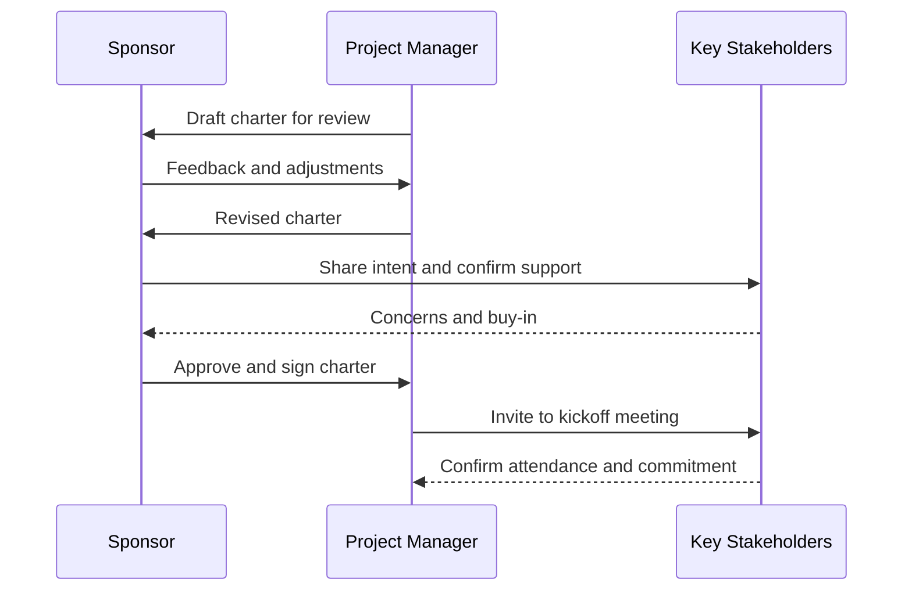
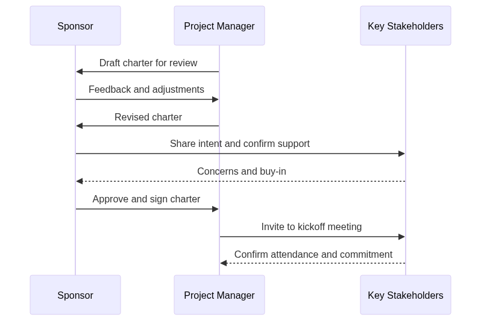

# Module 05 — Initiation — Business Case, Charter & Stakeholders

> ⏱️ **Estimated study time:** ~35 min · 🎚️ **Level:** Beginner · 📋 **Prerequisites:** [Module 03](03-lifecycle-and-process-groups.md) · Part of the **Sales -> Project Management Reviewer**.

*Every great story starts with someone deciding the idea is worth chasing. This is that chapter — the meet-cute between a project and the person brave enough to fund it.*

## 🎯 What you'll be able to do

- [ ] Explain why a project exists using a **business case** and a high-level **ROI** argument.
- [ ] Read, critique, and draft a **project charter** with all its standard contents.
- [ ] Identify **stakeholders** early and tell the **sponsor** apart from the **champion**.
- [ ] Document **assumptions and constraints** so they protect you later.
- [ ] Run a **kickoff meeting** that sets the right tone.

## 👋 From your mentor

Okay, real talk: you've been doing initiation for years and nobody told you it had a fancy name.

Every time you qualified a deal, dug past the surface ask to find the customer's *real* pain, and got a decision-maker to actually commit budget — that was chartering. You just didn't have a clipboard and a process group standing behind you. In project management we do the same thing, only we write it down and make the authority official.

This module is the moment a project stops being "that thing someone floated in a meeting" and becomes **officially real** — with a name, a sponsor, money, and *you* in charge. Nail this stage and the whole project breathes easier. Fumble it — fuzzy goals, no real sponsor, assumptions nobody bothered to write down — and you'll spend the next six months putting out fires you could've prevented in week one. Slow burn, but the bad kind.

---

## Why a project exists: the business case and needs assessment

Before anyone writes a single charter, somebody has to answer one delightfully blunt question: **why are we spending money on this at all?**

A **needs assessment** is the diagnosis. It looks at a business problem or opportunity and asks what the organization actually *needs* — *before* anyone falls in love with a solution. In sales terms, it's discovery. You don't pitch the product on the first call; you find out where it hurts first.

The **business case** is the justification document built on that diagnosis. It argues that the expected **benefits** outweigh the cost and effort. Here's the part people forget: it's owned by the sponsor and the business, *not* by you as PM — but you'll read it constantly, because it's your compass. When someone breezes in mid-project with a shiny new feature, you get to ask the quietly devastating question: "Does that serve the business case?"

A solid business case usually covers:

| Element | What it answers |
| --- | --- |
| **Problem / opportunity** | What pain or chance are we responding to? |
| **Options considered** | What alternatives exist (including "do nothing")? |
| **Recommended option** | Which path and why? |
| **Expected benefits** | Financial and non-financial value we expect |
| **Costs & timeline** | Rough investment and how long |
| **Risks** | What could undermine the value |

### ROI thinking at a high level

You don't need a finance degree, but you should recognize the language sponsors use when they're deciding *go / no-go*. These are **benefit measurement methods** — and yes, they're as exact as they look, so here's the precise version:

| Term | Plain meaning | Rule of thumb |
| --- | --- | --- |
| **ROI** (Return on Investment) | Gain relative to cost, as a % | Higher is better |
| **NPV** (Net Present Value) | Future cash flows discounted to today's dollars | **Positive** NPV = worth doing; pick the higher NPV |
| **Payback period** | How long until the project pays for itself | Shorter is better |
| **IRR** (Internal Rate of Return) | The interest rate at which NPV equals zero | Higher is better |
| **BCR** (Benefit-Cost Ratio) | Benefits ÷ costs | Greater than 1 is good |

A simple ROI sketch: `ROI = (Net Benefit ÷ Cost) × 100`. If a $50,000 project is expected to generate $80,000 in value, the net benefit is $30,000 and ROI ≈ 60%.

> 💡 Here's what that actually means for you: you rarely *calculate* these in initiation — finance or the sponsor handles the math. Your job is to understand the argument so you can defend the project's purpose and instantly spot when a "small" change request quietly murders the ROI in its sleep.

---

## The initiation flow

Here's the path from a half-formed idea to a project with an actual heartbeat.

<!-- mobile-diagram:05-initiation-charter-stakeholders-1 -->

🖼️ Tap to view as an image (for the GitHub mobile app)

<!-- /mobile-diagram -->

*From a vague idea to an authorized project: each gate quietly filters out the work that isn't worth doing.*

---

## The project charter: your authorization to lead

The **project charter** is the single most important document of initiation. Think of it as the moment the relationship goes official. In PMI's *PMBOK® Guide* (7th edition), the charter is the **formal document that authorizes the existence of a project and gives the project manager the authority to apply organizational resources** to project activities.

Three things to lock in:

1. **It authorizes the project.** No charter, no project — it's the official "this is real, we're doing this."
2. **It's issued by the sponsor**, not by you. The sponsor is the senior person funding and backing the project; their signature is what gives the charter its power. (You may *draft* it — and often should — but it must be issued and signed by someone with authority over the budget.)
3. **It names you as PM and defines your authority.** This is the document you reach for when someone raises an eyebrow and questions whether you can actually make that call.

> ⚠️ A classic rookie trap: writing your own charter and signing it yourself. That's like a salesperson "approving" their own discount — adorable, but it carries zero weight. Authority has to come from above you.

### Typical charter contents

A charter is short — often one to three pages. It's high-level on purpose; the juicy detail comes later in planning. Standard contents:

| Section | What it contains | Sales analogy |
| --- | --- | --- |
| **Purpose / justification** | Why the project exists (links to the business case) | The customer's core pain |
| **Measurable objectives** | What success looks like, in numbers | The quota / target |
| **High-level scope** | What's broadly in and out | What you're selling vs. not |
| **High-level requirements** | Top-level needs to be met | Must-have features |
| **Milestones** | Major target dates | Key deal-stage dates |
| **Summary budget** | Ballpark money approved | Deal size |
| **Key stakeholders** | Who's involved and affected | The buying committee |
| **Success criteria** | How we'll judge "done and good" | "Closed-won" definition |
| **High-level risks** | Big things that could go wrong | Deal-killers |
| **Assumptions & constraints** | What we're taking as given / our limits | Budget cycle, contract terms |
| **PM name & authority level** | Who leads and how much they can decide | Your rep-of-record authority |
| **Sponsor name & sign-off** | Who's backing and funding it | The economic buyer |

> 🔁 **Sales → PM bridge:** The charter is your project's **signed proposal**. In sales, nobody starts delivering until the prospect signs the SOW or contract — that signature is the moment interest turns into commitment and gives you the authority to act. The charter does exactly that for a project. The sponsor's signature is your "closed-won," and just like a signed deal, it's what you calmly reach for when scope creep comes sniffing around later: "That wasn't in what we agreed."

### Mapping the charter

<!-- mobile-diagram:05-initiation-charter-stakeholders-2 -->

🖼️ Tap to view as an image (for the GitHub mobile app)

<!-- /mobile-diagram -->

*Four questions every charter answers: why, what, how much / how limited, and who.*

---

## Identifying stakeholders early

A **stakeholder** is anyone who can affect, be affected by, or *perceive* themselves to be affected by the project. Read that last part again — perception alone makes someone a stakeholder, even if you're convinced they're irrelevant. It's a little like inviting people to a wedding: the guest list isn't just who *you* think matters, it's everyone who'll feel some kind of way if they're left off it.

Identify them **early and broadly**. The cost of a missed stakeholder rises sharply over time: the legal reviewer you forgot in week one becomes a two-week blocker in week twelve — a slow-motion plot twist you absolutely saw coming. Start a **stakeholder register** in initiation — a living list of who they are, their interest, their influence, and how they feel about the project.

Two special roles to know cold:

| Role | What they do | Authority |
| --- | --- | --- |
| **Sponsor** | Funds the project, issues the charter, removes high-level obstacles, owns the business case | Formal, top-down — the buck stops here |
| **Champion** | Enthusiastically promotes the project, sells it to peers, builds momentum | Informal, influence-based |

The **sponsor** is your power source — you escalate to them and they clear roadblocks. The **champion** is your amplifier — often a well-liked colleague who isn't paying for the project but makes everyone else *want* it to succeed. Sometimes one person is both. Often they're not, and you genuinely need both.

> 🔁 **Sales → PM bridge:** You already map buying committees in your sleep. The **economic buyer** who signs the check is your **sponsor**. The **internal advocate** who talks up your product in meetings you're not even in is your **champion**. And that quiet **influencer** who can veto the whole thing with a single frown? That's the high-influence, low-interest stakeholder you must keep informed — ignore them and they'll sink you in the final act. Same map, new labels.

---

## Assumptions and constraints: the things that protect you

These two are the quiet heroes of initiation — the dependable best-friend characters who don't get the spotlight but save the day. Document them and they shield you. Skip them and they become the reasons a project mysteriously fails "for no clear reason."

- An **assumption** is something you believe to be true *without proof* and plan around. Example: "The client's data will be available by sprint 2." If that turns out false, your plan cracks down the middle — so you write it down and keep one eye on it.
- A **constraint** is a real **limiting factor** you must work within. The classic trio is the **triple constraint**: **scope, time, cost** (with quality, resources, and risk close behind). Example: "Must launch before the trade show on March 1" is a time constraint.

| | Assumption | Constraint |
| --- | --- | --- |
| **Nature** | Believed true, unverified | Known limit / boundary |
| **Risk if wrong** | Plan may break | (Not "wrong" — it's a fixed reality) |
| **Example** | "Vendor delivers on time" | "Budget capped at $200k" |
| **Your job** | Validate and monitor it | Plan within it |

**Why writing them down protects you:** every documented assumption is a tripwire. If it later proves false, you've got a paper trail showing it was a *known, shared* belief — not your personal oversight. This is your alibi against the dreaded "but you should have known." It turns a finger-pointing scene into a calm "we documented this assumption in the charter; it changed, so here's the impact."

> 💡 Treat each assumption as a tiny future risk waiting to make trouble. Many will graduate into your risk register during planning.

---

## The kickoff meeting: setting the tone

Once the charter is signed and the stakeholders are identified, you gather everyone for the **kickoff meeting**. It's part information-sharing, part ceremony — think of it as the dinner party where the guests finally meet and decide whether the night's going to be magic or awkward. The content matters, but the *tone* matters just as much, because this is the team's first real impression of you and the project.

A good kickoff covers:

- **Why** — the purpose and business case, in actual human language.
- **What** — high-level scope, objectives, and success criteria.
- **Who** — introductions, roles, who the sponsor is, who to go to for what.
- **How** — the approach (predictive, agile, or hybrid — see [Module 04](04-predictive-agile-hybrid.md)), cadence, and communication norms.
- **When** — major milestones on the horizon.
- **Questions & commitment** — space to surface concerns and get visible buy-in.

<!-- mobile-diagram:05-initiation-charter-stakeholders-3 -->

🖼️ Tap to view as an image (for the GitHub mobile app)

<!-- /mobile-diagram -->

*Charter approval is a conversation, not a rubber stamp — the PM drafts, the sponsor authorizes, stakeholders buy in.*

> 🔁 **Sales → PM bridge:** Your kickoff is the **discovery + alignment call** you've run a hundred times without breaking a sweat. You walk in, confirm everyone understands the goal, surface objections early, and leave with verbal commitment. Reading the room, coaxing the decision-maker into a clear "yes, this is what we want," turning the skeptic in the corner into an ally — that's *exactly* what makes a kickoff land. You're not learning a new skill here; you're just renaming one you already own.

---

## ⏸️ Pause & reflect

This is a natural place to put the book down — take a break, come back later if you need to. Initiation is dense, and it's worth letting it settle before the next chapter.

Before you move on, sit with these:

1. Think of a deal you closed. Who was the **economic buyer** (your sponsor) and who was the **internal champion**? Could you name them both, or were you quietly leaning on just one?
2. Recall a time a project or deal went sideways because of an **assumption nobody wrote down**. What was it, and how would documenting it have changed the conversation?
3. If a sponsor handed you a one-paragraph charter and said "go," what's the *first* missing piece you'd ask for?

No need to write essays — just notice how much of this you already understood from selling.

---

## 🧠 Check yourself

**1. Who has the authority to issue and sign a project charter?**

Show answer

The **sponsor** (or someone with authority over the funding/resources). The PM may *draft* the charter, but it must be authorized by someone senior enough to commit the organization's resources. A PM signing their own charter carries no real authority.

**2. What's the difference between a sponsor and a champion?**

Show answer

The **sponsor** has *formal* authority — they fund the project, issue the charter, and remove high-level obstacles. The **champion** has *informal* influence — they promote the project and build enthusiasm but typically don't control the budget. One person can be both, but often they're separate.

**3. Why does documenting an assumption protect you?**

Show answer

A documented assumption is a shared, agreed-upon belief on the record. If it later proves false, you have a paper trail showing it was a *known* assumption — not your personal oversight. It converts a blame argument into a calm impact discussion, and many assumptions later become tracked risks.

**4. Name four standard contents of a project charter.**

Show answer

Any four of: purpose/justification, measurable objectives, high-level scope, high-level requirements, milestones, summary budget, key stakeholders, success criteria, high-level risks, assumptions and constraints, the PM's name and authority level, and the sponsor's sign-off.

**5. What does a positive NPV tell a sponsor?**

Show answer

A **positive Net Present Value** means the project's expected future cash flows, discounted to today's dollars, exceed its cost — so it's financially worth doing. When comparing projects, the one with the **higher** NPV is generally preferred.

**6. What is the "triple constraint"?**

Show answer

The classic trio of competing project constraints: **scope, time, and cost** (often visualized as a triangle, with **quality** in the middle). Change one and you usually affect the others. Resources and risk are frequently added to the modern view.

---

## 🧰 Try it

**Draft a one-page charter for a project you'd actually run.**

Pick something real and small — "launch a customer referral program," "migrate the team to a new CRM," "run a Q3 webinar series." Then fill in these lines (one or two sentences each):

1. **Purpose** — why does this exist? (Tie it to a benefit or ROI.)
2. **Objectives** — 2-3 measurable success criteria.
3. **High-level scope** — one sentence on what's in, one on what's out.
4. **Milestones** — 3 major dates.
5. **Sponsor & champion** — name a real person for each.
6. **Two assumptions** — things you're taking as true.
7. **Two constraints** — your real limits (budget, deadline, headcount).
8. **Your authority** — one sentence on what decisions you can make alone.

If you can fill all eight in 20 minutes, congratulations — you can charter a project. Notice how much of it is just structured discovery wearing a slightly nicer outfit: the same instinct you use on every qualified deal.

---

## 🔑 Key terms

- **Business case** — the justification for a project, weighing expected benefits against cost; owned by the sponsor/business.
- **Needs assessment** — analysis of the underlying problem or opportunity *before* choosing a solution.
- **Project charter** — the formal document that authorizes the project's existence and empowers the PM to apply organizational resources.
- **Sponsor** — the senior person who funds the project, issues the charter, and removes high-level obstacles; holds formal authority.
- **Champion** — an enthusiastic advocate who promotes the project and builds momentum; holds informal influence.
- **Stakeholder** — anyone who can affect, be affected by, or perceives themselves affected by the project.
- **Stakeholder register** — a living list of stakeholders with their interest, influence, and attitude.
- **Assumption** — something believed true without proof and planned around.
- **Constraint** — a real limiting factor the project must work within (e.g., scope, time, cost).
- **Triple constraint** — the interdependent trio of scope, time, and cost (with quality at the center).
- **ROI** — Return on Investment; gain relative to cost, expressed as a percentage.
- **NPV** — Net Present Value; future cash flows discounted to today's dollars; positive means worth doing.
- **Kickoff meeting** — the first gathering that aligns the team on why, what, who, how, and when, and sets the project's tone.

---
⬅️ **Previous:** [Module 04 — Predictive, Agile & Hybrid — Choosing Your Approach](04-predictive-agile-hybrid.md) · 🏠 **[Reviewer Home](../README.md)** · ➡️ **Next:** [Module 06 — Scope Management](06-scope-management.md)
