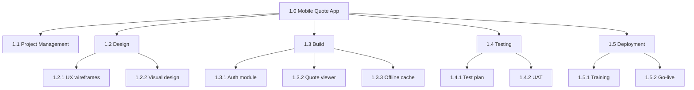
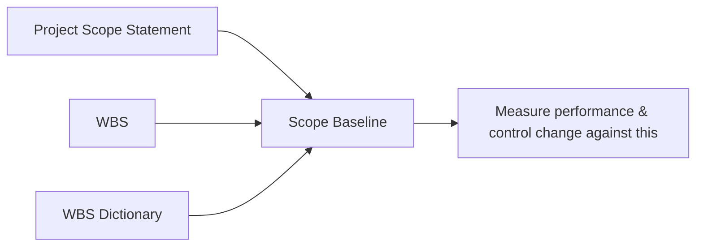
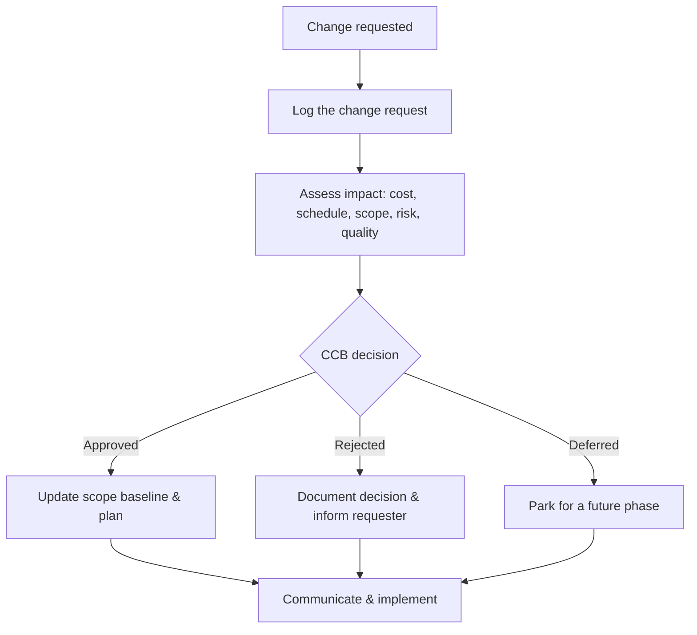
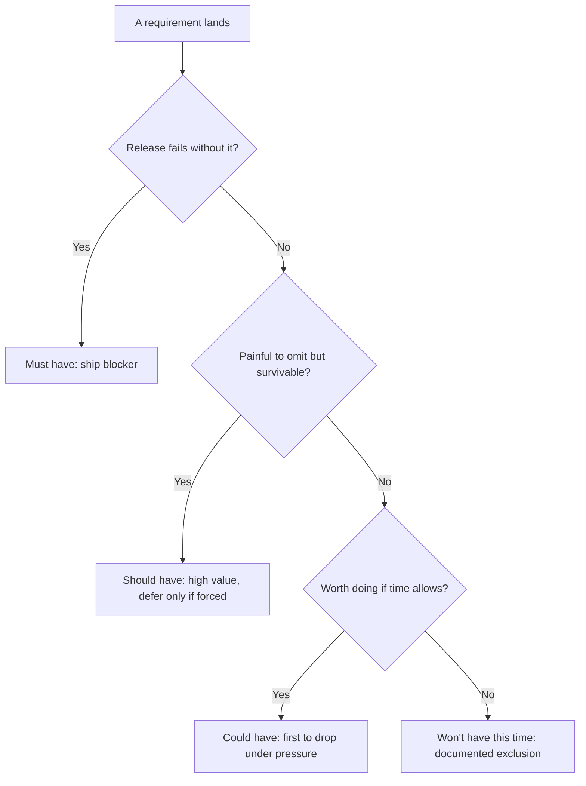
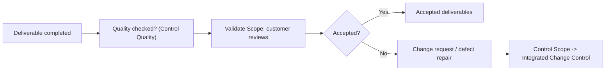

# Module 06 — Scope Management

> ⏱️ Estimated study time: ~45 min · 📈 Level: Intermediate · 📚 Prerequisites: Module 05 · Part of the **Sales -> Project Management Reviewer**.

## 🎯 What you'll be able to do

- [ ] Run a requirements-gathering session and capture what you hear in a **requirements traceability matrix**.
- [ ] Tell **product scope** from **project scope** and write a scope statement with crisp in/out boundaries.
- [ ] Build a **Work Breakdown Structure (WBS)** down to work packages and explain why it's the backbone of every plan.
- [ ] Spot **scope creep** and **gold plating**, and use change control to protect the project.
- [ ] Prioritize requirements with **MoSCoW** and run both **Validate Scope** and **Control Scope**.

## 👋 From your mentor

Here's the good news: you already manage scope every day. Every time a prospect says "can you also throw in onboarding and a custom report?", you're making a scope decision — what's in the deal, what costs extra, what you politely defer. Project Management just gives that instinct a vocabulary and a paper trail.

Scope is where projects quietly succeed or fail. Get the boundaries clear up front and the schedule and budget have something solid to stand on. Leave them fuzzy and you'll deliver something nobody asked for, late. This module is about drawing the line — and defending it.

---

## 📋 Collecting requirements

You can't manage scope until you know what people actually want. In sales you call this **discovery**; in PM we call it **Collect Requirements**. Same muscle: ask good questions, listen hard, write it down, confirm.

A **requirement** is a documented need or condition the project must satisfy. The building blocks fall into a few buckets you'll see referenced constantly:

| Requirement type | What it captures | Example |
|---|---|---|
| **Business** | The high-level *why* — the org's need | "Cut order-processing time by 30%." |
| **Stakeholder** | A specific group's need | "Sales reps need mobile access to quotes." |
| **Solution — functional** | What the product *does* | "System emails a confirmation after checkout." |
| **Solution — non-functional** | Quality attributes / constraints | "Page loads in under 2 seconds." |
| **Transition / readiness** | What's needed to go live | "Reps trained before cutover." |
| **Project** | How the work must run | "No deployments during quarter close." |
| **Quality** | Conditions to validate success | "99.9% uptime measured monthly." |

### Elicitation techniques

"Elicitation" is just a fancy word for *drawing requirements out of people*. Pick the technique to fit the situation — you already do this when you decide between a quick call, a full demo, or sending a sample.

| Technique | What it is | When you'd reach for it |
|---|---|---|
| **Interviews** | One-on-one structured conversations | Sensitive topics, busy executives, getting the real story |
| **Workshops** | Facilitated group sessions (e.g. JAD) | Cross-functional alignment fast; resolving conflicts live |
| **Prototypes** | A mockup or clickable model to react to | When people struggle to describe what they want abstractly |
| **Observation** ("job shadowing") | Watching the work happen | Uncovering steps people forget to mention |
| **Surveys / questionnaires** | Written questions at scale | Many stakeholders, geographically spread |
| **Brainstorming** | Generating many ideas without judgment | Early, divergent, "what could this be?" thinking |
| **Document analysis** | Mining existing docs, contracts, tickets | A system already exists and is partly documented |

> 🔁 **Sales → PM bridge:** A prototype is your *demo*. When a prospect can't articulate what they need, you stop talking and show them a screen — and their reaction tells you more than any spec. Same move here: a rough prototype turns vague opinions into concrete, actionable requirements.

### The Requirements Traceability Matrix (RTM)

Once you've gathered requirements, you need to keep them honest. The **Requirements Traceability Matrix** is a table that links each requirement back to its origin and forward to the deliverable, test, and business objective that satisfies it. Nothing gets built that nobody asked for; nothing requested gets quietly dropped.

| Req ID | Requirement | Source | Priority | WBS deliverable | Test / acceptance | Status |
|---|---|---|---|---|---|---|
| R-01 | Reps view quotes on mobile | Sales VP | Must | 1.2 Mobile app | Login + view on phone | In progress |
| R-02 | Email confirmation at checkout | Customer | Must | 1.3 Checkout svc | Receive email < 1 min | Done |
| R-03 | Dark mode | Survey | Could | 1.4 UI theme | Toggle persists | Deferred |

Think of the RTM as the CRM of your requirements — every "opportunity" (requirement) has a stage, an owner, and a next step.

---

## 🎯 Product scope vs project scope

Two words that sound identical and trip people up constantly:

- **Product scope** = the *features and functions* that characterize the thing you're delivering. Measured against **requirements**. ("The app has login, quotes, and offline mode.")
- **Project scope** = the *work* required to deliver that product. Measured against the **project management plan**. ("Design, build, test, train, deploy, document.")

Product scope is the *what*; project scope is the *work to get there*. A simple gut check: if you describe a button, that's product scope. If you describe writing the test plan for that button, that's project scope.

### Writing a clear scope statement

The **Project Scope Statement** is the document that nails down the boundaries. A good one always has an explicit **out-of-scope** list — because what you *won't* do prevents more arguments than what you will.

A solid scope statement includes:

- **Product scope description** — what the deliverable is and does.
- **Deliverables** — the tangible outputs (and acceptance criteria for each).
- **Acceptance criteria** — the conditions that must be met to be "done."
- **In-scope** — explicitly included work.
- **Out-of-scope (exclusions)** — explicitly *not* included. Be specific.
- **Constraints** — fixed limits (budget, deadline, fixed tech).
- **Assumptions** — things taken as true that, if wrong, create risk.

**Example — the out-of-scope list is your friend:**

> *In scope:* Mobile quote viewing for iOS and Android.
> *Out of scope:* Quote *editing* on mobile; tablet-optimized layout; integration with the legacy ERP. These may be considered in a future phase.

That one out-of-scope line saves you a dozen "but I assumed…" conversations later — the same way a clear statement of work protects you from a client who "thought training was included."

---

## 🧱 The Work Breakdown Structure (WBS)

The **WBS** is a hierarchical decomposition of the *total scope of work* into smaller, manageable pieces. It is **deliverable-oriented** — you break down *nouns* (things produced), not a to-do list of verbs. It is, genuinely, the backbone of planning: your schedule, cost estimates, resource plan, and risk register all hang off it.

### Decomposition and work packages

You break the project down level by level until you reach **work packages** — the lowest level of the WBS, small enough to estimate cost and duration reliably and to assign to one owner. (Work packages later get decomposed further into *activities* for scheduling — that's Module 07's job.)

*A WBS tree: the project decomposes into deliverables, then into work packages at the lowest level.*

### The 100% rule

The single most important rule of the WBS: the **100% rule**. The WBS must capture **100% of the work** defined by the scope — no more, no less. Every level of decomposition must add up to exactly its parent. If it's not in the WBS, it's not in the project. And if it *is* in the WBS but not in the scope, you've got gold plating sneaking in.

A practical consequence: children must fully account for their parent. The three boxes under "1.3 Build" should, together, equal *all* the building — not 90%, not 110%.

### The WBS dictionary

The boxes in the WBS are short labels. The **WBS dictionary** is the companion document that gives the detail behind each work package: a description, the responsible owner, acceptance criteria, estimated effort, dependencies, and the requirement IDs it satisfies. The WBS shows the *structure*; the dictionary holds the *substance*.

| WBS ID | Work package | Owner | Acceptance criteria | Linked req |
|---|---|---|---|---|
| 1.3.1 | Auth module | Dev lead | Login + biometric, lockout after 5 fails | R-01 |
| 1.3.3 | Offline cache | Dev | Last 50 quotes available with no signal | R-04 |

---

## 📌 The scope baseline

Once your scope is approved, you lock it in as the **scope baseline** — the approved version you measure performance against. It's not one document but **three together**:

1. The approved **Project Scope Statement**
2. The **WBS**
3. The **WBS dictionary**

*The scope baseline is the approved trio you defend; changes to it go through formal change control.*

The key word is **approved**. Once baselined, scope only changes through **integrated change control** — you don't quietly edit it. That formality is exactly what stops the slow bleed of scope creep.

---

## 🐍 Scope creep and gold plating

Two ways scope grows without permission. Knowing the difference matters:

- **Scope creep** — uncontrolled changes or *continuous additions* to scope **without** adjusting time, cost, and resources. Usually comes from outside (a stakeholder keeps asking for "just one more thing").
- **Gold plating** — the *team* adds extra work or polish nobody asked for, thinking they're being generous. Comes from inside. It still burns budget and risk for zero approved value.

Both are dangerous because they consume budget and schedule against requirements nobody signed off on. The cure for both is the same: **change control**.

> 🔁 **Sales → PM bridge:** That customer who keeps saying "oh, and can you also add…" right before signing? That's scope creep, and you already manage it. You either re-price the deal or write it into a future phase — you don't just absorb it for free. In PM you do the exact same thing through a **change request**: every addition gets evaluated for impact on cost, schedule, and risk before anyone says yes.

### Integrated change control protects you

When a change is requested, it doesn't go straight into the work. It goes through a defined path — typically reviewed by a **Change Control Board (CCB)** — that weighs the impact before approving or rejecting.

*Integrated change control: nothing changes the baseline until impact is assessed and a decision is recorded.*

The magic isn't the bureaucracy — it's that **every "yes" now comes with a visible cost**. Stakeholders ask for far less when they can see the schedule slip attached to their request.

---

## ✅ Prioritization with MoSCoW

Not every requirement is equal. **MoSCoW** is a fast, shared way to rank them so that when time runs short, everyone already agreed what gets cut.

| Category | Meaning | Rule of thumb |
|---|---|---|
| **Must have** | Non-negotiable; without it the release fails | If any Must is missing, you don't ship |
| **Should have** | Important but not vital; painful to omit | Strong candidates, but survivable to defer |
| **Could have** | Nice to have; included if time allows | First to drop under pressure |
| **Won't have (this time)** | Explicitly excluded for now | Documented so it's not forgotten — and not silently added |

*A MoSCoW decision flow: each requirement falls into exactly one bucket. The high-value blockers become Must-haves; the explicit "Won't have" bucket keeps deferred work from creeping back in.*

The "**Won't have**" column is the underrated one. Writing down what you're *not* doing is how you keep it from creeping back in — it's the prioritization twin of your out-of-scope list.

---

## ⏸️ Pause & reflect

This is a natural place to stop, stretch, and come back later — the next part (validation vs control) is a distinct idea and will land better with fresh eyes.

Before you go, sit with these:

- Think of a deal where the customer kept adding asks. What was the *one* thing that, if missing, would have killed it (your "Must")? What did you happily defer (your "Could")?
- If you had to write a three-line scope statement for your *current* job change into PM, what would your **out-of-scope** list say?

No need to write essays — just notice that you already think this way.

---

## 🤝 Validate Scope vs Control Scope

These two get confused constantly, so let's make them stick. Both happen during execution, but they answer different questions.

| | **Validate Scope** | **Control Scope** |
|---|---|---|
| **Question it answers** | "Will you formally *accept* this deliverable?" | "Is scope changing, and is it controlled?" |
| **Focus** | Customer **acceptance** of deliverables | Monitoring scope status; managing changes to the baseline |
| **Who's central** | The **customer / sponsor** signs off | The **PM / team** watch for variance & creep |
| **Key output** | **Accepted deliverables** | **Change requests**, work performance info |
| **About** | Formal, documented sign-off | Preventing/managing creep & gold plating |

A clean way to remember it: **Validate Scope is the handshake** (the customer formally accepts the work — like getting the signature on the deal, not just a verbal "looks good"). **Control Scope is the guardrail** (you constantly compare reality to the baseline and route any change through change control).

*Note the order: a deliverable is verified for quality first, then validated for acceptance by the customer.*

> One nuance worth remembering: **Control Quality** (an internal check that the deliverable is *correct*) usually happens *before* **Validate Scope** (an external check that the customer *accepts* it). Correct first, accepted second.

---

## 🧠 Check yourself

**1. What's the difference between product scope and project scope?**

Show answer

Product scope = the features and functions of the deliverable, measured against **requirements**. Project scope = the work needed to deliver that product, measured against the **project management plan**. Product = the *what*; project = the *work to get there*.

**2. State the 100% rule and one consequence of it.**

Show answer

The WBS must include **100% of the work** in the scope — no more, no less — and each level must sum exactly to its parent. Consequence: if work isn't in the WBS, it isn't in the project (and anything in the WBS but not the scope is gold plating).

**3. Name the three components of the scope baseline.**

Show answer

The approved **Project Scope Statement**, the **WBS**, and the **WBS dictionary**.

**4. Scope creep vs gold plating — who causes each, and what's the fix for both?**

Show answer

**Scope creep** = uncontrolled additions to scope (usually driven by stakeholders/customers, from outside) without adjusting time/cost. **Gold plating** = the **team** adding unrequested extras (from inside). The fix for both is **integrated change control** — assess impact before any change is approved.

**5. In one line each, distinguish Validate Scope from Control Scope.**

Show answer

**Validate Scope** = formal customer **acceptance** of completed deliverables (the handshake). **Control Scope** = monitoring scope status and managing changes to the scope baseline (the guardrail).

**6. What does the "Won't have" category in MoSCoW give you that the others don't?**

Show answer

It explicitly documents what is **excluded this time**, so it isn't forgotten *and* can't silently creep back in. It's the prioritization version of an out-of-scope list.

---

## 🧰 Try it

Pick a small, real project you could actually run — say, "launch a personal portfolio site to land PM interviews." In 20 minutes:

1. **Write a 5-line scope statement** with an explicit **in-scope** and **out-of-scope** list. Force yourself to put at least three things in *out-of-scope*.
2. **Sketch a WBS** with 3-5 top-level deliverables and decompose one of them into 2-3 work packages. Check it against the 100% rule.
3. **MoSCoW-tag** five features. Make sure exactly one is a "Won't have."
4. **Pick one likely scope-creep request** ("add a blog!") and write the one-sentence change-request response you'd give — naming the impact on time.

If you can do this, you've just performed the core of scope management. Keep the file — Module 07 will hang a schedule off that WBS.

---

## 🔑 Key terms

- **Collect Requirements** — the process of determining, documenting, and managing stakeholder needs.
- **Elicitation** — drawing requirements out of stakeholders (interviews, workshops, prototypes, observation, etc.).
- **Requirements Traceability Matrix (RTM)** — a table linking each requirement to its source, deliverable, test, and objective.
- **Product scope** — the features and functions of the deliverable; measured against requirements.
- **Project scope** — the work required to deliver the product; measured against the project management plan.
- **Project Scope Statement** — the document defining deliverables, acceptance criteria, and in/out-of-scope boundaries.
- **Work Breakdown Structure (WBS)** — a deliverable-oriented hierarchical decomposition of the total scope of work.
- **Work package** — the lowest level of the WBS; small enough to estimate and assign.
- **100% rule** — the WBS must capture exactly all the scope; each level sums to its parent.
- **WBS dictionary** — the companion document detailing each WBS component.
- **Scope baseline** — the approved Scope Statement + WBS + WBS dictionary.
- **Scope creep** — uncontrolled additions to scope without adjusting time/cost/resources.
- **Gold plating** — the team adding unrequested features or polish.
- **MoSCoW** — prioritization into Must / Should / Could / Won't-have.
- **Validate Scope** — formal customer acceptance of completed deliverables.
- **Control Scope** — monitoring scope status and managing changes to the baseline.

---
⬅️ **Previous:** [Module 05 — Initiation — Business Case, Charter & Stakeholders](05-initiation-charter-stakeholders.md) · 🏠 **[Reviewer Home](../README.md)** · ➡️ **Next:** [Module 07 — Schedule Management](07-schedule-management.md)
