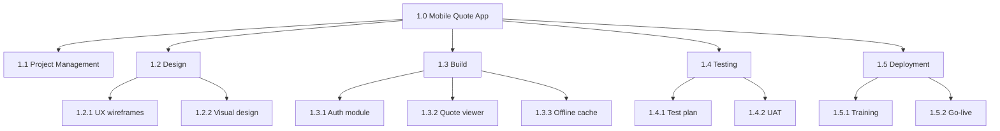
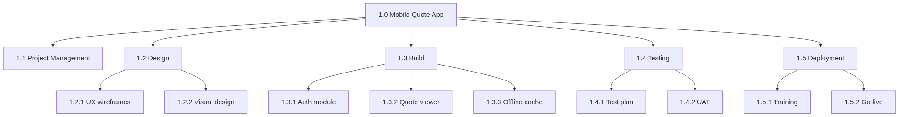
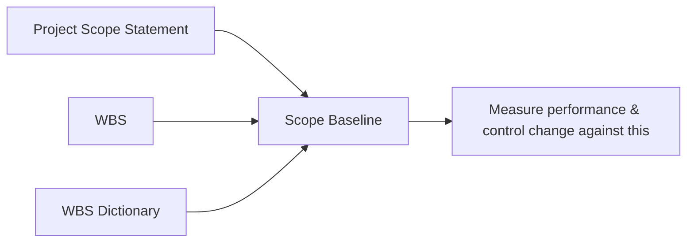
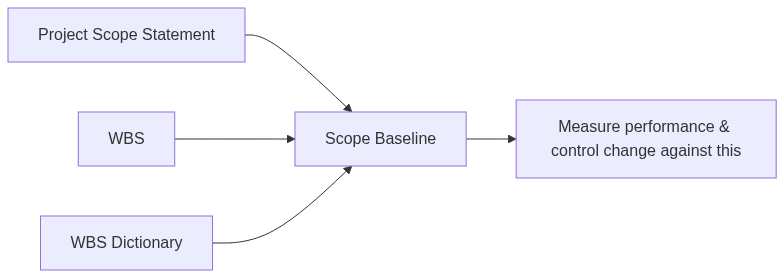
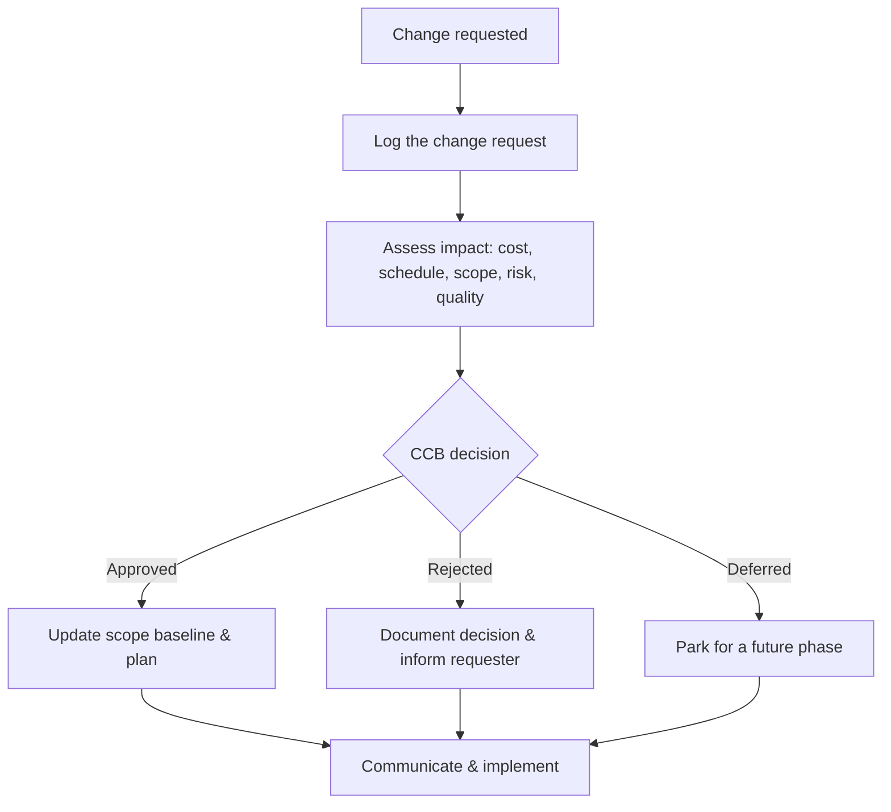
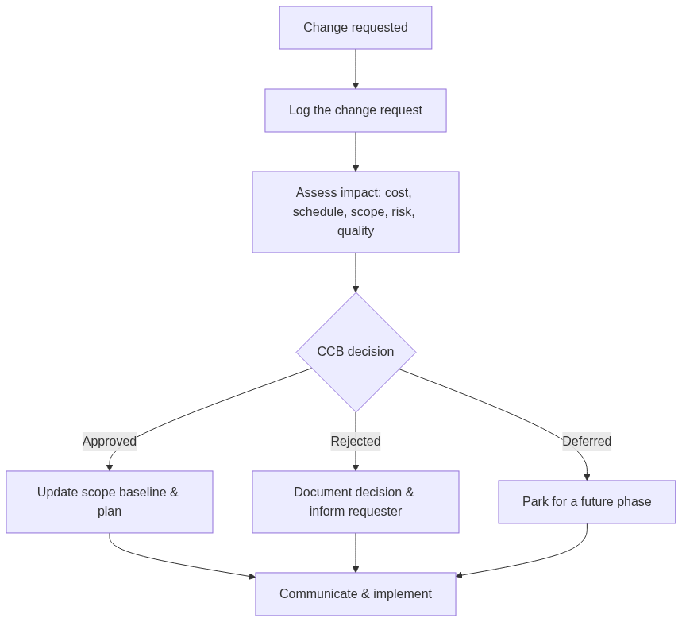
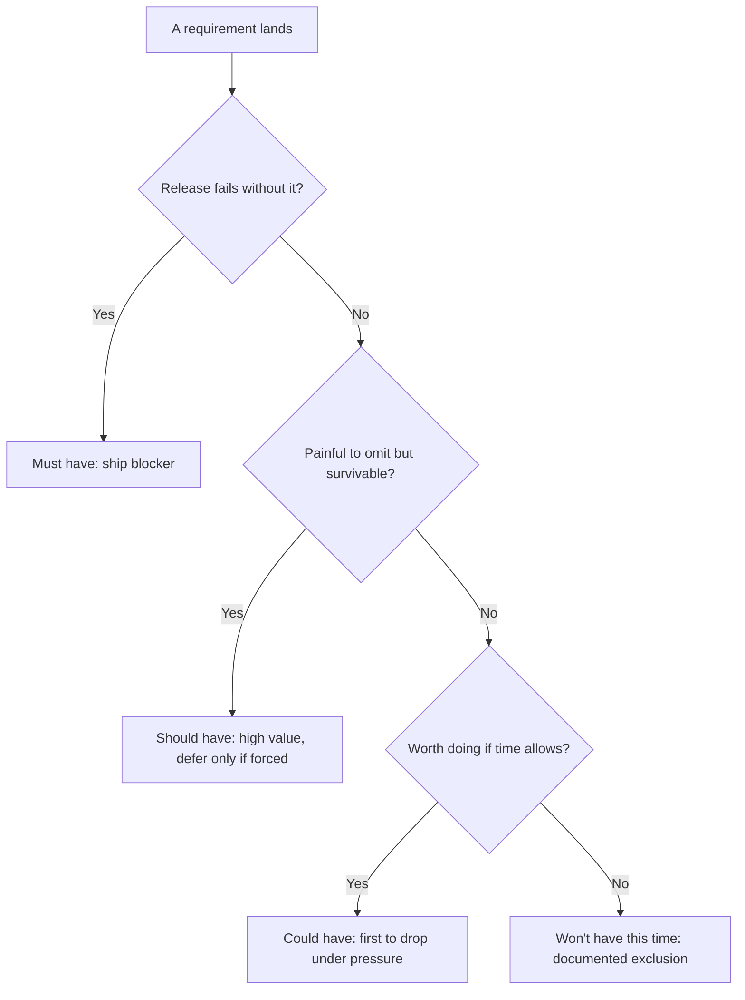
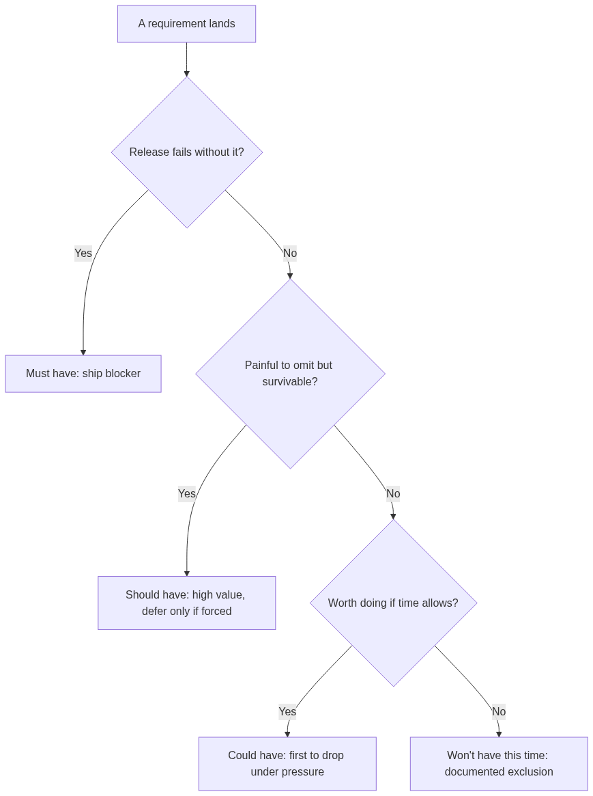
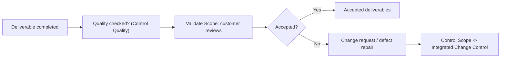
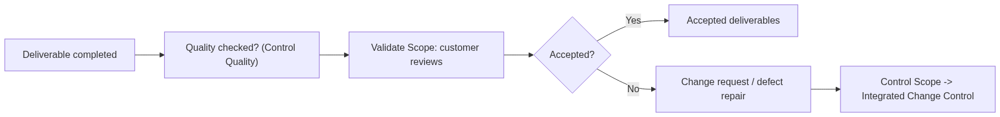

# Module 06 — Scope Management

> ⏱️ Estimated study time: ~45 min · 📈 Level: Intermediate · 📚 Prerequisites: Module 05 · Part of the **Sales -> Project Management Reviewer**.

*The will-they-won't-they of every project: you said yes to *this*, so why does it keep trying to become *that*?*

## 🎯 What you'll be able to do

- [ ] Run a requirements-gathering session and capture what you hear in a **requirements traceability matrix**.
- [ ] Tell **product scope** from **project scope** and write a scope statement with crisp in/out boundaries.
- [ ] Build a **Work Breakdown Structure (WBS)** down to work packages and explain why it's the backbone of every plan.
- [ ] Spot **scope creep** and **gold plating**, and use change control to protect the project.
- [ ] Prioritize requirements with **MoSCoW** and run both **Validate Scope** and **Control Scope**.

## 👋 From your mentor

Okay, real talk: you already manage scope every day. Every time a prospect leans in and says "ooh, can you also throw in onboarding *and* a custom report?", you make a split-second scope decision — what's in the deal, what costs extra, what you smile and gently defer to "phase two." Project management didn't invent that instinct. It just handed it a vocabulary and a paper trail.

Here's the thing nobody tells you up front: scope is where projects quietly fall in love or quietly fall apart. Draw the boundaries clearly and your schedule and budget have solid ground to stand on. Leave them fuzzy and you'll deliver something nobody actually asked for, three weeks late, while everyone insists *they* never agreed to that. This whole module is about drawing the line — and, just as importantly, defending it like it owes you money.

---

## 📋 Collecting requirements

You can't manage scope until you know what people actually want — and "want" is a slippery little word, because people are *terrible* at saying it out loud. In sales you call this **discovery**. In PM we call it **Collect Requirements**. Same muscle, same move: ask good questions, listen harder than you talk, write it down, confirm.

A **requirement** is a documented need or condition the project must satisfy. They fall into a few buckets you'll see referenced everywhere — think of them as the cast of characters:

| Requirement type | What it captures | Example |
|---|---|---|
| **Business** | The high-level *why* — the org's need | "Cut order-processing time by 30%." |
| **Stakeholder** | A specific group's need | "Sales reps need mobile access to quotes." |
| **Solution — functional** | What the product *does* | "System emails a confirmation after checkout." |
| **Solution — non-functional** | Quality attributes / constraints | "Page loads in under 2 seconds." |
| **Transition / readiness** | What's needed to go live | "Reps trained before cutover." |
| **Project** | How the work must run | "No deployments during quarter close." |
| **Quality** | Conditions to validate success | "99.9% uptime measured monthly." |

### Elicitation techniques

"Elicitation" is just a fancy word for *coaxing the truth out of people* — and you, my friend, are already a pro. Pick the technique to fit the moment, the same way you instinctively choose between a quick call, a full demo, or quietly mailing a sample and waiting.

| Technique | What it is | When you'd reach for it |
|---|---|---|
| **Interviews** | One-on-one structured conversations | Sensitive topics, busy executives, getting the real story |
| **Workshops** | Facilitated group sessions (e.g. JAD) | Cross-functional alignment fast; resolving conflicts live |
| **Prototypes** | A mockup or clickable model to react to | When people struggle to describe what they want abstractly |
| **Observation** ("job shadowing") | Watching the work happen | Uncovering steps people forget to mention |
| **Surveys / questionnaires** | Written questions at scale | Many stakeholders, geographically spread |
| **Brainstorming** | Generating many ideas without judgment | Early, divergent, "what could this be?" thinking |
| **Document analysis** | Mining existing docs, contracts, tickets | A system already exists and is partly documented |

> 🔁 **Sales → PM bridge:** A prototype is your *demo*. When a prospect can't put their need into words, you stop explaining and show them a screen — and the look on their face tells you more than any spec ever could. Same exact move here: a rough prototype turns vague opinions into concrete, actionable requirements before anyone's wasted a sprint building the wrong thing.

### The Requirements Traceability Matrix (RTM)

So you've gathered all these requirements. Lovely. Now you have to keep them honest — because requirements are like a group chat at 2am: things get added, things get forgotten, and nobody remembers who suggested what. The **Requirements Traceability Matrix** is the table that links each requirement back to its origin *and* forward to the deliverable, test, and business objective that satisfies it. Nothing gets built that nobody asked for; nothing requested gets quietly ghosted.

| Req ID | Requirement | Source | Priority | WBS deliverable | Test / acceptance | Status |
|---|---|---|---|---|---|---|
| R-01 | Reps view quotes on mobile | Sales VP | Must | 1.2 Mobile app | Login + view on phone | In progress |
| R-02 | Email confirmation at checkout | Customer | Must | 1.3 Checkout svc | Receive email < 1 min | Done |
| R-03 | Dark mode | Survey | Could | 1.4 UI theme | Toggle persists | Deferred |

Think of the RTM as the CRM of your requirements — every "opportunity" (requirement) has a stage, an owner, and a next step. You already live in a pipeline; this is just yours.

---

## 🎯 Product scope vs project scope

Two phrases that sound like twins and trip up almost everyone at the worst possible moment:

- **Product scope** = the *features and functions* that characterize the thing you're delivering. Measured against **requirements**. ("The app has login, quotes, and offline mode.")
- **Project scope** = the *work* required to deliver that product. Measured against the **project management plan**. ("Design, build, test, train, deploy, document.")

Product scope is the *what*; project scope is the *work to get there*. Quick gut check: if you're describing a button, that's product scope. If you're describing writing the test plan for that button, that's project scope. (One is the wedding; the other is the eleven months of planning it.)

### Writing a clear scope statement

The **Project Scope Statement** is the document that nails the boundaries to the floor. And here's the secret a good one always knows: it has an explicit **out-of-scope** list — because what you *won't* do prevents more fights than what you will.

A solid scope statement includes:

- **Product scope description** — what the deliverable is and does.
- **Deliverables** — the tangible outputs (and acceptance criteria for each).
- **Acceptance criteria** — the conditions that must be met to be "done."
- **In-scope** — explicitly included work.
- **Out-of-scope (exclusions)** — explicitly *not* included. Be specific.
- **Constraints** — fixed limits (budget, deadline, fixed tech).
- **Assumptions** — things taken as true that, if wrong, create risk.

**Example — the out-of-scope list is your best friend at the party:**

> *In scope:* Mobile quote viewing for iOS and Android.
> *Out of scope:* Quote *editing* on mobile; tablet-optimized layout; integration with the legacy ERP. These may be considered in a future phase.

That one humble out-of-scope line quietly saves you a dozen "but I *assumed*…" conversations down the road — the same way a crisp statement of work protects you from the client who was *certain* training was bundled in.

---

## 🧱 The Work Breakdown Structure (WBS)

The **WBS** is a hierarchical decomposition of the *total scope of work* into smaller, manageable pieces. It is **deliverable-oriented** — you break down *nouns* (things produced), not a to-do list of verbs. And it is, genuinely, the backbone of everything: your schedule, cost estimates, resource plan, and risk register all hang off it. Get this right and the rest of planning has something to lean on.

### Decomposition and work packages

You break the project down level by level until you reach **work packages** — the lowest level of the WBS, small enough to estimate cost and duration reliably and to hand to one owner. (Work packages later get broken down further into *activities* for scheduling — but that's Module 07's storyline, not ours.)

<!-- mobile-diagram:06-scope-management-1 -->

🖼️ View as image (for the GitHub mobile app)

<!-- /mobile-diagram -->

*A WBS tree: the project branches into deliverables, then into work packages at the lowest level.*

### The 100% rule

The single most important rule of the WBS, and the one examiners love: the **100% rule**. The WBS must capture **100% of the work** defined by the scope — no more, no less. Every level of decomposition must add up to exactly its parent. If it's not in the WBS, it's not in the project. And if it *is* in the WBS but not in the scope, congratulations, you've got gold plating sneaking in the back door.

A practical consequence: children must fully account for their parent. The three boxes under "1.3 Build" should, together, equal *all* the building — not 90%, not 110%. No more, no less.

### The WBS dictionary

The boxes in the WBS are short little labels — name tags at a networking event. The **WBS dictionary** is the companion document that gives the real detail behind each work package: a description, the responsible owner, acceptance criteria, estimated effort, dependencies, and the requirement IDs it satisfies. The WBS shows the *structure*; the dictionary holds the *substance*.

| WBS ID | Work package | Owner | Acceptance criteria | Linked req |
|---|---|---|---|---|
| 1.3.1 | Auth module | Dev lead | Login + biometric, lockout after 5 fails | R-01 |
| 1.3.3 | Offline cache | Dev | Last 50 quotes available with no signal | R-04 |

---

## 📌 The scope baseline

Once your scope is approved, you lock it in as the **scope baseline** — the official version you measure performance against. It's not one document but **three together**, a little trio:

1. The approved **Project Scope Statement**
2. The **WBS**
3. The **WBS dictionary**

<!-- mobile-diagram:06-scope-management-2 -->

🖼️ View as image (for the GitHub mobile app)

<!-- /mobile-diagram -->

*The scope baseline is the approved trio you defend; changes to it go through formal change control.*

The load-bearing word here is **approved**. Once it's baselined, scope only changes through **integrated change control** — you don't quietly slip in an edit at midnight and hope nobody notices. That little bit of formality is exactly what stops the slow, silent bleed of scope creep.

---

## 🐍 Scope creep and gold plating

Two ways scope grows without your blessing — and they have very different culprits, so it's worth learning to read the clues:

- **Scope creep** — uncontrolled changes or *continuous additions* to scope **without** adjusting time, cost, and resources. Usually comes from *outside* (a stakeholder who keeps murmuring "just one more tiny thing").
- **Gold plating** — the *team* adds extra work or polish nobody asked for, convinced they're being generous. Comes from *inside*. It still burns budget and risk for exactly zero approved value.

Both are dangerous because they spend your budget and schedule on requirements nobody signed off on. The cure for both is the same plot device: **change control**.

> 🔁 **Sales → PM bridge:** That customer who keeps adding "oh, and can you also…" right as the pen hovers over the contract? That's scope creep, and you already handle it in your sleep. You either re-price the deal or write it into a future phase — you don't just absorb it for free and eat the margin. In PM you do the *exact* same thing through a **change request**: every addition gets evaluated for its impact on cost, schedule, and risk before anyone says yes.

### Integrated change control protects you

When a change gets requested, it doesn't just stroll into the work like it owns the place. It follows a defined path — typically reviewed by a **Change Control Board (CCB)** — that weighs the impact before approving or rejecting it.

<!-- mobile-diagram:06-scope-management-3 -->

🖼️ View as image (for the GitHub mobile app)

<!-- /mobile-diagram -->

*Integrated change control: nothing touches the baseline until impact is assessed and a decision is on the record.*

And here's the quiet magic — it was never really about the bureaucracy. It's that **every "yes" now comes with a visible price tag**. Funny how the requests dry up the moment someone can see the schedule slip stapled to their bright idea.

---

## ✅ Prioritization with MoSCoW

Not every requirement is created equal, and pretending otherwise is how you end up out of time with the wrong things finished. **MoSCoW** is a fast, shared way to rank them — so that when the clock starts ticking down, everyone already agreed, *in advance*, what gets cut.

| Category | Meaning | Rule of thumb |
|---|---|---|
| **Must have** | Non-negotiable; without it the release fails | If any Must is missing, you don't ship |
| **Should have** | Important but not vital; painful to omit | Strong candidates, but survivable to defer |
| **Could have** | Nice to have; included if time allows | First to drop under pressure |
| **Won't have (this time)** | Explicitly excluded for now | Documented so it's not forgotten — and not silently added |

<!-- mobile-diagram:06-scope-management-4 -->

🖼️ View as image (for the GitHub mobile app)

<!-- /mobile-diagram -->

*A MoSCoW decision flow: each requirement lands in exactly one bucket. The high-value blockers become Must-haves; the explicit "Won't have" bucket keeps deferred work from sneaking back in.*

The "**Won't have**" column is the unsung hero of the four. Writing down what you're *not* doing is how you keep it from creeping back in under cover of darkness — it's the prioritization twin of your out-of-scope list. Same energy, same quiet power.

---

## ⏸️ Pause & reflect

This is a perfectly good place to stop, stretch, take a break, and come back later — the next part (validation vs control) is a genuinely distinct idea and it'll land cleaner with fresh eyes.

Before you wander off, sit with these for a sec:

- Think of a deal where the customer kept piling on asks. What was the *one* thing that, if it had been missing, would have killed the whole thing (your "Must")? What did you happily wave off to later (your "Could")?
- If you had to write a three-line scope statement for your *current* plot twist — moving into PM — what would your **out-of-scope** list say? (What are you deliberately *not* taking on right now?)

No essays required. Just notice, with a little satisfaction, that you already think exactly this way.

---

## 🤝 Validate Scope vs Control Scope

These two get mixed up constantly, so let's make them stick for good. Both happen during execution, but they're answering completely different questions:

| | **Validate Scope** | **Control Scope** |
|---|---|---|
| **Question it answers** | "Will you formally *accept* this deliverable?" | "Is scope changing, and is it controlled?" |
| **Focus** | Customer **acceptance** of deliverables | Monitoring scope status; managing changes to the baseline |
| **Who's central** | The **customer / sponsor** signs off | The **PM / team** watch for variance & creep |
| **Key output** | **Accepted deliverables** | **Change requests**, work performance info |
| **About** | Formal, documented sign-off | Preventing/managing creep & gold plating |

Here's the memory trick that makes it click: **Validate Scope is the handshake** — the customer *formally accepts* the work, like getting the actual signature on the deal, not just a breezy verbal "yeah, looks good" in the hallway. **Control Scope is the guardrail** — you're constantly comparing reality to the baseline and routing every would-be change through change control.

<!-- mobile-diagram:06-scope-management-5 -->

🖼️ View as image (for the GitHub mobile app)

<!-- /mobile-diagram -->

*Note the order: a deliverable gets verified for quality first, then validated for acceptance by the customer.*

> One nuance worth pocketing: **Control Quality** (an internal check that the deliverable is *correct*) usually happens *before* **Validate Scope** (an external check that the customer *accepts* it). Correct first, accepted second. Don't bring it to the table until you'd be proud to.

---

## 🧠 Check yourself

**1. What's the difference between product scope and project scope?**

Show answer

Product scope = the features and functions of the deliverable, measured against **requirements**. Project scope = the work needed to deliver that product, measured against the **project management plan**. Product = the *what*; project = the *work to get there*.

**2. State the 100% rule and one consequence of it.**

Show answer

The WBS must include **100% of the work** in the scope — no more, no less — and each level must sum exactly to its parent. Consequence: if work isn't in the WBS, it isn't in the project (and anything in the WBS but not the scope is gold plating).

**3. Name the three components of the scope baseline.**

Show answer

The approved **Project Scope Statement**, the **WBS**, and the **WBS dictionary**.

**4. Scope creep vs gold plating — who causes each, and what's the fix for both?**

Show answer

**Scope creep** = uncontrolled additions to scope (usually driven by stakeholders/customers, from outside) without adjusting time/cost. **Gold plating** = the **team** adding unrequested extras (from inside). The fix for both is **integrated change control** — assess impact before any change is approved.

**5. In one line each, distinguish Validate Scope from Control Scope.**

Show answer

**Validate Scope** = formal customer **acceptance** of completed deliverables (the handshake). **Control Scope** = monitoring scope status and managing changes to the scope baseline (the guardrail).

**6. What does the "Won't have" category in MoSCoW give you that the others don't?**

Show answer

It explicitly documents what is **excluded this time**, so it isn't forgotten *and* can't silently creep back in. It's the prioritization version of an out-of-scope list.

---

## 🧰 Try it

Pick a small, real project you could actually run — say, "launch a personal portfolio site to land PM interviews." Give it 20 minutes:

1. **Write a 5-line scope statement** with an explicit **in-scope** and **out-of-scope** list. Force yourself to put at least three things in *out-of-scope* (this is the hard part, and the point).
2. **Sketch a WBS** with 3-5 top-level deliverables and decompose one of them into 2-3 work packages. Check it against the 100% rule.
3. **MoSCoW-tag** five features. Make sure exactly one is a "Won't have."
4. **Pick one likely scope-creep request** ("ooh, add a blog!") and write the one-sentence change-request response you'd give — naming the impact on time.

Do all four and you've just performed the core of scope management with your own hands. Keep the file — Module 07 is going to hang a whole schedule off that WBS.

---

## 🔑 Key terms

- **Collect Requirements** — the process of determining, documenting, and managing stakeholder needs.
- **Elicitation** — drawing requirements out of stakeholders (interviews, workshops, prototypes, observation, etc.).
- **Requirements Traceability Matrix (RTM)** — a table linking each requirement to its source, deliverable, test, and objective.
- **Product scope** — the features and functions of the deliverable; measured against requirements.
- **Project scope** — the work required to deliver the product; measured against the project management plan.
- **Project Scope Statement** — the document defining deliverables, acceptance criteria, and in/out-of-scope boundaries.
- **Work Breakdown Structure (WBS)** — a deliverable-oriented hierarchical decomposition of the total scope of work.
- **Work package** — the lowest level of the WBS; small enough to estimate and assign.
- **100% rule** — the WBS must capture exactly all the scope; each level sums to its parent.
- **WBS dictionary** — the companion document detailing each WBS component.
- **Scope baseline** — the approved Scope Statement + WBS + WBS dictionary.
- **Scope creep** — uncontrolled additions to scope without adjusting time/cost/resources.
- **Gold plating** — the team adding unrequested features or polish.
- **MoSCoW** — prioritization into Must / Should / Could / Won't-have.
- **Validate Scope** — formal customer acceptance of completed deliverables.
- **Control Scope** — monitoring scope status and managing changes to the baseline.

---
⬅️ **Previous:** [Module 05 — Initiation — Business Case, Charter & Stakeholders](05-initiation-charter-stakeholders.md) · 🏠 **[Reviewer Home](../README.md)** · ➡️ **Next:** [Module 07 — Schedule Management](07-schedule-management.md)
