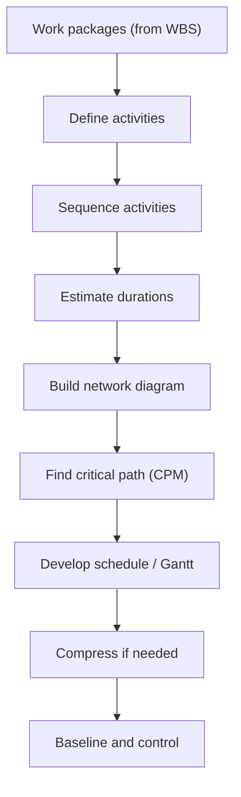
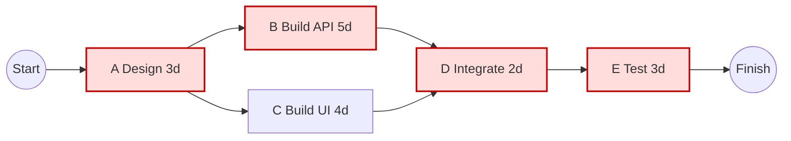
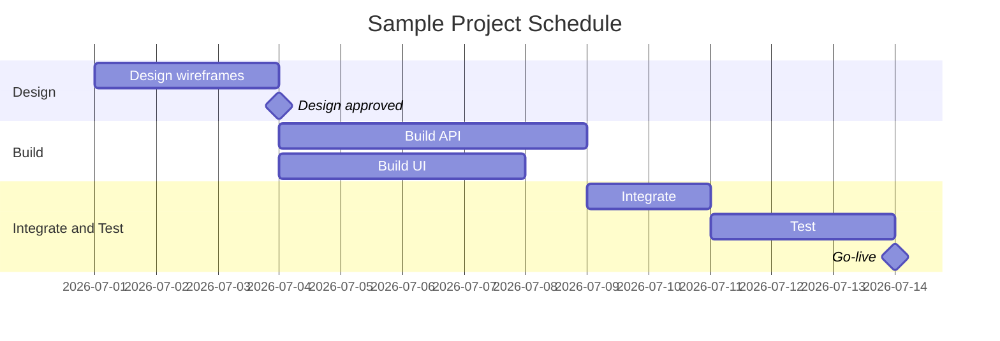
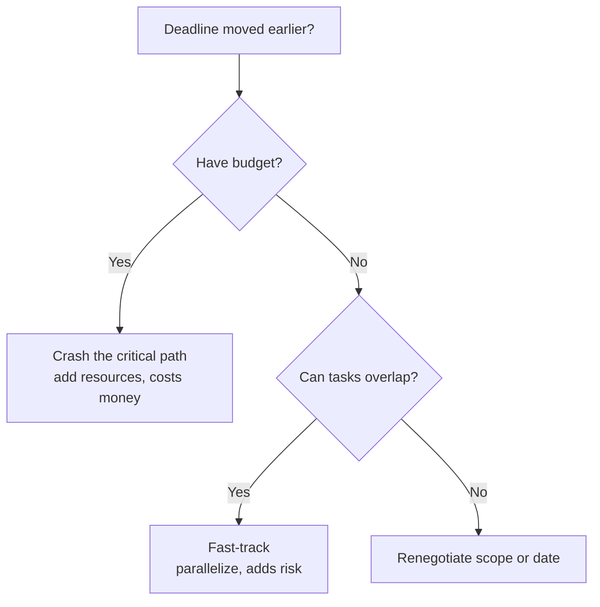

# Module 07 — Schedule Management

> ⏱️ **Estimated study time:** ~50 min · 📈 **Level:** Intermediate · ✅ **Prerequisites:** [Module 06 — Scope Management](06-scope-management.md) · Part of the **Sales -> Project Management Reviewer**.

## 🎯 What you'll be able to do

- [ ] Break work packages from the WBS down into **activities**, then sequence them with the right dependency types.
- [ ] Build a simple **network diagram** and find the **critical path** using a forward and backward pass.
- [ ] Estimate durations three ways — **analogous, parametric, and three-point/PERT** — and know when each fits.
- [ ] Read and build a **Gantt chart** with milestones, and explain it to a stakeholder.
- [ ] Choose between **crashing** and **fast-tracking** when the deadline moves up, and say what each costs you.
- [ ] Explain **float/slack** and why it tells you where you can (and can't) afford to slip.

## 👋 From your mentor

Here's the good news: you already think in deadlines. Every quarter you've worked backward from a close date, figuring out which deals *have* to move this week so the number lands by the 31st. That instinct — "what must happen, in what order, by when" — is the entire heart of schedule management.

In sales you carried that math in your head. In project management we make it explicit, on paper, so a team of ten people can see the same plan and trust it. That's the only real difference. This module gives you the vocabulary and the tools to turn that gut feel into something you can defend in a status meeting. Take it slow — this is the most "mathy" module so far, but every formula here is just arithmetic with a story attached.

## 🗺️ The big picture: from scope to a schedule

In Module 06 you decomposed the work into a **WBS** ending in **work packages** — the smallest chunks of deliverable work. Scheduling is what happens *after* that. You take each work package, break it into the verbs needed to produce it, line those verbs up in order, estimate how long each takes, and the calendar falls out the other end.

*The scheduling process: each step feeds the next — you can't sequence what you haven't defined.*

> 🔁 **Sales → PM bridge:** A work package is like an **account** in your pipeline. The *activities* are the touch-points needed to close it — discovery call, demo, proposal, redline, signature. You never closed an account in one undefined blob; you broke it into ordered steps with owners and dates. Scheduling is that, applied to deliverables instead of deals.

## 1) From work packages to activities

A **work package** is a noun — a thing you'll deliver (e.g., "User login page"). An **activity** (PMI also says **schedule activity**) is a verb — the work you do to produce it (e.g., "Design login wireframe," "Build login API," "Write login tests").

**Defining activities** = decomposing each work package into the actions required. **Sequencing activities** = deciding what order they run in and how they connect.

The output of defining is your **activity list** plus **activity attributes** (owner, assumptions, constraints) and a **milestone list**. Keep activities small enough to estimate honestly — if you can't put a believable number of days on it, it's still too big.

| Term | What it is | Sales analogy |
|---|---|---|
| Work package | Smallest deliverable in the WBS | An account to close |
| Activity | A unit of work to produce it | A call, demo, or proposal step |
| Milestone | A zero-duration marker of an event | "Contract signed" |
| Dependency | A relationship between two activities | "Can't send proposal before discovery" |

## 2) Dependency types and leads/lags

When you sequence activities, you connect them with a **logical relationship**. There are four, and the names read literally — the first word is the *predecessor's* end, the second is the *successor's*.

| Dependency | Reads as | Plain meaning | Example |
|---|---|---|---|
| **Finish-to-Start (FS)** | Finish A, then Start B | B can't start until A finishes | Pour foundation (A) → frame walls (B). *The default — ~90% of links.* |
| **Start-to-Start (SS)** | Start A, then Start B | B can't start until A starts | Start pouring concrete (A) → start leveling it (B). |
| **Finish-to-Finish (FF)** | Finish A, then Finish B | B can't finish until A finishes | Finish writing code (A) → finish testing it (B). |
| **Start-to-Finish (SF)** | Start A, then Finish B | B can't finish until A starts | Start new on-call shift (A) → finish old shift (B). *Rare.* |

**Leads and lags** fine-tune those links:

- A **lead** *pulls the successor earlier* — overlap. "Start testing 2 days before coding finishes" is an FS link with a **2-day lead** (often written as FS − 2d).
- A **lag** *pushes the successor later* — a waiting gap. "Apply second coat 24 hours after the first" is an FS link with a **1-day lag** (FS + 1d). Note: a lag is *imposed waiting time*, not slow work.

> 🔁 **Sales → PM bridge:** You already use lag without naming it. "Send the follow-up email **3 days after** the demo" is a Finish-to-Start link with a 3-day lag. And running discovery for two accounts *in parallel* is a Start-to-Start relationship. Sequencing logic isn't new to you — only the labels are.

## 3) The network diagram and the Critical Path Method (CPM)

A **network diagram** (precedence diagram) draws your activities as boxes and your dependencies as arrows. Once it's drawn, you can compute the **critical path**: the *longest* path of dependent activities through the network, which determines the *shortest possible* time to finish the project.

That sounds backwards, so sit with it: the longest chain of must-happen-in-order work sets the floor on your duration. If that chain is 20 days, the project cannot finish in less than 20 days no matter how fast everything else goes.

Here's a small network. Each node shows the activity and its duration in days.

*A small network. The highlighted path A → B → D → E is the critical path (3+5+2+3 = 13 days). The path through C is shorter, so C has float.*

### Forward pass, backward pass — in plain language

Two passes give you four numbers per activity: **Early Start (ES), Early Finish (EF), Late Start (LS), Late Finish (LF)**.

**Forward pass — "how soon can it happen?"** Walk left to right.
- First activity's ES = 0 (or day 1, depending on convention; we'll use 0).
- **EF = ES + duration.**
- The next activity's ES = the **largest** EF of all its predecessors (you wait for the slowest input).

**Backward pass — "how late can it slip without delaying the project?"** Walk right to left.
- Last activity's LF = its EF (the project end).
- **LS = LF − duration.**
- A predecessor's LF = the **smallest** LS of its successors.

### Float (slack) and why the critical path matters

**Total float** = LS − ES (equivalently LF − EF). It's how much an activity can slip without pushing out the *project* end date.

- **Critical path activities have zero float.** Slip one day, slip the whole project. These are the deals that *must* move this week.
- **Non-critical activities have positive float** — wiggle room. Activity C above can take an extra day or two before it starts to matter.

Run the numbers on the diagram (project length = 13 days):

| Activity | Dur | ES | EF | LS | LF | Float | Critical? |
|---|---|---|---|---|---|---|---|
| A | 3 | 0 | 3 | 0 | 3 | 0 | ✅ |
| B | 5 | 3 | 8 | 3 | 8 | 0 | ✅ |
| C | 4 | 3 | 7 | 4 | 8 | 1 | ❌ |
| D | 2 | 8 | 10 | 8 | 10 | 0 | ✅ |
| E | 3 | 10 | 13 | 10 | 13 | 0 | ✅ |

Why it matters: the critical path tells you **where to spend your attention**. If you can only watch a few things, watch the zero-float activities. And if you want to finish faster, you *must* shorten the critical path — speeding up C does nothing for the end date.

> 🔁 **Sales → PM bridge:** Working backward from a quarter-end close date to figure out which deals *must* move this week — that is literally a backward pass. The deals with no room to slip are your critical path. The ones you could push to next month without missing the number have float. You've been doing CPM in your head for years.

## 4) Estimating durations

You need a number of days for each activity. There are three respectable ways to get one — pick by how much data you have.

| Method | How it works | Accuracy | Use when |
|---|---|---|---|
| **Analogous** (top-down) | "Last similar project's login took 6 days, so ~6 here." | Low — fast & cheap | Early, little detail, similar past work exists |
| **Parametric** | Use a rate: 500 lines ÷ 100 lines/day = 5 days. | Medium–high | You have a measurable unit and a known rate |
| **Three-point / PERT** | Blend optimistic, most likely, pessimistic. | Higher — accounts for uncertainty | Risky or unfamiliar activities |

### Three-point and the PERT formula

Instead of one guess, you gather three: **Optimistic (O)**, **Most Likely (M)**, **Pessimistic (P)**. The **PERT** (beta) estimate weights the most likely outcome four times:

**`Estimate = (O + 4M + P) / 6`**

Example: a tricky integration. O = 4 days, M = 6 days, P = 14 days.
`(4 + (4 × 6) + 14) / 6 = (4 + 24 + 14) / 6 = 42 / 6 = 7 days.`

Notice the answer (7) sits above the most likely (6) because the long tail of bad days drags it up — that's the point. A plain average of the three would be (4 + 6 + 14) / 3 = 8 days; PERT's 4× weight on the most likely value keeps the estimate grounded nearer reality at 7.

> Quick aside: PERT can also estimate spread via **standard deviation = (P − O) / 6**. Here that's (14 − 4) / 6 ≈ 1.7 days, telling you how confident to be. You don't need this for every task, but it's handy for high-stakes ones.

## 5) Gantt charts and milestones

A **Gantt chart** is a bar chart against a calendar: each activity is a horizontal bar whose length is its duration and whose position is its start date. It's the single most common way to *communicate* a schedule because anyone can read it at a glance — no CPM training required.

A **milestone** is a significant point in time with **zero duration** — "Design approved," "Beta launched," "Go-live." Milestones are how executives track you, so choose them to mark real, verifiable events.

*A Gantt view of the same project. Bars show duration on the calendar; diamonds (milestones) mark zero-duration events like approvals and go-live.*

The Gantt and the network diagram describe the *same* schedule — the network shows the *logic*, the Gantt shows the *calendar*. Build with the network; present with the Gantt.

## 6) Schedule compression: when the date moves up

Your sponsor says "we need this two weeks sooner." You have exactly two honest levers. Both only matter when applied to the **critical path** — compressing anything else is wasted effort.

| Technique | What you do | The cost | Best when |
|---|---|---|---|
| **Crashing** | Add resources to critical activities (more people, overtime, paid expediting) | **Costs more money**; risk of diminishing returns (9 women can't make a baby in 1 month) | Budget exists and the task can absorb more hands |
| **Fast-tracking** | Run activities in **parallel** that were planned in sequence | **Adds risk** of rework (you start downstream work on unfinished inputs) | Activities can partially overlap and you can tolerate rework risk |

*Choosing a compression technique. Money buys crashing; tolerance for risk buys fast-tracking; neither means a scope/date conversation.*

Rule of thumb: **crashing trades money for time; fast-tracking trades risk for time.** There's no free compression — if someone promises one, you're about to inherit hidden cost or hidden risk.

## 7) Resource leveling and smoothing (briefly)

Two ways to deal with people who are over-allocated:

- **Resource leveling** — you adjust start/finish dates to fit limited resources (e.g., one developer can't do two activities at once, so one slides). This **can change the critical path and may extend the end date**. It respects the resource limit above all.
- **Resource smoothing** — you adjust work *within the available float only*, so the end date and critical path **don't change**. It's gentler; it just flattens the peaks and valleys of demand.

Memory hook: **Leveling** can *lengthen* the project; **smoothing** stays inside the slack you already have.

## ⏸️ Pause & reflect

This is a perfectly safe place to stop, stretch, and come back later — the CPM mechanics above are the densest part of the module, and they reward a fresh head.

Before you move on, sit with these:

1. Think of a past quarter. What was *your* critical path — the two or three deals that, if they slipped, the whole number missed?
2. Where in your old workflow did you naturally **fast-track** (overlap steps) versus **crash** (throw your own overtime at it)? Which one bit you with rework later?
3. Which estimating method matches how you used to forecast a deal's close date — analogous ("deals like this usually take 3 weeks") or three-point ("best case Friday, worst case end of month")?

## 🧠 Check yourself

**1. What is the critical path, in one sentence?**

Show answer

The longest path of dependent activities through the network diagram, which determines the shortest possible duration of the project. Activities on it have zero float.

**2. An activity has ES = 5, LS = 9. What is its total float, and is it on the critical path?**

Show answer

Total float = LS − ES = 9 − 5 = **4 days**. Because float is greater than zero, it is **not** on the critical path.

**3. Compute the PERT estimate for O = 3, M = 5, P = 13.**

Show answer

(O + 4M + P) / 6 = (3 + 20 + 13) / 6 = 36 / 6 = **6 days**.

**4. You must finish 2 weeks early and you have spare budget but the team is already maxed on overtime risk. Crash or fast-track?**

Show answer

**Crashing** — you have budget to add resources to the critical path. Fast-tracking would add rework risk; crashing spends money instead, which is the lever you actually have. (Always verify the added resources land on critical-path activities.)

**5. "Apply the second coat of paint 24 hours after the first coat" — what dependency and modifier is this?**

Show answer

A **Finish-to-Start (FS)** dependency with a **1-day lag**. The lag is imposed waiting time (drying), not slow work.

**6. What's the difference between resource leveling and resource smoothing?**

Show answer

**Leveling** adjusts dates to fit limited resources and *may extend* the project end date / change the critical path. **Smoothing** only shifts work within existing float, so the end date and critical path stay the same.

## 🧰 Try it

Take a small real goal — say, "Prepare and deliver a client demo." Do this on one page:

1. List **5–7 activities** (verbs): e.g., gather requirements, build demo data, script the walkthrough, dry-run, deliver.
2. Mark the **dependencies** — which can't start until another finishes (FS), and any you could overlap (SS).
3. Put a **duration** on each. For the riskiest one, use PERT: write your O, M, P and compute (O + 4M + P) / 6.
4. Sketch the **network** (boxes and arrows) and trace the **longest path** — that's your critical path.
5. Now pretend the demo got moved up two days. Decide: **crash** (who/what would you add?) or **fast-track** (which two activities would you overlap, and what could go wrong?).

If you can do this for a 6-activity project, you can do it for a 60-activity one — it's the same moves at bigger scale.

## 🔑 Key terms

- **Activity** — A discrete unit of scheduled work, decomposed from a WBS work package.
- **Dependency (logical relationship)** — How two activities connect: FS, SS, FF, or SF.
- **Lead / Lag** — A modifier that overlaps (lead) or delays (lag) a successor relative to its predecessor.
- **Network diagram** — A graph of activities (nodes) and dependencies (arrows) used to compute the schedule.
- **Critical Path Method (CPM)** — Technique to find the longest path and the shortest project duration via forward/backward passes.
- **Float / Slack (total float)** — How long an activity can slip without delaying the project; LS − ES. Critical-path activities have zero.
- **Forward pass / Backward pass** — Left-to-right calculation of ES/EF; right-to-left calculation of LS/LF.
- **Analogous / Parametric / Three-point (PERT)** — Estimating methods: by similarity, by rate, and by weighted O/M/P average — (O + 4M + P) / 6.
- **Gantt chart** — A calendar bar chart of activities; the standard way to communicate a schedule.
- **Milestone** — A zero-duration marker of a significant event (e.g., approval, go-live).
- **Crashing** — Compressing the schedule by adding resources; costs money.
- **Fast-tracking** — Compressing by running sequential activities in parallel; adds risk.
- **Resource leveling / smoothing** — Resolving over-allocation; leveling may extend the schedule, smoothing stays within float.

---
⬅️ **Previous:** [Module 06 — Scope Management](06-scope-management.md) · 🏠 **[Reviewer Home](../README.md)** · ➡️ **Next:** [Module 08 — Cost & Budget Management](08-cost-and-budget.md)
