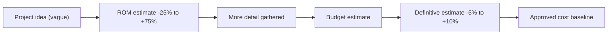
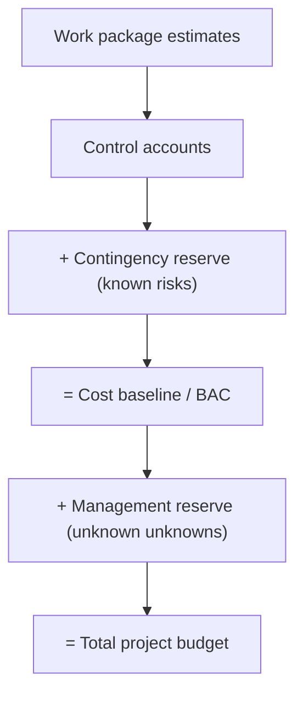
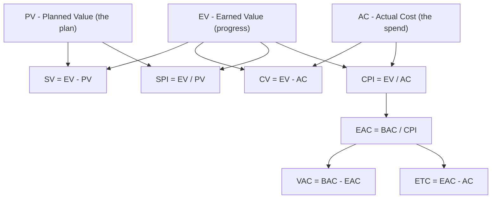
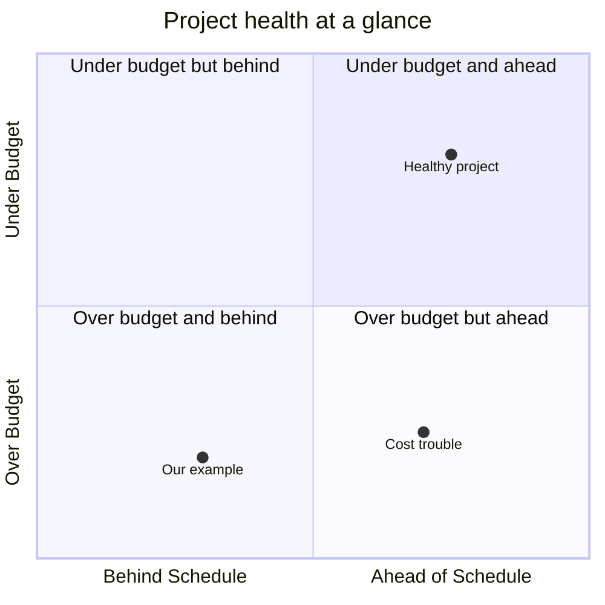
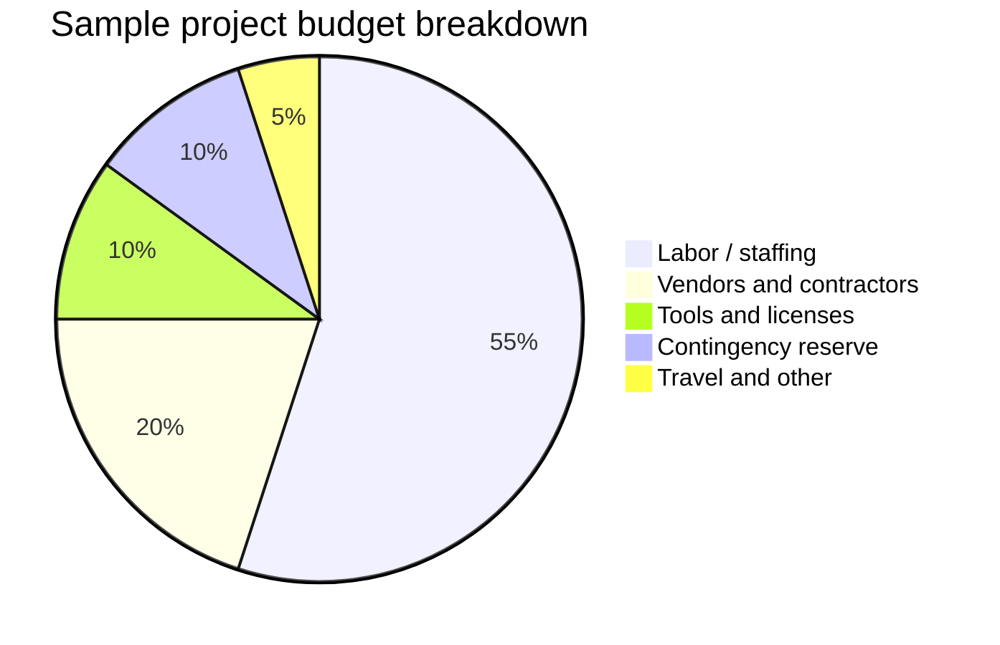

# Module 08 — Cost & Budget Management

> **Estimated study time:** ~50 min · **Level:** Intermediate · **Prerequisites:** [Module 07 — Schedule Management](07-schedule-management.md) · Part of the **Sales -> Project Management Reviewer**.

## 🎯 What you'll be able to do

- [ ] Pick the right cost-estimating method (analogous, parametric, bottom-up) and state how accurate it is.
- [ ] Build a cost baseline and explain the difference between contingency reserve and management reserve.
- [ ] Calculate the core Earned Value metrics — PV, EV, AC — and the formulas built on them.
- [ ] Read a CPI or SPI number and translate it into a plain-English status for a sponsor.
- [ ] Forecast where a project will land financially using EAC, ETC, VAC, and TCPI.

## 👋 From your mentor

Here's the good news: you already have the instinct for this. Every time you looked at your pipeline and asked *"am I on track to hit the number?"* you were doing the exact thing Earned Value Management does — just without the formulas.

Budgets scare a lot of new PMs because of the math. But the math is grade-school arithmetic (mostly division), and the *thinking* behind it is sales thinking. By the end of this module you'll be able to look at a project mid-flight and tell your sponsor, in one sentence, whether the money is on track — and what it'll cost to finish. That's a superpower. Let's build it.

---

## 💸 Estimating costs: three methods, three trade-offs

Before you can manage a budget you have to *estimate* one. The PMBOK Guide gives you three workhorse techniques. Think of them as the difference between a gut quote, a pricing model, and a line-item proposal.

| Method | How it works | Speed | Accuracy | When to use it |
|---|---|---|---|---|
| **Analogous** (top-down) | "Last similar project cost \$80k, so this one is roughly \$80k." Uses history + expert judgment. | Fast | Low | Early, when detail is thin. |
| **Parametric** | Multiply a unit rate by a quantity: 1,200 sq ft × \$150/sq ft = \$180k. Statistical/per-unit. | Fast–medium | Medium–high (if the data is good) | When you have a reliable cost-per-unit. |
| **Bottom-up** | Estimate every small work package, then roll the numbers up. | Slow | Highest | When you need a defensible, detailed number. |

> 🔁 **Sales → PM bridge:** Analogous estimating is the "ballpark this for me" quote you give a prospect on a discovery call. Parametric is your **price-per-seat × number-of-seats** quote. Bottom-up is the full, itemized proposal your sales engineer builds when the deal is real. Same spectrum — fast-and-fuzzy to slow-and-precise.

### Accuracy ranges: ROM vs definitive

An estimate is only honest if you state how rough it is. PMI describes two anchor points:

- **Rough Order of Magnitude (ROM):** early, wide. A common range is **−25% to +75%**. ("Somewhere between \$75k and \$175k.")
- **Definitive estimate:** late, tight. A common range is **−5% to +10%**. ("\$98k to \$113k.")

As the project moves from idea to plan, your estimate **converges** — it gets narrower as the unknowns shrink. This is sometimes called the *cone of uncertainty*. Never give a single-number estimate early and let people treat it as a promise.

*Estimates narrow as knowledge grows — the cone of uncertainty closing toward an approved baseline.*

---

## 🧱 From estimates to a budget: the cost baseline

Individual estimates aren't a budget yet. You **aggregate** them and add reserves in layers. PMI is precise about what sits inside what — and this distinction shows up constantly on the PMP/CAPM exams, so lock it in.

| Layer | What it contains | Who can release it |
|---|---|---|
| **Work package cost estimates** | The raw cost of the actual work. | The team. |
| **+ Contingency reserve** | Money for **known risks** ("known unknowns") — the risks you identified and planned for. | The **project manager**. |
| **= Cost baseline** | The approved, time-phased spending plan you measure performance against. | — |
| **+ Management reserve** | Money for **unknown unknowns** — risks nobody saw coming. | The **sponsor / management**. |
| **= Total project budget** | Everything. | — |

Two ideas to burn into memory:

- **Contingency reserve** is *inside* the cost baseline. It covers risks you already know about. You control it.
- **Management reserve** is *outside* the cost baseline. It covers the truly unforeseen. You usually need sponsor approval to tap it, and using it often means re-baselining.

The **BAC (Budget at Completion)** is the total value of the cost baseline — the full planned budget for the work. You'll use BAC constantly in the EVM formulas below.

*The budget is built in layers — contingency lives inside the baseline, management reserve sits outside it.*

---

## ⏸️ Pause & reflect

Take a breath — this is a natural place to stop and come back later if you need to. Before you walk away, sit with these:

- In your own words, what's the difference between **contingency reserve** and **management reserve**? Who controls each?
- Why is it dishonest (and risky) to give a single-number ROM estimate and let a stakeholder treat it as a commitment?

If those two are clear, the EVM section will click much faster. If they're fuzzy, re-skim the table above — it's worth it.

---

## 📊 Earned Value Management, from scratch

EVM sounds intimidating. It isn't. It's three numbers and then everything else is arithmetic on top of them. Master the three numbers and you've won.

Imagine a 4-week project. You planned to spend \$10,000 total, evenly: \$2,500 of *value* delivered per week.

It's the **end of week 2**. Here are the three measurements:

| Term | Question it answers | In our example |
|---|---|---|
| **PV — Planned Value** | How much work *should* be done by now (in \$)? | By end of week 2 we planned 50% → **\$5,000** |
| **EV — Earned Value** | How much work is *actually* done (valued at the plan)? | We've actually finished 40% → 40% × \$10,000 = **\$4,000** |
| **AC — Actual Cost** | How much have we actually *spent*? | We've spent **\$6,000** |

Read those three again. PV is the plan, EV is the progress, AC is the spend. Everything else is just comparing them.

> 🔁 **Sales → PM bridge:** This is your quarterly number. **PV** is your quota pacing ("by week 8 I should have \$5k booked"). **EV** is what you've actually closed, valued at quota. **AC** is what you burned in time and spend to get there. CPI and SPI are just your attainment ratios with fancy names.

### The core formulas (with our worked example)

Keep one mnemonic in your head: **for the *variances*, EV comes first and you subtract. For the *indexes*, EV is on top and you divide.**

| Formula | Meaning | Our numbers | Result | Read it as |
|---|---|---|---|---|
| **CV = EV − AC** | Cost Variance | 4,000 − 6,000 | **−\$2,000** | Negative = over budget |
| **SV = EV − PV** | Schedule Variance | 4,000 − 5,000 | **−\$1,000** | Negative = behind schedule |
| **CPI = EV / AC** | Cost Performance Index | 4,000 / 6,000 | **0.67** | < 1 = over budget |
| **SPI = EV / PV** | Schedule Performance Index | 4,000 / 5,000 | **0.80** | < 1 = behind schedule |

So in plain English for this project: we've gotten \$0.67 of value for every \$1 spent (ugly), and we're moving at 80% of planned pace (behind). This project is in trouble — and we caught it at week 2 instead of week 4.

### Forecasting: where will we land?

The indexes above describe *now*. These next formulas project the *future*. (BAC here = \$10,000.)

| Formula | Meaning | Our numbers | Result |
|---|---|---|---|
| **EAC = BAC / CPI** | Estimate at Completion (assumes current cost performance continues) | 10,000 / 0.67 | **≈ \$14,925** |
| **ETC = EAC − AC** | Estimate to Complete (cost of the work *remaining*) | 14,925 − 6,000 | **≈ \$8,925** |
| **VAC = BAC − EAC** | Variance at Completion (projected overrun/underrun) | 10,000 − 14,925 | **≈ −\$4,925** |
| **TCPI = (BAC − EV) / (BAC − AC)** | To-Complete Performance Index — efficiency needed on remaining work to still hit BAC | (10,000 − 4,000) / (10,000 − 6,000) | **1.50** |

That **EAC of ~\$14,925** is the line that gets a sponsor's attention: "At our current efficiency, this \$10k project finishes around \$15k." And **TCPI = 1.50** says: to *still* hit the original budget, the team would have to suddenly run at 150% efficiency for the rest of the project — almost certainly unrealistic. That's how you turn math into an honest conversation.

> **Note on EAC:** `EAC = BAC / CPI` is the common, exam-default formula and assumes current cost performance continues. PMI defines other EAC variants (e.g. when the original estimate is no longer valid, `EAC = AC + Bottom-up ETC`, or when both cost *and* schedule pressure persist, `EAC = AC + (BAC − EV) / (CPI × SPI)`). Know that the formula you choose encodes an *assumption* about the future.

*The three measured values (PV, EV, AC) feed every variance, index, and forecast in EVM.*

---

## 🟢🔴 How to read EVM at a glance

Here's the cheat sheet that makes you fluent. The trick: **1.0 is the line. Above is good, below is bad. Index is a ratio; variance is dollars.**

| Metric | Value | What it means | Sponsor-speak |
|---|---|---|---|
| **CPI** | > 1 | Under budget | "We're getting more value per dollar than planned." |
| **CPI** | = 1 | On budget | "Spending exactly as planned." |
| **CPI** | < 1 | Over budget | "Each dollar is buying less than planned — we're overspending." |
| **SPI** | > 1 | Ahead of schedule | "We're delivering faster than planned." |
| **SPI** | < 1 | Behind schedule | "We're delivering slower than planned." |
| **CV / SV** | Positive | Good (under budget / ahead) | — |
| **CV / SV** | Negative | Bad (over budget / behind) | — |

A quick way to remember the indexes: **C for Cost, S for Schedule; over 1 you're a hero, under 1 you've got work to do.**

### Telling the story to a sponsor

Sponsors don't want formulas — they want the verdict. Translate like this:

> "We're at **CPI 0.85, SPI 0.92**. In plain terms: we're spending about 18% more than planned for the value we've delivered, and we're running a bit behind pace. At this rate the project finishes around **\$118k against a \$100k budget**. Here's my recovery plan…"

That sentence — number, plain-English meaning, forecast, plan — is the whole job.

*Plotting SPI (horizontal) against CPI (vertical) — the bottom-left quadrant is where projects go to get cancelled.*

---

## 🥧 A sample budget breakdown

When you present a budget, show *where the money goes*, not just the total. A simple breakdown builds trust and surfaces debate early.

*A representative cost baseline — labor usually dominates, with a visible slice carved out for contingency.*

Notice contingency is shown explicitly. Hiding reserves erodes trust; showing them says "I've planned for risk."

---

## 🧠 Check yourself

**1. A project has EV = \$8,000, AC = \$10,000, PV = \$9,000. Is it over or under budget, and ahead or behind schedule?**

Show answer

CPI = EV/AC = 8,000/10,000 = **0.80** → CPI < 1 → **over budget**.
SPI = EV/PV = 8,000/9,000 = **0.89** → SPI < 1 → **behind schedule**.
Both bad — the project is over budget *and* behind. (CV = −\$2,000, SV = −\$1,000.)

**2. What's the difference between contingency reserve and management reserve, and which one is inside the cost baseline?**

Show answer

**Contingency reserve** covers **known risks** ("known unknowns"), is controlled by the **PM**, and is **inside** the cost baseline. **Management reserve** covers **unknown unknowns**, is controlled by **management/sponsor**, and sits **outside** the cost baseline (in the total budget).

**3. BAC = \$200,000 and CPI = 0.80. What's the EAC, and what does it tell you?**

Show answer

EAC = BAC / CPI = 200,000 / 0.80 = **\$250,000**. At the current cost efficiency, the project is forecast to finish \$50,000 over its \$200k budget (VAC = BAC − EAC = −\$50,000).

**4. You need a fast, early estimate for a project very similar to one you finished last year. Which estimating method fits, and what accuracy should you claim?**

Show answer

**Analogous (top-down)** estimating — base it on the prior project's actuals plus expert judgment. Because it's early and coarse, state it as a **ROM** (e.g. −25% to +75%), not a precise number.

**5. TCPI comes out to 1.35. In one sentence, what does that mean for the team?**

Show answer

To finish within the original budget (BAC), the team must perform the remaining work at **135% efficiency** — getting \$1.35 of value per \$1 spent. That's far above the typical 1.0, so hitting the original budget is likely unrealistic and you should re-set expectations.

**6. Translate "CPI = 1.10, SPI = 0.95" into one plain-English sentence for a sponsor.**

Show answer

"We're spending about 10% *less* than planned for the value delivered (good), but we're running slightly behind pace at 95% of plan — so we're cost-efficient but a touch slow." (CPI > 1 = under budget; SPI < 1 = behind schedule.)

---

## 🧰 Try it

Take a small, real-ish project — say a **\$12,000, 6-week website rebuild**, planned to deliver \$2,000 of value per week.

1. It's the **end of week 3**. Decide three numbers: how much value *should* be done (**PV**), how much is *actually* done as a dollar value (**EV**), and how much you've *spent* (**AC**). Make EV and AC realistic but imperfect.
2. Calculate **CV, SV, CPI, SPI**.
3. Forecast **EAC, ETC, and VAC** (BAC = \$12,000).
4. Write **one sentence** you'd say to the sponsor: the number, the plain-English meaning, and the forecast.

If you can do this in under ten minutes, you can do EVM on a live project. That's the whole skill — practiced once.

---

## 🔑 Key terms

- **ROM (Rough Order of Magnitude)** — an early, wide estimate, commonly −25% to +75%.
- **Definitive estimate** — a late, tight estimate, commonly −5% to +10%.
- **Cost baseline** — the approved, time-phased budget used to measure performance; includes contingency reserve.
- **BAC (Budget at Completion)** — the total approved value of the cost baseline.
- **Contingency reserve** — funds for *known* risks; inside the cost baseline; PM-controlled.
- **Management reserve** — funds for *unknown* risks; outside the cost baseline; sponsor-controlled.
- **PV (Planned Value)** — budgeted cost of work *scheduled* to be done by now.
- **EV (Earned Value)** — budgeted value of work *actually completed*.
- **AC (Actual Cost)** — money actually spent to date.
- **CPI / SPI** — Cost / Schedule Performance Index; > 1 good, < 1 bad.
- **CV / SV** — Cost / Schedule Variance in dollars; positive good, negative bad.
- **EAC (Estimate at Completion)** — forecast total cost; default `BAC / CPI`.
- **ETC (Estimate to Complete)** — forecast cost of the *remaining* work; `EAC − AC`.
- **VAC (Variance at Completion)** — forecast over/under run; `BAC − EAC`.
- **TCPI (To-Complete Performance Index)** — efficiency required on remaining work to hit a target; `(BAC − EV) / (BAC − AC)`.

---
⬅️ **Previous:** [Module 07 — Schedule Management](07-schedule-management.md) · 🏠 **[Reviewer Home](../README.md)** · ➡️ **Next:** [Module 09 — Quality Management](09-quality-management.md)
