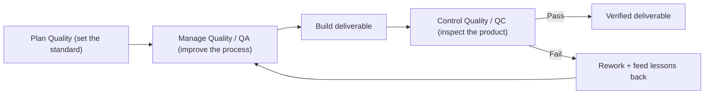
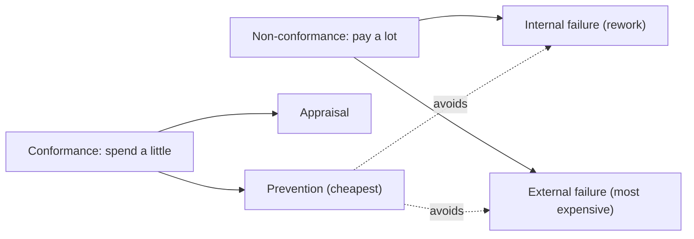
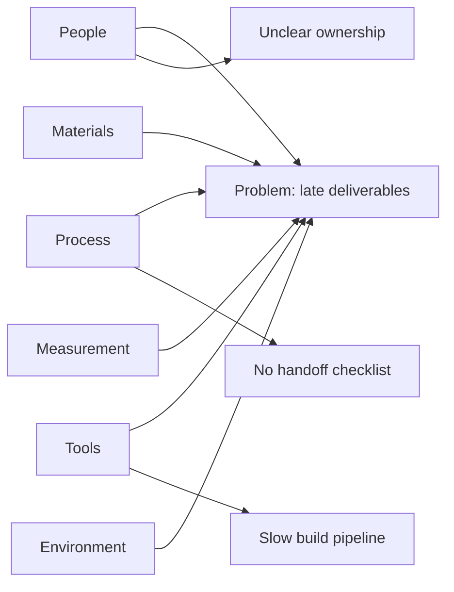
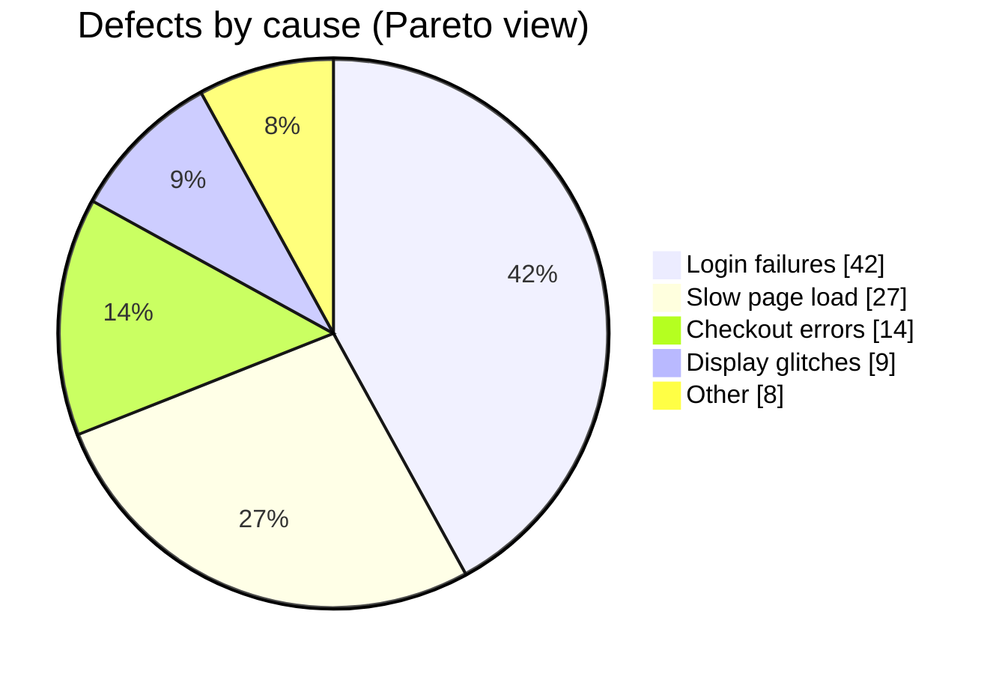
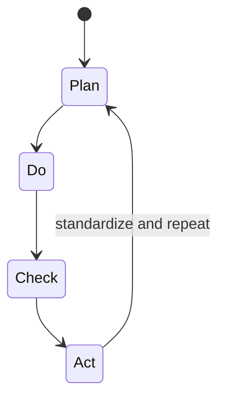

# Module 09 — Quality Management

> **Estimated study time:** ~40 min · **Level:** Intermediate · **Prerequisites:** [Module 06](06-scope-management.md). Part of the **Sales -> Project Management Reviewer**.

## 🎯 What you'll be able to do

- [ ] Tell the difference between **quality** and **grade** — and stop using them as synonyms.
- [ ] Explain how **Quality Assurance (prevention)** differs from **Quality Control (inspection)**.
- [ ] Use the **Cost of Quality** model to argue why spending early saves money later.
- [ ] Pick the right tool from the **seven basic quality tools** for a given problem.
- [ ] Run a **PDCA** loop and describe **Kaizen**, **Lean**, and **Six Sigma** in a sentence each.

## 👋 From your mentor

Here's the good news: you already manage quality every single day. When a deal closes but the customer churns three months later, you know the "deliverable" wasn't actually fit for purpose — the demo promised something the product didn't keep. That gap between *what was promised* and *what was delivered* is the entire field of quality management.

In sales you feel quality through renewals, referrals, and refunds. In project management we make that feeling **measurable and preventable** instead of reactive. This module gives you the vocabulary and the tools so you stop firefighting defects and start designing them out. It connects directly back to the scope and requirements you defined in Module 06 — because quality is just "did we build what we said we'd build, and does it work?"

---

## 1. Quality vs. Grade

These two words get swapped constantly, and mixing them up will burn you on the PMP exam and in real planning conversations.

- **Quality** = the degree to which the deliverable meets **requirements** and is **fit for purpose** and **defect-free**. It's about whether the thing *works as promised*.
- **Grade** = a category assigned to deliverables that have the **same functional use but different technical characteristics** (feature richness, materials, capability tier).

The rule to memorize: **Low quality is always a problem. Low grade may not be.**

| Scenario | Grade | Quality | Acceptable? |
|---|---|---|---|
| Budget laptop, no defects, does what's promised | Low | High | ✅ Yes — fit for purpose |
| Premium laptop that crashes constantly | High | Low | ❌ No — defective |
| Free CRM tier, reliable, limited features | Low | High | ✅ Yes |
| Enterprise CRM, feature-packed, loses data | High | Low | ❌ No |

A simple, reliable economy car is **high quality, low grade** — and that's perfectly fine. A luxury car that won't start is **high grade, low quality** — and that's a failure. As a PM, you deliver the grade the customer **paid for** and the quality they **always deserve**.

> 🔁 **Sales → PM bridge:** Think of the pricing tiers you sell — Bronze, Silver, Gold. Those tiers are **grade**: same product family, different feature sets. A customer who buys Bronze isn't getting "low quality" — they're getting a lower grade that should still work flawlessly. Selling Bronze as if it were Gold is a *grade* mismatch; selling something that's broken is a *quality* failure. Your job is to set grade expectations honestly and never compromise on quality.

---

## 2. The three quality processes

PMI splits quality work into three processes. Knowing which is which — and what each *focuses on* — is the most-tested distinction in this module.

| Process | Process group | Focus | Question it answers |
|---|---|---|---|
| **Plan Quality Management** | Planning | The standard | "What does *good* look like, and how will we know?" |
| **Manage Quality** (QA) | Executing | The **process** — prevention | "Are we *doing the right things* to build it well?" |
| **Control Quality** (QC) | Monitoring & Controlling | The **product** — inspection | "Did this specific deliverable *come out right*?" |

### Plan Quality Management

This is where you decide the **quality standards** for the project and how you'll **demonstrate compliance**. Outputs include the **quality management plan**, **quality metrics** (the actual measurements, e.g. "page load under 2 seconds," "defect rate below 1%"), and a definition of what "acceptable" means. You can't control quality you never defined — plan first.

### Manage Quality = Quality Assurance (QA)

QA is **process-focused** and about **prevention**. You audit your *processes* to make sure they're capable of producing good output. Think audits, process improvement, design reviews, and **building quality into the way you work** so defects never get created in the first place. QA is proactive: "Is our process sound?"

### Control Quality = Quality Control (QC)

QC is **product-focused** and about **inspection**. You examine the *actual deliverables* to catch defects before they reach the customer. Think testing, measuring, peer reviews of finished work, and accept/reject decisions. QC is reactive in the sense that it catches problems after they exist: "Did this unit pass?"

*Plan sets the bar, QA shapes the process that builds it, QC inspects what came out — and failures loop back to improve the process.*

> 🔁 **Sales → PM bridge:** QA is like building a **repeatable sales playbook** — a tested discovery script, a qualification checklist, a demo flow — so *every* rep produces good calls by default. QC is like **listening to a recorded call after the fact** to check if it met the bar. The playbook (QA, prevention) scales; reviewing every single call (QC, inspection) doesn't. Smart teams invest in the playbook.

---

## 3. Cost of Quality (CoQ)

**Cost of Quality** is the total cost of *all* effort related to quality across the product's life — both the money you spend to *get it right* and the money you lose when you *get it wrong*. It splits into two buckets.

### Cost of Conformance (money spent to PREVENT failure)

| Category | What it is | Examples |
|---|---|---|
| **Prevention costs** | Building quality in | Training, documenting processes, good tooling, design reviews |
| **Appraisal costs** | Checking quality | Testing, inspections, audits, code review |

### Cost of Non-Conformance (money lost BECAUSE of failure)

| Category | What it is | Examples |
|---|---|---|
| **Internal failure costs** | Defects found **before** delivery | Rework, scrap, fixing bugs in-house |
| **External failure costs** | Defects found **after** delivery, by the customer | Warranty claims, recalls, refunds, lost business, damaged reputation |

The whole point of CoQ: **prevention is dramatically cheaper than failure**, and the cost of a defect rises the later you catch it. This is sometimes called the "1-10-100 rule" — a defect that costs roughly **$1** to prevent costs about **$10** to fix during inspection and **$100** once it reaches the customer.

*Every dollar spent on the left (conformance) buys down many dollars on the right (failure).*

> 🔁 **Sales → PM bridge:** You already know **external failure cost** in your bones — it's the **churned customer**, the **chargeback**, the **angry one-star review**, the **referral you'll never get**. Spending an hour up front to qualify a deal properly (prevention) is far cheaper than the months you'll burn supporting and then losing a bad-fit account (external failure). CoQ just puts a number on that instinct.

---

## 4. The seven basic quality tools

These seven tools (sometimes called the "7 QC tools") are the classic toolkit for finding and analyzing quality problems. You don't need to be a statistician — you need to know *which tool answers which question*.

| # | Tool | What it does | Use it when you ask... |
|---|---|---|---|
| 1 | **Cause-and-effect (Ishikawa / fishbone)** | Maps possible causes of a problem by category | "*Why* is this happening?" |
| 2 | **Pareto chart** | Bar chart ranking causes by frequency (80/20) | "Which *few* causes drive most defects?" |
| 3 | **Control chart** | Tracks a process over time vs. control limits | "Is the process *stable* / in control?" |
| 4 | **Histogram** | Bar chart of how often values occur (distribution) | "What's the *shape* of my data?" |
| 5 | **Check sheet** | Tally sheet for collecting data as it happens | "How do I *count* defects consistently?" |
| 6 | **Scatter diagram** | Plots two variables to reveal correlation | "Are these two things *related*?" |
| 7 | **Flowchart** | Maps the steps in a process | "*Where* in the process could things go wrong?" |

### Ishikawa / Fishbone — finding root causes

The fishbone diagram pushes you past the first obvious cause into the *categories* of root cause. A common set of category "bones" for manufacturing is the **6 Ms** (Method, Machine, Material, Measurement, Manpower/People, Environment); for services people often use the **4 Ps** (People, Process, Policy, Plant).

*A fishbone view: the spine points at the problem; each "bone" is a category of possible root cause to investigate.*

### Pareto — focus where it counts

The **Pareto principle** says roughly **80% of effects come from 20% of causes**. A Pareto chart ranks defect types from most to least frequent so you fix the vital few instead of scattering effort across the trivial many.

*The top two causes account for ~69% of defects — fix those first for the biggest return.*

> 🔁 **Sales → PM bridge:** Pareto is just your pipeline instinct: a small slice of accounts drives most of your revenue, and a handful of objections kill most of your deals. You already attack the **vital few** rather than spreading yourself thin — that's exactly how a PM prioritizes which defects to chase.

---

## 5. Continuous improvement

Quality isn't a one-time gate; it's a habit of getting a little better each cycle.

### PDCA — the Plan-Do-Check-Act cycle

Also called the **Deming cycle** (or Shewhart cycle), PDCA is the engine of continuous improvement. You run it as a loop, not a line.

| Phase | What you do |
|---|---|
| **Plan** | Identify the problem, set a goal, design a small change |
| **Do** | Run the change on a small scale (a pilot) |
| **Check** | Measure results against the goal — did it work? |
| **Act** | If it worked, standardize it; if not, adjust and loop again |

*PDCA never really "ends" — each Act feeds the next Plan, so improvement compounds.*

### Kaizen, Lean, and Six Sigma

- **Kaizen** — Japanese for "change for good / continuous improvement." A philosophy of **small, incremental, everyone-participates** improvements made constantly, rather than rare big overhauls. PDCA is the mechanism; Kaizen is the mindset.
- **Lean** — focuses on **maximizing value by eliminating waste** (anything the customer wouldn't pay for: waiting, rework, overproduction, unnecessary steps).
- **Six Sigma** — a data-driven method to **reduce defects and variation**, targeting fewer than 3.4 defects per million opportunities, often run with the **DMAIC** cycle (Define, Measure, Analyze, Improve, Control). "Lean Six Sigma" simply combines waste reduction with variation reduction.

> 🔁 **Sales → PM bridge:** Every time you tweak your cold-email opener, measure the reply rate, keep what worked, and try the next variation — you're running **PDCA** and living **Kaizen**. You've been doing continuous improvement on your own funnel for years; project quality management is the same discipline applied to deliverables.

---

## ⏸️ Pause & reflect

This is a natural place to **stop, breathe, and come back later** if you need to — your progress is saved by your own understanding, not by finishing in one sitting.

- Think of a past sale where the customer was unhappy after delivery. Was it a **grade** mismatch (they wanted more features) or a **quality** failure (it didn't work)? Naming it correctly is half the skill.
- Where in *your* current work could a little **prevention** (a checklist, a template, a quick review) save hours of **external failure** later?

No rush. When you're ready, the self-test is below.

---

## 🧠 Check yourself

**1. A reliable economy car with no defects is described how, in quality terms?**

Show answer

**High quality, low grade.** It's fit for purpose and defect-free (high quality) but has fewer features/characteristics than a luxury model (low grade). Low grade is acceptable; low quality is not.

**2. You audit your team's *process* to make sure defects don't get created. QA or QC?**

Show answer

**Quality Assurance (Manage Quality).** It's **process-focused** and about **prevention**. QC, by contrast, **inspects the finished product** to catch defects.

**3. A customer reports a defect after delivery and demands a refund. Which Cost of Quality category?**

Show answer

**External failure cost** — a cost of **non-conformance** discovered *after* the deliverable reached the customer. These are the most expensive defects of all.

**4. Which of the seven tools would you use to find the *root causes* of a recurring problem?**

Show answer

The **cause-and-effect (Ishikawa / fishbone) diagram**, which organizes possible causes by category. To then decide *which* causes to tackle first, you'd pair it with a **Pareto chart**.

**5. What does the "Check" step of PDCA do?**

Show answer

You **measure the results** of the change you piloted in "Do" against the goal you set in "Plan" to see whether it actually worked. Based on that, "Act" either standardizes the change or adjusts and loops again.

**6. In one line, how does Six Sigma differ from Lean?**

Show answer

**Six Sigma** reduces **defects and variation** (data-driven, via DMAIC); **Lean** reduces **waste** to maximize customer value. Combined, they're "Lean Six Sigma."

---

## 🧰 Try it

Pick one recurring problem from your own world — late follow-ups, a report that's always wrong, a demo step that keeps breaking. Then:

1. **Draw a quick fishbone** (on paper is fine). Write the problem at the head. Add 3-4 category bones (People, Process, Tools, Environment) and brainstorm at least one cause under each.
2. **Run one PDCA loop on the biggest cause.** Write a one-sentence *Plan* ("If I add a handoff checklist, fewer items will slip"), describe how you'd *Do* it for a week, what you'd *Check* (how many slipped?), and how you'd *Act* on the result.
3. **Classify the cost.** If this problem reaches the customer, is it internal or external failure? Estimate roughly what one prevention step would cost versus one failure event.

Five minutes of this beats an hour of theory. You've just done real quality management.

---

## 🔑 Key terms

- **Quality** — degree to which a deliverable meets requirements and is fit for purpose and defect-free.
- **Grade** — a category of deliverables with the same use but different technical characteristics (feature richness).
- **Quality Assurance (Manage Quality)** — process-focused, prevention-oriented quality work.
- **Quality Control (Control Quality)** — product-focused, inspection-oriented quality work.
- **Cost of Quality (CoQ)** — total cost of conformance (prevention + appraisal) plus non-conformance (internal + external failure).
- **Prevention cost** — money spent building quality in (training, good process, tooling).
- **Appraisal cost** — money spent checking quality (testing, inspection, audits).
- **Internal / external failure cost** — cost of defects found before / after delivery, respectively.
- **Ishikawa (fishbone)** — cause-and-effect diagram that maps root causes by category.
- **Pareto principle** — ~80% of effects come from ~20% of causes; the "vital few."
- **PDCA** — Plan-Do-Check-Act continuous-improvement cycle (Deming cycle).
- **Kaizen** — philosophy of small, continuous, everyone-involved improvement.
- **Lean** — eliminating waste to maximize customer value.
- **Six Sigma** — data-driven reduction of defects and variation (DMAIC; <3.4 defects/million).

---
⬅️ **Previous:** [Module 08 — Cost & Budget Management](08-cost-and-budget.md) · 🏠 **[Reviewer Home](../README.md)** · ➡️ **Next:** [Module 10 — Resources, Teams & Leadership](10-resources-teams-leadership.md)
