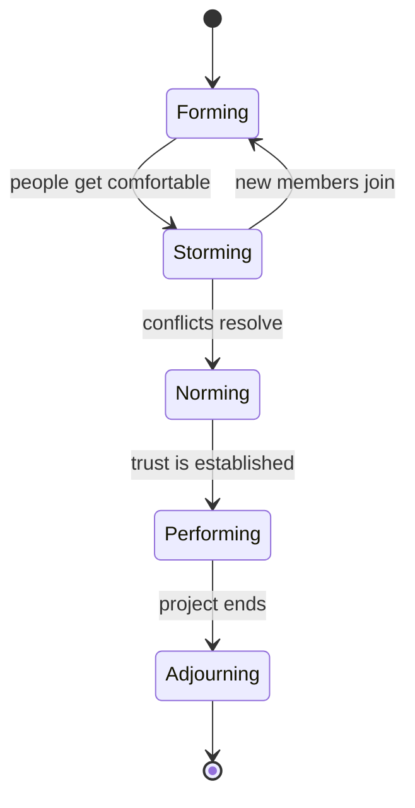
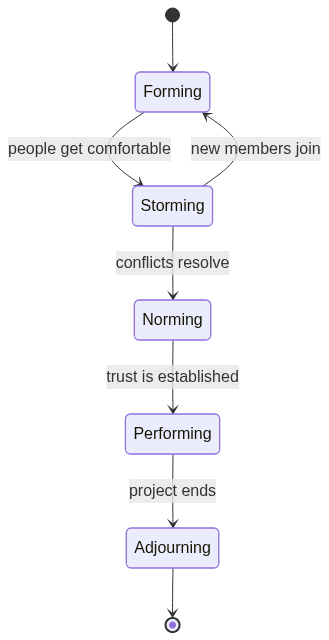
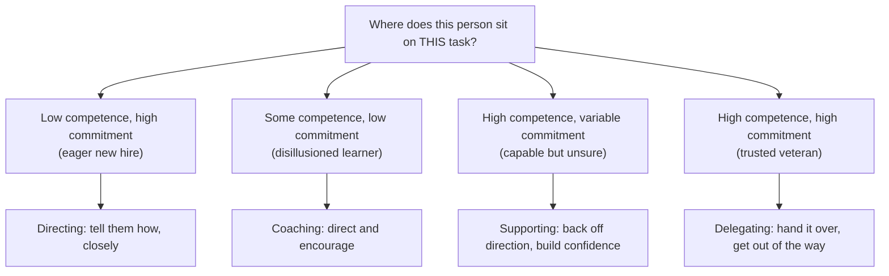
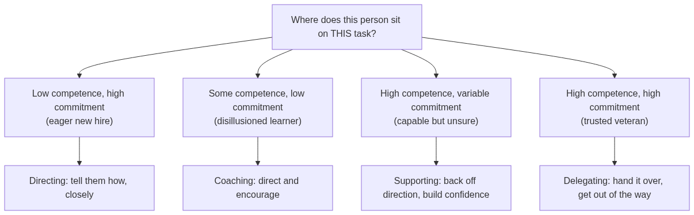
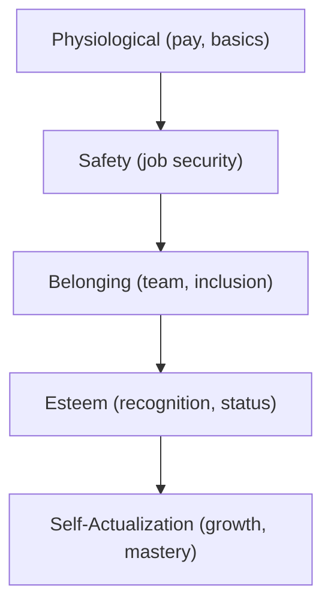
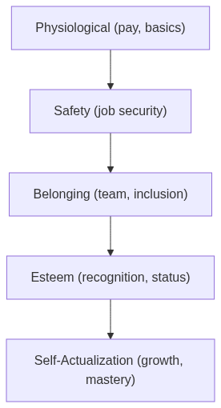
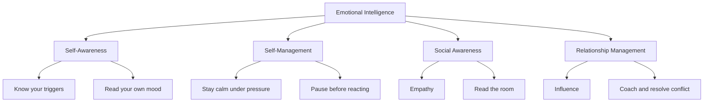
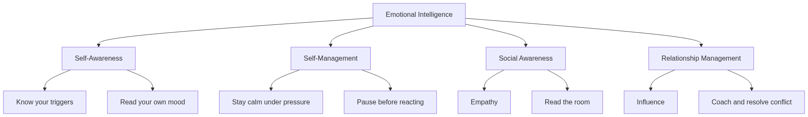
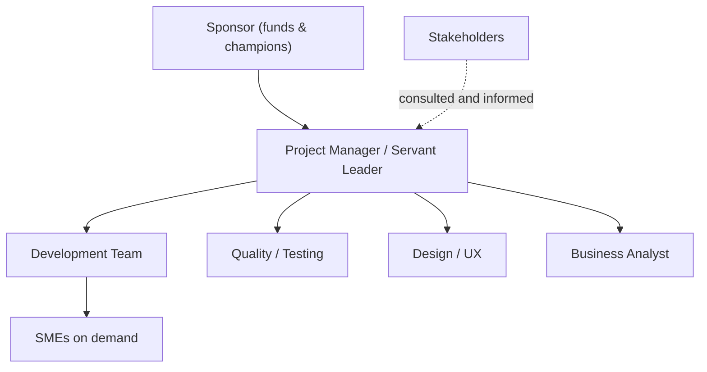
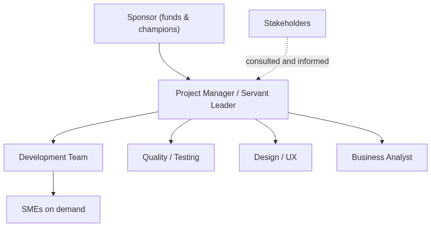

# Module 10 — Resources, Teams & Leadership

> ⏱️ **Estimated study time:** ~45 min · 📈 **Level:** Intermediate · ✅ **Prerequisites:** [Module 03 — Lifecycle & Process Groups](03-lifecycle-and-process-groups.md) · Part of the **Sales → Project Management Reviewer**.

*The module where the project stops being a spreadsheet and becomes a cast of characters — and you, dear reader, are the one who gets them all to play nice.*

## 🎯 What you'll be able to do

- [ ] Acquire, develop, and manage both your **team** and your **physical resources** through a project's life.
- [ ] Build a **RACI matrix** that kills the "I thought *you* were doing that" problem forever.
- [ ] Recognize where your team is in **Tuckman's stages** and adjust what you do at each one.
- [ ] Pick a **leadership style** (especially **servant leadership**) that fits the person and the moment.
- [ ] Use real **motivation theories** — Maslow, Herzberg, McGregor — as practical levers, not trivia.
- [ ] Spot common **sources of conflict** and lead **virtual / distributed** teams with emotional intelligence.

## 👋 From your mentor

Okay, real talk: here's the secret the textbooks bury in chapter twelve. A project doesn't get done by a Gantt chart — it gets done by **people**, and people are messy, motivated, anxious, brilliant, and gloriously human. You already know this. You've spent years reading the room on a discovery call, catching the half-second a prospect hesitated, knowing exactly which teammate to text before the deal slipped.

That instinct? It's the single most transferable thing you own. In sales you choreographed SDRs, AEs, and sales engineers to land a deal nobody could close alone. In project management we just give that a fancier name — **cross-functional team leadership** — and it's the beating heart of this whole module. So let's stop calling it "a hunch" and give your instincts a vocabulary.

---

## 🧱 Resources: people *and* things

In the PMBOK Guide world, **resources** come in two flavors, and a good PM keeps an eye on both:

| Type | Examples | What you do with them |
|------|----------|-----------------------|
| **Team resources** (human) | Developers, designers, analysts, contractors, SMEs | Acquire, develop, motivate, lead, resolve conflict |
| **Physical resources** | Equipment, materials, software licenses, lab time, cloud capacity, office space | Acquire, allocate, track utilization, prevent shortages/spoilage |

The work splits neatly into three verbs you'll meet again and again:

### 1. Acquire

Getting the right resources, in the right amount, at the right time.

- **For people:** negotiate with functional managers for the staff you need (pre-assigned, negotiated, or external hires), confirm availability, and weigh **make-or-buy** (hire vs. contract).
- **For things:** procure equipment and materials so they arrive *just before* you need them — not so early they sit idle, not so late they stall the work.

> Think of acquisition like staffing a deal: you don't drag the solutions engineer onto every cold call, but you'd better have them on the demo. Right person, right moment.

### 2. Develop

Turning a *group of individuals* into an actual *team* — the slow-burn part, where strangers become people who finish each other's sentences.

- **Training** to close skill gaps.
- **Team-building activities** to build trust (this maps directly to Tuckman, just below).
- **Ground rules** — agreed norms for behavior, meetings, and communication.
- **Recognition and rewards** to reinforce the behavior you want.
- **Co-location** ("tight matrix") or strong **virtual tools** when co-location isn't possible.

A useful tell that it's working: **team performance assessments** — are individual skills improving, is turnover dropping, is the team self-correcting without you hovering?

### 3. Manage

The ongoing, day-to-day part: tracking performance, giving feedback, **resolving conflict**, and nudging the team to keep delivering. This is where leadership style and emotional intelligence (later in this module) earn their keep.

> 🔁 **Sales → PM bridge:** Acquiring resources is just **resource negotiation** — the same muscle you flexed haggling for SE hours or marketing-development funds to support a big account. You're trading priorities with another manager who's got their own quota to hit. Lead with *their* interests, not just yours.

---

## 📋 The RACI matrix (responsibility assignment)

Ambiguity is a project killer — the quiet kind, the one that doesn't show up until the deadline and then takes the whole thing down with it. The fastest way to prevent "I assumed *someone* else had it" is a **RACI matrix** — a type of **Responsibility Assignment Matrix (RAM)** that maps *who does what* across every activity.

RACI stands for:

| Letter | Role | Plain English |
|--------|------|---------------|
| **R** — Responsible | Does the work | The person(s) actually performing the task |
| **A** — Accountable | Owns the outcome | The single neck on the line; approves and answers for it |
| **C** — Consulted | Two-way input | SMEs you talk *with* before/while doing it |
| **I** — Informed | One-way update | People you tell *after* it's done |

**Two non-negotiable rules:**

1. **Exactly one `A` per row.** Two accountable people = nobody accountable.
2. **Every row needs at least one `R`.** No `R` means the work has no owner.

### Worked example — launching a customer onboarding portal

| Activity | PM | Dev Lead | Designer | QA | Sponsor |
|----------|:--:|:--------:|:--------:|:--:|:-------:|
| Define requirements | A | C | C | I | C |
| Design UI mockups | I | C | **R/A** | I | I |
| Build the portal | A | **R** | C | I | I |
| Test & sign off quality | I | C | I | **R/A** | I |
| Approve go-live | C | I | I | C | **R/A** |

Read a row left to right and you instantly know the chain of ownership. Read a column top to bottom and you can spot the overloaded one (too many `R`s) or the ghost (all `I`s — do they even need to be on this project?). It's basically a guest list audit, but for accountability.

> 🔁 **Sales → PM bridge:** A RACI is your **deal team map** in disguise. On a complex sale you knew the AE *owned* the number (Accountable), the SE *ran* the demo (Responsible), legal got *consulted* on terms, and your VP just wanted to be *informed* at each stage. Same matrix, different game.

---

## 🌱 Tuckman's stages of team development

Here's a plot twist no one warns the new PM about: teams don't show up "performing." Psychologist Bruce **Tuckman** mapped five predictable stages every team moves through — and knowing where you are tells you exactly what to do next.

*The team lifecycle — and notice teams can slip back a stage when membership or scope changes.*

<!-- mobile-diagram:10-resources-teams-leadership-1 -->

🖼️ View as image (for the GitHub mobile app)

<!-- /mobile-diagram -->

| Stage | What it feels like | What the PM does |
|-------|--------------------|------------------|
| **Forming** | Polite, cautious, unsure of roles | Provide clear direction, set goals, introduce people, establish ground rules |
| **Storming** | Friction, power struggles, pushback | Stay calm, mediate conflict, keep the vision front-and-center, don't avoid it |
| **Norming** | Trust forms, norms settle, collaboration starts | Step back, coach, reinforce healthy behavior |
| **Performing** | High output, self-organizing, low drama | Delegate, remove blockers, protect the team from outside noise |
| **Adjourning** | Wind-down, mixed emotions, release | Celebrate, capture lessons learned, recognize people, help them transition |

The mindset shift that separates rookies from real PMs: **Storming is normal and necessary** — it's not a sign you failed. A team that never storms is usually a team quietly dodging the hard conversations (and trust me, those conversations always come due eventually). Your job isn't to prevent the storm; it's to walk them *through* it.

> 🔁 **Sales → PM bridge:** Remember onboarding a new sales pod — the stiff, polite first week (Forming), the turf war over accounts (Storming), the moment it finally clicked and people started covering for each other (Performing)? You've already led people through Tuckman. You just didn't have the word for it.

---

## 🧭 Leadership styles

There's no single "best" leadership style — there's the style that fits **this person, this task, this moment**. But for modern project work, especially Agile, one style is the clear leading lady.

### Servant leadership (the headline act)

A **servant leader** flips the org chart on its head. Instead of "the team works for me," it's **"I work for the team."** Your job is to **remove impediments**, shield the team from distractions, grow their skills, and quietly build the conditions for them to do their best work.

The Scrum Master role (2020 Scrum Guide) is described explicitly as a servant leader / "true leader who serves." Core servant-leadership behaviors:

- **Listen** first, prescribe second.
- **Coach** rather than command.
- **Remove blockers** so the team keeps flowing.
- **Build trust** and psychological safety.
- **Grow people** — measure your success by their growth, not your visibility.

### Situational leadership (the dial you turn)

**Situational leadership** says: adapt your style to the **competence and commitment** of the person on a given task. New person on an unfamiliar task? Stay close and direct. Seasoned pro who's done it a hundred times? Delegate and get out of the way.

*Match your style to where each person sits — directing, coaching, supporting, or delegating as their competence and commitment shift.*

<!-- mobile-diagram:10-resources-teams-leadership-2 -->

🖼️ View as image (for the GitHub mobile app)

<!-- /mobile-diagram -->

### Other styles worth knowing

| Style | One-liner | Good for |
|-------|-----------|----------|
| **Directive / Autocratic** | "Do this." | Crises, safety issues, no time to debate |
| **Transactional** | Rewards/penalties for results | Clear, repeatable, measurable work |
| **Transformational** | Inspire toward a vision | Change, innovation, motivating through purpose |
| **Laissez-faire** | Hands-off, team self-directs | Highly skilled, self-organizing teams |
| **Servant** | "How can I help you succeed?" | Agile teams, knowledge work, most projects |

> 🔁 **Sales → PM bridge:** The best sales managers you ever had weren't the ones barking quotas across the floor — they were the ones who **unblocked** you: got the discount approved, cleared the bureaucratic hurdle, talked you off the ledge before a tough call. That's servant leadership, and you *felt* the difference. Now go be that for your team.

---

## 🔥 Motivation theories, made practical

Theory only matters if it changes what you actually *do* on Monday morning. So here are the three classics, each with the practical move attached.

### Maslow's Hierarchy of Needs

People are motivated by the lowest **unmet** need. You cannot inspire someone with a grand vision while they're lying awake worried about job security — the pep talk just bounces off.

*Climb only happens from the bottom up — meet the lower need before reaching for the higher one.*

<!-- mobile-diagram:10-resources-teams-leadership-3 -->

🖼️ View as image (for the GitHub mobile app)

<!-- /mobile-diagram -->

**Practical move:** If a teammate seems checked out, play detective — ask *which level is unmet*. Fear of layoffs (Safety)? Feeling excluded (Belonging)? No recognition (Esteem)? Treat the actual gap, not the symptom.

### Herzberg's Two-Factor Theory

Herzberg split work factors into two groups that do **completely different jobs**:

| **Hygiene factors** (prevent dissatisfaction) | **Motivators** (create satisfaction) |
|-----------------------------------------------|--------------------------------------|
| Salary, benefits | Achievement |
| Job security | Recognition |
| Working conditions | The work itself |
| Company policy, supervision | Responsibility |
| Relationships with peers | Advancement & growth |

**The key insight:** Fixing hygiene factors only gets you to *neutral* — a fair salary stops people from being unhappy, but it doesn't make them *driven*. Real motivation lives in the right-hand column. **You can't pay someone into engagement; you grow them into it.**

### McGregor's Theory X and Theory Y

Two opposite assumptions a manager can carry about people:

- **Theory X:** People are lazy, avoid work, and must be controlled and closely supervised.
- **Theory Y:** People are self-motivated, seek responsibility, and do their best work when trusted.

**Practical move:** How you *assume* people behave shapes how you manage them — and then quietly becomes self-fulfilling. Lead with **Theory Y** (trust by default) and the servant-leadership behaviors show up almost on their own. Micromanage on Theory X and you'll manufacture the very disengagement you were scared of.

> 🔁 **Sales → PM bridge:** Commission is a **hygiene-flavored motivator** — necessary, sure, but you knew the reps who truly lit up weren't chasing the check alone. They wanted the top of the leaderboard (Esteem) and to close the deal everyone swore was unwinnable (Achievement). Same psychology — just point it at delivery instead of quota.

---

## ⏸️ Pause & reflect

This is a natural breakpoint — a genuinely safe place to close the laptop, stretch your legs, and come back later. Your brain consolidates this stuff far better with a break than by white-knuckling through.

Before you wander off, sit with one or two of these:

- Think of a team you were on that **stormed**. Looking back, what would a servant leader have done to move you through it faster?
- Which **motivation level** (Maslow) or **factor** (Herzberg) is most unmet for *you* right now in this career change? Naming it out loud helps more than you'd think.
- Were the best managers you've had **Theory X or Theory Y**? How did it actually *feel* to be on the receiving end?

No rush. The next section will be right here when you are.

---

## 🤝 Conflict, virtual teams & emotional intelligence

### Sources of conflict

Conflict is inevitable — and, plot twist, not always a bad thing. Research on project teams points to common root causes, usually ranked roughly like this:

1. **Schedules** — competing deadlines, who goes first.
2. **Project priorities** — disagreement on what matters most.
3. **Resources** — who gets the scarce person, budget, or equipment.
4. **Technical opinions** — how to build it.
5. **Administrative procedures** — process and reporting friction.
6. **Cost** — budget disputes.
7. **Personality** — usually *last*, despite feeling first.

Here's the twist most people get backwards: **personality conflict is the *least* common source.** Most "people problems" are really *structural* problems — unclear priorities, scarce resources — wearing a personality mask. Fix the structure and the so-called clash often quietly evaporates.

**Five ways to handle conflict** (worth knowing by name):

| Approach | When it fits |
|----------|--------------|
| **Collaborate / Problem-solve** | Best long-term — find a win-win (the default to aim for) |
| **Compromise** | Both give something; quick but no one fully wins |
| **Smooth / Accommodate** | Emphasize agreement; preserve the relationship |
| **Force / Direct** | Win-lose; only for emergencies or when you must |
| **Withdraw / Avoid** | Retreat; sometimes buys cooling-off time, but it doesn't resolve |

### Leading virtual / distributed teams

Distributed teams gain talent and flexibility but lose the hallway — the casual run-in where half the misunderstandings used to dissolve. Your job is to **rebuild the missing context** on purpose:

- **Over-communicate** and write things down — async clarity beats real-time ambiguity.
- Establish **ground rules** for response times, core overlap hours, and which channel is for what.
- Be deliberate about **inclusion** across time zones — rotate meeting times so it's not always the same region dialing in at midnight.
- Invest extra in **trust and belonging** (Maslow's middle); it doesn't form by accident through a screen.
- Use the right tools and watch for the quiet voices who get steamrolled in video calls.

### Emotional intelligence (EQ)

**Emotional intelligence** is your ability to perceive, understand, and manage emotions — yours and everyone else's. It's the connective tissue running under everything in this module. The classic four domains:

*The four EQ domains — start with self-awareness; the rest builds on it.*

<!-- mobile-diagram:10-resources-teams-leadership-4 -->

🖼️ View as image (for the GitHub mobile app)

<!-- /mobile-diagram -->

> 🔁 **Sales → PM bridge:** Reading the room is **social awareness**. Staying composed when a prospect went ice-cold is **self-management**. Knowing when to push and when to just listen is **relationship management**. You've been training your EQ on every single call for years — honestly, it might already be your strongest PM asset.

---

## 🏗️ How the team fits together

A quick mental model of a typical cross-functional project team and who reports where:

*A simple cross-functional team — solid lines are reporting flow; the dotted line is influence, not authority.*

<!-- mobile-diagram:10-resources-teams-leadership-5 -->

🖼️ View as image (for the GitHub mobile app)

<!-- /mobile-diagram -->

In a **matrix organization** (very common), team members report to *both* you and their functional manager — which is exactly why your negotiation and influence skills matter so much. You'll often lead people you don't formally own. Welcome to project management; sound familiar from herding a deal team across three departments who all answered to someone else?

---

## 🧠 Check yourself

**1. In a RACI matrix, how many people can be Accountable for a single activity?**

Show answer

Exactly **one**. There can be multiple Responsible people, but only a single Accountable owner per row — otherwise accountability dissolves.

**2. Your team is full of friction, pushback, and turf battles. Which Tuckman stage is this, and what should you do?**

Show answer

**Storming.** Don't avoid it — mediate the conflict, keep the shared goal visible, and help the team work *through* the friction toward Norming. Storming is normal and necessary, not a failure.

**3. According to Herzberg, will giving everyone a raise make them motivated?**

Show answer

No. Salary is a **hygiene factor** — it prevents dissatisfaction but doesn't create motivation. Real motivation comes from **motivators**: achievement, recognition, responsibility, growth, and the work itself.

**4. What is the defining mindset of a servant leader?**

Show answer

"**I work for the team.**" The leader's job is to remove impediments, coach, build trust, and grow people so they can do their best work — flipping the traditional top-down org chart.

**5. Research shows which is the *least* common source of project conflict — and why does that matter?**

Show answer

**Personality.** It matters because most apparent "personality clashes" are really structural problems — unclear priorities, schedule pressure, or scarce resources. Fix the structure first.

**6. A teammate is highly skilled at a task but suddenly hesitant and unsure. Per situational leadership, what style fits?**

Show answer

A **supporting** style — high on relationship support, lower on task direction. They already have the competence; they need encouragement and confidence, not direction or micromanagement.

---

## 🧰 Try it

**Build a RACI for something you already know cold.** Pick a small, real cross-functional effort — onboarding a new hire, launching a webinar, or shipping a feature.

1. List **4–6 activities** down the left column.
2. List the **people / roles** across the top.
3. Fill each cell with **R, A, C, or I**.
4. Now audit it like a suspicious detective: Does **every row have exactly one A**? Does every row have at least one **R**? Is anyone all **I** (do they belong here)? Is anyone drowning in **R**s?

Then do the exact same exercise *retroactively* for a past sales deal you closed. You'll catch yourself realizing you've been building RACIs in your head for years — you just never wrote them down. That's the whole leap this module is asking you to make: take the instinct, and make it explicit.

---

## 🔑 Key terms

- **Resource** — Anything needed to do the work; **team** (human) or **physical** (equipment, materials, software).
- **RACI matrix** — A responsibility assignment matrix mapping who is **R**esponsible, **A**ccountable, **C**onsulted, and **I**nformed for each activity.
- **Tuckman's stages** — Forming, Storming, Norming, Performing, Adjourning — the predictable phases of team development.
- **Servant leadership** — Leading by serving the team: removing blockers, coaching, and growing people; "I work for the team."
- **Situational leadership** — Adapting leadership style to each person's competence and commitment for a given task.
- **Maslow's hierarchy** — Needs from physiological up to self-actualization; the lowest unmet need motivates.
- **Herzberg's two-factor theory** — **Hygiene** factors prevent dissatisfaction; **motivators** create real satisfaction.
- **Theory X / Theory Y** — McGregor's opposing assumptions: people need control (X) vs. people are self-motivated and trustworthy (Y).
- **Emotional intelligence (EQ)** — Perceiving and managing emotions, yours and others'; self-awareness, self-management, social awareness, relationship management.
- **Matrix organization** — A structure where team members report to both a functional manager and the project manager.

---

Next stop: you've learned to *lead* the people — but a team that can't hear you can't follow you. Module 11 is where you turn all this human insight into a communication plan that actually lands. Turn the page.

⬅️ **Previous:** [Module 09 — Quality Management](09-quality-management.md) · 🏠 **[Reviewer Home](../README.md)** · ➡️ **Next:** [Module 11 — Communication Management](11-communication-management.md)
