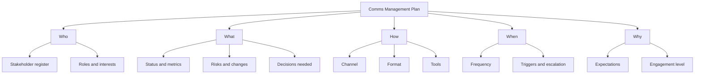
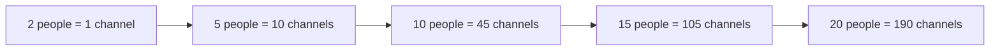
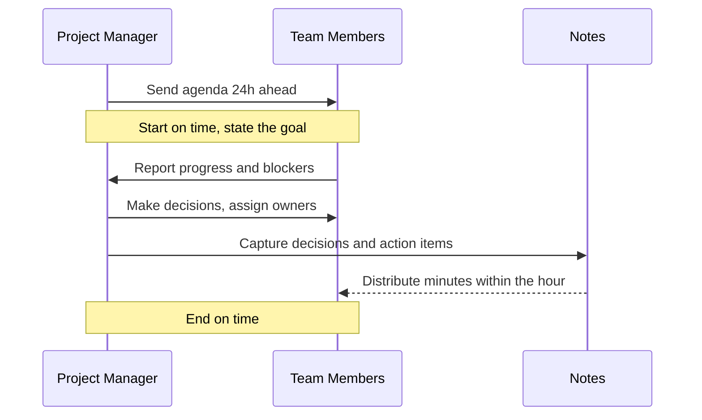
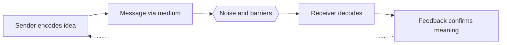

# Module 11 — Communication Management

> ⏱️ **Estimated study time:** ~40 min · 🎚️ **Level:** Intermediate · 📋 **Prerequisites:** Module 10 · Part of the **Sales -> Project Management Reviewer**.

## 🎯 What you'll be able to do

- [ ] Explain why communication is most of the PM job — and why your sales background gives you a head start.
- [ ] Draft a **communications management plan** that says who needs what, in what format, how often, and through which channel.
- [ ] Use the **communication channels formula** `n(n-1)/2` to predict how coordination cost explodes as a team grows.
- [ ] Choose the right **communication method** (interactive / push / pull) and register (formal vs informal, verbal vs written) for a given situation.
- [ ] Run a meeting that produces decisions and action items instead of wasting an hour.
- [ ] Apply **active listening**, structured feedback, and the **sender–receiver model** to cut through noise and barriers.

## 👋 From your mentor

Here's a secret that took me years to believe: the best PMs I know aren't the best at Gantt charts. They're the best at getting the right information to the right person at the right moment so nobody is surprised. Studies and PMI both put it at roughly **80–90% of your day spent communicating** — talking, writing, listening, clarifying.

And you? You've already spent years doing the hardest version of this. Every discovery call where you read between the lines, every proposal you tailored to a skeptical buyer, every "let me make sure I understand what you need" — that *is* project communication. This module just gives the muscle you already have a project manager's vocabulary. Let's go.

## 🧭 Why communication is the job (and your superpower)

In sales, communication *was* the product. You didn't ship code or pour concrete — you moved information and trust between people until a deal closed. Project management is the same shape, just with more stakeholders and a longer timeline.

When a project fails, the post-mortem almost never says "the math was wrong." It says things like: *"Engineering didn't know the deadline moved."* *"The sponsor thought we were on track."* *"Nobody told the client the scope changed."* Those are all communication failures, not technical ones.

So when you feel anxious about not having a formal PM background — remember that the skill that breaks or saves most projects is the one you've been sharpening for years.

> 🔁 **Sales → PM bridge:** A blown deal because "I thought you said next quarter" is the exact same failure as a blown sprint because "I thought the API was your team's job." You already know that ambiguity costs money. PM just makes managing that ambiguity an explicit, planned activity.

## 📋 The communications management plan

The **communications management plan** is a component of the overall project management plan. It is your answer, written down in advance, to a deceptively simple question: *who needs what information, in what format, how often, and through which channel?*

Think of it as the **account plan** you'd build for a big enterprise deal — except instead of mapping the buying committee, you're mapping everyone who touches the project. You build it on top of your **stakeholder register** (the list of people with an interest in the project; covered more in stakeholder content), because you can't plan communication until you know who you're communicating with.

A practical plan answers these columns:

| Stakeholder | Information they need | Format | Frequency | Channel | Owner |
|---|---|---|---|---|---|
| Executive sponsor | RAG status, budget vs. plan, top risks | 1-page dashboard | Weekly | Email + monthly steering call | PM |
| Client / customer | Milestones, demos, change requests | Demo + summary email | Per milestone | Video call | PM |
| Dev team | Tasks, blockers, priorities | Backlog + standup | Daily | Standup + board | Scrum Master |
| Functional managers | Resource needs, schedule shifts | Short note | As needed | Chat / email | PM |
| Regulators / legal | Compliance evidence | Formal report | Per regulation | Written, signed | PMO |

Notice how the **format and frequency change with the audience**. Your sponsor wants one page once a week — drown them in detail and they'll stop reading. Your dev team wants the opposite: granular, frequent, and conversational. Matching the message to the receiver is the whole game.

A good plan also captures:

- **Why** the communication happens (the stakeholder's interest/expectation).
- **Escalation paths** — who gets pulled in when something goes red.
- **Glossary / language** — acronyms and terms so "MVP" or "UAT" mean the same thing to everyone.
- **Constraints** — time zones, confidentiality, accessibility, preferred tools.

*A communications management plan answers who, what, how, when, and why for every stakeholder.*

## 🔢 The communication channels formula

Here's a formula PMI loves and the PMP exam loves more. The number of potential **communication channels** in a team is:

> **n(n − 1) / 2**, where **n** is the number of people.

A "channel" is just a possible line of communication between two people. The point of the formula isn't the arithmetic — it's the shape of the curve. Channels grow **quadratically**, not linearly. Add a few people and coordination cost explodes.

Worked example: your team grows over time.

| People (n) | Channels n(n−1)/2 | What it feels like |
|---|---|---|
| 2 | 1 | A quick chat |
| 3 | 3 | Easy, everyone in the loop |
| 5 | 10 | Manageable with a standup |
| 6 | 15 | Some things start slipping |
| 10 | 45 | You need a real plan |
| 15 | 105 | Chaos without structure |
| 20 | 190 | Subteams or it collapses |

Watch the jump: going from **5 people to 6** adds one person but **five new channels** (10 → 15). Going from 10 to 20 doesn't double the channels — it more than *quadruples* them (45 → 190).

This is exactly why growing projects need a **communications plan, defined roles, and a single source of truth**. The formula is the mathematical proof that "we'll just keep everyone in the loop informally" stops working fast.

*Each added person multiplies the lines of communication — coordination cost grows quadratically, not linearly.*

> 💡 **Exam tip:** If you're asked for *added* channels when a team grows from, say, 4 to 6, compute both and subtract: 6(5)/2 − 4(3)/2 = 15 − 6 = **9 new channels**.

## 📡 Communication methods, registers & channels

PMI groups communication methods into three buckets. Knowing which to reach for is half of communicating well.

| Method | What it is | Best for | Sales analogy |
|---|---|---|---|
| **Interactive** | Real-time, multi-directional exchange | Meetings, calls, standups, brainstorming | A live discovery call |
| **Push** | Sent *to* specific people, no guarantee they read or act | Email, memos, status reports, voicemail | A follow-up email after the demo |
| **Pull** | Recipients access it themselves on demand | Wikis, shared dashboards, intranet, knowledge base | A self-serve pricing page or portal |

The trap beginners fall into: treating **push as if it were interactive**. Sending an email does *not* mean the message landed. **Interactive** is the only method that confirms understanding in the moment — so use it for anything sensitive, ambiguous, or contested.

Two more dimensions matter:

- **Formal vs. informal.** Formal = reports, presentations, contracts, the signed change request. Informal = the hallway chat, the quick Slack ping, the coffee catch-up. *Both* are essential. Formal creates the record; informal builds the relationships that make the formal stuff go smoothly. (Sound familiar? It's golf-course relationship-building plus the signed contract.)
- **Verbal vs. written.** Verbal is fast and rich with tone; written is precise and durable. Rule of thumb: **discuss verbally, decide in writing.** A decision that isn't written down didn't happen.

| | Verbal | Written |
|---|---|---|
| **Formal** | Steering committee briefing, formal presentation | Project charter, status report, signed change request |
| **Informal** | Hallway chat, quick call, standup aside | Slack message, quick email, sticky note |

## 🗣️ Running meetings that don't waste time

Meetings are your most expensive communication method — multiply everyone's hourly cost by the duration and you'll never call a pointless one again. Make every meeting earn its seat.

A meeting that doesn't waste time has five parts:

1. **A purpose & agenda sent in advance.** No agenda, no meeting. The agenda tells people what to prepare and lets them decline if they're not needed.
2. **The right people only.** Every extra attendee is another channel (remember the formula). Invite deciders and contributors; send notes to the rest.
3. **A timebox.** Start on time, end on time. Assign rough minutes per agenda item and protect them.
4. **Decisions captured.** What did we *decide*? Write it down live so there's no "wait, what did we agree?" later.
5. **Action items with an owner and a due date.** "Someone should look into that" is not an action item. *"Maria sends the revised estimate by Thursday"* is.

After the meeting, send **minutes** that lead with **Decisions** and **Action Items** (owner + date), then supporting detail. Most readers only need the top.

### Effective status reporting

Status reports are **push** communication, so make them skimmable. A reliable structure:

- **RAG status** — Red / Amber / Green, the universal at-a-glance health signal.
- **Progress** — what got done since last report (against plan).
- **Plan** — what's next.
- **Risks & issues** — top items, with owners.
- **Asks** — decisions or help you need from the reader.

Tailor depth to the audience: the sponsor gets the one-pager, the team gets the detail. And never let a report be the *first* time someone hears bad news — escalate red items in real time, then confirm in the report. **No surprises** is the reputation you want.

*A clean status meeting: agenda first, decisions and owners captured live, minutes out fast.*

## 👂 The sender–receiver model, noise & barriers

Communication theory gives us a simple, powerful model. The **sender** has an idea, **encodes** it (into words, a chart, a tone), transmits it through a **medium**, and the **receiver** **decodes** it back into meaning — then sends **feedback** to confirm. The loop only closes when feedback tells the sender the message landed as intended.

What wrecks the loop is **noise** — anything that distorts the message between sender and receiver:

- **Physical noise:** a bad connection, a noisy room, a cluttered email.
- **Semantic noise:** jargon, acronyms, ambiguous words ("soon," "done," "MVP").
- **Psychological noise:** stress, mistrust, defensiveness, distraction.
- **Cultural / language barriers:** time zones, idioms, different norms.

*The sender–receiver model: meaning only transfers when feedback confirms it survived the noise.*

The PM's job is to **reduce noise and force the feedback loop**. Confirm understanding ("so to play it back, you need X by Friday — right?"), avoid unexplained jargon, pick a quiet enough channel, and never assume "sent" equals "understood."

### Active listening

Active listening is feedback you give *to* the sender so they know they've been heard. It's the single highest-leverage communication skill, and it's the same thing that made you good at discovery calls.

- **Pay attention** — put the phone down, face the speaker.
- **Show you're listening** — nod, brief verbal cues, eye contact.
- **Paraphrase / play back** — "What I'm hearing is…" — this *closes the feedback loop*.
- **Defer judgment** — don't interrupt to argue; let them finish.
- **Ask clarifying questions** — surface the real need behind the stated one.

### Giving and receiving feedback

Good feedback is specific, timely, and about behavior — not character. A clean structure: **Situation → Behavior → Impact** ("In yesterday's client call *(situation)*, when the budget question came up you deferred it *(behavior)*, and the client left unsure if we can deliver *(impact)*"). When *receiving* feedback, do the same thing you did in tough sales conversations: listen fully, thank them, ask questions, and resist the urge to defend.

> 🔁 **Sales → PM bridge:** Tailoring your pitch to each buyer persona — speaking ROI to the CFO, ease-of-use to the end user, risk-reduction to the IT lead — *is* stakeholder-tailored communication planning. The communications management plan is just that instinct written down: same project, different message, different channel, different cadence per audience. You've been building comms plans in your head for years.

## ⏸️ Pause & reflect

This is a great place to take a breath and come back later if you need to — the next sections will be waiting, and nothing here expires.

- Think of the worst miscommunication from your sales career. Which **noise** type caused it — physical, semantic, or psychological — and what feedback loop would have caught it?
- For a project (or even a household plan) you care about right now, who are your top **3 stakeholders**, and does each one need a different format, frequency, or channel?
- Recall a meeting that wasted your time. Which of the **five meeting ingredients** was missing?

## 🧠 Check yourself

**1. A project team grows from 6 people to 8. How many *new* communication channels are created?**

Show answer

8(8−1)/2 = **28** channels; 6(6−1)/2 = **15** channels. New channels = 28 − 15 = **13**. (Two people added, thirteen new lines of communication.)

**2. You need to confirm a customer agrees to a scope change *and* you need a durable record. Which method(s) do you use, and why?**

Show answer

Use **interactive** (a call/meeting) to confirm agreement and understanding in real time, then **push** a **written** summary or formal change request for the durable record. "Discuss verbally, decide in writing." Push alone wouldn't confirm understanding; verbal alone wouldn't create the record.

**3. What's the difference between push and pull communication? Give one example of each.**

Show answer

**Push** is sent *to* recipients with no guarantee they read it (email, status report, memo). **Pull** is information recipients retrieve themselves on demand (wiki, shared dashboard, knowledge base). Neither confirms understanding — only **interactive** does.

**4. In the sender–receiver model, what closes the communication loop, and what threatens it?**

Show answer

**Feedback** from the receiver closes the loop (it confirms the message was decoded as intended). **Noise** — physical, semantic, psychological, or cultural — threatens it by distorting the message in transit.

**5. Your executive sponsor and your dev team both need a "status update." Should they get the same one? Why or why not?**

Show answer

No. Tailor to the audience. The **sponsor** wants a brief, high-level view (RAG status, budget, top risks) on a weekly cadence. The **team** wants granular, frequent, conversational detail (tasks, blockers) daily. Matching format, depth, and frequency to the receiver is the core of the communications plan.

**6. Name three things a meeting needs to avoid wasting everyone's time.**

Show answer

Any three of: an **agenda sent in advance**, the **right people only**, a **timebox** (start/end on time), **decisions captured**, and **action items with an owner and due date**. Bonus: minutes distributed quickly afterward.

## 🧰 Try it

**Build a mini communications plan (15 minutes).**

Pick any real effort — a side project, a move, organizing an event, or a work initiative. Then:

1. List **5 stakeholders** (people with an interest in the outcome).
2. For each, fill one row of this table:

   | Stakeholder | What they need | Format | Frequency | Channel | Method (interactive / push / pull) |
   |---|---|---|---|---|---|

3. Circle the rows where you wrote "**email**" or "**push**" for something **sensitive or ambiguous** — and rewrite at least one to be **interactive** instead.
4. Count your stakeholders, add yourself, and compute the **channels** with `n(n−1)/2`. Were you underestimating how much coordination this takes?

Keep the table — it's the seed of a real artifact you'll produce on day one of a PM role.

## 🔑 Key terms

- **Communications management plan** — Component of the project management plan defining who needs what information, in what format, how often, and through which channel.
- **Communication channels** — The potential lines of communication in a group; counted with `n(n−1)/2`.
- **Interactive communication** — Real-time, multi-directional exchange (meetings, calls); the only method that confirms understanding live.
- **Push communication** — Information sent *to* recipients with no guarantee of receipt or action (email, reports, memos).
- **Pull communication** — Information recipients retrieve themselves on demand (wikis, dashboards, knowledge bases).
- **Sender–receiver model** — Communication as encode → transmit → decode → feedback; meaning transfers only when feedback confirms it.
- **Noise** — Anything (physical, semantic, psychological, cultural) that distorts a message between sender and receiver.
- **Active listening** — Fully concentrating on the speaker and playing back what you heard to close the feedback loop.
- **RAG status** — Red / Amber / Green health indicator for at-a-glance project status reporting.
- **Action item** — A specific task with a single owner and a due date, captured from a meeting.
- **Stakeholder register** — The catalog of people and groups with an interest in the project; the input to the communications plan.

---
⬅️ **Previous:** [Module 10 — Resources, Teams & Leadership](10-resources-teams-leadership.md) · 🏠 **[Reviewer Home](../README.md)** · ➡️ **Next:** [Module 12 — Risk Management](12-risk-management.md)
