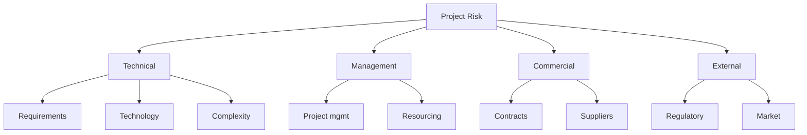
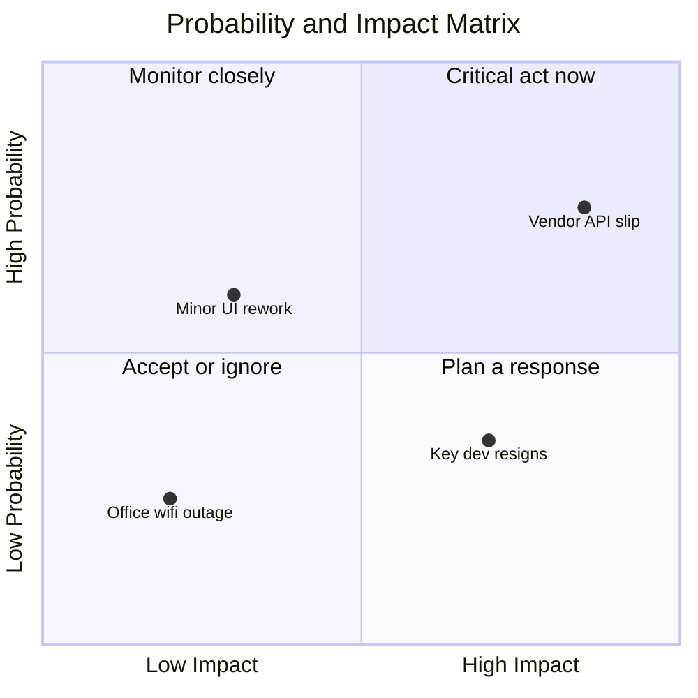
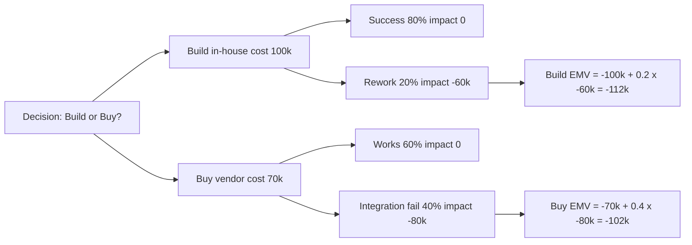
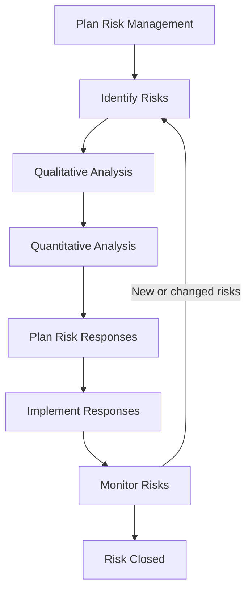
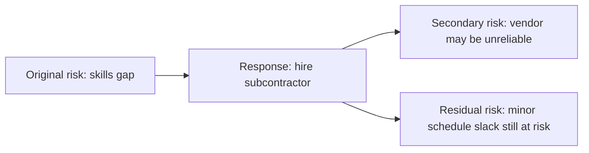

# Module 12 — Risk Management

> **Estimated study time:** ~50 min · **Level:** Intermediate · **Prerequisites:** [Module 06](06-scope-management.md) · Part of the **Sales -> Project Management Reviewer**.

## 🎯 What you'll be able to do

- [ ] Tell the difference between a **risk** (uncertain, future) and an **issue** (real, now), and explain why risks can be *good* news too.
- [ ] Build a **risk register** and organize categories with a **Risk Breakdown Structure (RBS)**.
- [ ] Identify risks using brainstorming, SWOT, checklists, expert judgment, and assumptions analysis.
- [ ] Prioritize risks with a **probability-and-impact matrix** (qualitative) and quantify them with **EMV** and **decision trees**.
- [ ] Choose the right **response strategy** for threats and opportunities, and explain contingency vs management reserves.

## 👋 From your mentor

Here's a secret: you've been managing risk your entire sales career. Every time you flagged a deal that *felt* shaky, lined up a backup contact in case your champion left, or padded your forecast because Q4 procurement always drags — that was risk management. You just didn't call it that.

In project management we make that instinct **explicit and repeatable**. We write risks down, score them, assign owners, and decide *in advance* what we'll do if they hit. Anxiety about the unknown shrinks fast once the unknowns are on a list with a plan beside each one. Let's give your gut a framework.

## Risk vs. issue — and why "risk" isn't a dirty word

Two words people mix up constantly. Get this right and you'll already sound like a PM.

- A **risk** is an **uncertain event or condition** that, *if it occurs*, has an effect on a project objective. It hasn't happened yet. It might never happen. Key word: **uncertainty**.
- An **issue** is something that **is happening right now** (or already happened). There's no uncertainty left — it's real and it needs action today.

A risk that occurs *becomes* an issue. Think of risk as the storm cloud on the horizon and the issue as the rain on your head.

| | Risk | Issue |
|---|---|---|
| Timing | Future, may or may not happen | Now / already occurred |
| Certainty | Uncertain (has a probability) | Certain (100% — it's real) |
| Tracked in | Risk register | Issue log |
| Question it answers | "What *could* go wrong (or right)?" | "What *has* gone wrong — fix it" |
| Example | "The vendor *might* miss the API deadline" | "The vendor *missed* the API deadline" |

### Threats vs. opportunities — risk goes both ways

Here's the part beginners always miss: **a risk can be positive.** PMI splits risks into two flavors:

- **Threat** — a risk with a *negative* effect on objectives (the cloud).
- **Opportunity** — a risk with a *positive* effect (a tailwind you could catch).

Example opportunity: "If the new framework ships next month, we *could* cut our build effort by 20%." That's uncertain and future — a real risk — but you'd *want* it to happen. Good PMs hunt for opportunities as deliberately as they hunt for threats.

> 🔁 **Sales → PM bridge:** When you qualify a deal, you assess the **risk of it slipping** — no budget signed, champion going quiet, a competitor circling — and you line up a backup plan. That's threat identification and response planning. And when you spot an upsell that *could* land if the timing's right? That's an opportunity. You already think in both directions; PM just gives it a register.

## The plan, the register, and the RBS

Three artifacts hold your risk work together.

### Risk management plan

This is the "how we'll do risk on *this* project" document — a subsidiary of the project management plan. It defines your **methodology, roles and responsibilities, risk categories, probability and impact definitions, and reserve/funding approach**. It also sets **risk thresholds**: how much risk the organization is willing to accept (its **risk appetite**) before something must be escalated. You write the plan *once, early*; you work the register *continuously*.

### Risk register — your living risk inventory

The single most important risk artifact. It starts during identification and grows all project long. Common fields:

| Field | What it captures |
|---|---|
| **Risk ID** | Unique identifier (e.g., R-014) |
| **Risk description** | Stated as cause → uncertain event → effect ("Because X, Y may happen, leading to Z") |
| **Category** | Where it sits in the RBS (technical, external, etc.) |
| **Probability** | Likelihood it occurs (e.g., High / Med / Low or a %) |
| **Impact** | Effect on cost, schedule, scope, or quality if it hits |
| **Risk score** | Probability × impact — drives priority |
| **Risk owner** | The *one* person responsible for watching and responding |
| **Response strategy** | Avoid / transfer / mitigate / accept (or exploit / share / enhance) |
| **Response actions** | Concrete steps to execute the strategy |
| **Trigger** | The early-warning sign the risk is about to occur |
| **Status** | Open, occurred, closed, retired |

A close cousin is the **risk report**, which summarizes overall project risk exposure and the most significant individual risks for stakeholders.

### Risk Breakdown Structure (RBS)

The RBS is a **hierarchical chart of risk categories** — like a WBS, but for *sources* of risk instead of deliverables. It gives your brainstorming structure so you don't just list random fears; you walk each branch and ask "what risks live here?"

*A Risk Breakdown Structure organizes risk sources into categories so identification is systematic, not random.*

## Identifying risks

You can't manage what you haven't named. Use several techniques together — no single one catches everything.

| Technique | What you do | Best for |
|---|---|---|
| **Brainstorming** | Gather the team, generate risks freely, no judging yet | Broad, creative coverage early on |
| **SWOT analysis** | List Strengths, Weaknesses, Opportunities, Threats | Surfacing *opportunities*, not just threats |
| **Checklists** | Work through a list from past projects / RBS | Fast, repeatable, catches the "usual suspects" |
| **Expert judgment** | Ask people who've done it before | Specialized or unfamiliar work |
| **Assumptions & constraints analysis** | Examine every assumption — what if it's wrong? | Hidden risks baked into your plan |

A word on **assumptions analysis**, because sales people are great at it: every plan rests on assumptions ("the client will provide test data by week 3"). Each assumption is a risk in disguise — *what happens if it's false?* Challenge them deliberately.

> 💡 **Write risks well.** A vague risk ("the project might be late") is useless. Use the **cause → event → effect** format: *"Because the only API expert is part-time (cause), the integration may slip (uncertain event), delaying launch by two weeks (effect)."* Now it's actionable.

## Qualitative analysis — fast prioritization

You'll find more risks than you can possibly act on. **Qualitative analysis** quickly ranks them so you focus on what matters. It's subjective, fast, and done for *every* risk.

The core tool is the **probability-and-impact (P×I) matrix**. You rate each risk's **probability** (how likely) and **impact** (how bad/good if it hits), then multiply to get a **risk score** that sorts your list.

*Risks in the high-probability / high-impact corner get your attention first; low/low risks can usually be accepted.*

A simple scoring scheme:

| | Low impact (1) | Medium impact (3) | High impact (5) |
|---|---|---|---|
| **High prob (5)** | 5 | 15 | **25** |
| **Med prob (3)** | 3 | 9 | 15 |
| **Low prob (1)** | 1 | 3 | 5 |

Score 25 = drop everything. Score 1 = note it and move on. You may also assess **urgency** (how soon a response is needed) — a high-urgency risk may jump the queue even at a moderate score.

## Quantitative analysis — putting numbers on it

**Quantitative analysis** assigns *actual numbers* (dollars, days) to risk. It's more rigorous and usually reserved for the high-priority risks that survive qualitative screening, especially on big projects.

### Expected Monetary Value (EMV)

The workhorse formula. **EMV = Probability × Impact**, where impact is in money. By convention, **threats are negative** and **opportunities are positive**.

> **EMV = P × Impact**
> A 30% chance of a $50,000 cost overrun → EMV = 0.30 × (−$50,000) = **−$15,000**
> A 20% chance of a $40,000 saving → EMV = 0.20 × (+$40,000) = **+$8,000**

You sum the EMVs across risks to size your contingency reserve and to compare options.

### Decision trees

A **decision tree** uses EMV to choose between options that each carry uncertain outcomes. You map each choice, branch into possible results with probabilities, compute the EMV of each branch, and pick the path with the best expected value.

*Each path's expected value combines its known cost with the EMV of its uncertain outcome; here "Buy" (−102k) beats "Build" (−112k).*

### Monte Carlo — one line

For schedules and budgets with many interacting uncertainties, a **Monte Carlo simulation** runs thousands of randomized scenarios to produce a *probability distribution* of outcomes (e.g., "85% confidence we finish by June 30"). You won't run it by hand — tools do — but know the term.

## ⏸️ Pause & reflect

This is a natural stopping point — **a safe place to put the bookmark in and come back later.** Grab coffee. When you're ready, reflect:

- Think of a past sales deal that slipped. Could you name the **cause → event → effect** of the risk you *felt* but didn't write down?
- Of EMV vs. a gut call — which would have helped you forecast that deal more honestly?
- One real risk on something you're working on now: is it a **threat** or an **opportunity**? Have you looked for opportunities at all, or only threats?

No rush. The next section is the most practical part — come back fresh.

## Response strategies — deciding what to actually do

A scored risk with no plan is just anxiety on a spreadsheet. For each significant risk you pick a **response strategy**. The strategies differ for threats and opportunities, and **escalate** applies to both.

### For threats (negative risks)

| Strategy | Meaning | Example |
|---|---|---|
| **Avoid** | Eliminate the threat entirely — change the plan so it can't happen | Drop a risky feature; change a deadline |
| **Transfer** | Shift the impact (and ownership) to a third party | Buy insurance; fixed-price subcontract; warranty |
| **Mitigate** | Reduce the probability or impact to acceptable levels | Add testing; build a prototype; cross-train staff |
| **Accept** | Take no proactive action; deal with it if it happens | Passive: just note it. Active: set a contingency reserve |

### For opportunities (positive risks)

| Strategy | Meaning | Example |
|---|---|---|
| **Exploit** | Make sure it *definitely* happens (the mirror of avoid) | Assign your best people to capture a sure win |
| **Share** | Partner with someone better able to capture it | Joint venture; teaming agreement |
| **Enhance** | Increase the probability or positive impact (mirror of mitigate) | Add resources to finish early and unlock a bonus |
| **Accept** | Willing to take it if it arises, but no active pursuit | Note the upside; don't chase it |

### For both — escalate

**Escalate** when the risk is *outside the project's authority or scope* — it belongs to the program, portfolio, or organization. You hand it to the right level and, once accepted there, it's typically no longer monitored in *your* register (though you keep it visible).

*The risk process is a loop, not a one-time event — you keep re-identifying and re-assessing as the project evolves.*

## Reserves, secondary and residual risk

Two leftover concepts that separate a confident PM from a guesser.

### Contingency vs. management reserves

| | **Contingency reserve** | **Management reserve** |
|---|---|---|
| Covers | **Known** risks ("known-unknowns") you've identified | **Unknown** risks ("unknown-unknowns") you couldn't foresee |
| Sized by | EMV / quantitative analysis | A policy percentage of the budget |
| Controlled by | The **project manager** — you can spend it | **Management / sponsor** — needs approval to access |
| Part of | The **cost baseline** | The **project budget** (above the baseline), not the baseline |

So: **Cost baseline = work estimates + contingency reserve.** **Total budget = cost baseline + management reserve.** Memorize that — it shows up everywhere, including on the PMP exam.

### Secondary and residual risk

- **Secondary risk** — a *new* risk created **by your response** to another risk. You hire a subcontractor to mitigate a skills gap → now you have supplier-reliability risk. Always ask, "what new risk does my plan introduce?"
- **Residual risk** — the risk that **remains after** you've executed your response. You can't usually drive risk to zero; the leftover is residual, and you often just *accept* it.

*A response rarely makes risk vanish — it can spawn a new (secondary) risk and usually leaves a (residual) remainder.*

## 🧠 Check yourself

**1. What's the difference between a risk and an issue?**

Show answer

A risk is an uncertain, future event that *may* affect objectives (it has a probability). An issue is already happening or has happened — there's no uncertainty left, only response. A risk that occurs becomes an issue.

**2. A risk has a 25% chance of causing a $80,000 cost overrun. What is its EMV, and what's the sign?**

Show answer

EMV = 0.25 × $80,000 = $20,000. Because it's a **threat**, it's recorded as **−$20,000**.

**3. Name the four threat response strategies and the four opportunity response strategies.**

Show answer

Threats: **Avoid, Transfer, Mitigate, Accept.** Opportunities: **Exploit, Share, Enhance, Accept.** **Escalate** applies to both.

**4. Who controls the contingency reserve vs. the management reserve, and which is inside the cost baseline?**

Show answer

The **project manager** controls the **contingency reserve** (for known risks), and it's **part of the cost baseline**. **Management/the sponsor** controls the **management reserve** (for unknown risks), which sits **above the cost baseline** in the total budget.

**5. You hire a vendor to mitigate a skills-gap risk, but the vendor might be unreliable. What kind of risk is the vendor unreliability?**

Show answer

A **secondary risk** — a new risk created *by* your response to the original risk. (The leftover skills risk that still exists after hiring would be the **residual risk**.)

**6. Which analysis ranks every risk quickly and subjectively, and which assigns actual dollars/days to the priority ones?**

Show answer

**Qualitative analysis** (the probability-and-impact matrix) ranks every risk fast and subjectively. **Quantitative analysis** (EMV, decision trees, Monte Carlo) assigns numerical values to the highest-priority risks.

## 🧰 Try it

Build a mini **risk register** for a small, real project of yours (or a mock one — "launch a personal website").

1. List **5 risks** using the **cause → event → effect** format. Make at least **one an opportunity**, not just threats.
2. For each, rate **probability** (1 / 3 / 5) and **impact** (1 / 3 / 5), then compute the **risk score** (P × I).
3. For your **top two** risks, pick a **response strategy** (avoid / transfer / mitigate / accept — or exploit / share / enhance for the opportunity) and write **one concrete action**.
4. For your single worst threat, estimate a dollar impact and a probability, and compute its **EMV**. That number is the start of your contingency reserve.

Five rows, fifteen minutes. That's a real PM deliverable — keep it; you'll reuse the format on every project.

## 🔑 Key terms

- **Risk** — An uncertain future event or condition that, if it occurs, affects a project objective (positively or negatively).
- **Issue** — A risk that has occurred or a problem happening now; tracked in the issue log, not the risk register.
- **Threat / Opportunity** — A risk with a negative (threat) or positive (opportunity) effect on objectives.
- **Risk register** — The living inventory of identified risks with their analysis, owners, and responses.
- **Risk Breakdown Structure (RBS)** — A hierarchy of risk *categories* used to identify risks systematically.
- **Probability-and-impact matrix** — A grid that scores risks by likelihood × impact to prioritize them (qualitative analysis).
- **EMV (Expected Monetary Value)** — Probability × monetary impact; negative for threats, positive for opportunities.
- **Decision tree** — An EMV-based diagram for choosing among options with uncertain outcomes.
- **Monte Carlo simulation** — A model running many randomized scenarios to produce a probability distribution of outcomes.
- **Contingency reserve** — Budget/time for *known* risks; controlled by the PM; part of the cost baseline.
- **Management reserve** — Budget for *unknown* risks; controlled by management; above the cost baseline.
- **Secondary risk** — A new risk introduced *by* a risk response.
- **Residual risk** — The risk remaining *after* a response is implemented.

---
⬅️ **Previous:** [Module 11 — Communication Management](11-communication-management.md) · 🏠 **[Reviewer Home](../README.md)** · ➡️ **Next:** [Module 13 — Stakeholder Engagement](13-stakeholder-engagement.md)
