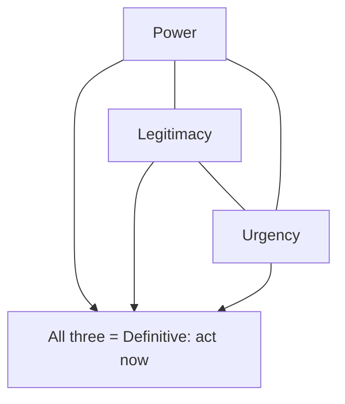
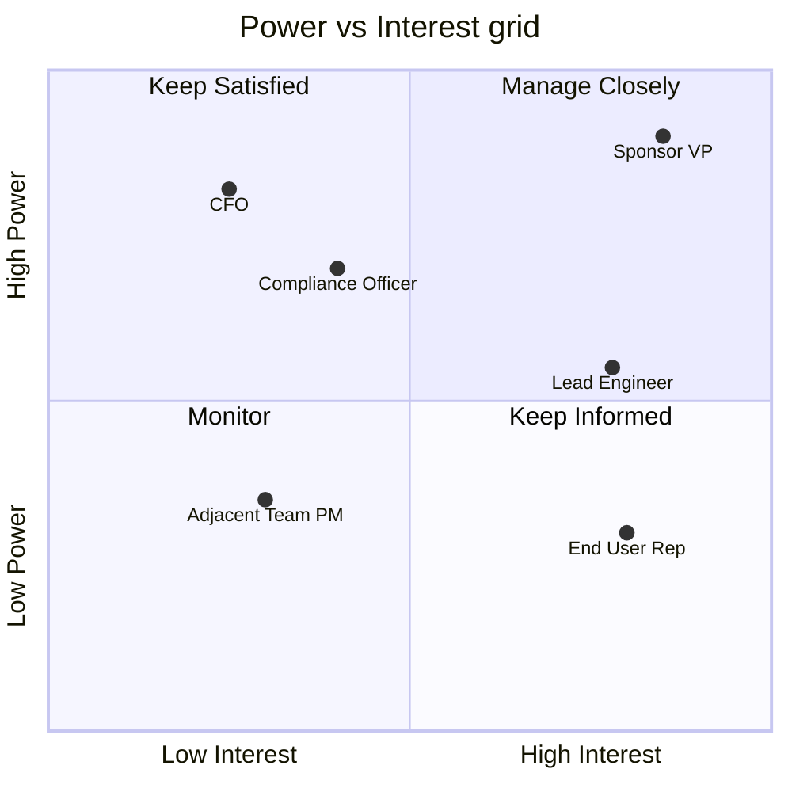
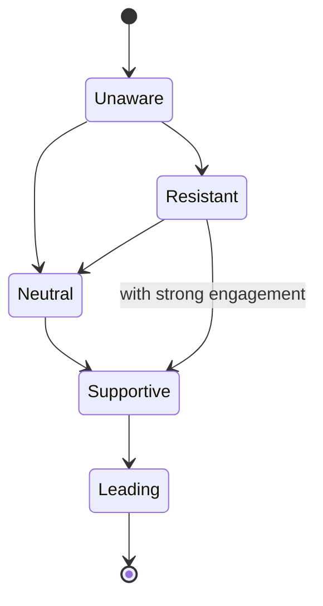
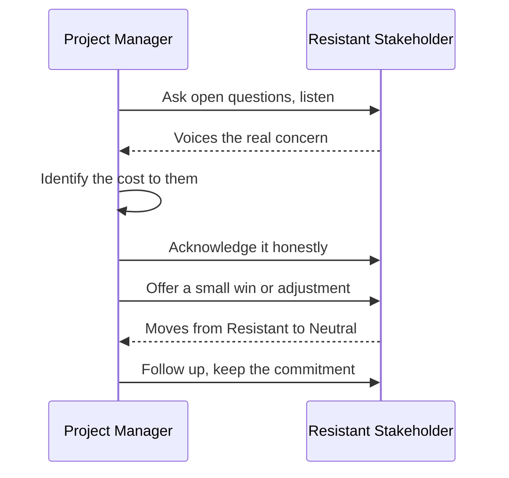
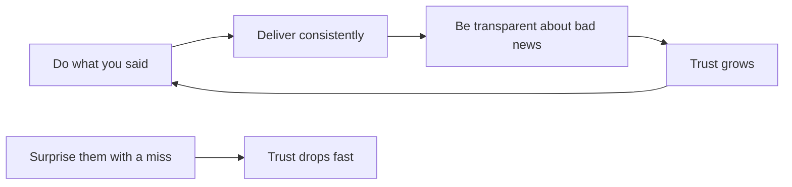
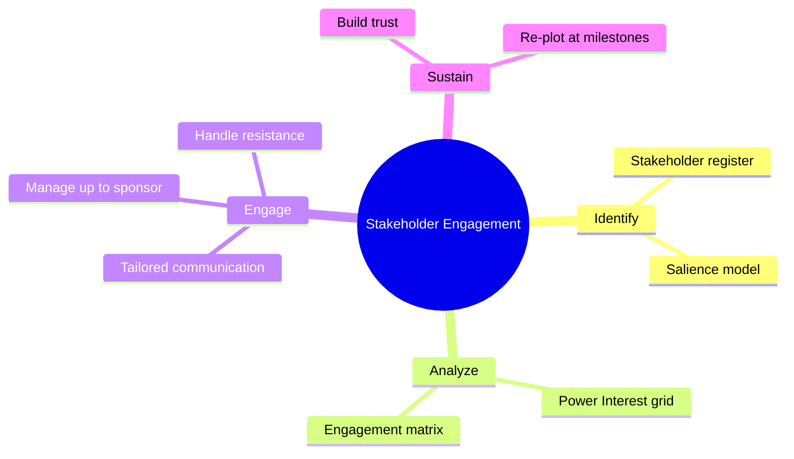

# Module 13 — Stakeholder Engagement

> ⏱️ Estimated study time: ~35 min · 🎚️ Level: Intermediate · ✅ Prerequisites: [Module 05](05-initiation-charter-stakeholders.md) · Part of the **Sales -> Project Management Reviewer**.

*The slow-burn romance of your whole career: a cast of characters, some who adore you, one who absolutely does not — and your job is to win the room.*

## 🎯 What you'll be able to do

- [ ] Identify your stakeholders and rank who matters most using the **salience model** and the **Power/Interest grid**.
- [ ] Place each stakeholder on an **engagement assessment matrix** (current vs. desired) and plan how to move them.
- [ ] Choose deliberate strategies to win over **resistant** stakeholders and to **manage up** to sponsors and executives.
- [ ] Build and protect **trust** across the whole life of a project.
- [ ] Translate everything you already know about working a **buying committee** into stakeholder engagement.

## 👋 From your mentor

Okay, real talk: you've been doing stakeholder engagement for years. You just called it "working the account." Every deal you ever closed meant finding the champion, charming the blocker into a truce, and getting the economic buyer to nod. That *is* stakeholder management — you've simply never been handed the official vocabulary.

What's new in project management is doing it **on purpose, in writing, and for the whole length of a project** instead of one quarter. The instincts transfer almost perfectly. In this module I'll hand you the names, grids, and matrices PMI uses, so you can be deliberate about a skill that's already living in your bones. Think of it as learning the choreography for a dance you already know by feel.

---

## Who is a stakeholder, anyway?

A **stakeholder** is any individual, group, or organization that can **affect, be affected by, or perceive themselves to be affected by** your project. Read that last phrase twice, because it's the plot twist: perception is reality here. If someone *thinks* your project threatens their turf, they're a stakeholder — whether or not your org chart agrees with them.

Stakeholders show up from everywhere, like wedding guests you didn't realize you'd invited:

| Where they sit | Examples |
|---|---|
| Inside the project | Sponsor, project manager, core team members |
| Inside the org | Department heads, finance, legal, IT, other PMs competing for the same people |
| Outside the org | Customers, end users, vendors, regulators, the public |

In PMI's *PMBOK Guide* (7th edition), **Stakeholder** is one of the eight **Performance Domains**, and engaging them well is one of the **12 Principles** ("Effectively engage with stakeholders"). The point PMI keeps hammering: this is **continuous**, not a one-time guest list you write at kickoff and forget by the appetizers.

### Stakeholder identification

Identification never really stops. New characters keep walking onto the page: a regulator appears during testing, a brand-new VP inherits a department halfway through. Capture what you learn in a **stakeholder register** — a living list of names, roles, interests, influence, and engagement notes.

> 🔁 **Sales → PM bridge:** Your stakeholder register is a **CRM for your project**. You already log every contact's role, what they care about, who they report to, and your last touchpoint. Same discipline — except now the "deal" is your project, and the "contacts" are everyone who can help you shine or quietly sink you.

---

## The salience model (a quick lens)

When you've got too many stakeholders to track equally — and you will — the **salience model** helps you spot who genuinely demands attention. It scores stakeholders on three attributes:

- **Power** — can they impose their will? (budget, authority, ability to stop you cold)
- **Legitimacy** — is their involvement appropriate and proper? (do they have a real, recognized stake?)
- **Urgency** — does their claim need immediate attention? (time-sensitive, important to them)

The magic, as in any good ensemble cast, is in the **overlaps**. A stakeholder with all three is **definitive** — drop everything. One with only a single attribute barely earns a line of dialogue.

*The three salience attributes overlap; the stakeholder holding all three is "definitive" and earns your immediate focus.*

Use salience as a fast gut-check. For day-to-day planning, though, most PMs reach for the simpler grid below — it's the one you'll actually keep open.

---

## The Power/Interest grid

This is the workhorse, the tool you'll come back to again and again. You plot each stakeholder on two axes:

- **Power** — how much influence they have over the project (vertical).
- **Interest** — how much they care about its outcome (horizontal).

That gives you four quadrants, each with a clear engagement posture:

| Quadrant | Power | Interest | Strategy | Sales analogy |
|---|---|---|---|---|
| **Manage Closely** | High | High | Engage fully, involve in decisions, frequent contact | The economic buyer who loves the deal |
| **Keep Satisfied** | High | Low | Keep them content, don't overload them, watch for shifts | The busy exec who can veto but isn't paying attention |
| **Keep Informed** | Low | High | Regular updates, use as advocates, harness their enthusiasm | The friendly end user who champions you internally |
| **Monitor** | Low | Low | Minimal effort, light-touch, re-check periodically | The peripheral contact you CC occasionally |

*Each dot is a real stakeholder; their quadrant tells you how much effort and what kind of contact to invest.*

**A concrete read of that chart:** the Sponsor VP sits top-right (Manage Closely — your leading love interest, the relationship you protect above all). The CFO is top-left (Keep Satisfied — powerful, not deeply engaged, so keep them comfortable without drowning them in detail). The End User Rep is lower-right (Keep Informed — low formal power but high interest, your natural advocate). The Adjacent Team PM is bottom-left (Monitor — light touch for now).

> 💡 People move between quadrants. The CFO who's "Keep Satisfied" today jumps to "Manage Closely" the moment your project needs more budget. **Re-plot the grid at major milestones.**

---

## Engagement levels and the assessment matrix

Knowing *who* matters isn't enough — you also need to know *how engaged* they are right now versus how engaged you *need* them to be. (It's the "where do we stand?" conversation, and yes, it's just as important here as it is in dating.) PMI defines five engagement levels:

| Level | What it looks like |
|---|---|
| **Unaware** | Doesn't know the project exists or its impact on them |
| **Resistant** | Aware, but opposed to the project or the change it brings |
| **Neutral** | Aware, neither supportive nor opposed; sitting on the fence |
| **Supportive** | Aware and in favor; helps when asked |
| **Leading** | Aware and actively engaged in driving the project to success |

The **Stakeholder Engagement Assessment Matrix** maps each person's **current (C)** level against their **desired (D)** level. Wherever C and D differ, you've got a **gap** — and a job to do.

| Stakeholder | Unaware | Resistant | Neutral | Supportive | Leading |
|---|:---:|:---:|:---:|:---:|:---:|
| Sponsor VP |  |  |  | C | D |
| CFO |  |  | C | D |  |
| Lead Engineer |  |  |  | C / D |  |
| Compliance Officer |  | C | D |  |  |
| End User Rep |  |  | C |  | D |

*Reading it:* The **Sponsor VP** is Supportive, but you need them **Leading** — close that gap, because a sponsor who merely approves is far weaker than one who actively champions. The **Compliance Officer** is **Resistant** and you only need them **Neutral** — a smaller, more achievable move. The **Lead Engineer** is exactly where you need them (C/D match) — protect that, and don't take it for granted.

*Engagement usually moves one step at a time — a Resistant stakeholder rarely leaps straight to Leading, so target the next realistic step.*

> ⚠️ Don't over-engineer. Not everyone needs to be **Leading** — that's the relationship equivalent of expecting every acquaintance to be your best friend. A "Monitor" stakeholder being **Neutral** is perfectly fine. Spend your energy where the **gap × importance** is largest.

---

## ⏸️ Pause & reflect

This is a natural place to stop, stretch, and let it settle. Come back fresh — the strategy section below is where it gets deliciously practical.

- Picture your last big sales deal. Who was the **champion**, the **blocker**, and the **economic buyer**? Now name the engagement level you'd assign each one.
- Think of one person at your current job who is **Resistant** to something you want. What's the *next single step* up the ladder for them — not all the way to Leading, just one notch?

No rush. Bookmark it here if you need to.

---

## Strategies to move stakeholders along

Once you can see the gaps, you close them with deliberate tactics. The move depends entirely on **where they are now** — you don't open with a grand gesture when a coffee will do:

| Moving from → to | What tends to work |
|---|---|
| **Unaware → Neutral** | Visibility: a clear, jargon-free briefing on what the project is and how it affects them |
| **Resistant → Neutral** | Listen first. Surface the real objection, address the cost *to them*, find a small win |
| **Neutral → Supportive** | Show value, give them a role, connect the project to something they already want |
| **Supportive → Leading** | Hand them ownership, public credit, and a platform to advocate |

Across all of these, three moves do most of the heavy lifting:

1. **Communicate in their language.** Tailor the message to what *they* care about — exactly like qualifying a prospect's pain before you ever pitch.
2. **Give them a stake.** People defend what they help build. Involve them early and resistance has a funny way of turning into ownership.
3. **Reduce their cost.** Most resistance is rational from the stakeholder's seat. Make saying "yes" cheaper than saying "no."

### Managing UP: sponsors and executives

Your **sponsor** is your single most important stakeholder — they fund the project, clear roadblocks, and champion you to other executives. Managing up well means:

- **Make them look good.** Give them clean, decision-ready summaries they can repeat to *their* boss without breaking a sweat.
- **Bring solutions, not just problems.** When you escalate, present options and a recommendation, not an open-ended mess dropped on their desk.
- **Respect their time.** Executives are "Keep Satisfied / Manage Closely" with **low patience for detail**. Lead with the headline, the ask, and the impact. Detail on request.
- **Escalate early.** A surprise three weeks late costs you trust. A heads-up early earns it.

> 🔁 **Sales → PM bridge:** Managing up to a sponsor is **executive selling**. You already know not to drown a C-level prospect in feature specs — you lead with business outcomes and ROI. Brief your sponsor the exact same way: outcome, risk, ask. One slide, not twenty.

### Handling difficult or resistant stakeholders

Here's the reframe that changes everything: resistance is **information, not insult**. A resistant stakeholder is telling you something the project hasn't addressed yet — they're the suspicious character who actually has a point. Work it like a sales objection:

*Resistance is handled like an objection in a sales call: surface it, validate it, address the underlying cost, then follow through.*

Practical tactics:

- **Find the why.** Is it loss of control, extra workload, a past failed project, or a turf threat? The remedy differs for each — diagnose before you prescribe.
- **Don't argue — reframe.** "You're worried this adds work to your team. Let's look at what we can take *off* their plate in return."
- **Recruit their peers.** A respected colleague who's Supportive moves a Resistant stakeholder better than you ever could. Let the friend make the introduction.
- **Document agreements.** When a difficult stakeholder commits, capture it in writing — kindly, but clearly.

---

## Building and maintaining trust

Engagement runs on **trust**, and trust is built in small, repeated deposits over the life of the project — never in a single grand charm offensive. It's a slow burn, not a fling.

*Trust compounds slowly through reliability and honesty, but a single hidden bad-news surprise can drain the account fast.*

The habits that build trust:

- **Reliability.** Hit your commitments, or renegotiate them *before* the deadline, never after.
- **Transparency.** Share bad news early and plainly. Hidden problems destroy trust faster than the problems themselves ever could.
- **Competence.** Know your project cold. Stakeholders trust a PM who has the details at their fingertips.
- **Consistency.** Same PM, same standards, every interaction. No favorites, no surprises.
- **Follow-through.** Close every loop. "I'll get back to you Thursday" has to actually happen Thursday.

> 🔁 **Sales → PM bridge:** This is **account management**, full stop. The rep who keeps a client for ten years isn't the smoothest talker — it's the one who returns calls, owns mistakes, and delivers what they promised. Run your stakeholders like your best long-term accounts.

---

## Putting it together: the stakeholder map

Here's how the whole story connects — from finding your cast, to ranking them, to engaging and re-checking:

*The four ongoing moves of stakeholder engagement: identify, analyze, engage, and sustain — looping for the whole project.*

---

## 🧠 Check yourself

**1. A department head has high power but currently low interest in your project. Which quadrant, and what's your strategy?**

Show answer

"Keep Satisfied." Keep them content and lightly informed without overloading them — but watch closely, because if their interest spikes (e.g., the project starts affecting their budget) they jump to "Manage Closely."

**2. Name the five engagement levels in order from least to most engaged.**

Show answer

Unaware → Resistant → Neutral → Supportive → Leading.

**3. What three attributes make up the salience model, and what do you call a stakeholder who has all three?**

Show answer

Power, Legitimacy, and Urgency. A stakeholder holding all three is a "definitive" stakeholder — your highest priority.

**4. On the engagement assessment matrix, what do the letters C and D represent, and why does the gap between them matter?**

Show answer

C = the stakeholder's Current engagement level; D = the Desired level you need. The gap between C and D is exactly the work you must do — and you prioritize the biggest gaps on your most important stakeholders.

**5. Your sponsor is "Supportive" but you need them "Leading." Give one concrete move to close that gap.**

Show answer

Hand them ownership and a visible platform: ask them to open the steering meeting, publicly champion the project to peer executives, or personally clear a named roadblock. Giving credit and a role turns passive support into active leadership.

**6. A stakeholder is openly resistant. What's the first thing you should do — and why is resistance useful?**

Show answer

Listen and ask open questions to surface the real concern. Resistance is information: it tells you about a cost, risk, or fear the project hasn't addressed yet — handle it like a sales objection, not an insult.

---

## 🧰 Try it

**Build a one-page engagement plan for a real situation.**

1. Pick a project or initiative you're involved in (even an informal one — a process change at work, a move, an event).
2. List **5–8 stakeholders**. For each, jot their **power**, **interest**, and best-guess **current engagement level**.
3. Plot them on a Power/Interest grid (just sketch four boxes on paper).
4. For your **two most important** stakeholders, mark **Current** and **Desired** engagement, then write **one concrete action** to close each gap.
5. Identify the **one resistant or skeptical** person and draft the **first question** you'd ask to understand their objection.

If you can do this for a real situation, you can do it on day one of a PM job. Keep the page — it's a template you'll reuse forever.

---

## 🔑 Key terms

- **Stakeholder** — Anyone who can affect, be affected by, or perceive themselves affected by the project.
- **Stakeholder register** — A living document recording stakeholders' roles, interests, influence, and engagement.
- **Salience model** — A prioritization lens scoring stakeholders on power, legitimacy, and urgency.
- **Power/Interest grid** — A four-quadrant tool plotting power against interest to set an engagement posture.
- **Engagement levels** — Unaware, Resistant, Neutral, Supportive, Leading.
- **Stakeholder Engagement Assessment Matrix** — A grid mapping each stakeholder's current (C) vs. desired (D) engagement level.
- **Managing up** — Deliberately engaging sponsors and executives with concise, decision-ready, outcome-focused communication.
- **Sponsor** — The senior person who funds the project, removes obstacles, and champions it at the executive level.

---
⬅️ **Previous:** [Module 12 — Risk Management](12-risk-management.md) · 🏠 **[Reviewer Home](../README.md)** · ➡️ **Next:** [Module 14 — Procurement & Contracts](14-procurement-and-contracts.md)
