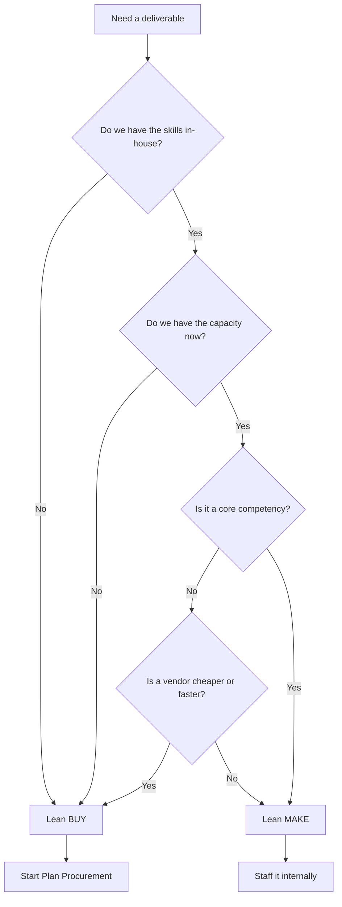
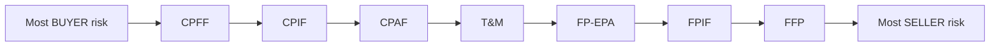
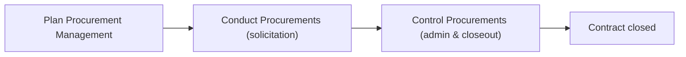
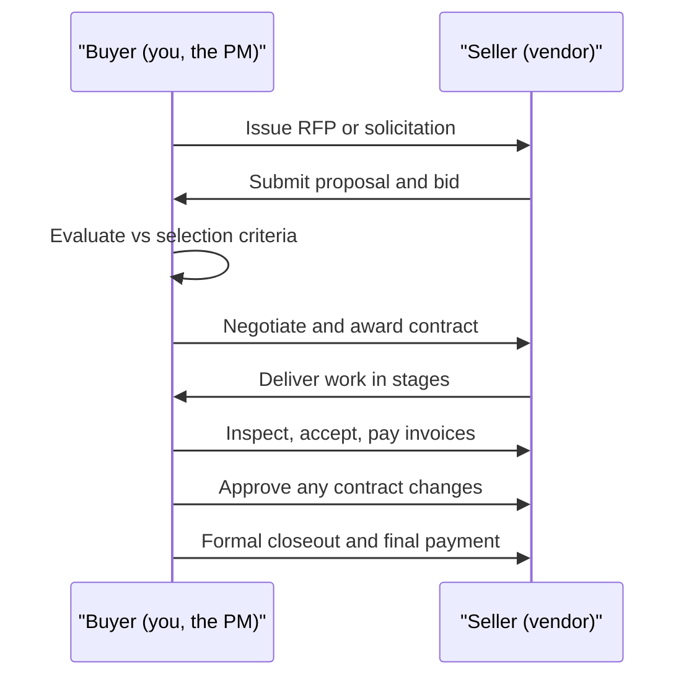
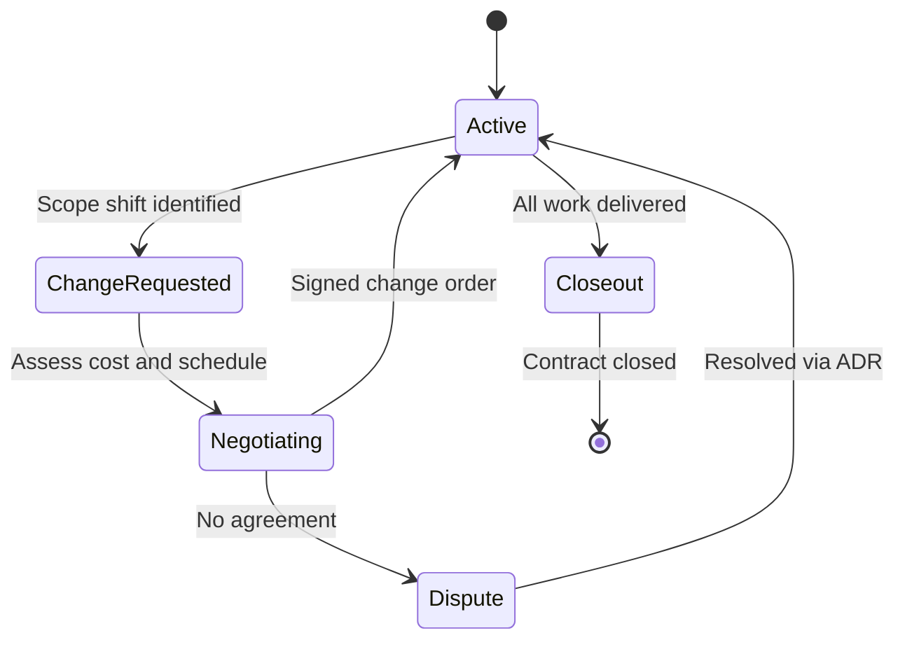

# Module 14 — Procurement & Contracts

> **Estimated study time:** ~35 min · **Level:** Intermediate · **Prerequisites:** [Module 08](08-cost-and-budget.md) · Part of the **Sales -> Project Management Reviewer.**

## 🎯 What you'll be able to do

- [ ] Run a **make-or-buy analysis** and decide when to bring in a vendor.
- [ ] Tell the major **contract types** apart and explain who carries the risk in each.
- [ ] Walk through the three procurement steps: **Plan**, **Conduct**, and **Control** Procurements.
- [ ] Pick the right **solicitation document** (RFI, RFQ, RFP) and write a usable **SOW**.
- [ ] Build fair **vendor selection criteria** and read an **SLA** without glazing over.
- [ ] Manage a live vendor relationship and handle **contract changes** without blowing up the deal.

## 👋 From your mentor

Here's a secret that should make you smile: you already know procurement. You've just been standing on the *other side of the table*. Every RFP you sweated over, every SOW you parsed for hidden scope, every "best and final" you negotiated — that was procurement, viewed from the seller's chair.

Now you're the buyer. The same negotiation muscles still work; you're just pointing them in a new direction. In this module you'll learn how a PM decides whether to hire help at all, how contracts quietly shift risk between the two parties, and how to keep a vendor honest and motivated once the ink is dry. Procurement is where money, scope, and risk all collide — get it right and a vendor becomes an extension of your team instead of a fire to fight.

---

## Make-or-buy analysis: should this even be a contract?

Before you draft a single document, answer one question: **do we build this ourselves, or do we buy it from someone else?** That's the **make-or-buy analysis**, and it's the gateway to all procurement.

You're weighing more than price. You're weighing capability, capacity, risk, speed, and what your organization wants to *own* long-term.

| Factor | Leans toward **MAKE** (in-house) | Leans toward **BUY** (vendor) |
|---|---|---|
| **Skills** | You already have the expertise | The skill is rare or specialized |
| **Capacity** | Your team has bandwidth | Your team is slammed |
| **Cost** | Cheaper to do internally over time | Vendor has economies of scale |
| **Speed** | No rush | You need it fast |
| **Core competency** | It's central to your business — keep control | It's peripheral — let an expert handle it |
| **Risk** | You can absorb the risk | You want to transfer risk to a vendor |
| **Confidentiality** | Sensitive IP you don't want to expose | Non-sensitive, commodity work |

A quick numeric example. Suppose buying a tool costs **$12,000 up front plus $300/month** to run. Building it in-house costs **$6,000 up front plus $700/month** in maintenance. When do the two break even?

- Difference in up-front cost: $12,000 − $6,000 = **$6,000** (buy is more expensive up front)
- Difference in monthly cost: $700 − $300 = **$400/month** (make is more expensive monthly)
- Break-even: $6,000 ÷ $400 = **15 months**

So if you'll use it **longer than 15 months, make is cheaper**; shorter than that, **buy wins**. Don't let "we can build it!" pride override the math.

*A make-vs-buy decision flow — capability and capacity gate the choice before cost does.*

> 🔁 **Sales → PM bridge:** Make-or-buy is just **qualifying a lead in reverse**. In sales you asked "is this prospect worth my time, or should I disqualify?" Here you ask "is this work worth a vendor, or do we keep it?" Same disciplined filter — you're protecting time and money instead of chasing every shiny option.

---

## Contract types: where the risk lives

Every contract is a **risk-allocation device**. The contract type decides who eats the cost if things go sideways. There are three big families. Memorize the headline for each:

- **Fixed Price** — the **seller** carries the cost risk.
- **Cost-Reimbursable** — the **buyer** carries the cost risk.
- **Time & Materials (T&M)** — risk is **shared**, and it tends to drift toward the buyer over time.

### Fixed Price (FP)

You agree on a price; the seller delivers for that price no matter what it actually costs them. If the seller is inefficient, *they* lose money — not you. That's why fixed price puts the cost risk on the **seller**. Best when scope is well-defined.

| Subtype | Full name | How it works | Best when |
|---|---|---|---|
| **FFP** | Firm Fixed Price | One price, period. Most common. | Scope is crystal clear |
| **FPIF** | Fixed Price Incentive Fee | Fixed price **plus** a bonus for hitting cost/schedule/performance targets | You want to reward over-performance |
| **FP-EPA** | Fixed Price with Economic Price Adjustment | Fixed price that can adjust for inflation, currency, or commodity prices | Multi-year deals exposed to economic swings |

### Cost-Reimbursable (CR)

You reimburse the seller for their **actual costs**, plus a fee. Because you're paying whatever it really costs, the cost risk sits with the **buyer**. Best when scope is fuzzy or evolving (R&D, early-stage work).

| Subtype | Full name | How the fee works | Notes |
|---|---|---|---|
| **CPFF** | Cost Plus Fixed Fee | Costs + a **fixed** dollar fee | Fee doesn't change with performance |
| **CPIF** | Cost Plus Incentive Fee | Costs + fee adjusted by a **share ratio** for beating/missing targets | Buyer and seller split savings/overruns |
| **CPAF** | Cost Plus Award Fee | Costs + an **award** fee based on subjective buyer judgment | Buyer rates the seller's performance |

> **CPIF share ratio in one line:** an 80/20 ratio means for every dollar **under** the target cost, the **buyer keeps 80¢** and the **seller earns 20¢** as bonus. Overruns split the same way. It aligns incentives so both sides want to control cost.

### Time & Materials (T&M)

A hybrid. You pay an agreed **rate** (e.g., $150/hour) plus materials, with no fixed total. Great for staff augmentation and small or undefined jobs — but watch the meter, because an open-ended T&M deal can run away from you. Smart buyers add a **not-to-exceed (NTE) ceiling** and a time limit to cap their exposure.

### The risk spectrum

*Cost risk slides from the buyer (cost-reimbursable, left) to the seller (firm fixed price, right). The clearer your scope, the further right you can safely sit.*

**Rule of thumb:** the **better defined the scope, the more fixed (right) you should go**. Vague scope + fixed price = a vendor who cuts corners or fights every change. Vague scope is exactly where cost-reimbursable earns its keep.

---

## The procurement process

PMI frames procurement as three processes that span the life of the deal. Think of them as **Plan → Conduct → Control**.

*The procurement spine: decide what to buy, run the selection, then administer and close out.*

### 1. Plan Procurement Management

You decide **what** to procure, **how**, and **when**. This is where make-or-buy lives. Key outputs:

- **Procurement management plan** — how the whole process will run.
- **Procurement strategy** — delivery method, contract type, phases.
- **Bid/solicitation documents** — RFI, RFQ, or RFP (see below).
- **Statement of Work (SOW)** for each item you're buying.
- **Source selection criteria** — how you'll score bidders.
- **Independent cost estimates** — your own number, so you can sniff out bids that are too high or suspiciously low.

### 2. Conduct Procurements (solicitation)

You go to market, collect responses, and pick a seller. Steps:

1. Send out solicitation documents to qualified sellers.
2. Hold a **bidder conference** (a.k.a. pre-bid or contractor conference) so all bidders get the **same** information at the same time — fairness matters.
3. Receive proposals or bids.
4. Evaluate against your selection criteria.
5. **Negotiate** and **award** the contract. The signed contract is the headline output.

### 3. Control Procurements (administration & closeout)

The contract is live. Now you **manage performance, process changes, pay invoices, and inspect deliverables**. At the end you formally **close** the procurement — confirm everything was delivered, settle final payments, capture lessons learned, and archive records.

*The buyer–seller handshake across the full lifecycle, from solicitation to closeout.*

---

## Solicitation documents: RFI, RFQ, RFP

These three get mixed up constantly. The trick is to ask **what answer do I actually want back?**

| Document | You're asking for… | Use it when… |
|---|---|---|
| **RFI** — Request for Information | **Information / education** about capabilities and options | You're exploring the market and don't fully know what's out there yet |
| **RFQ** — Request for Quotation | A **price** for a well-defined item | Scope is clear and price is the main decision factor |
| **RFP** — Request for Proposal | A full **proposed solution + approach + price** | The problem is complex and you want sellers to propose *how* they'd solve it |

**Mnemonic:** RF**I** = *Inform me*. RF**Q** = *Quote me a price*. RF**P** = *Propose a solution*.

### The Statement of Work (SOW)

The **SOW** describes the work to be done in enough detail that a seller can price it and deliver it. A vague SOW is the single biggest cause of procurement pain — it's where scope creep and disputes are born. A good SOW spells out:

- **Scope** — what's included and, crucially, what's **excluded**.
- **Deliverables** — concrete outputs with acceptance criteria.
- **Schedule / milestones** — when things are due.
- **Standards & specifications** — quality bar the work must meet.
- **Performance / reporting requirements** — how progress is tracked.

> A related cousin: a **Terms of Reference (TOR)** is used when you're procuring *services* rather than products — it describes objectives, responsibilities, and qualifications instead of a tangible deliverable.

### Vendor selection criteria

Don't pick on price alone — that's how you end up with the cheapest vendor and the most expensive cleanup. Build a weighted scorecard. Common criteria:

| Criterion | What you're checking |
|---|---|
| **Technical capability** | Can they actually do the work? |
| **Cost / total cost of ownership** | Not just price — lifetime cost |
| **Past performance & references** | Have they delivered before? |
| **Financial stability** | Will they still exist next year? |
| **Capacity** | Do they have the bandwidth? |
| **Approach / methodology** | Does their plan make sense? |
| **Cultural / management fit** | Will they be easy to work with? |

Score each bidder, multiply by your weights, and let the numbers start the conversation. Then apply judgment — the highest score isn't always the right partner.

### Service Level Agreements (SLAs)

An **SLA** is the part of the contract that defines **measurable performance promises** — and what happens when they're missed. It turns "good service" into something you can enforce.

A solid SLA names:

- **Metrics** — e.g., 99.9% uptime, 4-hour response to critical incidents, 95% of tickets resolved in 2 business days.
- **Measurement method** — how and how often you measure.
- **Penalties / service credits** — what the vendor owes you when they miss (often a % credit on the invoice).
- **Exclusions** — scheduled maintenance, force majeure, etc.

> 🔁 **Sales → PM bridge:** An SLA is your old **quota and comp plan, flipped**. As a seller you lived under metrics and accelerators that defined "performance." Now *you* write those metrics for the vendor. You already know exactly how a target changes behavior — use that instinct to set SLA numbers that are firm but achievable, so the vendor stays motivated instead of gaming the system.

---

## ⏸️ Pause & reflect

This is a natural place to stop, stretch, and let it settle — come back later with fresh eyes if you need to. Nothing here is going anywhere.

- Think of a time a customer pushed you onto a fixed price when the scope was still fuzzy. How did that feel as the *seller*? That discomfort is exactly the risk you're now learning to manage as the buyer.
- If you had to buy a service for your current job tomorrow, would you reach for an RFI, RFQ, or RFP — and why?
- Which contract type would you *default* to, and what would have to be true about the scope to make you change your mind?

---

## Managing the vendor relationship & contract changes

Signing the contract is the **start** of the relationship, not the finish line. Most procurement value — or pain — happens during execution.

**Keep the partnership healthy:**

- **Hold regular check-ins** and review SLA dashboards together. Surprises are the enemy.
- **Communicate early.** If your priorities shift, tell them before it becomes a crisis.
- **Pay on time.** Nothing erodes goodwill — and your leverage — faster than late payments.
- **Document everything.** In a dispute, the contract and the written record are all that matter.

**Handle changes through a controlled process.** Scope *will* change. When it does, route it through the contract's **change control** mechanism so both sides agree in writing on the new scope, cost, and schedule. Two key ideas:

- A **change order / contract change** is a formal, mutually signed modification. No signature, no change.
- A **claim** (or dispute) arises when the parties **disagree** about whether a change is owed — often resolved through negotiation, and if that fails, **Alternative Dispute Resolution (ADR)** like mediation or arbitration before anyone goes to court.

*A contract's life: changes loop back into the active state once signed; unresolved disagreements detour through dispute resolution.*

**Closing out cleanly** matters as much as starting well. Verify all deliverables meet acceptance criteria, release any retainage or final payment, get a signed acceptance, capture lessons learned, and archive the records. An un-closed contract is a liability that lingers.

---

## 🧠 Check yourself

**1. In a Firm Fixed Price (FFP) contract, who carries the cost risk — and why?**

Show answer

The **seller**. The price is locked, so if the work costs more than expected, the seller absorbs the overrun. The buyer's cost is fixed and predictable. That's why FFP is best when scope is well-defined.

**2. You're exploring a brand-new category and don't yet know what solutions exist. RFI, RFQ, or RFP?**

Show answer

An **RFI (Request for Information)**. You're gathering market education, not yet asking for a price (RFQ) or a full proposed solution (RFP).

**3. In a CPIF contract with an 80/20 share ratio, the seller comes in $10,000 under target cost. How is that split?**

Show answer

The **buyer keeps $8,000** (80%) and the **seller earns $2,000** (20%) as incentive fee. The share ratio aligns both parties to control costs.

**4. Your scope is still evolving and hard to pin down. Which contract family fits best, and which is dangerous?**

Show answer

**Cost-reimbursable** fits fuzzy/evolving scope — the buyer accepts cost risk in exchange for flexibility. **Fixed price** is dangerous here: with unclear scope, the seller either pads the price heavily or fights every change request.

**5. A vendor wants to expand the work mid-project. What's the right way to handle it, and what makes it official?**

Show answer

Route it through **contract change control**. It becomes official only as a **signed change order** that both parties agree to, capturing the new scope, cost, and schedule. A verbal "sure, go ahead" is not a change.

**6. What does an SLA add to a contract that a plain SOW does not?**

Show answer

**Measurable performance promises with consequences** — specific metrics (uptime, response times), how they're measured, and **penalties or service credits** when the vendor misses. The SOW says *what* to deliver; the SLA defines *how well* and *what happens if not*.

---

## 🧰 Try it

**Draft a one-page mini-procurement package.** Pick something real you could outsource — a logo, a market-research report, a small app feature, office cleaning, whatever.

1. **Make-or-buy:** Write 2–3 sentences on why buying beats building this. Include one rough number.
2. **Contract type:** Choose FFP, T&M, or CPFF and justify it in one sentence based on how clear the scope is.
3. **Solicitation:** Decide RFI vs RFQ vs RFP and say why.
4. **Mini-SOW:** List 3 deliverables, 1 milestone date, and one thing that is explicitly **out of scope**.
5. **Selection criteria:** Name your top 3 criteria and assign each a weight that totals 100%.
6. **One SLA line:** Write a single measurable performance metric with a penalty if missed.

If you can fill that page out coherently, you can run a real procurement. Keep it — you'll reuse the structure on the job.

---

## 🔑 Key terms

- **Make-or-buy analysis** — deciding whether to produce a deliverable in-house or purchase it from a vendor.
- **Firm Fixed Price (FFP)** — single locked price; cost risk on the seller.
- **FPIF / FP-EPA** — fixed price variants adding incentive fees / economic price adjustments.
- **Cost-Reimbursable (CPFF, CPIF, CPAF)** — buyer reimburses actual costs plus a fixed, incentive, or award fee; cost risk on the buyer.
- **Time & Materials (T&M)** — pay agreed rates plus materials with no fixed total; shared risk, often capped by a not-to-exceed ceiling.
- **Share ratio** — the buyer/seller split of cost savings or overruns in an incentive contract (e.g., 80/20).
- **RFI / RFQ / RFP** — requests for Information / Quotation / Proposal.
- **Statement of Work (SOW)** — detailed description of the work to be procured, including scope, deliverables, and exclusions.
- **Source selection criteria** — weighted standards used to evaluate and choose a seller.
- **SLA (Service Level Agreement)** — contractual, measurable performance commitments with penalties for misses.
- **Change order** — a formal, signed modification to a contract's scope, cost, or schedule.
- **Claim** — a disputed change the parties disagree on, often resolved via ADR (mediation/arbitration).
- **Bidder conference** — a meeting giving all prospective sellers the same information for a fair bid.

---
⬅️ **Previous:** [Module 13 — Stakeholder Engagement](13-stakeholder-engagement.md) · 🏠 **[Reviewer Home](../README.md)** · ➡️ **Next:** [Module 15 — Agile & Scrum, In Depth](15-agile-and-scrum.md)
