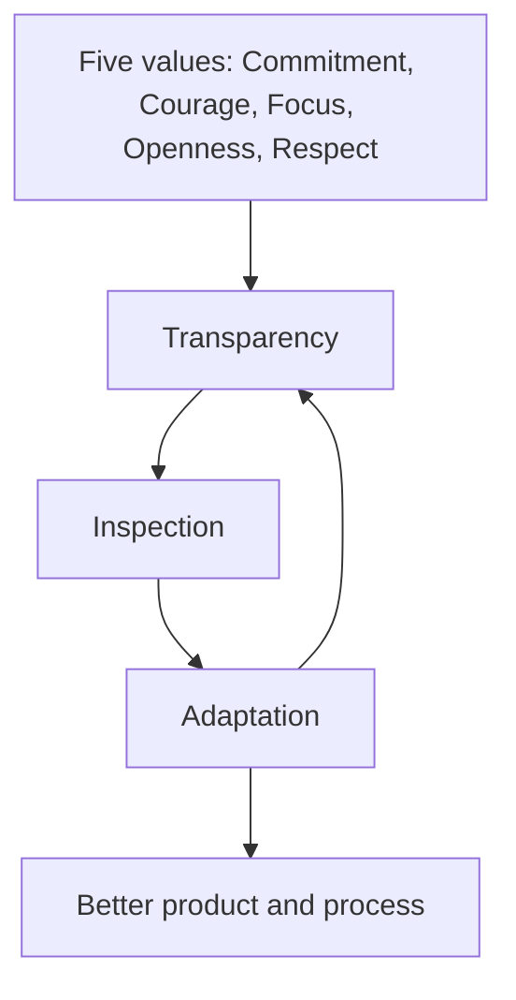
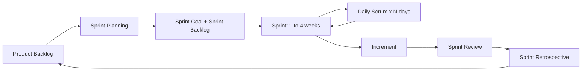
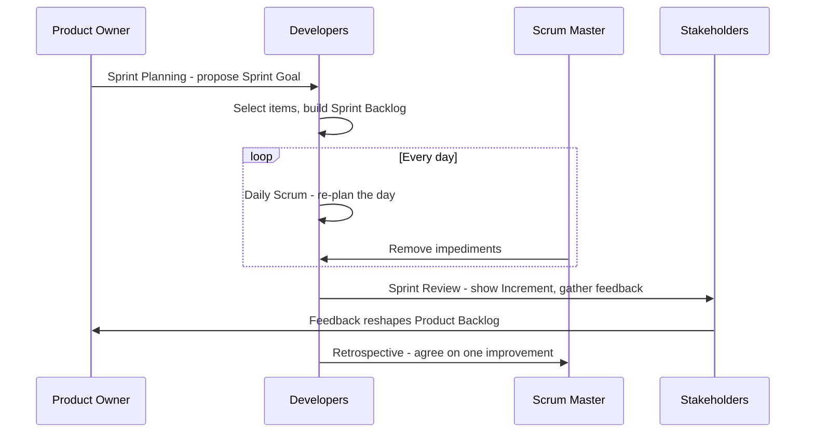
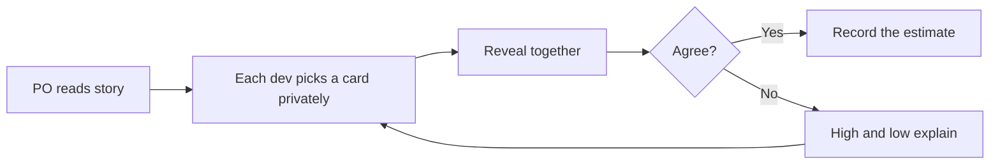
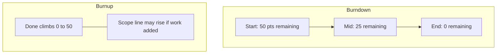
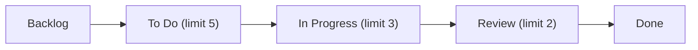

# Module 15 — Agile & Scrum, In Depth

> **Estimated study time:** ~60 min · **Level:** Intermediate · **Prerequisites:** [Module 04](04-predictive-agile-hybrid.md). Part of the **Sales -> Project Management Reviewer**.

*The slow burn that finally clicks: you've been living the Agile mindset for years — now you get the words for it.*

## 🎯 What you'll be able to do

- [ ] Explain Scrum's three pillars and five values in plain language, and why "empirical" beats "predictive" for messy work.
- [ ] Name the three accountabilities, five events, and three artifacts of Scrum — and what each one *commits* to.
- [ ] Write a user story with INVEST-quality and crisp acceptance criteria, then estimate it with story points and planning poker.
- [ ] Read a burndown and a burnup chart, and use velocity to forecast honestly.
- [ ] Set up a Kanban board with WIP limits and explain lead time, cycle time, and throughput.
- [ ] Say the words "SAFe" and "LeSS" without flinching.

## 👋 From your mentor

Okay, real talk: the word "Scrum" gets said with such reverence in some offices you'd think it came with robes and a secret handshake. It doesn't. And here's the part nobody tells you — you've basically been doing it for years.

Think about how you actually work a quarter in sales. You don't write a 40-page plan to close an account and then refuse to change a comma of it. You run discovery, adjust your pitch, read the room, and try again next week with what you learned. That instinct — *small loops, real feedback, adapt fast* — is the entire soul of Agile. The whole thing.

So when someone makes Scrum sound like a mysterious club with weird ceremonies, just smile. You already have the mindset down cold. This module hands you the vocabulary, the rules, and the rituals so you can walk into a sprint planning meeting and sound like you've been there all along. Because honestly? You have.

---

## What "Agile" actually is

Here's the first plot twist: **Agile** isn't a method. It's an umbrella. In 2001 a group of software folks holed up and wrote the **Agile Manifesto** — four value statements and twelve principles. The four values, paraphrased:

| We value... | ...over... |
|---|---|
| Individuals and interactions | processes and tools |
| Working software (a working *product*) | comprehensive documentation |
| Customer collaboration | contract negotiation |
| Responding to change | following a plan |

Now catch the sly bit in the wording: the things on the right *still have value*. We just value the things on the left **more**. So when someone tells you "Agile means no documentation," that's gossip, not the Manifesto. Don't fall for it.

**Scrum** and **Kanban** are the two most common ways teams actually *do* Agile. Scrum is a structured framework with fixed-length cycles and defined roles. Kanban is a lighter, flow-based approach with no required roles. We'll spend time with both. For where these fit alongside waterfall, hybrid, and predictive approaches, see [Module 04](04-predictive-agile-hybrid.md).

> 🔁 **Sales → PM bridge:** "Responding to change over following a plan" is just *qualifying out fast*. You don't keep flogging a dead deal because your Q1 plan said so — you re-read the signals and reallocate your energy where it'll actually pay. Agile teams do exactly that with features.

---

## Scrum theory: empiricism, three pillars, five values

Scrum is built on **empiricism** — the idea that knowledge comes from experience, and decisions are based on what's actually observed, not on guesses about the future. (You know that feeling when a forecast was built entirely on hope? Empiricism is the opposite of that.) It's also built on **lean thinking** — reduce waste, focus on the essentials.

Empiricism stands on **three pillars**:

| Pillar | What it means | Sales analogy |
|---|---|---|
| **Transparency** | The work and the process are visible to everyone who needs to see them. Hidden problems can't be fixed. | An honest, up-to-date CRM pipeline — no sandbagging, no phantom deals. |
| **Inspection** | Frequently check the artifacts and progress toward goals to detect problems early. | Your weekly pipeline review where you look hard at every stage. |
| **Adaptation** | When inspection shows you're off course, adjust — fast. | Changing your outreach the moment a sequence stops converting. |

Here's the thing: inspection without transparency is theater. Inspection without adaptation is just complaining. But all three together, repeated often, is how Scrum actually learns.

The **five Scrum values** are the behaviors that make the pillars work in real life — they're the character, not the plot:

| Value | In practice |
|---|---|
| **Commitment** | The team commits to goals and to supporting each other. |
| **Courage** | Do the right thing; raise hard problems; say "I don't know." |
| **Focus** | Concentrate on the Sprint's work and Goal — not ten things at once. |
| **Openness** | Be honest about the work and the challenges. |
| **Respect** | Treat each other as capable, independent people. |

*The values fuel the pillars, and the pillars turn in a loop — inspect, adapt, repeat.*

---

## The three accountabilities (roles)

The 2020 Scrum Guide calls these **accountabilities**, not "roles," and there are exactly three. Together they form one **Scrum Team** — typically 10 people or fewer, with no sub-teams and no hierarchy. (Think small dinner party, not a wedding reception.)

### Product Owner (PO)
Owns **value**. The PO is accountable for maximizing the value of the product and for managing the **Product Backlog** — ordering it, keeping it clear, and making sure the team understands it. The PO owns the **Product Goal**. One person, not a committee. They can delegate the work but keep the accountability.

### Scrum Master (SM)
Owns **effectiveness**. A servant-leader and coach, accountable for the team's understanding and practice of Scrum. They remove impediments, facilitate events when asked, and protect the team's focus. The SM is **not** a project manager assigning tasks, and **not** the PO's boss. Think coach, not commander.

### Developers
Own **the work**. "Developers" is anyone doing the work to build the Increment — coders, testers, designers, writers, analysts. They are **self-managing**: they decide *how* to turn backlog items into a usable Increment, create the Sprint Backlog, and hold themselves to the Definition of Done.

| Accountability | Owns | Commits to / manages |
|---|---|---|
| **Product Owner** | Value | Product Backlog, Product Goal |
| **Scrum Master** | Team effectiveness / Scrum | Removing impediments, coaching |
| **Developers** | Building the Increment | Sprint Backlog, Definition of Done |

> 🔁 **Sales → PM bridge:** The Product Owner is your **VP of Sales setting the priorities and the number** — they decide what matters most. The Scrum Master is the **sales enablement coach** who clears blockers and makes the team sharper but doesn't carry a quota. The Developers are the **reps who actually close the work** and decide how to run their own day.

---

## The five events

Everything in Scrum happens inside a **Sprint** — the heartbeat container event. The other four nest inside it, like scenes inside a chapter. All events are **timeboxed** (a maximum length) and recur on a regular cadence, which quietly kills the need for a pile of other meetings.

| Event | Purpose | Timebox (for a 1-month Sprint) |
|---|---|---|
| **The Sprint** | The container; a fixed-length cycle (one month or less) where a usable Increment is created. | ≤ 1 month |
| **Sprint Planning** | Plan the Sprint: define the **Sprint Goal**, select backlog items, make a plan. | ≤ 8 hours |
| **Daily Scrum** | Developers inspect progress toward the Sprint Goal and adapt the plan for the day. | 15 minutes, every day |
| **Sprint Review** | Inspect the Increment with stakeholders; adapt the Product Backlog. | ≤ 4 hours |
| **Sprint Retrospective** | Inspect how the *team* worked; plan improvements. | ≤ 3 hours |

Shorter Sprints get proportionally shorter timeboxes (a 2-week Sprint plans in ≤ 4 hours, reviews in ≤ 2 hours, retro ≤ 1.5 hours).

A few rules worth tattooing on your memory:
- A new Sprint starts **immediately** after the previous one ends. No gaps, no breather.
- The Sprint Goal, once set, doesn't change — but **scope may be clarified and renegotiated** with the PO as more is learned.
- Only the PO can **cancel** a Sprint, and only if the Sprint Goal becomes obsolete. (Rare — this is the plot twist that almost never happens.)

### Sprint Planning answers three questions
1. **Why** is this Sprint valuable? → the Sprint Goal (PO proposes value).
2. **What** can be done this Sprint? → Developers select Product Backlog items.
3. **How** will the work get done? → Developers decompose items into a plan.

### Daily Scrum is for the Developers
It's *their* meeting to re-plan the day, not a status report to the boss. The old "three questions" (what I did, what I'll do, any blockers) are optional — the only requirement is that it moves progress toward the Sprint Goal. Fifteen minutes. That's the deal.

### Sprint Review is a working session, not just a demo
Yes, you show the Increment. But the real point is a collaborative conversation with stakeholders about what to do next — the Product Backlog gets adjusted based on the feedback. Less curtain call, more strategy huddle.

### Sprint Retrospective improves the team
What went well? What didn't? What will we change next Sprint? The team picks at least one improvement and often drops it straight into the next Sprint Backlog so it actually happens instead of evaporating by Monday.

*The Scrum framework loop: the backlog feeds planning, the Sprint runs with daily check-ins, then review and retro feed learning back into the backlog.*

*One Sprint, start to finish: who talks to whom, and when.*

---

## The three artifacts and their commitments

Each Scrum artifact comes with a built-in **commitment** — something it's measured against to keep everyone honest and focused. (Think of it as the promise attached to each one.)

| Artifact | What it is | Commitment |
|---|---|---|
| **Product Backlog** | An ordered, ever-evolving list of everything that might be needed in the product. | **Product Goal** — the future state the product is working toward. |
| **Sprint Backlog** | The Sprint Goal + the items selected + the plan to deliver them. The Developers' plan, by and for them. | **Sprint Goal** — the single objective for the Sprint. |
| **Increment** | A concrete, usable stepping stone toward the Product Goal. Multiple Increments may be created per Sprint. | **Definition of Done** — the quality bar that makes an item truly "done." |

The **Definition of Done (DoD)** deserves its own spotlight. It's a shared, formal checklist of what "finished" really means — tested, documented, reviewed, deployable, whatever your team agrees on. If an item doesn't meet the DoD, it can't be released and goes back to the Product Backlog. The DoD is what finally ends the dreaded "well, it's *basically* done" conversation. No more "basically."

> 🔁 **Sales → PM bridge:** The Definition of Done is your **"closed-won" criteria**. A deal isn't closed because the prospect said "sounds good" over lunch — it's closed when the contract is signed, the PO number is in, and finance has booked it. Same discipline: a clear, non-negotiable bar for "done."

---

## User stories, INVEST, and acceptance criteria

Backlog items are often written as **user stories** — a short, plain-language description of a feature from the user's point of view. The classic template:

> **As a** [type of user], **I want** [some goal] **so that** [some benefit].

Example:
> *As a* sales rep, *I want* to filter my pipeline by close date *so that* I can focus on deals closing this month.

That "so that" clause? Pure gold. It captures the **why**, which lets the team make smart trade-offs instead of building features blind.

A good story passes the **INVEST** checklist:

| Letter | Means | Quick test |
|---|---|---|
| **I** | Independent | Can it be built without depending on another story? |
| **N** | Negotiable | Is it a conversation, not a rigid contract? |
| **V** | Valuable | Does it deliver value to a user or customer? |
| **E** | Estimable | Can the team size it? |
| **S** | Small | Can it fit comfortably in one Sprint? |
| **T** | Testable | Can you prove it's done? |

**Acceptance criteria** define the specific conditions a story must satisfy to be accepted. A common format is **Given / When / Then**:

> **Given** I'm on the pipeline page, **When** I select "closes this month," **Then** only deals with a close date in the current month are shown.

Don't mix these two up — it's a classic rookie tangle. Acceptance criteria are story-specific; the **Definition of Done** is team-wide and applies to *every* item.

---

## Story points, relative estimation, and planning poker

Agile teams often estimate in **story points** instead of hours. A story point is a *relative* measure of effort that blends complexity, uncertainty, and amount of work. The point isn't precision — it's that humans are terrible at absolute estimates ("47 hours," said with a straight face) but pretty decent at comparison ("this is about twice that one").

Teams commonly use a **modified Fibonacci** scale (1, 2, 3, 5, 8, 13, 20, 40, 100). The gaps get wider on purpose — past a point, you genuinely can't tell a 20 from a 22, so the scale won't let you pretend you can.

**Planning poker** is the estimation ritual:
1. The PO reads a story aloud.
2. Each Developer privately picks a card.
3. Everyone reveals at once.
4. The high and low estimators explain their reasoning.
5. Discuss, then re-vote until you converge.

The reveal-at-once part is the whole secret — it stops the loudest or most senior voice from anchoring everyone before they've even thought. The *conversation* is the real deliverable; the number is just the souvenir you walk away with.

*Planning poker: private picks, simultaneous reveal, discuss the outliers, converge.*

---

## Backlog refinement, velocity, and burndown / burnup

**Backlog refinement** (sometimes "grooming") is the ongoing activity of breaking down, clarifying, and re-ordering Product Backlog items so they're ready before planning. It's not a formal Scrum event — it's continuous behind-the-scenes work, usually capped at ~10% of the Developers' capacity.

**Velocity** is the average number of story points a team completes per Sprint. It's a *forecasting* tool for one team — not a performance score, and **never** a way to compare teams (one team's points are arbitrary to that team, so comparing them is apples to imaginary oranges). If a team averages 30 points/Sprint and the release backlog is 180 points, that's roughly 6 Sprints — with a sane margin.

### Burndown vs. burnup

| Chart | Y-axis | Shows | Watch for |
|---|---|---|---|
| **Burndown** | Work *remaining* | A line falling toward zero as the Sprint/release progresses. | A flat line (stuck) or a line that won't reach zero (overcommitted). |
| **Burnup** | Work *completed* + a total-scope line | Progress climbing toward a scope line. | The scope line jumping up (scope creep is now *visible*). |

The big advantage of a **burnup**: it draws scope as its own line, so when someone quietly adds work mid-release, the gap is impossible to miss. A burndown hides scope changes inside the slope — and what you can't see, you can't argue about.

*Burndown tracks what's left; burnup tracks what's done against a visible scope line.*

---

## Kanban: flow, WIP limits, and pull

**Kanban** is an Agile method obsessed with **flow** — moving work smoothly through a process. It has no required roles, no fixed Sprints, and no story points required. You can layer it onto whatever you already do, which makes it the low-commitment, no-drama option. Its core practices:

1. **Visualize the workflow.** Make a board with a column for each step. Each work item is a card.
2. **Limit work in progress (WIP).** Put a number cap on each "in progress" column. This is the heart of Kanban.
3. **Manage flow.** Watch how work moves; find and fix bottlenecks.
4. **Make policies explicit.** Everyone knows what "ready for testing" means.
5. **Use feedback loops.** Regular reviews of the board and metrics.
6. **Improve collaboratively.** Evolve the process with data.

**WIP limits** are the magic trick. By capping how many items can be "in progress" at once, you force the team to **finish before starting** and to swarm on blockers together. Less frantic multitasking, faster delivery. It's **pull**, not push: a person grabs the next card only when they have free capacity, instead of work getting shoved onto an already-full plate.

*A Kanban board with WIP-limited columns — work is pulled left to right, and a full column means finish before you start.*

### Flow metrics
| Metric | Definition | Why you care |
|---|---|---|
| **Lead time** | From when an item is *requested* to when it's *delivered*. | What the customer actually experiences. |
| **Cycle time** | From when work *starts* on an item to when it's done. | The team's working speed. |
| **Throughput** | Number of items completed per time period. | Capacity and forecasting. |
| **WIP** | Items in progress right now. | High WIP usually means slow lead times (Little's Law). |

> 🔁 **Sales → PM bridge:** WIP limits are *exactly* why your best quarters happen when you're **not** juggling 40 open deals at once. Focusing on a few late-stage opportunities and driving them home beats spreading yourself thin across everything. Kanban just makes that discipline a rule instead of a New Year's resolution.

---

## A word on scaling (so it isn't scary)

Plain Scrum is built for one small team. But when many teams have to build one product together — that's a different beast — organizations reach for a **scaling framework**. The two you'll hear name-dropped most:

- **SAFe (Scaled Agile Framework)** — the most widely adopted and most prescriptive; lots of roles, levels, and ceremonies. Powerful, and sometimes accused of being heavyweight.
- **LeSS (Large-Scale Scrum)** — deliberately minimal; "Scrum, but with more teams" and very few added rules.

You don't need to master these now — nobody's quizzing you. Just know the words and the idea: **scaling = coordinating multiple teams toward one product** without throwing Agile principles out the window.

---

## ⏸️ Pause & reflect

This is a perfectly good place to stop, breathe, and come back later if you need to — the Kanban and scaling sections will still be right here, and nothing below depends on you finishing in one sitting. Take a breather.

- Which of the five Scrum events maps most naturally to a meeting you already attend in sales? What's different about it?
- Think of the last project (work or personal) where you wished you'd gotten feedback sooner. How would a 2-week Sprint have changed the ending?
- Be honest — this stays between us: which Scrum *value* (commitment, courage, focus, openness, respect) is hardest for you under pressure?

---

## 🧠 Check yourself

**1. What are the three pillars of Scrum's empiricism?**

Show answer

Transparency, Inspection, and Adaptation. You make work visible (transparency), frequently check it against goals (inspection), and adjust quickly when you're off course (adaptation).

**2. The Scrum Master notices the Daily Scrum has turned into a status report to a manager. What's the issue?**

Show answer

The Daily Scrum belongs to the Developers — it's *their* 15-minute event to inspect progress toward the Sprint Goal and re-plan the day, not a status report up the chain. The SM should coach the team to refocus it on the Sprint Goal.

**3. What's the difference between acceptance criteria and the Definition of Done?**

Show answer

Acceptance criteria are **specific to one story** — the conditions that particular item must satisfy. The Definition of Done is a **team-wide quality bar** that applies to *every* item before it can be considered done and releasable.

**4. Your team averages 25 points per Sprint and the release backlog is 150 points. Roughly how many Sprints?**

Show answer

About 6 Sprints (150 ÷ 25). Treat it as a forecast with a margin, not a promise — and re-check it as velocity stabilizes and scope shifts.

**5. Why might a team prefer a burnup chart over a burndown for a release?**

Show answer

A burnup draws total scope as its own line, so when work is added mid-release the scope change is visible. A burndown hides scope changes inside the slope of the remaining-work line.

**6. What's the single most important practice that distinguishes Kanban?**

Show answer

Limiting work in progress (WIP). Capping items in each "in progress" column forces the team to finish before starting, exposes bottlenecks, and improves flow. It turns "push" into "pull."

---

## 🧰 Try it

Take **one** real goal you care about right now — a job search, learning a tool, a side project. Spend 20 minutes turning it into a tiny Scrum + Kanban setup:

1. Write a **Product Goal** in one sentence (the outcome you want).
2. Brain-dump 8–12 backlog items, then **order** them by value.
3. Write your top item as a **user story** ("As a… I want… so that…") with 2–3 **acceptance criteria** in Given/When/Then form.
4. Estimate your top three items in **story points** (1, 2, 3, 5, 8…) relative to each other.
5. Draw a 4-column **Kanban board** (Backlog → To Do → Doing → Done) and put a **WIP limit of 2** on "Doing."
6. Pick a one-week **Sprint Goal** and decide what you'll demo to yourself in your own mini **Sprint Review**.

Then turn the page to [Module 16](16-tools-of-the-trade.md), where you'll meet the software that runs all of this for real teams — the apps where these boards, backlogs, and burndowns actually come to life.

---

## 🔑 Key terms

- **Empiricism** — Making decisions based on what's observed and experienced, not on speculation.
- **Sprint** — The fixed-length container event (one month or less) in which a usable Increment is created.
- **Sprint Goal** — The single objective for a Sprint; the commitment of the Sprint Backlog.
- **Product Goal** — The long-term objective the product is working toward; the commitment of the Product Backlog.
- **Definition of Done (DoD)** — The team-wide quality bar an item must meet to be releasable; the commitment of the Increment.
- **Increment** — A usable, "done" stepping stone toward the Product Goal.
- **User story** — A short, user-centered description of a feature ("As a… I want… so that…").
- **INVEST** — A checklist for good stories: Independent, Negotiable, Valuable, Estimable, Small, Testable.
- **Story point** — A relative unit of effort blending complexity, uncertainty, and size.
- **Velocity** — Average story points a team completes per Sprint; a forecasting aid, not a scorecard.
- **Burndown / Burnup** — Charts of work remaining vs. work completed against scope.
- **WIP limit** — A cap on how many items may be in progress in a workflow stage at once.
- **Lead time / Cycle time / Throughput** — Flow metrics: request-to-delivery, start-to-done, and items completed per period.
- **Scaling framework** — An approach (e.g., SAFe, LeSS) for coordinating many teams on one product.

---
⬅️ **Previous:** [Module 14 — Procurement & Contracts](14-procurement-and-contracts.md) · 🏠 **[Reviewer Home](../README.md)** · ➡️ **Next:** [Module 16 — Tools of the Trade](16-tools-of-the-trade.md)
