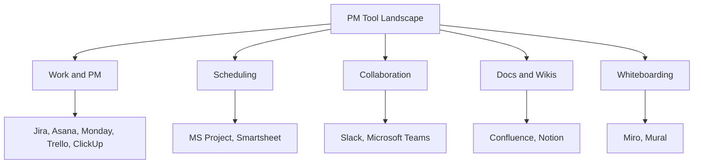
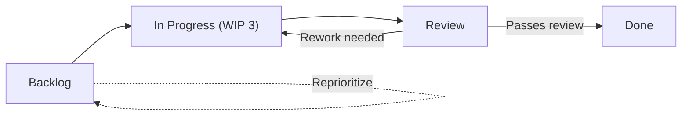
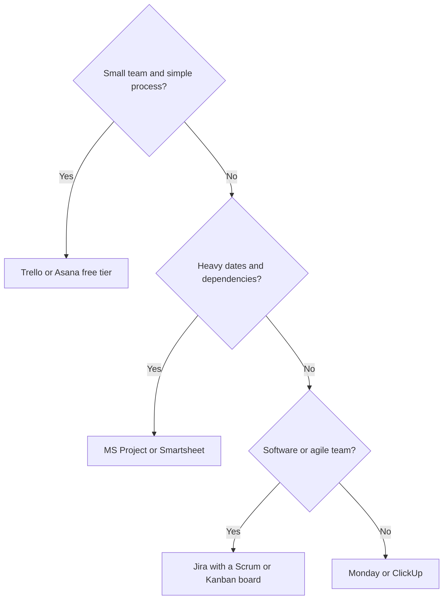

# Module 16 — Tools of the Trade

> ⏱️ **Estimated study time:** ~30 min · 🎚️ **Level:** Beginner · 📋 **Prerequisites:** Module 15 · Part of the **Sales -> Project Management Reviewer.**

*Consider this the lazy-Sunday chapter — the one where you sink into the couch, no pressure, and meet the cast of characters you'll be living with for the rest of your PM life.*

## 🎯 What you'll be able to do

- [ ] Name the major categories of PM software and give a real example product in each.
- [ ] Explain how your **methodology** (predictive vs. agile) points you toward different tools.
- [ ] Read the anatomy of a board — backlog, columns, swimlanes, WIP limits, and workflow.
- [ ] Pick a tool sensibly by team size, budget, and process maturity, and spot **over-tooling**.
- [ ] Build a free demo board you can show off in interviews and your portfolio.

## 👋 From your mentor

Okay, real talk — breathe out. This is the easy, fun module, the romantic-getaway episode after a few intense chapters. You spent years inside a CRM watching deals slide from *Lead* to *Qualified* to *Closed Won*. A project management tool is the exact same idea wearing a slightly different outfit, just with **work items** instead of **deals**. The muscle memory you already have transfers almost one-for-one.

So don't let the logos intimidate you — they're just the new love interests, and you've dated this type before. Tools are simply where the work lives. The thinking you built up in Modules 1–15 is what actually matters; the tool is the steering wheel, not the car. Slide in. Let's get you comfortable behind the wheel.

## 🗺️ The tool landscape, by category

You don't need to learn every product — nobody's quizzing you on all of them at the door. You need to recognize the **categories**, know one or two flagship names in each, and understand what job each one does. Here's the map, and like any good ensemble cast, everyone has a role.

| Category | What it's for | Flagship examples | Your sales analogy |
|---|---|---|---|
| **Work / PM management** | Tracking tasks and tickets through stages | Jira, Asana, Monday, Trello, ClickUp | Your CRM's pipeline of deals |
| **Scheduling** | Timelines, dependencies, Gantt charts | MS Project, Smartsheet | A forecast calendar with hard close dates |
| **Collaboration & chat** | Day-to-day team talk, quick decisions | Slack, Microsoft Teams | The sales floor / your team channel |
| **Docs & wikis** | Durable knowledge, specs, decisions | Confluence, Notion | Your shared playbook and battlecards |
| **Whiteboarding** | Visual brainstorming, mapping, retros | Miro, Mural | A planning-session whiteboard with sticky notes |

*The five tool families you'll meet on almost any project, with the headline products in each.*

### Work / PM management (the core)

This is where most of your day will happen — your home base, your favorite booth at the café. These tools track discrete **work items** — tasks, stories, bugs, tickets — as they move through stages toward "done."

- **Jira** — the heavyweight. Dominant in software teams, deeply Scrum/Kanban-friendly, very configurable, and a little high-maintenance for tiny teams (the brooding lead who needs a backstory).
- **Trello** — the friendliest on-ramp. A pure board of cards. Great for learning the concepts and running small projects without fuss.
- **Asana** — clean task and project tracking, beloved by marketing and operations teams.
- **Monday** — colorful, spreadsheet-flavored, highly visual; strong for non-software work.
- **ClickUp** — the "everything" tool that tries to do tasks, docs, and goals all in one place.

> 🔁 **Sales → PM bridge:** You already lived in a CRM all day. Salesforce or HubSpot moved a **deal** through *Lead → Qualified → Proposal → Closed*. A PM tool moves a **work item** through *To Do → In Progress → Review → Done*. Same columns-and-cards mental model — just swap "deal" for "task." If you can run a pipeline, you can run a board. This is less a career change and more a wardrobe change.

### Scheduling tools

When dates, dependencies, and a long timeline matter — when the whole thing has a ticking clock — you reach for scheduling tools.

- **MS Project** — the classic predictive-planning tool. Strong **Gantt charts**, critical path, resource leveling. The natural home for a waterfall plan.
- **Smartsheet** — a spreadsheet that grew up into a project tool. Gantt views plus grid familiarity; easier for people who think in rows and columns.

### Collaboration & chat

- **Slack** and **Microsoft Teams** are where the conversation happens — quick questions, decisions, stand-up notes, and integrations that ping you the moment a board changes. Think of it as the group chat that actually gets things done. Teams comes bundled with Microsoft 365, so many corporate shops default to it; Slack is the one tech and startup culture has a crush on.

### Docs & wikis

- **Confluence** (which pairs tightly with Jira) and **Notion** are your **single source of truth** — the things that should outlive a chat message. Project charters, meeting notes, decisions, specs, runbooks. If chat is the conversation, the wiki is the memory. (And we both know memory is what saves you when someone insists "that was never the plan.")

### Whiteboarding

- **Miro** and **Mural** are infinite digital whiteboards for brainstorming, story mapping, risk workshops, and retrospectives. Sticky notes you can drag around with a remote team — all the fun of a planning whiteboard, none of the dried-out markers.

## 🧭 How methodology drives tool choice

Here's the plot twist most beginners miss: **the tool follows the method, not the other way around.** Pick how you'll run the work (Modules 13–15), *then* pick a tool that supports it. Choosing the tool first is like booking the venue before you know if it's a wedding or a book club.

| If your project is... | You care most about... | Typical tool & view |
|---|---|---|
| **Predictive / waterfall** | Dates, dependencies, critical path | MS Project or Smartsheet **Gantt** |
| **Agile / Scrum** | Backlog, sprints, velocity | Jira **Scrum board** with sprints |
| **Kanban / continuous flow** | Flow, WIP limits, cycle time | Jira/Trello **Kanban board** |
| **Hybrid** | A milestone plan *and* a team board | A Gantt for the plan + a board for delivery |

A Scrum team plans in two-week sprints and lives on a **board**. A predictive, construction-style project plans the whole thing up front and lives on a **Gantt chart**. The same software vendor might offer both views — what changes isn't the tool, it's *how you use it*.

> ⏸️ Heads up: this is a lovely place to pause if you need to. The categories above are the 80% you'll use constantly. The rest of this module is hands-on detail — it'll wait right here for you.

## 🧱 Anatomy of a board

Here's the secret no one tells you up front: nearly every PM tool, no matter the logo, is built from the same five parts. Learn these once and you can walk up to any board on day one and read it like the back of a familiar novel.

**1. Backlog** — the holding pen. Every task, story, or idea that *might* get done lives here, usually prioritized top-to-bottom. Think of it as your full list of unworked leads before you decide who's worth calling today.

**2. Columns / states** — the stages a work item passes through, left to right. A simple set is `Backlog → In Progress → Review → Done`. Each column is a **state** the work can be in.

**3. Swimlanes** — horizontal rows that group cards across all columns. You might lane by person, by feature, by priority, or by "expedite vs. normal." They answer *whose* or *which kind of* work without changing the stages.

**4. WIP limits** (Work In Progress) — a cap on how many cards can sit in a column at once. If "In Progress" is capped at 3 and it's full, you **finish something before you start something new.** This is the single most powerful habit a board will ever teach you.

**5. Workflow** — the rules for how a card legally moves from one state to the next, including any "definition of done" gate before it reaches the final column.

| Part | Question it answers | Sales echo |
|---|---|---|
| Backlog | What *could* we work on? | Your full lead list |
| Columns | What *stage* is this in? | Pipeline stages |
| Swimlanes | *Whose* / *which kind*? | Territory or rep rows |
| WIP limits | Are we overcommitted? | Capping live opportunities per rep |
| Workflow | How does it move & "done"? | Stage-exit criteria |

*A sample board workflow: cards flow left to right, can bounce back from Review to In Progress, and only reach Done after passing review.*

> 🔁 **Sales → PM bridge:** A **WIP limit** is the same discipline your best sales managers already preached — "stop adding new opportunities until you advance the ones you have." Capping In Progress is that exact anti-thrash rule applied to tasks. Finishing beats starting. (It's the will-they-won't-they tension of project work: stop flirting with new cards and *close* the one in front of you.)

## 🎯 Picking a tool without over-tooling

Choosing software is mostly about matching the tool to your **team size**, **budget**, and **process maturity** — and resisting the very real urge to buy more than you can use. It's the dating rule, honestly: pick the one that fits your life, not the flashiest one in the room.

| Factor | Lighter need | Heavier need |
|---|---|---|
| **Team size** | 1–8 people → Trello, Notion, Asana | 30+ / many teams → Jira, Smartsheet |
| **Budget** | Free tier or low cost | Paid seats, admin, integrations |
| **Process maturity** | New to PM → simple board | Established cadence → custom workflows, automation |

A handy rule of thumb:

*A quick decision tree — start from team size and process, not from the flashiest brand.*

**The danger of over-tooling.** It's tempting to buy the powerful tool and configure fifteen custom fields, four automations, and three integrations before a single task ships. Don't. That's the classic too-much-too-soon mistake, and it has real costs:

- **Setup tax** — hours spent configuring instead of delivering.
- **Adoption drag** — the team quietly reverts to spreadsheets and chat because the tool is a chore.
- **Data rot** — fields nobody fills in, so your reports start telling little lies.

A simple board everyone actually updates beats a sophisticated one nobody trusts. Start minimal; add structure only when the pain is real. You can always grow into Jira — but you can't un-confuse a team that drowned on day one.

## 🆓 Getting hands-on for free

You learn this by *doing*, not by admiring it from across the room — and almost every tool has a free tier built for exactly that.

- **Trello** — free plan, the fastest possible way to build your first board. Start here.
- **Jira** — free for up to 10 users; spin up a project and a real Scrum or Kanban board.
- **Asana** and **ClickUp** — generous free tiers for personal projects.
- **Notion** — free personal plan for your docs/wiki practice.

**Build a portfolio demo board.** This is pure gold in interviews. Take a small, relatable project — "plan a product launch" or even "organize my career switch into PM" — and model it:

1. Create a board with `Backlog → In Progress → Review → Done`.
2. Add 10–15 realistic cards with descriptions and due dates.
3. Set a WIP limit on In Progress.
4. Add a couple of swimlanes (e.g., by workstream).
5. Take a screenshot. Now you can *show*, not just claim, that you know your way around a board.

That one artifact turns "I'm learning PM" into "here's a board I built" — and that's the difference between telling someone you're interesting and being interesting.

## ⏸️ Pause & reflect

This is a safe place to stop and come back later — dog-ear the page, go refill the coffee, no one's keeping score.

- Which tool **category** would your old sales team have benefited from most, and why?
- Think of a CRM stage you knew cold. What "definition of done" gated a deal from one stage to the next? That's a **workflow rule** — congratulations, you've been designing these for years.
- Be honest with yourself: are you tempted to reach for the most powerful tool, or the *right-sized* one?

## 🧠 Check yourself

**1. Your team of 5 is brand new to PM and has no budget. What do you reach for?**

Show answer

A free-tier, simple board — Trello (or Asana/Jira free). Match the tool to small team size, low budget, and early process maturity. Avoid over-tooling.

**2. A construction-style project with hard dates and many dependencies — predictive board or Gantt?**

Show answer

A Gantt chart in a scheduling tool like MS Project or Smartsheet. Predictive work that lives or dies on dates and dependencies belongs on a timeline, not a flow board.

**3. What does a WIP limit do, and why is it useful?**

Show answer

It caps how many items can sit in a column (e.g., In Progress) at once. It forces the team to finish work before starting new work, exposing bottlenecks and reducing context-switching.

**4. Name the five parts of a board.**

Show answer

Backlog, columns/states, swimlanes, WIP limits, and the workflow (rules for movement plus the "done" gate).

**5. What's the risk of over-tooling, in one sentence?**

Show answer

You spend time and money configuring a tool so complex the team abandons it, leaving you with rotten data and no adoption — a simple board everyone updates is better.

**6. Which tool pairs most naturally with Confluence, and what does that pairing give you?**

Show answer

Jira. Together they cover work tracking (Jira board) plus a durable wiki/source of truth (Confluence) — the board for delivery, the wiki for memory.

## 🧰 Try it

Spend 20 minutes building your first demo board — think of it as a first date with the tool, low stakes, just see if you click:

1. Sign up for **Trello** (free) — or Jira free if you want the Scrum/agile flavor.
2. Create a board called **"My PM Career Switch."**
3. Add columns: `Backlog → In Progress → Review → Done`.
4. Add 8–10 cards (e.g., "Finish Module 16," "Build portfolio board," "Draft PM resume," "Practice Scrum vocabulary"). Give 3 of them due dates.
5. Set a **WIP limit of 2** on In Progress and drag two cards into it.
6. Take a screenshot and save it — that's your first portfolio artifact.

When you're done, you'll have *used* the exact concepts from this module, not just read them. Big difference.

## 🔑 Key terms

- **Backlog** — the prioritized holding list of all work that might be done.
- **Column / state** — a stage a work item passes through (e.g., In Progress).
- **Swimlane** — a horizontal row grouping cards by person, type, or priority.
- **WIP limit** — a cap on items allowed in a column at once, to force finishing over starting.
- **Workflow** — the rules for how a card moves between states and what counts as done.
- **Gantt chart** — a timeline view showing tasks, durations, and dependencies; core to scheduling tools.
- **Over-tooling** — adopting more tool complexity than the team can absorb, hurting adoption and data quality.
- **Free tier** — the no-cost plan of a tool, enough to learn and build a demo board.

---
⬅️ **Previous:** [Module 15 — Agile & Scrum, In Depth](15-agile-and-scrum.md) · 🏠 **[Reviewer Home](../README.md)** · ➡️ **Next:** [Module 17 — Metrics, KPIs & Reporting](17-metrics-and-reporting.md)
