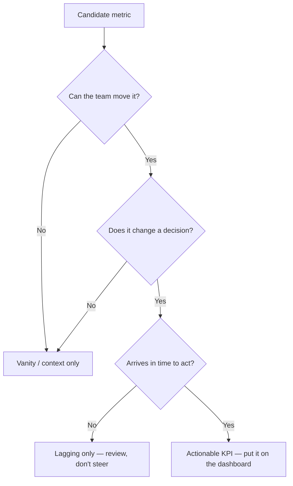
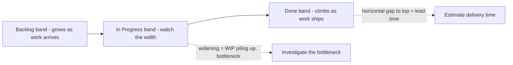
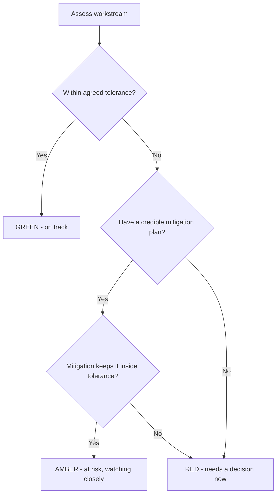
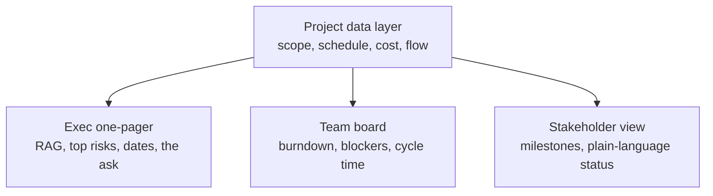

# Module 17 — Metrics, KPIs & Reporting

> ⏱️ Estimated study time: **~35 min** · 📈 Level: **Intermediate** · 📋 Prerequisites: **Module 08** · Part of the **Sales -> Project Management Reviewer**.

*Every dashboard tells a story. Some of them are lying to your face — and this module teaches you to catch the liar.*

## 🎯 What you'll be able to do

- [ ] Tell a **good metric** from a vanity number, and a **leading** indicator from a **lagging** one.
- [ ] Read **EVM** health signals (**CPI** and **SPI**) at a glance and say what they mean out loud.
- [ ] Explain **velocity, cycle time, lead time, throughput**, and read a **cumulative flow diagram**.
- [ ] Build a **RAG** status and tailor a report to its audience — executive one-pager vs. team detail.
- [ ] Set a sane **reporting cadence** and spot (and prevent) **"watermelon" reporting**.

## 👋 From your mentor

Okay, real talk: you already live by numbers. Quota, win rate, pipeline coverage, days-to-close — you read those like a weather report and quietly rearrange your whole week around them. Project management is that exact same instinct, just pointed at *delivery* instead of *revenue*. Same you, new genre.

Here's the comforting part: the hardest thing about metrics was never the math. It's **discipline** — picking the handful of numbers that actually change what you do, and being honest about what they're telling you. You've been doing that under quota pressure for years, sometimes at 4:55 on the last Friday of the month. We're just translating a skill you already have. Let's go.

---

## 📐 What makes a good metric

A number is only worth tracking if it changes what you *do*. Everything else is decoration. Before anything earns a spot on your dashboard, make it pass this little screening — think of it as vetting a date before you let it meet your friends:

| Quality | What it means | Sales analogy |
|---|---|---|
| **Actionable** | Moving it is within your team's control | "Calls booked" beats "market size" |
| **Decision-driving** | Someone behaves differently based on it | A red KPI triggers a re-plan |
| **Timely** | It arrives while you can still act | A leak you see *during* the sprint, not after |
| **Clearly defined** | Everyone computes it the same way | One agreed definition of "qualified lead" |
| **Hard to game** | Can't be juiced without real progress | Not just "activity for activity's sake" |

### Leading vs. lagging indicators

This is the single most useful distinction in the whole module, so let's lock it in for good.

- A **lagging indicator** measures an *outcome that already happened*. It's the scoreboard after the buzzer. Example: **schedule variance at month-end**, **defects found in production**, **actual cost**.
- A **leading indicator** measures an *input or early signal* that tends to predict the outcome — early enough that you can still change it. Example: **number of open blockers**, **test pass rate trend**, **size of the unrefined backlog**.

You want **both**. Lagging numbers tell you *whether you won*; leading numbers tell you *whether you're about to* — back when you can still do something about it.

> 🔁 **Sales → PM bridge:** Closed-won revenue is a **lagging** indicator — by the time it lands, the quarter is already decided, for better or worse. Discovery calls booked and demos completed are **leading** indicators: nudge them this week and you bend next month's revenue curve. In PM, "blockers cleared this week" is your discovery-calls-booked. Watch the leading number daily; the lagging number tends to take care of itself.

### Vanity vs. actionable metrics

A **vanity metric** looks impressive and feels *amazing* but changes exactly zero decisions. "Total lines of code," "total tickets ever closed," "hours logged" — big, flattering numbers that only ever go up and never once tell you to *do* anything. They're the metric equivalent of a text that just says "haha."

An **actionable metric** is tied to a decision, and usually to a comparison or a rate: *cycle time this sprint vs. last*, *CPI trending below 1.0*, *cumulative flow band widening*. Quick test: if you can't finish the sentence "...so we will **\_\_\_**," it's probably vanity.

*The bouncer at the dashboard door: run every proposed number through this gate before it gets in.*

---

## 🔮 Predictive metrics: an EVM health check

Module 08 walked you through Earned Value Management in full — this is the **30-second dashboard-glance** version you'll actually use mid-status-meeting when someone asks "so... are we okay?" EVM blends scope, schedule, and cost into two ratios anyone can read.

The three base values:

- **PV — Planned Value:** budgeted cost of the work *scheduled* by now.
- **EV — Earned Value:** budgeted cost of the work *actually completed*.
- **AC — Actual Cost:** what you *really spent* to complete it.

From those, the two health ratios:

| Index | Formula | Reads as | Healthy |
|---|---|---|---|
| **CPI** (Cost Performance Index) | `CPI = EV / AC` | "Value earned per dollar spent" | **≥ 1.0** |
| **SPI** (Schedule Performance Index) | `SPI = EV / PV` | "Progress vs. plan" | **≥ 1.0** |

How to read them at a glance:

- **CPI = 1.0** → on budget. **CPI = 0.80** → you're getting 80 cents of work per dollar (over budget). **CPI = 1.10** → under budget.
- **SPI = 1.0** → on schedule. **SPI < 1.0** → behind. **SPI > 1.0** → ahead.

> **Worked example:** You planned to have \$100k of work done (PV) and have actually completed \$90k worth (EV), spending \$120k to do it (AC).
> **SPI = 90 / 100 = 0.90** → ~10% behind schedule.
> **CPI = 90 / 120 = 0.75** → you're burning \$1.33 for every \$1 of value. That's a red flag worth a calm, grown-up re-plan conversation *today*, not a panicked one at quarter-end.

Here's what makes CPI and SPI special: they're **predictive**. A CPI stuck below 1.0 almost never heals itself on its own — so it forecasts a cost overrun while you still have runway to react. That's the whole trick of EVM: it gives you a *leading* read on a *lagging* outcome. It's the early plot twist, not the autopsy.

---

## 🌊 Agile & flow metrics

If your team runs Scrum or Kanban (see the Scrum mechanics module), you'll lean on **flow metrics** instead of EVM. These measure how work *moves* through the system — less "how much did we spend," more "where does everything keep getting stuck."

| Metric | Definition | What it tells you |
|---|---|---|
| **Velocity** | Story points completed per sprint | Capacity for *planning the next sprint* (team-internal only) |
| **Throughput** | Number of work items finished per period | Raw delivery rate, point-free |
| **Cycle time** | Time from *work started* → *done* | How fast the team executes once it picks something up |
| **Lead time** | Time from *request made* → *done* | What the *customer* actually waits |
| **WIP** | Items in progress right now | Overload signal; high WIP usually means slow cycle time |

A few honest cautions your sales brain will appreciate immediately:

- **Velocity is a planning tool, not a performance score.** Comparing two teams' velocities is like ranking two reps by raw "activities" with zero context — meaningless, and quietly toxic. Points are relative to each team. Don't do it.
- **Lead time ≥ cycle time**, always — lead time includes the wait in the queue *before* anyone even starts. The gap between them is pure customer waiting. Often, shrinking the queue beats working faster.
- **Throughput** shines when your items are similar in size, because it sidesteps the whole "but how big is a point, really" debate.

### The cumulative flow diagram (CFD)

A **CFD** stacks the count of items in each workflow state over time. The secret is you read it by the **bands**, not the lines:

- A **widening band** (especially "In Progress") = work piling up, WIP climbing, trouble quietly brewing.
- **Parallel, steady bands** = healthy, predictable flow. This is the boring-in-a-good-way picture.
- The **horizontal gap** between the top of "Done" and the top of the stack ≈ **lead time**.
- The **vertical gap** between the "arrived" and "departed" lines ≈ **WIP**.

*Concept view of a cumulative flow diagram: a fat, growing middle band is your early warning that work is stuck — the suspicious bulge that says "investigate me."*

> 🔁 **Sales → PM bridge:** Cycle time is your **days-to-close**, and a CFD is your **pipeline-by-stage report**. When deals bunch up in "Proposal Sent," you know exactly which stage to go unstick. Same move here: when the "In Progress" band starts to bulge, you've just spotted the stage strangling your delivery. Follow the clue.

---

## ⏸️ Pause & reflect

Natural stopping point — close the laptop, top off the coffee, come back whenever. The concepts above are the foundation; reporting (below) is how you *communicate* them so they actually matter.

Before you move on, sit with these two:

1. In your last role, name one **lagging** metric you were measured on and one **leading** metric that predicted it. Which one did you actually *manage* day to day?
2. Think of a number a past manager was obsessed with that never once changed a single decision. What made it **vanity**?

No wrong answers, no grade. Jot a sentence each and pick it back up when you're ready.

---

## 🚦 Status reporting

A metric nobody reads is wasted effort. Reporting is where measurement quietly turns into influence — it's the difference between *knowing* something and *getting people to act on it*.

### RAG status

**RAG** = **Red / Amber / Green**, a traffic-light health summary for a project, workstream, or KPI.

| Status | Meaning | Action expected |
|---|---|---|
| 🟢 **Green** | On track within tolerance | Keep going; no help needed |
| 🟡 **Amber** | At risk; a threshold is threatened | Mitigation underway; *heads-up* to sponsors |
| 🔴 **Red** | Off track; tolerance breached | Needs a decision or escalation **now** |

The whole trick is **defining the thresholds in advance** so the color is earned, not just a vibe you felt that morning. Tie it to your tolerances (recall the threshold idea from Module 08): e.g. "Amber if SPI < 0.95; Red if SPI < 0.90 *or* any milestone slips past its baseline date." Decide the rules before you're emotionally invested in the answer.

*A RAG decision flow: color is earned by tolerance and mitigation, never by gut feel or wishful thinking.*

### Dashboards and tailoring to the audience

Same data, **packaged completely differently** depending on who's reading. This is pure sales instinct — you would never pitch a CFO the way you pitch an end user, and you'd never bring the same energy to a first date and a Sunday dinner with the in-laws.

| Audience | Wants | Format | Cadence |
|---|---|---|---|
| **Executives / Sponsors** | Are we on track? Any decisions for me? | One-pager: RAG, top 3 risks, key dates, asks | Bi-weekly / monthly |
| **The delivery team** | What's blocked, what's next | Burndown, board, cycle time, blocker list | Daily / per-sprint |
| **Stakeholders / Clients** | Progress vs. promises, what's coming | Milestone view + plain-language highlights | Per-milestone |

**Executive one-pager** = the *headline*: three colors, three risks, three dates, one clear ask. **Team detail** = the *engine room*: the board, the burndown, the blocker log. Send the engine-room view to a sponsor and you bury your own signal under noise; send the headline to your team and you starve them of what they actually need to act.

*One source of truth, three tailored views — same numbers, audience-fit packaging.*

### Cadence and the "watermelon" trap

**Reporting cadence** is the rhythm: daily standup (team), weekly or bi-weekly status (stakeholders), monthly steering (sponsors). Match the frequency to how fast decisions actually need to be made — too frequent and you're wasting everyone's afternoon; too rare and problems get to hide in the dark and grow.

And here's the one to tattoo on your brain: the **watermelon report** — 🟢 **green on the outside, 🔴 red on the inside**. It looks perfectly healthy on the dashboard while the project quietly catches fire underneath. This is the villain of the module. It sneaks in when status is wishful, thresholds are fuzzy, or — most often — people are scared to deliver bad news.

How to keep your reports honest:

- **Define RAG thresholds up front** so green is *earned*, not *claimed*.
- **Lead with leading indicators** — they expose trouble before the lagging scoreboard ever catches up.
- **Make amber safe.** A team that gets punished for amber will paint everything green and smile through it. Reward the early flag, not the brave face.
- **Pair color with evidence** — a number or trend standing behind every single light.

> A green status with no supporting metric is a *hope*, not a *report*. You learned in sales never to forecast a deal as "commit" on a hunch and a good feeling — exact same rule applies here.

---

## 🧠 Check yourself

**1. CPI = 0.85 — what does it mean, and is it good?**

Show answer

You're earning \$0.85 of planned value for every \$1.00 actually spent — you're **over budget** (CPI < 1.0). Not good; it predicts a cost overrun unless something changes.

**2. Velocity vs. throughput — what's the difference, and which is safe to compare across teams?**

Show answer

**Velocity** = story points completed per sprint (uses the team's *relative* point scale). **Throughput** = number of items completed per period (point-free). Neither should be used to *rank* teams, but throughput at least avoids the "a point means different things to different teams" problem. Velocity is strictly a within-team planning tool.

**3. Lead time or cycle time — which does the customer feel, and why is it always the longer one?**

Show answer

The customer feels **lead time** (request → done). It's always **≥ cycle time** (start → done) because lead time also includes the time the item waited in the queue *before* anyone started working it.

**4. Give one leading and one lagging indicator for a software delivery project.**

Show answer

**Leading:** open blocker count, test pass-rate trend, unrefined backlog size, WIP. **Lagging:** production defects, actual cost (AC), milestone slip at month-end. (Any reasonable pair works — leading = early signal you can still act on; lagging = outcome already realized.)

**5. What is "watermelon" reporting and what's the best single defense against it?**

Show answer

A status that's **green on the outside, red on the inside** — looks fine on the dashboard while real trouble hides. Best defense: **define RAG thresholds in advance** (so green is earned) and **make amber psychologically safe** so people flag risk early instead of painting over it.

**6. A sponsor asks for "the status." Do you send the team board? Why or why not?**

Show answer

No. Send the **executive one-pager** — RAG, top 3 risks, key dates, and any decision you need from them. The team board (burndown, blocker log, cycle time) is engine-room detail that buries the signal an executive needs.

---

## 🧰 Try it

**Build a one-page status from scratch (15 min).**

Pick any project you actually know — a past sales initiative, a home renovation, planning a wedding. Then:

1. **List 5 candidate metrics.** Run each through the vanity gate (Can we move it? Does it drive a decision? Timely?). Cross out the ones that flunk.
2. **Label each survivor** leading or lagging. Make sure you've got at least one of each.
3. **Set a RAG threshold** for your top metric — write the *exact* numbers that make it amber and red. No vibes allowed.
4. **Draft the one-pager:** one overall RAG color, your top 3 risks, 3 key dates, and one clear ask for a sponsor. Keep it to a single screen.

Pull this off and you can walk into any status meeting and *run* it. That's a PM skill hiring managers test for directly — so this little exercise is quietly interview prep too.

---

## 🔑 Key terms

- **KPI (Key Performance Indicator)** — a metric chosen because it drives a specific decision or goal.
- **Leading indicator** — an early input/signal that predicts an outcome in time to act on it.
- **Lagging indicator** — a metric of an outcome that has already occurred (the scoreboard).
- **Vanity metric** — a number that looks good but changes no decision.
- **CPI (Cost Performance Index)** — `EV / AC`; value earned per dollar spent. ≥ 1.0 is healthy.
- **SPI (Schedule Performance Index)** — `EV / PV`; progress vs. plan. ≥ 1.0 is healthy.
- **Velocity** — story points completed per sprint; a within-team planning input.
- **Throughput** — count of work items completed per period.
- **Cycle time** — duration from work *started* to *done*.
- **Lead time** — duration from request *made* to *done*; what the customer waits.
- **WIP (Work In Progress)** — items being worked on simultaneously.
- **Cumulative Flow Diagram (CFD)** — stacked-band chart of items per workflow state over time; reveals WIP and lead time.
- **RAG status** — Red/Amber/Green traffic-light health summary tied to defined tolerances.
- **Reporting cadence** — the agreed rhythm at which status is communicated.
- **Watermelon reporting** — status green on the surface but red underneath; hidden trouble.

---
⬅️ **Previous:** [Module 16 — Tools of the Trade](16-tools-of-the-trade.md) · 🏠 **[Reviewer Home](../README.md)** · ➡️ **Next:** [Module 18 — Negotiation, Conflict & Soft Skills](18-negotiation-conflict-softskills.md)
