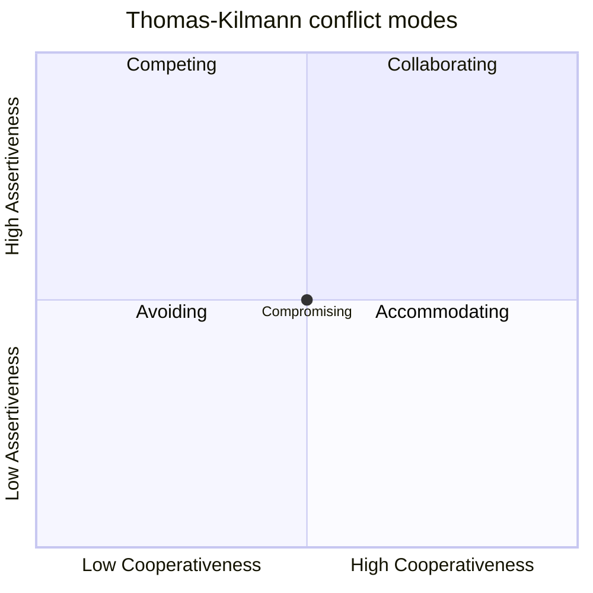
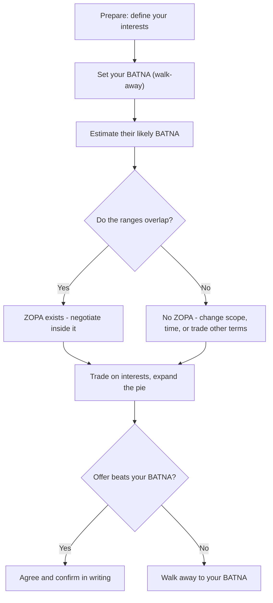
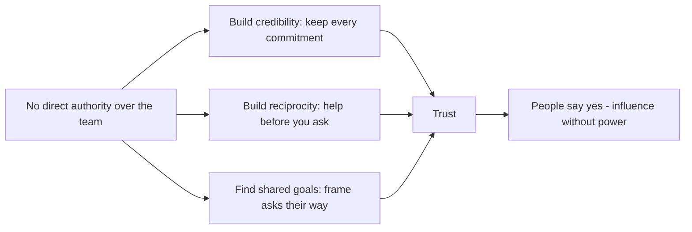
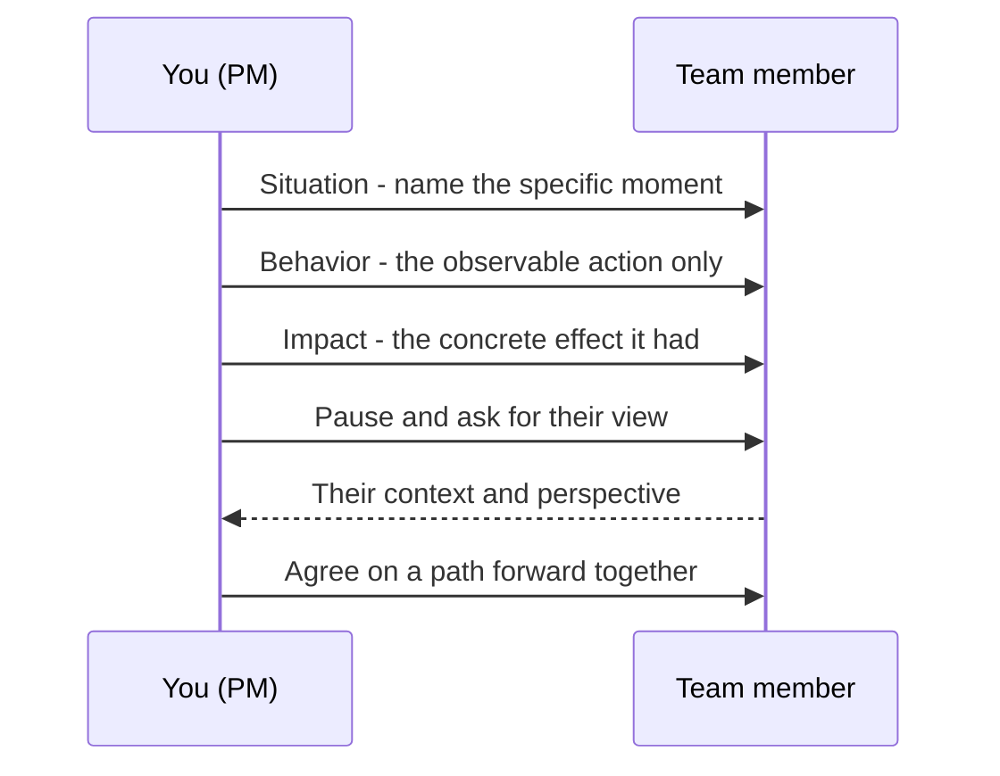

# Module 18 — Negotiation, Conflict & Soft Skills

> **Estimated study time:** ~40 min · **Level:** Intermediate · **Prerequisites:** [Module 10](10-resources-teams-leadership.md) · Part of the **Sales -> Project Management Reviewer**.

## 🎯 What you'll be able to do

- [ ] Name the five Thomas-Kilmann conflict modes and pick the right one for a given moment.
- [ ] Use **BATNA** and **ZOPA** to walk into any negotiation knowing your floor and your room.
- [ ] Apply **principled negotiation** — argue over interests, not positions, and keep people separate from the problem.
- [ ] Influence people who don't report to you using reciprocity, credibility, and shared goals.
- [ ] Deliver tough feedback cleanly with the **SBI** model and stay calm under pressure with **emotional intelligence**.

## 👋 From your mentor

Here's the secret nobody tells career-changers: the "soft skills" in project management are the hardest, most valuable skills on the job — and you already have most of them. You've spent years reading the room, handling objections, and getting a "yes" out of someone who started at "no." That's negotiation. That's conflict resolution. That's influence.

The only thing that changes when you move into PM is the *goal*. In sales you aimed all that skill at **closing**. As a PM you aim it at **alignment** — getting a roomful of people who answer to different bosses to row in the same direction. Same muscles, new target. Let's tune them.

## Conflict is normal — and often healthy

First, breathe. Conflict on a project is not a sign something has gone wrong. It's a sign that real people with real stakes are paying attention. A team that never disagrees is usually a team that's disengaged, or one where the quiet person is sitting on the risk that sinks you in month four.

There are two flavors worth separating:

| Type | What it looks like | Healthy? |
|---|---|---|
| **Task / cognitive conflict** | Disagreeing about the *work* — scope, approach, priorities, design | Usually yes — it pressure-tests ideas |
| **Relationship / affective conflict** | Disagreeing about the *person* — personality clashes, blame, tone | Rarely — it drains the team |

Your job as PM isn't to eliminate conflict. It's to **keep conflict on the task and off the person**. When two engineers argue hard about an architecture choice and shake hands after — that's a win. When they stop talking to each other — that's the fire to put out.

> 🔁 **Sales → PM bridge:** An objection on a sales call was never a rejection — it was information about what the buyer actually cared about. Conflict on a project is the same signal. "We can't hit that date" isn't your team being difficult; it's data about a constraint you didn't see. Lean into it the way you leaned into "it's too expensive."

## The Thomas-Kilmann conflict modes

The **Thomas-Kilmann Instrument (TKI)** maps how people handle conflict along two axes:

- **Assertiveness** — how hard you push for *your own* concerns.
- **Cooperativeness** — how much you work for the *other person's* concerns.

Cross those two axes and you get five modes. None is "always right" — the skill is matching the mode to the moment.

*Assertiveness rises up the vertical axis; cooperativeness rises across — compromising sits dead center.*

Here's when each one actually fits:

| Mode | Assertive? | Cooperative? | Use it when… | Watch out for… |
|---|---|---|---|---|
| **Avoiding** | Low | Low | The issue is trivial, emotions are too hot right now, or you need time to gather facts | Using it to dodge a real problem that festers |
| **Accommodating** | Low | High | You're wrong, the issue matters far more to them, or you're banking goodwill | Becoming a doormat; people stop respecting your "no" |
| **Competing** | High | Low | A true emergency, a safety/ethics/legal line, or an unpopular call that must be made fast | Burning trust if you over-use it |
| **Compromising** | Medium | Medium | Both sides have valid points, the stakes are moderate, and you need a deal *now* | "Splitting the difference" can leave both sides half-satisfied |
| **Collaborating** | High | High | The stakes are high, both sets of concerns matter, and you have time to dig | It's slow — don't collaborate over where to eat lunch |

**The default-to-best mode is collaborating (problem-solving).** It's the only mode where both people can walk away with *more* than they came in with, because you invent options instead of dividing a fixed pie. PMI and most modern PM thinking treat collaborate/problem-solve as the go-to for anything that matters. The other four are tools you reach for deliberately, not habits you fall into.

The mistake new PMs make is having *one* default mode (usually avoiding or accommodating, because they're afraid to rock the boat) and using it for everything. You came from sales — you already know how to be assertive *and* warm at the same time. That's the collaborating quadrant. You live there.

## Negotiation fundamentals

Every negotiation — a deadline, a budget, who owns a deliverable — runs on three ideas. Learn these and you'll never walk in blind.

### BATNA — your walk-away power

**BATNA = Best Alternative To a Negotiated Agreement.** It's what you'll do if this deal falls through. Your BATNA is your real source of power, because it sets the point below which you should walk away.

Example: You're negotiating with a vendor for a 3-week integration. If you can build it in-house in 4 weeks instead, *that's* your BATNA. Any vendor offer worse than "4 weeks in-house" is a deal you should refuse. Knowing that, you negotiate from calm instead of fear.

The two rules of BATNA:
1. **Know yours before you start.** Never negotiate without an answer to "what do I do if this is a no?"
2. **Quietly improve it.** The better your alternative, the less you need this deal — and the better you'll do in it.

### ZOPA — the room where a deal lives

**ZOPA = Zone Of Possible Agreement.** It's the overlap between what you'll accept and what they'll accept. If your max and their min overlap, a deal exists. If they don't, no amount of charm closes it — you need to change the variables.

*A negotiation is just checking whether a ZOPA exists, then trading inside it until the offer beats your BATNA.*

A quick worked example. You want a feature delivered by **June 1**; you'd grudgingly accept **June 15**. The vendor can't go earlier than **June 10** but would happily take **July 1**. Your acceptable range (June 1–15) overlaps theirs (June 10 onward) between **June 10 and June 15** — *that's* the ZOPA. The deal lives there.

### Principled negotiation

This is the framework from *Getting to Yes* (Fisher & Ury). Four moves:

1. **Separate the people from the problem.** Attack the issue, not the human. "This timeline worries me" — not "you're being unrealistic."
2. **Focus on interests, not positions.** A *position* is what someone says they want ("I need it by Friday"). An *interest* is *why* ("my exec demo is Monday morning"). Positions collide; interests often don't. Maybe they don't need the whole feature Friday — just the demo-able slice.
3. **Invent options for mutual gain.** Brainstorm several ways forward before deciding. Phase the delivery, swap scope, add a contractor — expand the pie before you cut it.
4. **Insist on objective criteria.** Anchor on something neutral — market rates, the velocity data, the contract — so it's not your will against theirs.

> 🔁 **Sales → PM bridge:** "Focus on interests, not positions" is *discovery*. You never sold to the surface request ("I want the cheaper plan"); you dug for the real driver ("my CFO is watching this quarter's spend"). Same move here — the stakeholder yelling about the date usually cares about something underneath it. Find that and the fight dissolves.

## Influence without authority

Here's the jolt for every new PM: **you're accountable for the outcome but you usually have no direct power over the people delivering it.** The developers report to an engineering manager. The designer reports to a design lead. You can't fire anyone, promote anyone, or order anyone. Welcome to PM — you lead by influence, not authority.

Three reliable levers:

| Lever | How it works | In practice |
|---|---|---|
| **Reciprocity** | People help those who've helped them | Unblock someone, cover for them, give credit publicly — goodwill compounds |
| **Credibility** | People follow those they trust to know and to deliver | Be right about the small stuff; do exactly what you said you'd do, every time |
| **Shared goals** | People move for *their* reasons, not yours | Frame the ask around what *they* care about — their deadline, their reputation, their pain |

*With no org-chart power, a PM earns yes through credibility, reciprocity, and shared goals.*

Credibility is the slow one and the most important. You build it by being boringly reliable — your status reports are accurate, your meetings start on time, your "I'll find out and get back to you by 3" lands at 2:55. Every kept promise is a deposit. When you eventually need a big favor, you make a withdrawal.

> 🔁 **Sales → PM bridge:** You never had authority over your buyers either — you couldn't make anyone purchase. You closed by building trust, trading value, and tying the product to *their* goal. Influencing a cross-functional team is the exact same game with a longer relationship and no commission check.

## Difficult conversations & feedback: the SBI model

Sooner or later you'll have to tell someone their work missed, their tone is hurting the team, or they dropped a ball. Avoid it and the problem grows; botch it and you make an enemy. The fix is a tiny, sturdy structure: **SBI — Situation, Behavior, Impact.**

- **Situation** — anchor it in a specific time and place. ("In yesterday's client demo…")
- **Behavior** — describe the observable action, no judgment, no labels. ("…the API errored twice and we didn't have a fallback ready…")
- **Impact** — state the concrete effect on you, the team, or the goal. ("…the client lost confidence and asked to push the contract review.")

Then **stop and listen.** SBI opens a conversation; it isn't a verdict.

*SBI keeps feedback factual and specific, then hands the floor back so it stays a dialogue.*

Why it works: it strips out the two things that make feedback explode — **vague generalizations** ("you're always sloppy") and **mind-reading** ("you clearly didn't care"). You can argue with a label; you can't argue with "the API errored twice in the demo." SBI keeps you on observable facts, so the other person can hear you instead of defending themselves.

A few rules of the road:
- **Praise in public, correct in private.** SBI works for positive feedback too — and public praise builds the reciprocity bank.
- **Feedback fast, while it's fresh.** A clean SBI the same afternoon beats a saved-up grievance a month later.
- **One issue at a time.** Don't ambush someone with a list. Pick the one that matters.

## Emotional intelligence: the through-line

Everything above runs on one underlying skill: **emotional intelligence (EQ)** — the ability to read and manage emotions, yours and other people's. It's the thread connecting conflict modes, negotiation, influence, and feedback. Daniel Goleman's classic breakdown gives you four pillars; these three carry most of the load for a PM:

| Pillar | What it is | PM moment |
|---|---|---|
| **Self-awareness** | Noticing your own emotions as they happen | Catching that you're defensive *before* you fire off the email |
| **Self-regulation** | Managing your reaction instead of being run by it | Pausing 24 hours before responding to a hostile message |
| **Empathy** | Sensing what others feel and why | Reading that the "difficult" stakeholder is actually scared about their budget |

(The fourth pillar, **social skill / relationship management**, is what you *do* with the other three — and it's basically your entire sales background.)

The highest-leverage habit is the **pause**. When something lands wrong — a snippy Slack message, a meeting that ambushes you — the move is to notice the spike (self-awareness) and *not* react from it (self-regulation). "Let me think on that and come back to you" is a complete, professional sentence. It buys you the few seconds that separate a calm PM from a reactive one.

Empathy is your unfair advantage. You spent years reading micro-signals on calls — the hesitation that meant "I'm not sold," the tone that meant "I'm not the real decision-maker." Point that radar at your team and stakeholders and you'll spot a brewing problem long before it shows up in a status report.

## ⏸️ Pause & reflect

This is a perfectly safe place to stop, stretch, and come back later — none of this needs to be swallowed in one sitting.

- Think of a recent conflict (work or personal). Which Thomas-Kilmann mode did you reach for by reflex — and was it the right one for that moment?
- When you negotiated something lately, did you know your BATNA going in? How would walking in *knowing* it have changed how you felt?
- Which EQ pillar is your strongest from sales, and which one will you have to consciously practice as a PM?

Jot a sentence on each. You'll get far more from the rest of this reviewer if you connect it to your own experience as you go.

## 🧠 Check yourself

**1. What's the difference between a position and an interest in a negotiation?**

Show answer

A **position** is the specific thing someone says they want ("I need it by Friday"). An **interest** is the underlying *why* ("my exec demo is Monday"). Positions tend to collide head-on; interests often reveal room for a creative solution that satisfies everyone. Principled negotiation says to dig past positions to interests.

**2. You're about to negotiate a deadline with a vendor. Why must you know your BATNA first?**

Show answer

Your **BATNA** (Best Alternative To a Negotiated Agreement) is what you'll do if the deal falls through — e.g., build it in-house in 4 weeks. It sets your walk-away point: any offer worse than your BATNA should be refused. Knowing it lets you negotiate from confidence instead of fear, and stops you from accepting a bad deal just to avoid "no deal."

**3. Which Thomas-Kilmann mode is usually best for high-stakes issues where both sides' concerns matter, and why?**

Show answer

**Collaborating** (high assertiveness + high cooperativeness). It's the only mode that can produce a solution better than either side started with, because you invent options for mutual gain instead of dividing a fixed pie. The trade-off is time, so save it for things that actually matter.

**4. Rewrite this feedback using SBI: "You're always disorganized in meetings."**

Show answer

Strip the label and anchor it in facts. For example: *"In this morning's standup **(Situation)**, we jumped between three topics without an agenda **(Behavior)**, and we ran ten minutes over so the QA update got cut **(Impact)**."* Then pause and ask for their view. It's specific, observable, and hard to argue with.

**5. As a PM you have no authority to order the team around. Name two levers you use instead.**

Show answer

Any two of: **reciprocity** (help people before you ask for help), **credibility** (keep every commitment so people trust you), and **shared goals** (frame your ask around what *they* care about). Influence, not authority, is how PMs get things done.

**6. What is ZOPA, and what do you do if there isn't one?**

Show answer

**ZOPA** (Zone Of Possible Agreement) is the overlap between what you'll accept and what the other side will accept — the range where a deal is possible. If there's no overlap, charm won't close it: you change the variables (adjust scope, timeline, or trade other terms) to *create* an overlap, or you walk away to your BATNA.

## 🧰 Try it

**The 15-minute negotiation prep sheet.** Pick one real ask you need to make this week — a deadline, a resource, a scope cut. Before the conversation, write down:

1. **My interest:** the real *why* behind my ask (not the position).
2. **Their likely interest:** what does the other person actually care about here?
3. **My BATNA:** what I'll do if they say no.
4. **Likely ZOPA:** where do our acceptable ranges probably overlap?
5. **One collaborative option** that could give *both* of us more than a simple split.
6. **My SBI** (if feedback is involved): Situation / Behavior / Impact, in one clean sentence.

Have the conversation. Afterward, note which conflict mode you used and whether your BATNA prep changed how calm you felt. Do this five times and negotiation prep becomes a reflex — exactly like your pre-call discovery routine used to be.

## 🔑 Key terms

- **Conflict (task vs. relationship)** — disagreement about the work (often healthy) vs. about the person (rarely healthy); keep it on the task.
- **Thomas-Kilmann modes** — five conflict styles plotted on assertiveness × cooperativeness: avoiding, accommodating, competing, compromising, collaborating.
- **Collaborating** — high-assertiveness, high-cooperativeness problem-solving; the usual best mode for issues that matter.
- **BATNA** — Best Alternative To a Negotiated Agreement; your walk-away point and true source of negotiating power.
- **ZOPA** — Zone Of Possible Agreement; the overlap where a deal can exist.
- **Principled negotiation** — Fisher & Ury's method: separate people from the problem, focus on interests not positions, invent options for mutual gain, use objective criteria.
- **Position vs. interest** — what someone *says* they want vs. the underlying *why* behind it.
- **Influence without authority** — leading via reciprocity, credibility, and shared goals when you have no formal power.
- **SBI** — Situation-Behavior-Impact; a structure for clean, factual feedback.
- **Emotional intelligence (EQ)** — self-awareness, self-regulation, empathy, and social skill; the through-line under every soft skill here.

---
⬅️ **Previous:** [Module 17 — Metrics, KPIs & Reporting](17-metrics-and-reporting.md) · 🏠 **[Reviewer Home](../README.md)** · ➡️ **Next:** [Module 19 — Certifications Roadmap](19-certifications-roadmap.md)
