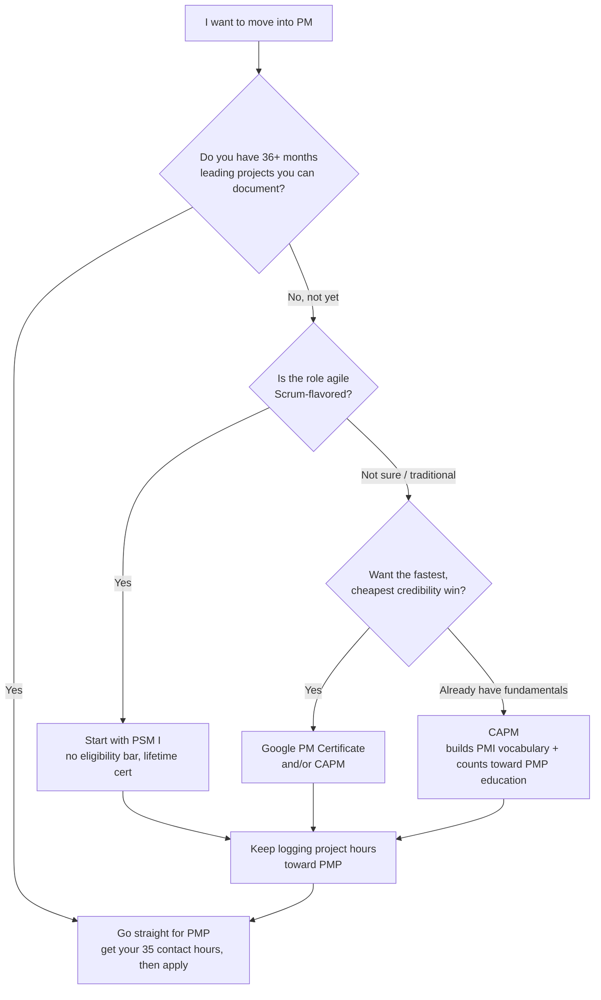
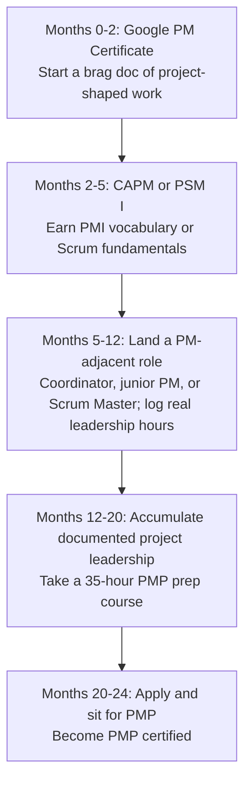
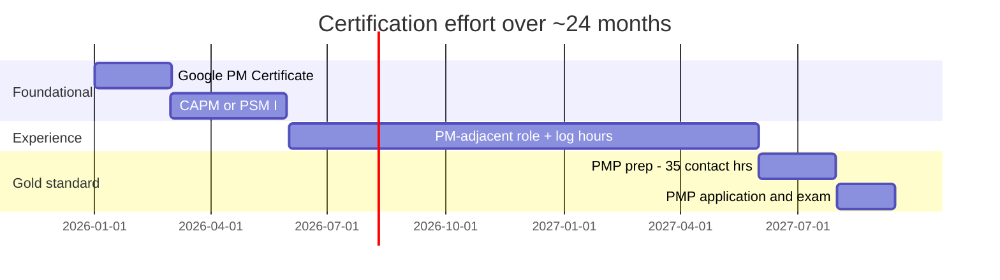

# Module 19 — Certifications Roadmap

> ⏱️ Estimated study time: **~30 min** · 🎓 Level: **Career** · 📋 Prerequisites: **Modules 01–15 recommended** · Part of the **Sales → Project Management Reviewer**.

## 🎯 What you'll be able to do

- [ ] Name the major PM certifications and the body that issues each one.
- [ ] Tell the difference between **CAPM** and **PMP** eligibility, and know which one you actually qualify for right now.
- [ ] Pick a sensible *first* certification given your sales background and current experience.
- [ ] Sketch a realistic 12–24 month roadmap from your first cert to PMP.
- [ ] Talk about certifications on your resume the way you talk about a quota-crush record — as credibility, not as a magic spell.

## 👋 From your mentor

Here's the truth nobody says out loud: a certification will not *make* you a project manager. What it does is get you past the resume filter and into the room — the same way "President's Club, 3 years running" gets a salesperson the interview. You still have to close.

So treat this module like territory planning. We're going to figure out which cert is the *cheapest, fastest win* you can claim now, and which one is the *big account* (PMP) you nurture toward over the next year or two. Don't let the alphabet soup intimidate you — by the end you'll have a path.

---

## 🗺️ The certification landscape

There are a lot of acronyms, but they come from only a handful of organizations. Once you know *who issues what*, the soup turns into a menu.

| Certification | Issuer | What it signals | Flavor |
|---|---|---|---|
| **Google Project Management Certificate** | Google (via Coursera) | Foundational, self-taught grit; you learned the basics | Entry / foundational |
| **CAPM** (Certified Associate in Project Management) | **PMI** | You know PM fundamentals and PMI vocabulary | Entry-level, predictive + agile |
| **PMP** (Project Management Professional) | **PMI** | You've *led* real projects and know the discipline cold | The gold standard, mid-senior |
| **PMI-ACP** (Agile Certified Practitioner) | **PMI** | Broad agile across several frameworks | Agile, mid-level |
| **PSM I / PSM II** (Professional Scrum Master) | **Scrum.org** | You understand Scrum and the Scrum Master role | Agile / Scrum |
| **PSPO I** (Professional Scrum Product Owner) | **Scrum.org** | You understand the Product Owner role and value | Agile / Scrum |
| **CSM / CSPO** (Certified ScrumMaster / Product Owner) | **Scrum Alliance** | Same roles, course-based path | Agile / Scrum |
| **PRINCE2 Foundation / Practitioner** | **Axelos / PeopleCert** | You know the PRINCE2 process method (big in UK/EU/gov) | Process-based method |

A few things worth burning into memory because interviewers and recruiters mix them up constantly:

- **PMP and CAPM are PMI.** PMI also owns **PMI-ACP**. PMI publishes the **PMBOK® Guide** (now in its **7th edition**, which shifted from rigid "knowledge areas" to **12 principles** and **8 performance domains**).
- **PSM and PSPO are Scrum.org** (founded by Ken Schwaber, co-author of Scrum). Their exams are based on the **2020 Scrum Guide**.
- **CSM and CSPO are Scrum Alliance** — a *different* organization from Scrum.org. Same roles, different brand and a required course.
- **PRINCE2 is Axelos / PeopleCert.** Very common in the UK, Europe, Australia, and government/public-sector work.

> 🔁 **Sales → PM bridge:** You already know that **the logo on the badge matters as much as the badge**. A reference from a Fortune 500 client carries more weight than one from your cousin's startup. Same here: "PMP (PMI)" reads as a heavyweight credential to a hiring manager, while a generic "PM course certificate" reads as homework. Know whose name is on the cert before you spend money.

---

## 💰 Eligibility, effort, cost, and difficulty

⚠️ **Read this first:** every number below is **approximate and changes over time.** Prices vary by country and PMI membership, eligibility rules get revised, and exams get updated. **Always verify the current requirements on the issuer's official website before you pay or schedule.** Use this table to plan, not as gospel.

| Cert | Eligibility (approx.) | Rough cost (USD) | Difficulty | Renewal |
|---|---|---|---|---|
| **Google PM Certificate** | None — open to anyone | ~$49/month subscription (finish in 1–3 months) | Low | None |
| **CAPM** | Secondary diploma **+ 23 hours of PM education** (the official CAPM course content covers this) | ~$225 member / ~$300 non-member | Low–Medium | 3 yrs / PDUs |
| **PSM I** | None — anyone can sit it | ~$200 (exam only, no course required) | Medium | None — lifetime |
| **PSM II** | None, but PSM I knowledge assumed | ~$250 | Hard | None — lifetime |
| **PSPO I** | None | ~$200 | Medium | None — lifetime |
| **CSM / CSPO** | **Mandatory 2-day course** from a certified trainer | ~$400–$1,000 (course + exam bundled) | Low–Medium | 2 yrs / SEUs |
| **PMI-ACP** | 12 mo general project experience + 8 mo agile experience + 21 contact hours of agile training | ~$435 member / ~$495 non-member | Medium–Hard | 3 yrs / PDUs |
| **PRINCE2 Foundation** | None | ~$300–$500 (often bundled with training) | Medium | — |
| **PRINCE2 Practitioner** | Foundation (or equivalent) first | ~$400–$600 | Medium–Hard | 3 yrs |
| **PMP** | See the dedicated section below ⬇️ | ~$405 member / ~$555 non-member | **Hard** | 3 yrs / 60 PDUs |

### The PMP eligibility bar (this is the one that trips people up)

PMP is the prize, but you can't just sign up. PMI requires **documented experience leading projects** *plus* formal education. There are two paths depending on your degree:

| Your education | Project experience required | PM education required |
|---|---|---|
| **Four-year degree (bachelor's)** | **36 months** leading projects | **35 contact hours** of PM education *(or hold CAPM)* |
| **High school / associate degree** | **60 months** leading projects | **35 contact hours** of PM education *(or hold CAPM)* |

Three things to understand about that bar:

1. **"Leading projects" is broader than your job title.** PMI doesn't require you to have had "Project Manager" on your business card. If you've **coordinated a CRM rollout**, **owned the launch of a new sales territory**, **run an RFP response with cross-functional teammates**, or **managed a customer onboarding from kickoff to go-live** — that is project leadership experience you can document. (Be honest and specific; PMI does audit applications.)
2. **The 35 contact hours are training, not work.** You earn them from a PMP prep course (online or in-person). If you already hold **CAPM**, it satisfies the education requirement.
3. **You apply, then you sit the exam.** The application asks for project titles, dates, hours, and a short description of what you led. Build that history *before* you apply — which is exactly why a sales-to-PM switcher should start logging their project-flavored work today.

> 🔁 **Sales → PM bridge:** Filling out the PMP experience application is just like writing up a **deal in your CRM**. You log the account (project), the timeline (start/end dates), your role (lead vs. support), and the outcome. If you've ever written a clean deal-close summary for your VP, you can write a PMP experience entry. Start keeping a running "brag doc" of your project-shaped wins *now* — future-you applying for PMP will thank you.

---

## 🧭 Which cert first? (a decision flow for a sales switcher)

You don't need every cert. You need *the right next one.* Here's how to think about it.

*Figure 1 — "Which cert first?" Most sales switchers land on the bottom paths first, then nurture toward PMP.*

The logic in plain English:

- **If you already qualify for PMP** (you've quietly been leading projects for years), don't waste time on entry certs — go for the gold standard.
- **If the jobs you want are agile/Scrum** ("Scrum Master," "Agile PM," "delivery lead" at a software company), **PSM I** is a fantastic first move: no eligibility bar, ~$200, and the cert never expires. You can study and pass it in a few focused weeks.
- **If you want the fastest possible "I'm serious about this" signal,** the **Google PM Certificate** is cheap, self-paced, and genuinely teaches the vocabulary. Pair it with **CAPM** to get a PMI-recognized credential *and* knock out part of your future PMP education requirement.

---

## 📅 A 12–24 month roadmap

Here's a realistic timeline for someone leaving sales today, assuming you're studying around a job. Adjust the pace to your life.

*Figure 2 — A roadmap, not a rule. The slow part isn't the studying — it's accumulating the documented leadership hours PMP requires.*

If you prefer to see it as overlapping effort blocks:

*Figure 3 — The same plan as a Gantt. Notice the experience block is the long pole; certs bookend it.*

A note on sequencing: **certs are quick; experience is slow.** Don't sit around waiting to "qualify" for PMP. Get an entry cert, use it to land a PM-adjacent role, and let that role *generate* the hours PMP requires. The certs and the experience build each other.

---

## ⏸️ Pause & reflect

This is a perfectly safe place to stop, close the laptop, and come back later — your progress here is just thinking, and good thinking deserves a coffee break.

Before you move on, sit with these:

1. **Honestly, how many months of "leading projects" could you document today** if you counted the cross-functional things you've owned in sales (rollouts, launches, onboarding programs)? Jot a rough number.
2. **Which world do the jobs you actually want live in** — traditional/predictive (lean PMI/CAPM/PMP) or agile/Scrum (lean PSM)? Look at 3 real job postings and notice which acronyms they ask for.
3. **What's the smallest cert you could realistically finish in the next 90 days?** Name it. That's your first target.

---

## 📚 Study resources & exam-day tips (high level)

You'll go deeper in **20-landing-the-pm-job.md**, but here's the orientation:

**Where to study (general guidance — pick what fits your budget):**

- **Official sources first.** PMI, Scrum.org, and PeopleCert all publish the authoritative exam content outline and reference material. For Scrum exams, the **2020 Scrum Guide** is free and is *the* source of truth — read it until it's boring.
- **A structured prep course** for the heavyweights (PMP especially). The course also conveniently provides your **35 contact hours**.
- **Practice exams.** This is the single highest-leverage activity. Take timed, full-length mocks until you're consistently scoring above the pass threshold *with margin.* The discomfort of a bad practice score now is cheaper than a failed real exam.

**Exam-day tips at a glance:**

| Tip | Why it matters |
|---|---|
| Sleep and eat — treat it like a big sales pitch | A foggy brain misreads questions |
| Read the *full* question; watch for "EXCEPT" and "BEST" | PMI/Scrum love distractor answers that are *true but not the answer* |
| Answer "by the book," not "by your old job" | They test the framework's ideal, not your past company's shortcuts |
| Flag-and-move; don't burn time on one question | Time management is part of the test |
| Eliminate two wrong answers, then choose | Cuts a 4-way guess to a coin flip |

> 🔁 **Sales → PM bridge:** Exam questions that ask for the "**BEST**" next action are objection-handling in disguise. In sales you don't blurt the first rebuttal — you pick the response that moves the deal forward *and* preserves the relationship. Same instinct passes PMP scenario questions: choose the answer that addresses the root cause and respects the stakeholders, not the one that's merely fast.

---

## 🧠 Check yourself

**1. Which organization issues the PMP and the CAPM?**

Show answer

**PMI** (Project Management Institute). PMI also issues **PMI-ACP** and publishes the **PMBOK® Guide (7th edition)**.

**2. You have a high-school diploma and want PMP. How many months of project-leadership experience do you need, and what else?**

Show answer

**60 months** of leading projects (it's 36 months if you hold a four-year/bachelor's degree), **plus 35 contact hours** of project management education — or holding **CAPM**, which satisfies the education requirement.

**3. What's the difference between PSM and CSM?**

Show answer

Both certify Scrum Master knowledge, but **PSM is issued by Scrum.org** (no mandatory course, lifetime cert) and **CSM is issued by Scrum Alliance** (requires a 2-day trainer-led course, renews every 2 years). Different organizations, similar role focus.

**4. Why is PSM I often a great *first* cert for a career-changer?**

Show answer

It has **no eligibility requirements**, costs around $200, can be self-studied in a few weeks using the free **2020 Scrum Guide**, and **never expires** — high credibility for low cost and no experience gate.

**5. True or false: you must have had the job title "Project Manager" to count experience on a PMP application.**

Show answer

**False.** PMI cares that you **led projects**, not your job title. Documented cross-functional work — a CRM rollout, a territory launch, a structured customer onboarding — can count, as long as you describe it honestly and accurately.

**6. Who issues PRINCE2, and where is it most commonly required?**

Show answer

**Axelos / PeopleCert.** It's most common in the **UK, Europe, Australia, and government/public-sector** projects.

---

## 🧰 Try it

**Build your certification game plan (20 minutes).**

1. Open a blank doc and make three headers: **Now**, **6 months**, **18 months**.
2. **Now:** Write down the *one* entry-level cert you'll start this quarter (Google PM Cert, CAPM, or PSM I). Add the official URL and the real current price — go verify it.
3. Start your **brag doc**: list every project-shaped thing you've led in sales. For each, note a rough start/end date, your role, and the outcome. Count the months. (This is your raw material for a future PMP application.)
4. **6 months:** Note the PM-adjacent role you'll target to start logging *recognized* leadership hours.
5. **18 months:** Write "PMP application + 35 contact hours" — or your agile equivalent — as the destination.
6. Pin the doc somewhere you'll see it. You just turned career anxiety into a plan.

---

## 🔑 Key terms

- **PMI** — Project Management Institute; issuer of CAPM, PMP, and PMI-ACP, and publisher of the PMBOK® Guide.
- **PMBOK® Guide (7th edition)** — PMI's foundational reference, organized around 12 principles and 8 performance domains.
- **CAPM** — Certified Associate in Project Management; PMI's entry-level cert, requires ~23 hours of PM education.
- **PMP** — Project Management Professional; PMI's flagship cert, requires documented project-leadership experience plus 35 contact hours.
- **Contact hours** — formal PM education hours (35 required for PMP); typically earned via a prep course.
- **PMI-ACP** — PMI's agile cert spanning multiple agile frameworks.
- **Scrum.org** — issuer of PSM and PSPO; exams based on the 2020 Scrum Guide; certs don't expire.
- **PSM I / PSM II** — Professional Scrum Master, levels 1 and 2.
- **PSPO I** — Professional Scrum Product Owner, level 1.
- **Scrum Alliance** — issuer of CSM and CSPO; course-based, renews periodically.
- **PRINCE2** — process-based PM method (Foundation and Practitioner levels) issued by Axelos / PeopleCert.
- **PDU** — Professional Development Unit; the credit you earn to renew PMI certifications.

---
⬅️ **Previous:** [Module 18 — Negotiation, Conflict & Soft Skills](18-negotiation-conflict-softskills.md) · 🏠 **[Reviewer Home](../README.md)** · ➡️ **Next:** [Module 20 — Landing the PM Job](20-landing-the-pm-job.md)
