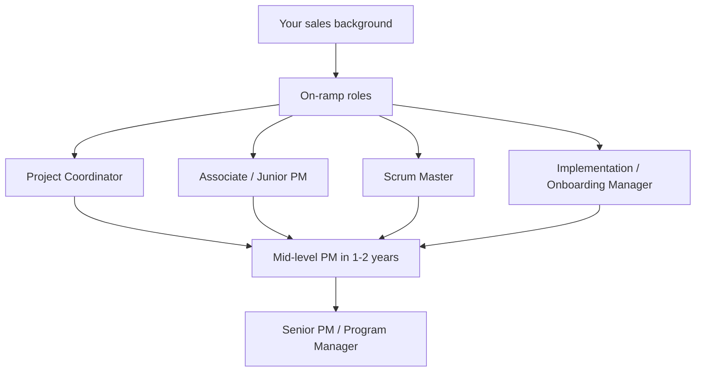
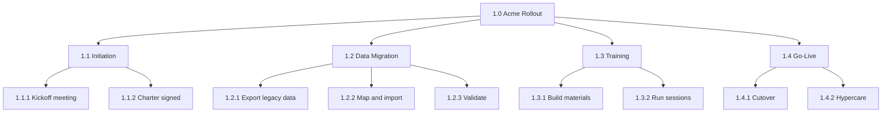
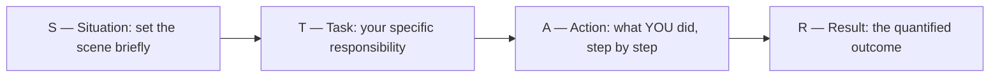
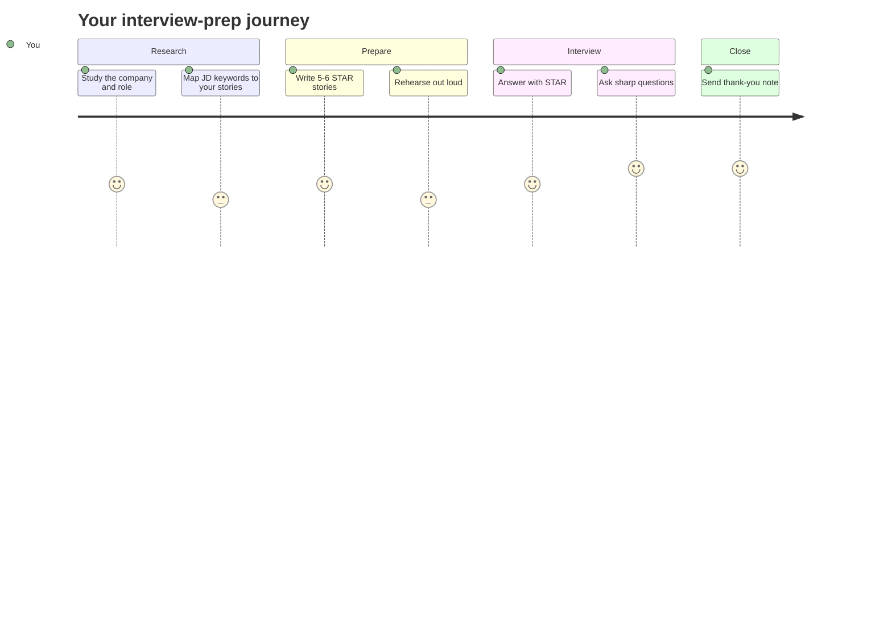
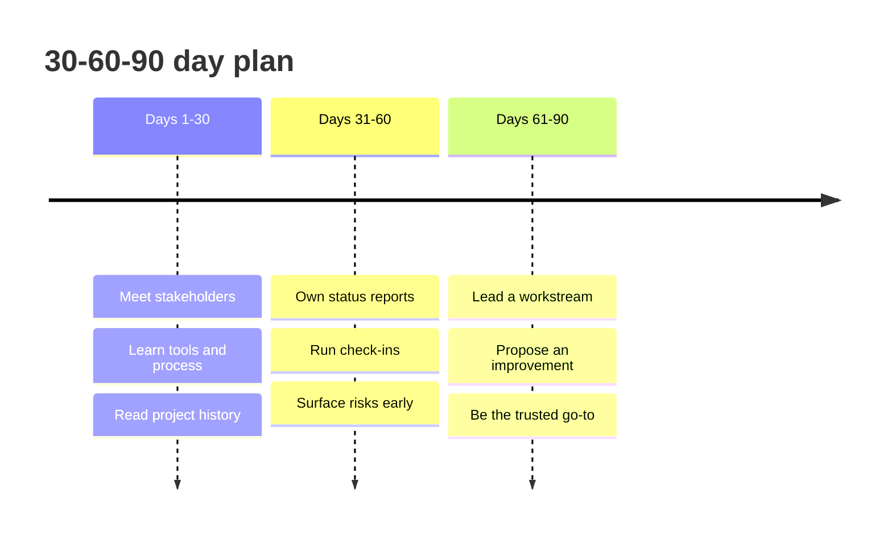

# Module 20 — Landing the PM Job

> **Estimated study time:** ~45 min · **Level:** Career · **Prerequisites:** [Module 02](02-from-sales-to-pm.md) · Part of the **Sales -> Project Management Reviewer.**

## 🎯 What you'll be able to do

- [ ] Rewrite your sales resume into a PM resume that highlights planning, coordination, and stakeholder management with quantified outcomes.
- [ ] Pick realistic target roles for a career-changer instead of swinging for jobs you can't yet land.
- [ ] Build a small portfolio of case studies — including sales wins reframed as projects — with a charter, WBS, and status report.
- [ ] Run a focused networking + LinkedIn strategy and book informational interviews.
- [ ] Answer behavioral and scenario interview questions using the STAR method, and ask sharp questions back.
- [ ] Walk into day one with a 30-60-90 day plan that makes you look like a pro.

## 👋 From your mentor

Here's the truth that should calm your nerves: you already know how to run a campaign with a quota, a pipeline, and a close date — that's basically what a job hunt is. The only thing changing is the **product** you're selling, and that product is you.

You've spent years getting strangers to trust you, coordinating moving parts, and hitting deadlines under pressure. That is not "no PM experience." That's PM experience wearing a sales badge. This module teaches you how to take the badge off and let the PM underneath show. Let's go land it.

---

## 1. Translating a SALES resume into a PM resume

A hiring manager scanning your resume spends maybe 7 seconds before deciding "PM-shaped" or "not for us." Your job is to make the PM signal jump off the page. You don't lie about your past — you **re-language** it.

Sales and PM share more DNA than you'd think. Watch how the same accomplishment reads in two dialects:

### Before / after bullet rewrites

| Sales bullet (before) | PM bullet (after) | What the rewrite emphasizes |
|---|---|---|
| Consistently exceeded quarterly sales quota by 20%. | Planned and tracked a rolling 90-day pipeline against targets, delivering 20% over goal each quarter for 8 quarters. | Planning, tracking, predictable delivery |
| Managed a book of 40 enterprise accounts. | Coordinated 40 concurrent client engagements, balancing competing priorities and a shared resource calendar. | Portfolio/workload management |
| Closed a $250K deal with a Fortune 500 client. | Led a 5-month, cross-functional pursuit (sales, legal, solutions, finance) to a $250K signed outcome, on the committed timeline. | Cross-functional coordination, stakeholder management |
| Ran weekly demos for prospects. | Facilitated weekly stakeholder sessions, captured requirements, and managed expectations through a 6-week evaluation. | Facilitation, requirements, expectation management |
| Used Salesforce daily. | Maintained a single source of truth in CRM, building dashboards leadership used for forecasting decisions. | Reporting, status visibility, tooling |

Notice the pattern: every PM bullet starts with a **strong verb of coordination** (Led, Coordinated, Planned, Facilitated, Tracked, Delivered), names the **stakeholders or moving parts**, and ends with a **quantified outcome**. That last part is your unfair advantage — sales taught you to count everything.

*From a sales win to a PM-ready bullet in five moves.*

### The resume skeleton

- **Top summary (3 lines):** State your target role plainly. "Aspiring/Associate Project Manager with X years coordinating cross-functional sales pursuits, now focused on delivery." Don't make them guess.
- **Skills band:** Mix PM vocabulary you can defend (stakeholder management, scope, risk, status reporting, Agile/Scrum basics, RAID) with tools (Jira, Asana, MS Project, Smartsheet, Excel, CRM).
- **Experience:** Rewritten bullets as above. Lead with outcomes, not duties.
- **Projects / Portfolio:** A dedicated section pointing to your case studies (Section 3). This is where a career-changer wins.
- **Certifications:** Whatever you've earned or are pursuing — see [Module 19](19-certifications-roadmap.md). "CAPM (in progress)" is legitimate and signals commitment.

> 🔁 **Sales → PM bridge:** A resume bullet is a 30-second elevator pitch about a past win. You already know how to lead with the customer's outcome instead of your activity. Apply the exact same instinct: lead with the project's outcome ("delivered on time, 15% under budget"), not the busywork ("attended meetings").

---

## 2. Realistic target roles for a career-changer

Aiming straight for "Senior Project Manager" with no PM title yet is like cold-calling a CEO to close on the first dial — possible, but you're fighting the odds. Target the **on-ramp roles** instead. They get you the title, the tooling, and the stories you need for the next jump.

| Role | What it really is | Why it fits a sales background |
|---|---|---|
| **Project Coordinator** | The PM's right hand — schedules, status, logistics, follow-ups. | You already chase action items and keep people accountable. |
| **Associate / Junior PM** | A real PM role with a smaller scope and a mentor above you. | Entry point that still carries the PM title. |
| **Scrum Master** | Servant-leader for an Agile team; removes blockers, facilitates ceremonies. | Facilitation + unblocking = your discovery-call and deal-desk muscles. See [Module 11](15-agile-and-scrum.md). |
| **Program Coordinator** | Coordination across several related projects. | Managing a "book" of related things is your account-management life. |
| **Implementation / Onboarding Manager** | Gets a new customer live after the sale closes. | **The sales-adjacent on-ramp.** You speak customer fluently and already live in that post-sale moment. |

> The **Implementation / Onboarding Manager** path deserves a star. It sits right where sales ends and delivery begins, so your domain knowledge transfers almost untouched — you're managing a project (the rollout) for a customer you already know how to handle. Many career-changers slip into PM through exactly this door.

*The realistic ladder — start on an on-ramp, climb deliberately.*

---

## 3. Building a portfolio with case studies

A career-changer's secret weapon is a **portfolio**, because it shows instead of tells. You don't need to have shipped software. You need to prove you can think like a PM about real work — and your best raw material is the sales wins you already have.

**Reframe a sales win as a project.** Take that 5-month, $250K pursuit and document it as if it were a delivery project: a goal, stakeholders, milestones, risks, and an outcome. Build 2-3 of these. Host them in a clean GitHub repo, a Notion page, or a tidy PDF, and link from your resume and LinkedIn.

Each case study should include three artifacts. Here's the minimum viable version of each.

### Sample project charter

A **charter** authorizes the project and states the essentials on one page (see [Module 04](05-initiation-charter-stakeholders.md)).

| Field | Example |
|---|---|
| Project name | Acme Corp Enterprise Rollout |
| Objective | Migrate Acme from legacy tool to our platform within 90 days of contract signature. |
| Sponsor | VP Customer Success |
| Stakeholders | Acme IT lead, Acme end users, our support + sales teams |
| Scope (in) | Data migration, user training, go-live |
| Scope (out) | Custom integrations, hardware procurement |
| Key milestones | Kickoff, data migration complete, training done, go-live |
| Success criteria | 95% of users active within 2 weeks of go-live; zero data loss |
| Budget / resources | 0.5 FTE PM, 1 implementation engineer, 40 hrs training |

### Sample WBS (Work Breakdown Structure)

A **WBS** decomposes the work into manageable chunks (see [Module 06](06-scope-management.md)).

*A WBS breaks a deliverable into bite-sized, assignable pieces.*

### Sample status report

A weekly **status report** is your single most-used PM artifact. Keep it scannable.

| Section | Example content |
|---|---|
| **Overall status** | 🟢 Green (or 🟡 Amber / 🔴 Red) |
| **Summary** | Migration on track; training starts Monday. |
| **Done this week** | Legacy export validated; 3 of 4 environments imported. |
| **Planned next week** | Finish import; run first training cohort. |
| **Risks / issues** | Acme IT contact on leave — escalation path confirmed with backup. |
| **Decisions needed** | Approve go-live date of the 28th. |

A **RAG status** (Red/Amber/Green) plus a one-line "why" is exactly what executives want. You learned to write tight forecast updates in sales; this is the same muscle.

---

## 4. Networking & an optimized LinkedIn

Most PM roles are filled through people, not portals. Treat networking as **top-of-funnel prospecting** — and you already know how to prospect.

### LinkedIn optimization checklist

- **Headline:** Don't leave it as "Sales Rep at Company." Try "Sales pro transitioning into Project Management | Stakeholder coordination · Delivery · Agile basics." Recruiters search keywords — feed them.
- **About:** Tell the transition story in first person. One paragraph on what you did, one on why PM, one on what you're learning now (cert in progress counts).
- **Featured:** Pin your portfolio / case studies.
- **Skills:** Add and get endorsements for stakeholder management, project coordination, Agile, Scrum.
- **Open to work:** Turn it on, set it to your target titles from Section 2.

### Informational interviews

These are **discovery calls** with no quota attached. You ask a working PM for 20 minutes to learn about their path — not for a job. The ask is low-pressure, so people say yes.

> 🔁 **Sales → PM bridge:** An informational interview is a discovery call. Same rhythm: research them first, ask open questions, listen more than you talk, capture what you learn, and follow up with a thank-you. You've run hundreds of these — the only difference is you're qualifying a *path*, not a *deal*.

A clean ask: *"I'm moving from sales into project management and admiring how you made a similar jump. Could I borrow 20 minutes to hear how you'd approach it? No agenda beyond learning."* Then end every one with: *"Who else would you suggest I talk to?"* — that's how a pipeline grows.

---

## 5. Interview prep

PM interviews test three things: can you **structure ambiguity**, can you **work with people**, and have you **actually done the work**. Behavioral questions probe your past; scenario questions probe your thinking.

### Common PM interview questions

| Type | Example |
|---|---|
| Behavioral | "Tell me about a time you managed competing priorities." |
| Behavioral | "Describe a time a stakeholder was unhappy. What did you do?" |
| Behavioral | "Walk me through a deadline you almost missed." |
| Scenario | "A key team member quits mid-project. Your move?" |
| Scenario | "Your sponsor wants to add scope but won't move the date. What now?" |
| Knowledge | "Difference between Agile and Waterfall?" (see [Module 09](04-predictive-agile-hybrid.md)) |
| Knowledge | "How do you handle scope creep?" (see [Module 06](06-scope-management.md)) |

### The STAR method (for behavioral answers)

Behavioral answers fall apart when you ramble. **STAR** gives you a rail to run on:

*STAR keeps a behavioral answer tight, specific, and outcome-focused.*

Spend the most words on **Action** (it's about *you*, not the team) and always land on a **quantified Result**. Example, answering "managed competing priorities":

> **S:** I carried 40 enterprise accounts during our busiest quarter. **T:** Three deals needed attention the same week with overlapping deadlines. **A:** I mapped each by deal size and close-date risk, batched the renewal paperwork, delegated the smallest to a junior rep, and renegotiated one timeline with the client. **R:** All three closed that month — $400K combined — with no slipped commitments.

Notice that's a *sales* story told in *PM* language: prioritization, delegation, stakeholder negotiation, quantified result. Pre-write 5-6 STAR stories from your sales career and you can cover almost any behavioral question.

### Scenario / situational questions

There's rarely one "right" answer — they want your **reasoning**. A safe structure: clarify the goal and constraints → identify the real problem → name your options and trade-offs → pick one → say how you'd communicate it. Showing you'd *talk to the stakeholder* before acting unilaterally is almost always the right instinct.

### Smart questions to ask THEM

Asking nothing reads as low interest. Have 3-4 ready:

- "What does a successful first 90 days look like in this role?"
- "What methodology does the team actually use day to day — and how closely?"
- "What's the biggest challenge facing the projects I'd inherit?"
- "How is project success measured here?"

*Treat interview prep as a journey with stages, not a single cram session.*

---

## 6. A 30-60-90 day plan for your first PM role

Bringing a 30-60-90 plan to a final interview — or to week one — signals that you think like an owner. Here's the shape it should take.

| Phase | Theme | Focus |
|---|---|---|
| **Days 1-30** | Learn & listen | Meet every stakeholder, learn the tools and process, read project history, ask a lot. Don't change anything yet. |
| **Days 31-60** | Contribute | Own status reporting, run standups/check-ins, surface risks, take a small deliverable end to end. |
| **Days 61-90** | Lead & improve | Own a project or workstream fully, propose one process improvement, build trust as the go-to coordinator. |

*Ramp deliberately: listen first, contribute next, lead last.*

The mistake new PMs make is trying to lead on day three. You wouldn't try to close on the first cold call — you'd qualify and build rapport first. Same here: the first 30 days are pure discovery.

---

## ⏸️ Pause & reflect

This is a safe place to stop, breathe, and come back later — the job hunt is a marathon, and so is this module. Before you move on, sit with these:

- Which **on-ramp role** from Section 2 actually excites you, and which sales strength makes you a natural fit for it?
- Pick one sales win right now. What's the *project* hiding inside it? Jot the objective, the stakeholders, and the outcome.
- Where does the job hunt scare you most — the resume, the networking, or the interview? Name it; that's the part to over-prepare.

No rush. When you're ready, the self-check is waiting.

---

## 🧠 Check yourself

**1. Your sales bullet says "Closed a $250K deal." How do you make it PM-ready?**

Show answer

Reframe it as a coordinated project with a quantified outcome: e.g., *"Led a 5-month, cross-functional pursuit (sales, legal, solutions, finance) to a $250K signed outcome, delivered on the committed timeline."* Lead with a PM verb, name the stakeholders/moving parts, and end on the measurable result.

**2. Why is "Implementation / Onboarding Manager" a smart target for a career-changer from sales?**

Show answer

It's the sales-adjacent on-ramp: it sits exactly where the sale ends and delivery begins, so your customer domain knowledge transfers almost untouched. You're running a real project (the rollout) for a customer profile you already know how to manage.

**3. What does each letter in STAR stand for, and where should most of your words go?**

Show answer

**S**ituation, **T**ask, **A**ction, **R**esult. Spend the most time on **Action** (it's about what *you* specifically did), and always finish with a **quantified Result**.

**4. What three artifacts make a strong portfolio case study?**

Show answer

A project **charter** (one-page authorization with objective, stakeholders, scope, success criteria), a **WBS** (work broken into manageable pieces), and a **status report** (RAG status plus done/next/risks). Even a reframed sales win can supply all three.

**5. In a 30-60-90 plan, what should you mostly avoid in the first 30 days?**

Show answer

Avoid trying to lead or change things. Days 1-30 are for learning and listening — meet stakeholders, learn the tools and process, read project history. Contribution comes at 31-60, leadership at 61-90.

**6. Why is the job hunt itself a sales campaign?**

Show answer

You are the product. It has a pipeline (leads → applications → interviews → offers), it rewards disciplined follow-up, and it ends in a close (the offer and negotiation). Every sales habit — qualifying, nurturing, following up, closing — applies directly.

---

## 🧰 Try it

**Reframe one sales win as a PM case study (30 minutes).**

1. Choose your single best sales win — a big deal, a saved account, a tough renewal.
2. Write a one-page **charter** for it using the table in Section 3 (objective, stakeholders, scope in/out, milestones, success criteria).
3. Sketch a 2-level **WBS** of how that win actually got done (initiation, the main phases, close).
4. Draft a final **status report** as if it were the last weekly update: RAG status, what got done, the risk you navigated, the outcome.
5. Now turn the whole thing into **one resume bullet** and **one STAR story**.

When you finish, you'll have a portfolio artifact, a resume line, and an interview answer — all from one win you already had. That's leverage.

---

## 🔑 Key terms

- **On-ramp role** — An entry-level or sales-adjacent PM-track role (coordinator, associate PM, scrum master, implementation manager) realistic for a career-changer.
- **Charter** — A one-page document that authorizes a project and states its objective, stakeholders, scope, and success criteria.
- **WBS (Work Breakdown Structure)** — A hierarchical decomposition of project work into smaller, assignable pieces.
- **Status report** — A regular, scannable update on progress, usually carrying a RAG (Red/Amber/Green) status.
- **STAR** — A behavioral-answer framework: Situation, Task, Action, Result.
- **Informational interview** — A low-pressure conversation to learn about someone's role or career path; a discovery call without a job ask.
- **30-60-90 plan** — A structured plan for your first three months: learn (1-30), contribute (31-60), lead (61-90).
- **RAG status** — A Red/Amber/Green health indicator summarizing whether a project is off track, at risk, or on track.

---
⬅️ **Previous:** [Module 19 — Certifications Roadmap](19-certifications-roadmap.md) · 🏠 **[Reviewer Home](../README.md)** · ➡️ **Next:** [Module 21 — Glossary & Cheat Sheets](21-glossary-and-cheatsheets.md)
