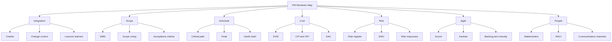
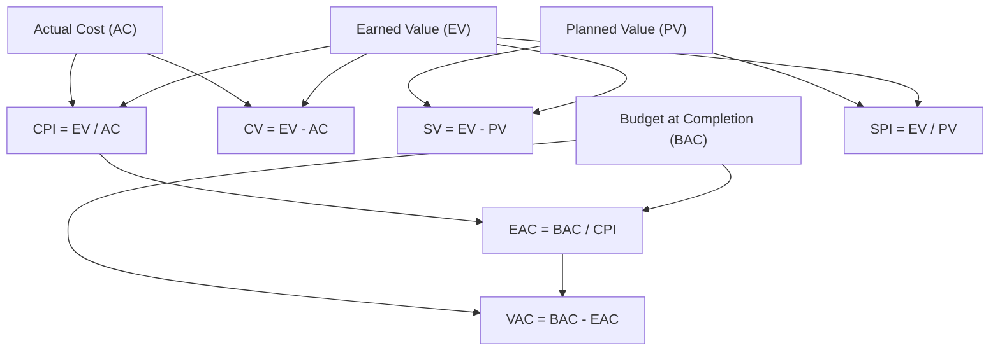
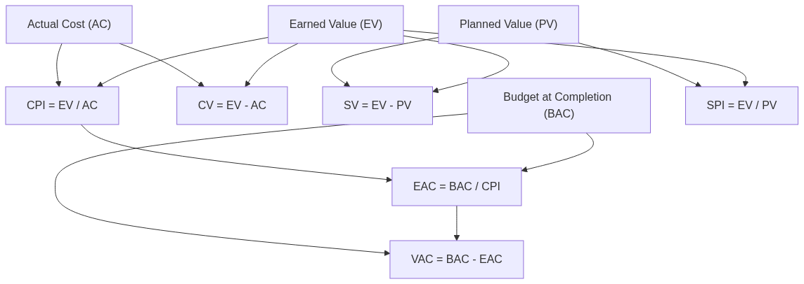

# Module 21 — Glossary & Cheat Sheets

> **Estimated study time:** Reference · **Level:** Reference · **Prerequisites:** Use anytime · Part of the **Sales -> Project Management Reviewer.**

*Every great heroine has a trusted confidant she can call at 2 a.m. — this module is yours.*

## 🎯 What you'll be able to do

- [ ] Look up any PM term used across this reviewer in seconds.
- [ ] Decode the acronym soup PMs throw around in meetings.
- [ ] Plug numbers into the core EVM, PERT, float, and communication formulas without hunting.
- [ ] Orient yourself instantly on the process-groups × knowledge-areas grid.
- [ ] Tell predictive, Scrum, and Kanban apart in one glance.

## 👋 From your mentor

Okay, real talk: this module isn't a story with a slow burn and a satisfying ending. It's the friend who sits in the passenger seat with the map open so you never have to pull over. Keep it parked in a browser tab while you work the rest of the reviewer — the same way you used to keep your price sheet and objection-handling card within arm's reach of the phone. You don't *memorize* a cheat sheet. You reach for it until the reaching quietly stops being necessary.

So bookmark this one. When an interviewer leans in and asks "what's CPI?" or "explain float," you want the answer to roll out as smoothly as quoting your close rate — no flop sweat, no scrambling. Everything here is short on purpose. Let's go.

---

## 📖 Glossary

Alphabetical, like a guest list. Terms link conceptually to the modules where they're taught in depth.

| Term | Definition |
|---|---|
| **Acceptance criteria** | The conditions a deliverable must meet to be accepted by the customer. In Agile, attached to a user story. |
| **Agile** | A mindset (and family of frameworks) favoring iterative delivery, fast feedback, and responding to change over following a fixed plan. |
| **Backlog** | An ordered list of everything that might be done on a product. The **product backlog** is owned by the Product Owner; the **sprint backlog** is the slice pulled into a sprint. |
| **Baseline** | The approved version of the scope, schedule, or cost plan. You measure performance *against* the baseline; you only change it through formal change control. |
| **BATNA** | Best Alternative To a Negotiated Agreement — your walk-away option in any negotiation. (Yes, the same one from sales.) |
| **Burndown chart** | A line chart showing work remaining over time in a sprint or release. Ideally trends toward zero. |
| **Change control** | The formal process for reviewing, approving, and recording changes to a baseline. |
| **Charter** | The document that formally authorizes the project and names the PM. Without it, you have no mandate. |
| **Critical path** | The longest sequence of dependent activities through the schedule; it sets the minimum project duration. Activities on it have **zero float**. |
| **CPI** | Cost Performance Index — earned value ÷ actual cost. Above 1 = under budget. |
| **Crashing** | Compressing the schedule by adding resources to critical-path tasks (costs more money). |
| **Daily Scrum** | A 15-minute daily event for the Developers to inspect progress toward the Sprint Goal and re-plan. |
| **Definition of Done (DoD)** | The shared checklist a backlog item must satisfy to be considered complete. Creates quality consistency. |
| **Deliverable** | A unique, verifiable product, result, or capability produced by the project. |
| **Dependency** | A relationship where one activity relies on another (finish-to-start is the most common). |
| **Earned Value (EV)** | The budgeted value of the work *actually completed* to date. The heart of EVM. |
| **EMV** | Expected Monetary Value — probability × impact, summed across risks. Used in decision trees. |
| **Epic** | A large body of work that's broken down into multiple user stories. |
| **EVM** | Earned Value Management — a method that integrates scope, schedule, and cost to measure performance objectively. |
| **Fast-tracking** | Compressing the schedule by overlapping activities normally done in sequence (adds risk, not cost). |
| **Float (slack)** | How long an activity can slip without delaying the project (**total float**) or the next activity (**free float**). |
| **Gantt chart** | A horizontal bar chart showing activities against a timeline. The classic schedule visual. |
| **Issue** | A current problem that has already occurred (vs a risk, which is still in the future). |
| **Kanban** | A flow-based method that visualizes work on a board and limits work in progress to improve flow. |
| **Lessons learned** | Knowledge gained during the project, captured so future projects benefit. |
| **Milestone** | A significant point or event in the schedule. Has zero duration. |
| **MoSCoW** | Prioritization scheme: **M**ust have, **S**hould have, **C**ould have, **W**on't have (this time). |
| **MVP** | Minimum Viable Product — the smallest releasable version that delivers value and tests assumptions. |
| **Product Owner** | The Scrum accountability for maximizing product value and managing the product backlog. |
| **Project** | A temporary endeavor undertaken to create a unique product, service, or result. (Temporary + unique.) |
| **RACI** | A responsibility chart: **R**esponsible, **A**ccountable, **C**onsulted, **I**nformed. One "A" per row. |
| **Risk register** | The living log of identified risks, their analysis, owners, and responses. |
| **Risk response** | The chosen action for a risk. Threats: avoid, transfer, mitigate, accept, escalate. Opportunities: exploit, share, enhance, accept, escalate. |
| **Scope** | The sum of products, services, and results delivered (product scope) and the work to deliver them (project scope). |
| **Scope creep** | Uncontrolled growth of scope without adjustments to time, cost, or resources. The silent project killer. |
| **Scrum Master** | The Scrum accountability for the team's effectiveness and for upholding Scrum; a servant-leader, not a boss. |
| **Sprint** | A fixed-length iteration (one month or less) that produces a usable increment. |
| **SPI** | Schedule Performance Index — earned value ÷ planned value. Above 1 = ahead of schedule. |
| **Stakeholder** | Anyone who can affect, be affected by, or perceive themselves affected by the project. |
| **Story points** | A relative estimate of effort/complexity for a backlog item (not hours). |
| **Triple constraint** | The interplay of scope, schedule, and cost (with quality at the center). Move one, the others react. |
| **User story** | A short, user-centered requirement: "As a [role], I want [goal], so that [benefit]." |
| **Velocity** | The average amount of work (story points) a team completes per sprint. A planning input, not a target. |
| **WBS** | Work Breakdown Structure — a hierarchical decomposition of the total scope into manageable work packages. |
| **Work package** | The lowest level of the WBS; small enough to estimate and assign. |

> 🔁 **Sales → PM bridge:** A **risk register** is your deal-risk tracker wearing a nicer outfit. In sales you already mutter "champion might leave," "budget not confirmed," "competitor's circling the account" — and you quietly assign yourself the next move. A risk register just makes that instinct official: list the threat, rate probability and impact, name an owner, and decide the response *before* it sneaks up behind you in the third act.

---

## 🔤 Acronyms quick list

The alphabet soup everyone ladles out in meetings, finally translated.

| Acronym | Expansion |
|---|---|
| **AC** | Actual Cost |
| **BAC** | Budget At Completion |
| **BATNA** | Best Alternative To a Negotiated Agreement |
| **CCB** | Change Control Board |
| **CPI** | Cost Performance Index |
| **CPM** | Critical Path Method |
| **CR** | Change Request |
| **DoD** | Definition of Done |
| **EAC** | Estimate At Completion |
| **EMV** | Expected Monetary Value |
| **ETC** | Estimate To Complete |
| **EV** | Earned Value |
| **EVM** | Earned Value Management |
| **KA** | Knowledge Area |
| **MVP** | Minimum Viable Product |
| **PM** | Project Manager / Project Management |
| **PMBOK** | Project Management Body of Knowledge |
| **PMI** | Project Management Institute |
| **PMO** | Project (or Program) Management Office |
| **PO** | Product Owner |
| **PV** | Planned Value |
| **RACI** | Responsible, Accountable, Consulted, Informed |
| **RFP** | Request For Proposal |
| **ROM** | Rough Order of Magnitude (estimate) |
| **SOW** | Statement Of Work |
| **SPI** | Schedule Performance Index |
| **SM** | Scrum Master |
| **VAC** | Variance At Completion |
| **WBS** | Work Breakdown Structure |
| **WIP** | Work In Progress |
| **WSJF** | Weighted Shortest Job First |

---

## 🧮 Formula cheat sheet

Memorize these five clusters and you can answer most quantitative PM questions in your sleep. No calculus, I promise — just tidy arithmetic with good manners.

### Earned Value Management (EVM)

The three inputs are **PV** (planned value — what you *planned* to have done), **EV** (earned value — what you *actually* completed, valued at budget), and **AC** (actual cost — what you *spent*). Picture them as three friends comparing notes on a shared trip.

| Metric | Formula | Reading |
|---|---|---|
| Cost Variance | **CV = EV − AC** | Positive = under budget |
| Schedule Variance | **SV = EV − PV** | Positive = ahead of schedule |
| Cost Performance Index | **CPI = EV / AC** | > 1 = under budget |
| Schedule Performance Index | **SPI = EV / PV** | > 1 = ahead of schedule |
| Estimate At Completion | **EAC = BAC / CPI** | Forecast total cost (typical case) |
| Estimate To Complete | **ETC = EAC − AC** | Remaining cost forecast |
| Variance At Completion | **VAC = BAC − EAC** | Forecast over/under budget |
| To-Complete Perf. Index | **TCPI = (BAC − EV) / (BAC − AC)** | Efficiency needed to hit BAC |

**Worked example:** BAC = \$100,000. You planned to be 50% done (PV = \$50,000) but you've only finished 40% (EV = \$40,000), and you've spent \$50,000 (AC = \$50,000).
CV = 40,000 − 50,000 = **−\$10,000 (over budget)**. CPI = 40,000 / 50,000 = **0.8**. SV = 40,000 − 50,000 = **−\$10,000 (behind)**. EAC = 100,000 / 0.8 = **\$125,000**. Here's what that actually means for you: at this pace you'll overshoot the budget by \$25,000. And now you have a *number* to bring to the sponsor — a hard fact, not an anxious hunch. That's the difference between sounding worried and sounding in control.

### PERT three-point estimate

For a single activity with optimistic (**O**), most likely (**M**), and pessimistic (**P**) estimates — basically asking "best case, realistic case, what-if-everything-goes-sideways case":

- **PERT (Beta) estimate = (O + 4M + P) / 6**
- **Standard deviation = (P − O) / 6**

*Example:* O = 4 days, M = 6 days, P = 14 days → (4 + 24 + 14) / 6 = **7 days**; SD = (14 − 4) / 6 ≈ **1.7 days**.

### Communication channels

Add one more person and the lines of communication don't just grow — they multiply, like a group chat that suddenly has opinions. That's exactly why big teams need structure.

- **Channels = n(n − 1) / 2**, where *n* = number of people.

*Example:* 5 people → 5 × 4 / 2 = **10 channels**. 10 people → **45**. Double the guest list, quadruple the chaos.

### Float (schedule slack)

- **Total Float = LS − ES = LF − EF** (Late Start − Early Start, or Late Finish − Early Finish)
- **Free Float = ES(next) − EF(current)** (for finish-to-start)
- Activities on the **critical path** have **Total Float = 0**.

---

## 🗺️ Orientation grid: Process Groups × Knowledge Areas

The classic PMBOK *Guide* (6th ed.) lens still tested on the PMP framework questions. Read it like a seating chart: each **Knowledge Area** (row) shows up across one or more **Process Groups** (columns).

| Knowledge Area ↓ \ Process Group → | Initiating | Planning | Executing | Monitoring & Controlling | Closing |
|---|:---:|:---:|:---:|:---:|:---:|
| Integration | ✓ | ✓ | ✓ | ✓ | ✓ |
| Scope | | ✓ | | ✓ | |
| Schedule | | ✓ | | ✓ | |
| Cost | | ✓ | | ✓ | |
| Quality | | ✓ | ✓ | ✓ | |
| Resource | | ✓ | ✓ | ✓ | |
| Communications | | ✓ | ✓ | ✓ | |
| Risk | | ✓ | ✓ | ✓ | |
| Procurement | | ✓ | ✓ | ✓ | |
| Stakeholder | ✓ | ✓ | ✓ | ✓ | |

*Note:* The **PMBOK Guide 7th edition** reframes this around **12 principles** and **8 performance domains** rather than the 5×10 grid, but the grid is still the fastest mental map and the basis of most practice questions. Both are worth knowing.

---

## ⚖️ Methodology comparison

One table to keep predictive, Scrum, and Kanban straight — the three suitors, and what each one is actually like to date.

| Dimension | Predictive (Waterfall) | Scrum | Kanban |
|---|---|---|---|
| **Best when** | Requirements stable, scope clear | Requirements evolving, value delivered iteratively | Continuous flow, shifting priorities |
| **Cadence** | Phased, plan-driven | Fixed-length sprints (≤ 1 month) | Continuous, no fixed iterations |
| **Planning** | Heavy up-front, baselined | Per-sprint planning | Just-in-time, pull-based |
| **Roles** | PM, sponsor, team | Product Owner, Scrum Master, Developers | No prescribed roles |
| **Change** | Via formal change control | Welcomed between sprints | Welcomed anytime |
| **Key metric** | Variance vs baseline (CPI/SPI) | Velocity, burndown | Cycle time, throughput, WIP limits |
| **Owning body** | PMI / Axelos (PRINCE2) | Scrum.org / Scrum Alliance | Lean/Kanban community |

> 🔁 **Sales → PM bridge:** Choosing a methodology is just like choosing a sales motion. A long enterprise deal with a signed MSA and fixed SOW is **predictive** — locked scope, milestones, change orders, everything formal. A product-led, "ship-iterate-learn" motion is **Scrum**. A high-volume inbound queue you work by priority is **Kanban**. You already read the room and match your approach to the deal; now you do the same thing for projects.

---

## 🧩 Visual maps

```mermaid
flowchart TD
    ROOT["PM Reviewer Map"]
    ROOT --> INT["Integration"]
    ROOT --> SCO["Scope"]
    ROOT --> SCH["Schedule"]
    ROOT --> COST["Cost"]
    ROOT --> RISK["Risk"]
    ROOT --> AGILE["Agile"]
    ROOT --> PEOPLE["People"]

    INT --> INT1["Charter"]
    INT --> INT2["Change control"]
    INT --> INT3["Lessons learned"]

    SCO --> SCO1["WBS"]
    SCO --> SCO2["Scope creep"]
    SCO --> SCO3["Acceptance criteria"]

    SCH --> SCH1["Critical path"]
    SCH --> SCH2["Float"]
    SCH --> SCH3["Gantt chart"]

    COST --> COST1["EVM"]
    COST --> COST2["CPI and SPI"]
    COST --> COST3["EAC"]

    RISK --> RISK1["Risk register"]
    RISK --> RISK2["EMV"]
    RISK --> RISK3["Risk responses"]

    AGILE --> AG1["Scrum"]
    AGILE --> AG2["Kanban"]
    AGILE --> AG3["Backlog and velocity"]

    PEOPLE --> PPL1["Stakeholders"]
    PEOPLE --> PPL2["RACI"]
    PEOPLE --> PPL3["Communication channels"]
```

<!-- mobile-diagram:21-glossary-and-cheatsheets-1 -->

🖼️ View as image (for the GitHub mobile app)

<!-- /mobile-diagram -->

*The whole reviewer at a glance — use it to spot which branches still feel a little shaky and deserve a second date.*

<!-- mobile-diagram:21-glossary-and-cheatsheets-2 -->

🖼️ View as image (for the GitHub mobile app)

<!-- /mobile-diagram -->

*How the EVM inputs flow into variances, indexes, and forecasts — follow any line backward like a detective and it lands on PV, EV, AC, or BAC.*

---

## ⏸️ Pause & reflect

This is a safe place to set the book down and come back later — reference modules aren't meant to be read cover-to-cover in one breathless sitting.

- Which three terms in the glossary still feel a little fuzzy? Flag them and revisit the module that teaches them.
- Cover the formula table with your hand and try writing CPI, SPI, and the PERT estimate from memory. How'd you do — be honest.
- Can you say, in one clean sentence each, when you'd pick predictive vs Scrum vs Kanban?

Close the tab with a clear conscience. The cheat sheet isn't going anywhere — it'll be right here when you need it.

---

## 🧠 Check yourself

**1. CPI = 0.8. Are you over or under budget, and by how much per dollar?**

Show answer

Over budget. CPI below 1 means you're getting only \$0.80 of value for every \$1.00 spent — you're spending faster than you're earning value.

**2. An activity has total float of zero. What does that tell you?**

Show answer

It's on the **critical path**. Any delay to it delays the whole project, so it gets your closest attention.

**3. Your team grows from 6 people to 8. How many communication channels did you add?**

Show answer

6 people = 6×5/2 = 15 channels. 8 people = 8×7/2 = 28 channels. You **added 13** — coordination cost rises fast.

**4. Estimates: O = 3, M = 5, P = 13. What's the PERT estimate?**

Show answer

(3 + 4×5 + 13) / 6 = (3 + 20 + 13) / 6 = 36 / 6 = **6**.

**5. What does the "A" in RACI mean, and how many should each task have?**

Show answer

**Accountable** — the single person answerable for the outcome. Each row/task should have exactly **one** A (others can be Responsible, Consulted, or Informed).

**6. Which Scrum accountability owns and orders the product backlog?**

Show answer

The **Product Owner**. The Scrum Master upholds the process; the Developers do the work.

---

## 🧰 Try it

Build your own one-page **personal cheat card** — your secret weapon, slipped into your back pocket. On a single index card (or one screen), write:

1. The four EVM core formulas (CV, SV, CPI, SPI) — from memory first, *then* check against this module. No peeking until you've tried.
2. Your three "still fuzzy" glossary terms with a one-line definition in *your own words*.
3. One sentence picking a methodology for a real project you can imagine running.

Keep that card next to your keyboard for a week. Just like your old objection-handling card, the goal is to use it until the day you reach for it and realize — happily — you didn't need it.

---

## 🔑 Key terms

- **Baseline** — the approved scope/schedule/cost plan you measure performance against.
- **Critical path** — the longest dependent activity chain; sets minimum project duration; zero float.
- **CPI / SPI** — cost and schedule efficiency indexes; above 1 is good.
- **EVM** — method integrating scope, schedule, and cost into objective performance numbers.
- **Float** — how long an activity can slip without delaying the project (total) or the next task (free).
- **RACI** — responsibility chart: Responsible, Accountable, Consulted, Informed (one A per row).
- **Velocity** — average story points a team completes per sprint; a planning input, not a goal.
- **WBS** — hierarchical breakdown of total scope into work packages.

You've got the whole reviewer in your pocket now — the vocabulary, the formulas, the maps. One module left, and it's the one that ties everything together: your personal study plan, plus an honest mirror to check how ready you really are. Turn the page.

---
⬅️ **Previous:** [Module 20 — Landing the PM Job](20-landing-the-pm-job.md) · 🏠 **[Reviewer Home](../README.md)** · ➡️ **Next:** [Module 22 — Your Study Plan & Self-Assessment](22-study-plan-and-self-assessment.md)
