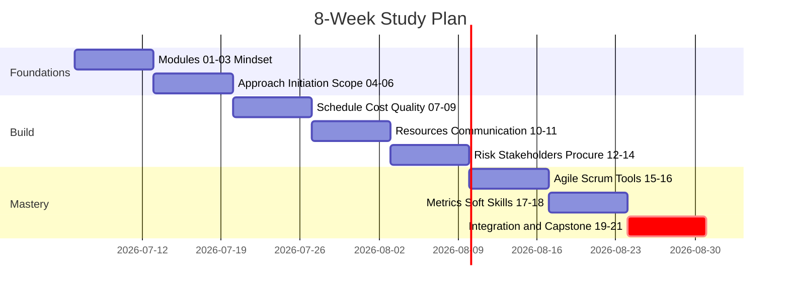
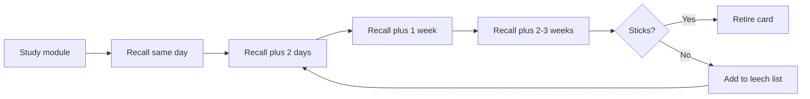
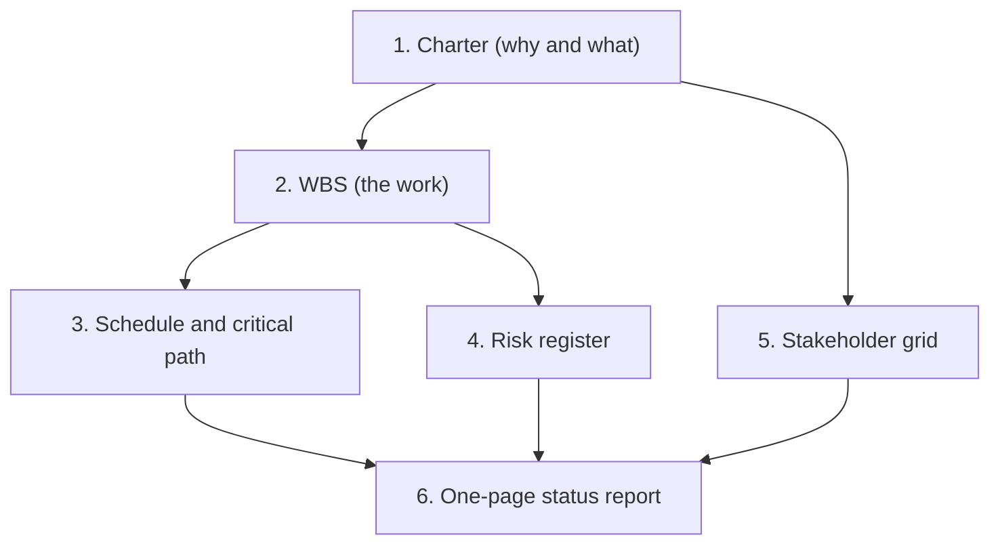
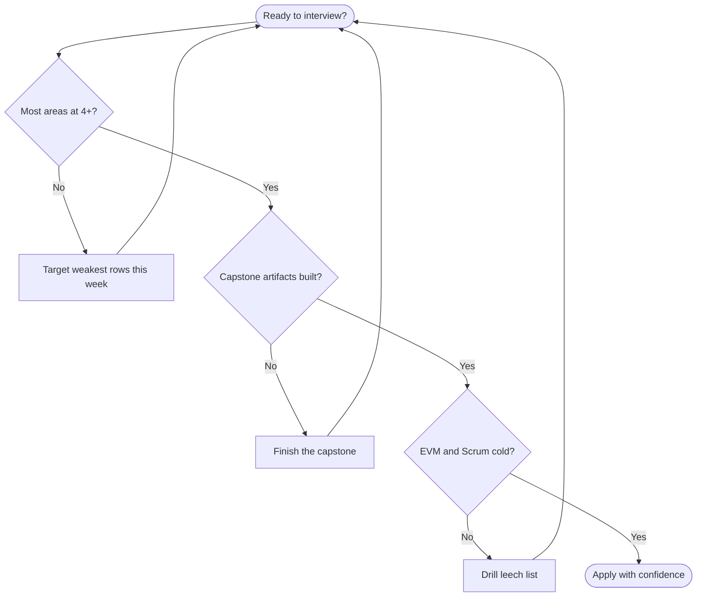

# Module 22 — Your Study Plan & Self-Assessment

> **Estimated study time:** ~30 min to set up (then weeks of execution) · **Level:** Capstone · **Prerequisites:** All modules · Part of the **Sales -> Project Management Reviewer**.

*The final chapter — where the slow burn finally pays off and you walk out the door ready.*

## 🎯 What you'll be able to do

- [ ] Follow an 8-week study plan that maps every module to concrete weekly activities, recall days, and rest.
- [ ] Run a compressed 2-week "interview crunch" variant when a recruiter call lands sooner than you'd like.
- [ ] Use spaced repetition to make the "Check yourself" questions actually stick.
- [ ] Complete a capstone: plan a mock project end to end and produce real PM artifacts.
- [ ] Rate yourself against a readiness rubric so you *know* when you're interview-ready instead of guessing.
- [ ] Pass a mixed-topic final quiz spanning the whole reviewer.

## 👋 From your mentor

Okay, real talk: you made it to the last module. That's not nothing. Most people put a book like this down somewhere around the middle and tell themselves they'll "come back to it." You didn't. You finish what you start — which, between us, is the single most underrated PM trait there is.

You already know the sales truth that activity without a plan is just busywork in disguise. Same rule applies here. This module takes the twenty-one chapters you just read and turns them into a *campaign* — a sequence of focused weeks, deliberate review, and honest self-checks. Think of it as working a pipeline toward one very specific close — the job offer — methodically, instead of cramming the night before like it's finals week and you forgot the class existed. So. Let's build your plan.

## 🗓️ The 8-week study plan

The plan below assumes roughly **4–6 hours per week** — two or three focused sessions plus a light review. That's a realistic pace alongside a job, not a fantasy version of you with infinite free evenings. And the rhythm matters more than the hours: little and often beats one heroic Sunday every single time.

Each week ends with a **Recall day** (you actively retrieve — no re-reading allowed) and a **Rest day** (genuinely off — your brain quietly files everything away while you're not looking, like a good night's sleep after a big decision).

| Week | Theme | Modules | Core weekly activities | Recall + Rest |
|------|-------|---------|------------------------|---------------|
| 1 | Foundations & mindset | 01–03 | Read modules, note where sales already gave you PM instincts. Write your own one-paragraph "why PM" story. | Recall: redo Module 01–03 "Check yourself". Rest: 1 day off. |
| 2 | Approach, initiation & scope | 04–06 | Map predictive vs. agile vs. hybrid in a table from memory. Draft a real charter and build a WBS. | Recall: explain a life cycle aloud to a friend. Rest. |
| 3 | Schedule, cost & quality | 07–09 | Draft a network diagram and find the critical path by hand. Practice EVM formulas until CPI/SPI feel automatic. | Recall: re-quiz weeks 1–3 (spaced). Rest. |
| 4 | Resources & communication | 10–11 | Sketch a RACI chart and a team-development arc. Draft a one-page communications plan. | Recall: redo schedule math problems. Rest. |
| 5 | Risk, stakeholders & procurement | 12–14 | Build a risk register with 8–10 risks scored on a P×I matrix. Draw a stakeholder grid. Compare contract types. | Recall: re-quiz weeks 3–5 (spaced). Rest. |
| 6 | Agile, Scrum & tools | 15–16 | Learn the 2020 Scrum Guide cold: accountabilities, events, artifacts. Tour the PM tool landscape. | Recall: explain qualitative vs. quantitative risk aloud. Rest. |
| 7 | Metrics & soft skills | 17–18 | Practice reading CPI/SPI for a sponsor. Rehearse negotiation and conflict styles. | Recall: re-quiz weeks 4–7 (spaced). Rest. |
| 8 | Certs, the job & review | 19–21 | Tie it together, finish the **capstone** below, drill the glossary and cheat sheets, map your cert path. | Recall: full mixed quiz. Rest, then launch the job hunt. |

*Each bar is one week; the final week (Integration & Capstone) is the critical one — the part of the plan you don't let slip.*

### Weekly cadence

Pick a repeatable shape for each week — something you can run on autopilot when you're tired. Here's one that works:

| Day | Focus | Time |
|-----|-------|------|
| Mon | New module read + notes | ~60 min |
| Wed | Second module + a table/diagram you redraw from memory | ~60 min |
| Fri | "Try it" exercise for the week | ~45 min |
| Sat | **Recall day** — quiz yourself, no re-reading | ~30 min |
| Sun | **Rest** — fully off | 0 min |

> 🔁 **Sales → PM bridge:** You already run a weekly sales cadence in your sleep — Monday pipeline review, mid-week prospecting, Friday wrap-up. This is the exact same discipline, just pointed at a study pipeline instead of a sales one. The muscle is already built. You're only aiming it somewhere new.

## 🔁 Spaced repetition for the "Check yourself" questions

Here's the plot twist nobody tells you: re-reading *feels* productive — cozy, even — but it barely moves the needle on memory. The real work is **active recall** (answering from a blank page, no peeking) plus **spaced repetition** (revisiting at growing intervals). That combination is what makes knowledge hold up when an interviewer is looking right at you.

Use this simple schedule for each module's "Check yourself" questions:

| Review | When | What you do |
|--------|------|-------------|
| 1st | Same day you study the module | Answer all questions cold, then check. |
| 2nd | +2 days | Re-answer only the ones you missed or hesitated on. |
| 3rd | +1 week | Mix that module's questions with the prior week's. |
| 4th | +2–3 weeks | Quick blitz; anything still shaky goes on a "leech" list. |

Keep a one-page **leech list** — the 10–15 facts that absolutely refuse to stick (EVM formulas, the order of Scrum events, the difference between *risk* and *issue*). These are your recurring villains. Drill the leech list twice a week, because that's exactly where your real gains are hiding.

*Anything you keep missing loops back into frequent review instead of getting a premature "done" stamp.*

## ⚡ The 2-week "interview crunch" variant

A recruiter calls. The screen is in twelve days. Cue the ticking clock. Don't panic — this is where you compress, not cram. The goal quietly shifts from *mastery* to *confident coverage of the high-frequency topics*. Different mission, same calm.

| Day | Focus |
|-----|-------|
| 1 | Modules 01–03 — vocabulary and mindset. Learn to *sound* like a PM. |
| 2 | Modules 04–05 — predictive vs. agile vs. hybrid; charter and stakeholders. Memorize what a charter contains. |
| 3 | Modules 06–07 — WBS, critical path. Do the schedule math once, by hand. |
| 4 | Modules 08–09 — **EVM formulas** (CPI, SPI, EAC) and quality basics. EVM is interview catnip. |
| 5 | Modules 10–11 — resources, RACI, communications plan. |
| 6 | Modules 12–14 — risk register, P×I matrix, stakeholder grid, contract types. |
| 7 | **Rest + light recall.** Half a day off. Re-quiz days 1–6. |
| 8 | Modules 15–16 — 2020 Scrum Guide: 3 accountabilities, 5 events, 3 artifacts, cold; tools. |
| 9 | Modules 17–21 — metrics, soft skills, certs, the job, glossary blitz. |
| 10 | **Mini-capstone:** charter + WBS + risk register for one scenario (2–3 hrs). |
| 11 | Full mixed quiz (below). Build your leech list. |
| 12 | Drill the leech list. Rehearse 3 STAR stories that reframe sales wins as PM wins. Sleep early. |

> Crunch tip: an interviewer would far rather hear "I'd build a stakeholder register and run a kickoff" than a flawless textbook recitation. Coverage plus calm beats depth plus panic. Every time.

## 🏗️ Capstone exercise — plan a mock project end to end

This is the heart of the whole module — the bit you'll be quietly proud of. Pick a relatable scenario and produce real artifacts. Doing beats reading by a mile, and you'll walk into interviews carrying a portfolio you actually built with your own two hands.

**Scenario (use this or your own):** *Your company is launching a customer-referral program. You have 10 weeks, a budget of $40,000, a cross-functional team of five (marketing, two developers, a designer, and you), and a hard launch date tied to a Q4 sales kickoff.*

Notice how naturally that maps onto your old world — a referral program is basically your sales pipeline reimagined as a product. Lean into that comfort; it's an unfair advantage.

### Deliverables checklist

- [ ] **1. Project Charter** — purpose, high-level scope, objectives, a measurable success criterion, named sponsor, key milestones, top assumptions and constraints. (One page.)
- [ ] **2. Work Breakdown Structure (WBS)** — decompose the work into 3–5 major deliverables, each broken into work packages. Keep it deliverable-oriented (nouns, not verbs).
- [ ] **3. Basic schedule with a critical path** — list activities, estimate durations, set dependencies, and identify the longest path. Mark which activities have zero float.
- [ ] **4. Risk register** — 8–10 risks, each with a cause, probability, impact, P×I score, response strategy (avoid / mitigate / transfer / accept), and an owner.
- [ ] **5. Stakeholder grid** — plot 6–8 stakeholders on a power/interest matrix and note an engagement approach for each.
- [ ] **6. One-page status report** — RAG (Red/Amber/Green) status, % complete, top 3 accomplishments, top 3 next steps, top risk/issue, and any ask of the sponsor.

*The artifacts feed each other like a good ensemble cast: the charter anchors everything, and the status report rolls it all up.*

**Mini-WBS to get you started:**

| 1. Program Design | 2. Build | 3. Launch & Measure |
|---|---|---|
| 1.1 Referral rules | 2.1 Tracking integration | 3.1 Internal launch |
| 1.2 Reward structure | 2.2 Landing page | 3.2 Sales kickoff demo |
| 1.3 Legal/terms review | 2.3 Email automation | 3.3 Metrics dashboard |

Time-box the whole capstone to 2–3 hours. It's meant to be *good enough to talk about with confidence*, not gallery-perfect. Done is the goal.

## ⏸️ Pause & reflect

This is a safe place to stop. Bookmark the page, close the laptop, go pour the second coffee — the plan will still be right here when you get back. It's not going anywhere.

Before you go, sit with these for a minute:

- Which knowledge area still makes your stomach tighten a little? That's your next study target — not a verdict on your ability, just a flag on a map.
- Where did your sales experience *already* give you a head start in this reviewer? Name two concrete examples. You'll want them in interviews.
- Looking at the 8-week plan, what's the one realistic time slot in your actual week you can genuinely protect for study?

## 🧠 Check yourself

**1. Why is active recall better than re-reading for interview prep?**

Show answer

Re-reading creates *familiarity* (it feels easy) but weak retrieval. Active recall forces your brain to reconstruct the answer from scratch, which strengthens memory and surfaces exactly what you don't yet know — the same thing an interviewer will probe.

**2. In the spaced-repetition schedule, what is a "leech" and how do you handle it?**

Show answer

A leech is a fact you keep missing despite repeated reviews. You pull it onto a short leech list and drill it more frequently (twice a week) rather than letting it hide inside a module you've marked "done."

**3. What are the six capstone deliverables, in order?**

Show answer

1) Project charter, 2) WBS, 3) Schedule with critical path, 4) Risk register, 5) Stakeholder grid, 6) One-page status report.

**4. In the 2-week crunch, why is the goal "confident coverage" rather than "mastery"?**

Show answer

With limited time, breadth across high-frequency interview topics beats deep mastery of a few. Interviewers reward a calm, structured approach and correct vocabulary more than exhaustive detail — and panic from over-cramming hurts you more than a few gaps.

**5. What belongs on a one-page status report?**

Show answer

Overall RAG status, % complete, top accomplishments, top next steps, the top risk or issue, and any ask of the sponsor. It's a roll-up, not a novel.

**6. How do recall and rest days each contribute to the plan?**

Show answer

Recall days force retrieval, which cements learning; rest days let the brain consolidate memories and prevent burnout. Skipping either weakens retention — the rhythm is part of the method, not a luxury.

## 🧰 Try it

Set up your plan *right now*, in 15 minutes — before the motivation wears off:

1. Open your calendar and block your three weekly study slots for the next 8 weeks (or 2 weeks if you're in crunch mode). Treat them like client meetings — non-negotiable, no rescheduling, no guilt.
2. Create a single note titled **"Leech list"** and leave it gloriously empty; you'll fill it as you go.
3. Pick your capstone scenario (the referral program above or your own) and write *just the charter's one-line purpose statement* today. Starting beats planning to start, always.

That's it. You've just converted a vague intention into scheduled action — which is, honestly, the most PM thing you'll do all week.

## 📊 Readiness self-assessment rubric

Rate yourself **1 (shaky) to 5 (could teach it)** in each area. No grading on a curve, no one's watching. You're broadly **interview-ready when most rows are at 4+** and nothing critical is sitting at 1–2.

| Knowledge area | Module(s) | 1 | 2 | 3 | 4 | 5 |
|---|---|---|---|---|---|---|
| PM mindset & vocabulary | 01–03 | ☐ | ☐ | ☐ | ☐ | ☐ |
| Life cycles & frameworks (predictive/agile/hybrid) | 03–04 | ☐ | ☐ | ☐ | ☐ | ☐ |
| Charter & stakeholders | 05, 13 | ☐ | ☐ | ☐ | ☐ | ☐ |
| Scope & WBS | 06 | ☐ | ☐ | ☐ | ☐ | ☐ |
| Scheduling & critical path | 07 | ☐ | ☐ | ☐ | ☐ | ☐ |
| Cost & EVM (CPI, SPI, EAC) | 08 | ☐ | ☐ | ☐ | ☐ | ☐ |
| Quality & resources | 09–10 | ☐ | ☐ | ☐ | ☐ | ☐ |
| Communication, risk & procurement | 11–12, 14 | ☐ | ☐ | ☐ | ☐ | ☐ |
| Agile & 2020 Scrum Guide | 15 | ☐ | ☐ | ☐ | ☐ | ☐ |
| Metrics, soft skills & the job hunt | 17–20 | ☐ | ☐ | ☐ | ☐ | ☐ |

*Walk the gates in order; loop back until each one is a clear, unhesitating "yes."*

## 🧪 Final mixed-topic quiz

Twelve questions spanning the whole reviewer — the closing showdown. Answer cold, then check. No flipping back.

**1. A project's CPI is 0.8. What does that tell you?**

Show answer

You're getting $0.80 of value for every $1 spent — the project is **over budget** (cost efficiency below 1.0). CPI = EV / AC.

**2. SPI = EV / PV. If SPI = 1.1, is the project ahead or behind schedule?**

Show answer

**Ahead** of schedule — you've earned more value than was planned by now.

**3. Name the three accountabilities in the 2020 Scrum Guide.**

Show answer

Product Owner, Scrum Master, and Developers. (The 2020 guide dropped the word "roles" in favor of "accountabilities" and describes one Scrum Team without sub-teams.)

**4. What is the difference between a risk and an issue?**

Show answer

A **risk** is an uncertain future event that *may* affect the project; an **issue** is something that has *already happened* and needs managing now. Risks live in the risk register; issues live in the issue log.

**5. On a network diagram, what defines the critical path?**

Show answer

The longest path of dependent activities through the network — it determines the shortest possible project duration. Activities on it have **zero float**; any delay there delays the whole project.

**6. The PMBOK Guide 7th edition is organized around what two big structures?**

Show answer

**12 Principles** (the "how to behave") and **8 Performance Domains** (the areas to focus on), replacing the older process-group/knowledge-area model. It also references the PMI *Models, Methods, and Artifacts*.

**7. What is the basic EAC formula assuming current cost performance continues?**

Show answer

EAC = BAC / CPI. (Estimate at Completion = Budget at Completion divided by the Cost Performance Index.)

**8. A high-power, low-interest stakeholder should be managed how?**

Show answer

**Keep satisfied** — give them enough attention to stay onside without overwhelming them. (High-power/high-interest = manage closely; low/low = monitor; low-power/high-interest = keep informed.)

**9. What are the five events in Scrum?**

Show answer

The Sprint (the container) plus Sprint Planning, Daily Scrum, Sprint Review, and Sprint Retrospective.

**10. What's the purpose of a project charter, and who authorizes it?**

Show answer

The charter formally **authorizes the project** and gives the PM authority to apply resources. It's issued by the **sponsor** (or initiating body), not the PM.

**11. In risk response, what does "transfer" mean — give an example?**

Show answer

Shifting the impact (and ownership of response) of a risk to a third party — e.g., buying insurance or using a fixed-price contract so a vendor absorbs cost overrun risk. The risk still exists; you've moved who bears it.

**12. PMP and CAPM are offered by which body — and how do PSM/PSPO and PRINCE2 differ?**

Show answer

**PMP and CAPM** are from **PMI**. **PSM/PSPO** are Scrum.org certifications. **PRINCE2** is from **Axelos/PeopleCert**. Knowing who owns which cert signals you've done your homework.

## 🔑 Key terms

- **Active recall** — retrieving an answer from memory without looking, the most effective way to make knowledge stick.
- **Spaced repetition** — reviewing material at increasing intervals to fight the forgetting curve.
- **Leech** — a fact you repeatedly fail to remember; gets extra, more frequent drilling.
- **Capstone** — a culminating exercise that integrates everything learned into one end-to-end deliverable set.
- **Readiness rubric** — a self-rating scorecard that turns "do I feel ready?" into a measurable, area-by-area check.
- **RAG status** — Red/Amber/Green shorthand for project health on a status report.
- **STAR** — Situation, Task, Action, Result; the structure for interview stories (great for reframing sales wins as PM wins).

## 👏 A word before you go

You started this reviewer a little anxious about switching careers — and you're finishing it with a study plan, a capstone, and a readiness scorecard in hand. That arc, from uncertain to organized, *is* project management. You've been practicing the skill the entire time without anyone telling you that's what was happening.

Your sales background was never a gap to apologize for. It's your edge. You already manage stakeholders, handle objections (those are risks), forecast (that's estimating), and close (that's delivering). You're not starting over. You're translating a fluency you already have.

So go build the plan, run it week by week, and when the interview comes, talk like the PM you've quietly become. I'm proud of you — genuinely. Now go close this one.

— Your mentor

---
⬅️ **Previous:** [Module 21 — Glossary & Cheat Sheets](21-glossary-and-cheatsheets.md) · 🏠 **[Reviewer Home](../README.md)** · ➡️ **Next:** [Finish 🎉 (back to Reviewer Home)](../README.md)
